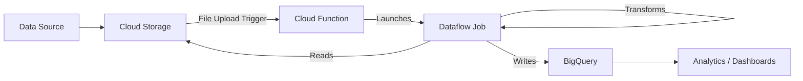

# How to Build a Serverless ETL Pipeline on GCP Using Cloud Functions Dataflow and BigQuery

Author: [nawazdhandala](https://www.github.com/nawazdhandala)

Tags: GCP, Serverless, ETL, Cloud Functions, Dataflow, BigQuery, Data Pipeline

Description: A complete guide to building a serverless ETL pipeline on Google Cloud using Cloud Functions for triggering, Dataflow for transformation, and BigQuery for storage.

---

ETL pipelines - Extract, Transform, Load - are the backbone of data engineering. On GCP, you can build fully serverless ETL pipelines where you do not manage any servers, scaling is automatic, and you only pay for what you use. The combination of Cloud Functions, Dataflow, and BigQuery gives you a powerful, production-ready pipeline architecture.

In this post, I will walk through building an ETL pipeline that extracts data from Cloud Storage, transforms it using Dataflow (Apache Beam), and loads the results into BigQuery. The whole thing is triggered automatically when new files arrive.

## Architecture

Here is the pipeline architecture:



The flow works like this: raw data files land in a Cloud Storage bucket. A Cloud Function detects the new file and launches a Dataflow job. The Dataflow job reads the file, transforms the data, and writes the results to BigQuery. From there, you can query the data with SQL or connect it to Looker Studio for dashboards.

## Step 1: Set Up the Cloud Storage Bucket

Create a bucket for incoming raw data:

```bash
# Create a bucket for raw data files
gsutil mb -l us-central1 gs://my-project-raw-data/

# Create a bucket for Dataflow temporary files
gsutil mb -l us-central1 gs://my-project-dataflow-temp/
```

## Step 2: Create the BigQuery Dataset and Table

Set up the destination in BigQuery:

```bash
# Create a dataset
bq mk --dataset --location=US my-project:sales_data

# Create a table with the expected schema
bq mk --table my-project:sales_data.transactions \
  transaction_id:STRING,customer_id:STRING,product_id:STRING,quantity:INTEGER,price:FLOAT,total:FLOAT,transaction_date:TIMESTAMP,region:STRING,category:STRING
```

## Step 3: Write the Dataflow Pipeline (Apache Beam)

The Dataflow pipeline is written using the Apache Beam SDK. It reads CSV files from Cloud Storage, transforms the data, and writes to BigQuery.

```python
# pipeline.py - Apache Beam pipeline for ETL processing
import apache_beam as beam
from apache_beam.options.pipeline_options import PipelineOptions, GoogleCloudOptions, StandardOptions
from apache_beam.io.gcp.bigquery import WriteToBigQuery, BigQueryDisposition
import csv
import io
from datetime import datetime

class ParseCSVRow(beam.DoFn):
    """Parse a CSV row into a dictionary."""

    def process(self, element):
        # Skip header rows
        if element.startswith("transaction_id"):
            return

        try:
            reader = csv.reader(io.StringIO(element))
            row = next(reader)

            # Map CSV columns to named fields
            yield {
                "transaction_id": row[0].strip(),
                "customer_id": row[1].strip(),
                "product_id": row[2].strip(),
                "quantity": int(row[3].strip()),
                "price": float(row[4].strip()),
                "transaction_date": row[5].strip(),
                "region": row[6].strip(),
                "category": row[7].strip(),
            }
        except (IndexError, ValueError) as e:
            # Log bad rows instead of failing the pipeline
            import logging
            logging.warning(f"Skipping malformed row: {element[:100]}... Error: {e}")


class EnrichTransaction(beam.DoFn):
    """Add computed fields to each transaction."""

    def process(self, element):
        # Calculate total from quantity and price
        element["total"] = element["quantity"] * element["price"]

        # Parse and normalize the date
        try:
            dt = datetime.strptime(element["transaction_date"], "%Y-%m-%d %H:%M:%S")
            element["transaction_date"] = dt.strftime("%Y-%m-%dT%H:%M:%S")
        except ValueError:
            element["transaction_date"] = None

        # Normalize region names
        element["region"] = element["region"].upper().strip()

        yield element


class FilterInvalidTransactions(beam.DoFn):
    """Filter out transactions that do not pass validation."""

    def process(self, element):
        # Skip transactions with zero or negative quantities
        if element["quantity"] <= 0:
            return

        # Skip transactions with no customer ID
        if not element["customer_id"]:
            return

        # Skip transactions with no date
        if element["transaction_date"] is None:
            return

        yield element


def run_pipeline(input_file, project_id, region="us-central1"):
    """Run the ETL pipeline."""
    # Configure pipeline options
    options = PipelineOptions()

    google_cloud_options = options.view_as(GoogleCloudOptions)
    google_cloud_options.project = project_id
    google_cloud_options.region = region
    google_cloud_options.temp_location = f"gs://{project_id}-dataflow-temp/tmp"
    google_cloud_options.staging_location = f"gs://{project_id}-dataflow-temp/staging"

    options.view_as(StandardOptions).runner = "DataflowRunner"

    # Define the BigQuery table schema
    table_schema = {
        "fields": [
            {"name": "transaction_id", "type": "STRING", "mode": "REQUIRED"},
            {"name": "customer_id", "type": "STRING", "mode": "REQUIRED"},
            {"name": "product_id", "type": "STRING", "mode": "REQUIRED"},
            {"name": "quantity", "type": "INTEGER", "mode": "REQUIRED"},
            {"name": "price", "type": "FLOAT", "mode": "REQUIRED"},
            {"name": "total", "type": "FLOAT", "mode": "REQUIRED"},
            {"name": "transaction_date", "type": "TIMESTAMP", "mode": "NULLABLE"},
            {"name": "region", "type": "STRING", "mode": "REQUIRED"},
            {"name": "category", "type": "STRING", "mode": "REQUIRED"},
        ]
    }

    # Build and run the pipeline
    with beam.Pipeline(options=options) as pipeline:
        (
            pipeline
            # Extract: Read the CSV file from Cloud Storage
            | "Read CSV" >> beam.io.ReadFromText(input_file)
            # Transform: Parse CSV rows
            | "Parse CSV" >> beam.ParDo(ParseCSVRow())
            # Transform: Enrich with computed fields
            | "Enrich" >> beam.ParDo(EnrichTransaction())
            # Transform: Filter invalid records
            | "Filter" >> beam.ParDo(FilterInvalidTransactions())
            # Load: Write to BigQuery
            | "Write to BigQuery" >> WriteToBigQuery(
                table=f"{project_id}:sales_data.transactions",
                schema=table_schema,
                write_disposition=BigQueryDisposition.WRITE_APPEND,
                create_disposition=BigQueryDisposition.CREATE_IF_NEEDED,
            )
        )

if __name__ == "__main__":
    import sys
    input_file = sys.argv[1]
    run_pipeline(input_file, "my-project")
```

## Step 4: Create the Cloud Function Trigger

Write a Cloud Function that triggers the Dataflow pipeline whenever a new file is uploaded to Cloud Storage:

```python
# main.py - Cloud Function to trigger Dataflow pipeline
import json
from googleapiclient.discovery import build
from google.auth import default

def trigger_dataflow_pipeline(event, context):
    """Triggered by a file upload to Cloud Storage.

    Launches a Dataflow job to process the uploaded file.
    """
    bucket = event["bucket"]
    file_name = event["name"]

    # Only process CSV files
    if not file_name.endswith(".csv"):
        print(f"Skipping non-CSV file: {file_name}")
        return

    # Skip temporary or staging files
    if file_name.startswith("tmp/") or file_name.startswith("staging/"):
        print(f"Skipping staging file: {file_name}")
        return

    input_file = f"gs://{bucket}/{file_name}"
    project_id = "my-project"
    region = "us-central1"

    print(f"Processing file: {input_file}")

    # Launch the Dataflow job using the Dataflow API
    credentials, _ = default()
    dataflow = build("dataflow", "v1b3", credentials=credentials)

    # Template parameters for the Dataflow job
    job_name = f"etl-{file_name.replace('/', '-').replace('.csv', '')}"

    # Launch from a Dataflow template
    request = dataflow.projects().locations().templates().launch(
        projectId=project_id,
        location=region,
        body={
            "jobName": job_name,
            "parameters": {
                "input_file": input_file,
            },
            "environment": {
                "tempLocation": f"gs://{project_id}-dataflow-temp/tmp",
                "zone": f"{region}-a",
            },
        },
        gcsPath=f"gs://{project_id}-dataflow-temp/templates/etl-pipeline",
    )

    response = request.execute()
    print(f"Dataflow job launched: {response['job']['id']}")

    return f"Job {response['job']['id']} launched"
```

Deploy the Cloud Function:

```bash
# Deploy the trigger function
gcloud functions deploy trigger-etl-pipeline \
  --runtime=python311 \
  --trigger-resource=my-project-raw-data \
  --trigger-event=google.storage.object.finalize \
  --entry-point=trigger_dataflow_pipeline \
  --memory=256MB \
  --timeout=120s \
  --region=us-central1 \
  --project=my-project
```

## Step 5: Create the Dataflow Template

For the Cloud Function to launch a Dataflow job, you need to create a template:

```bash
# Build the Dataflow template
python pipeline.py \
  --runner=DataflowRunner \
  --project=my-project \
  --region=us-central1 \
  --staging_location=gs://my-project-dataflow-temp/staging \
  --temp_location=gs://my-project-dataflow-temp/tmp \
  --template_location=gs://my-project-dataflow-temp/templates/etl-pipeline \
  --input_file=gs://my-project-raw-data/placeholder.csv
```

## Step 6: Test the Pipeline

Upload a test CSV file to trigger the pipeline:

```bash
# Create a test CSV file
cat > test_data.csv << 'EOF'
transaction_id,customer_id,product_id,quantity,price,transaction_date,region,category
TXN001,CUST100,PROD50,2,29.99,2026-02-17 10:30:00,us-east,electronics
TXN002,CUST101,PROD25,1,49.99,2026-02-17 11:15:00,us-west,clothing
TXN003,CUST102,PROD75,3,9.99,2026-02-17 12:00:00,europe,accessories
EOF

# Upload to Cloud Storage to trigger the pipeline
gsutil cp test_data.csv gs://my-project-raw-data/
```

Monitor the pipeline:

```bash
# Check the Cloud Function logs
gcloud functions logs read trigger-etl-pipeline --limit=10 --project=my-project

# Check the Dataflow job status
gcloud dataflow jobs list --region=us-central1 --project=my-project

# Query BigQuery to verify the data loaded
bq query --use_legacy_sql=false 'SELECT * FROM sales_data.transactions LIMIT 10'
```

## Step 7: Add Error Handling and Dead Letter Queue

For production pipelines, add error handling so bad records do not break the entire job:

```bash
# Create a dead letter table for failed records
bq mk --table my-project:sales_data.failed_records \
  raw_data:STRING,error_message:STRING,file_name:STRING,processed_at:TIMESTAMP
```

Route failed records to the dead letter table instead of failing the pipeline. This way, 99% of your data gets processed even if 1% has formatting issues.

## Summary

A serverless ETL pipeline on GCP using Cloud Functions, Dataflow, and BigQuery gives you automatic scaling, no server management, and pay-per-use pricing. Cloud Storage triggers handle the extraction, Dataflow with Apache Beam handles the transformation, and BigQuery handles the loading and querying. Start with a simple pipeline, add error handling and dead letter queues for production use, and monitor the pipeline with Cloud Monitoring to catch issues early.
