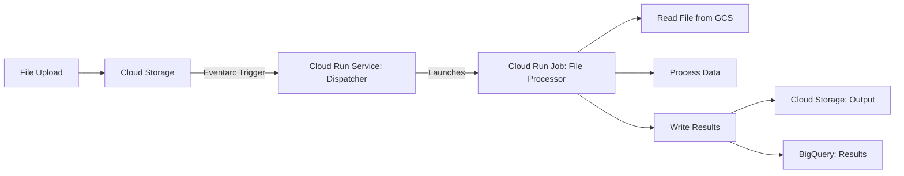

# How to Build a Serverless File Processing System Using Cloud Storage Triggers and Cloud Run Jobs

Author: [nawazdhandala](https://www.github.com/nawazdhandala)

Tags: GCP, Cloud Run Jobs, Cloud Storage, File Processing, Serverless, Eventarc

Description: Learn how to build a serverless file processing system on GCP using Cloud Storage triggers to launch Cloud Run Jobs for processing large files.

---

Cloud Functions are great for quick, lightweight tasks, but they have limitations - a 10-minute timeout for Gen 1 and 60 minutes for Gen 2, limited memory, and a single request processing model. When you need to process large files that take more time or more resources, Cloud Run Jobs are a better fit. They can run for up to 24 hours, use up to 32 GB of memory, and support task parallelism.

In this post, I will show how to build a file processing system where Cloud Storage triggers launch Cloud Run Jobs to process uploaded files. This gives you the best of both worlds - automatic triggering from file uploads and long-running, resource-intensive processing.

## Architecture



The flow works in two stages. First, a lightweight Cloud Run service receives the storage event and launches a Cloud Run Job. Then the Job does the heavy processing - reading the file, transforming the data, and writing results.

## Why Cloud Run Jobs Instead of Cloud Functions

Cloud Run Jobs are designed for batch processing workloads. Compared to Cloud Functions:

- **Longer timeout**: Up to 24 hours vs 60 minutes
- **More memory**: Up to 32 GB vs 32 GB (comparable, but Jobs are optimized for batch)
- **Task parallelism**: Built-in support for splitting work across multiple tasks
- **No request timeout**: Jobs run until completion, not tied to HTTP request lifecycle
- **Better for large files**: Can process multi-gigabyte files without worrying about timeouts

## Step 1: Create the Cloud Run Job

Build a container that processes files:

```python
# processor/main.py - Cloud Run Job for file processing
import os
import csv
import io
import json
import logging
from google.cloud import storage, bigquery, firestore
from datetime import datetime

logging.basicConfig(level=logging.INFO)
logger = logging.getLogger(__name__)

storage_client = storage.Client()
bq_client = bigquery.Client()
db = firestore.Client()

def main():
    """Main entry point for the Cloud Run Job.

    Reads the file path from environment variables and processes it.
    """
    # Get the file to process from environment variables
    bucket_name = os.environ.get("INPUT_BUCKET")
    file_name = os.environ.get("INPUT_FILE")
    job_id = os.environ.get("JOB_ID", "unknown")
    task_index = int(os.environ.get("CLOUD_RUN_TASK_INDEX", 0))
    task_count = int(os.environ.get("CLOUD_RUN_TASK_COUNT", 1))

    if not bucket_name or not file_name:
        logger.error("INPUT_BUCKET and INPUT_FILE environment variables are required")
        return

    logger.info(f"Job {job_id}: Processing {file_name} from {bucket_name}")
    logger.info(f"Task {task_index + 1} of {task_count}")

    # Update job status
    update_job_status(job_id, "processing", task_index)

    try:
        # Download the file
        bucket = storage_client.bucket(bucket_name)
        blob = bucket.blob(file_name)

        # Check file size to determine processing strategy
        blob.reload()
        file_size_mb = blob.size / (1024 * 1024)
        logger.info(f"File size: {file_size_mb:.1f} MB")

        # Process based on file type
        if file_name.endswith(".csv"):
            process_csv(bucket_name, file_name, job_id, task_index, task_count)
        elif file_name.endswith(".json"):
            process_json(bucket_name, file_name, job_id, task_index, task_count)
        elif file_name.endswith(".parquet"):
            process_parquet(bucket_name, file_name, job_id)
        else:
            logger.warning(f"Unsupported file type: {file_name}")
            return

        update_job_status(job_id, "complete", task_index)
        logger.info(f"Job {job_id} task {task_index}: Processing complete")

    except Exception as e:
        logger.error(f"Job {job_id} task {task_index} failed: {e}")
        update_job_status(job_id, "failed", task_index, str(e))
        raise


def process_csv(bucket_name, file_name, job_id, task_index, task_count):
    """Process a CSV file with parallel task support.

    If running with multiple tasks, each task processes a portion of the file.
    """
    bucket = storage_client.bucket(bucket_name)
    blob = bucket.blob(file_name)
    content = blob.download_as_text()

    lines = content.strip().split("\n")
    header = lines[0]
    data_rows = lines[1:]

    # If running in parallel, split the rows among tasks
    if task_count > 1:
        rows_per_task = len(data_rows) // task_count
        start = task_index * rows_per_task
        end = start + rows_per_task if task_index < task_count - 1 else len(data_rows)
        data_rows = data_rows[start:end]
        logger.info(f"Task {task_index}: processing rows {start} to {end}")

    # Parse the header
    columns = [c.strip() for c in header.split(",")]

    # Process each row
    processed_rows = []
    error_rows = []

    for i, row_text in enumerate(data_rows):
        try:
            reader = csv.reader(io.StringIO(row_text))
            values = next(reader)

            if len(values) != len(columns):
                error_rows.append({"row": i, "error": "Column count mismatch"})
                continue

            row_dict = dict(zip(columns, values))

            # Apply transformations
            processed = transform_row(row_dict)
            processed_rows.append(processed)

        except Exception as e:
            error_rows.append({"row": i, "error": str(e)})

        # Log progress every 10,000 rows
        if (i + 1) % 10000 == 0:
            logger.info(f"Processed {i + 1}/{len(data_rows)} rows")

    # Write results to BigQuery
    if processed_rows:
        write_to_bigquery(processed_rows, job_id)

    # Write errors to Cloud Storage
    if error_rows:
        write_errors(error_rows, job_id, task_index)

    logger.info(f"Task {task_index}: {len(processed_rows)} processed, "
                f"{len(error_rows)} errors")


def transform_row(row):
    """Apply business logic transformations to a data row."""
    transformed = {}

    for key, value in row.items():
        # Trim whitespace
        clean_value = value.strip()

        # Normalize date fields
        if "date" in key.lower():
            try:
                dt = datetime.strptime(clean_value, "%m/%d/%Y")
                clean_value = dt.strftime("%Y-%m-%d")
            except ValueError:
                pass

        # Convert numeric fields
        if key.lower() in ("amount", "price", "quantity", "total"):
            try:
                clean_value = float(clean_value.replace(",", "").replace("$", ""))
            except ValueError:
                clean_value = None

        # Normalize text fields
        if key.lower() in ("name", "city", "state"):
            clean_value = clean_value.title()

        transformed[key] = clean_value

    # Add metadata
    transformed["processed_at"] = datetime.utcnow().isoformat()

    return transformed


def write_to_bigquery(rows, job_id):
    """Write processed rows to BigQuery."""
    table_id = "my-project.processed_data.transactions"

    errors = bq_client.insert_rows_json(table_id, rows)
    if errors:
        logger.error(f"BigQuery insert errors: {errors[:5]}")
    else:
        logger.info(f"Wrote {len(rows)} rows to BigQuery")


def write_errors(errors, job_id, task_index):
    """Write error records to Cloud Storage for review."""
    bucket = storage_client.bucket("my-project-processing-errors")
    blob = bucket.blob(f"{job_id}/task-{task_index}-errors.json")
    blob.upload_from_string(
        json.dumps(errors, indent=2),
        content_type="application/json",
    )
    logger.info(f"Wrote {len(errors)} error records to GCS")


def process_json(bucket_name, file_name, job_id, task_index, task_count):
    """Process a JSON file."""
    bucket = storage_client.bucket(bucket_name)
    blob = bucket.blob(file_name)
    content = blob.download_as_text()
    data = json.loads(content)

    if isinstance(data, list):
        # Process array of records
        logger.info(f"Processing {len(data)} records from JSON")
        processed = [transform_row(record) for record in data]
        write_to_bigquery(processed, job_id)
    else:
        logger.warning("JSON file is not an array of records")


def process_parquet(bucket_name, file_name, job_id):
    """Process a Parquet file using BigQuery load job."""
    # For Parquet files, use BigQuery's native loading
    table_id = "my-project.processed_data.transactions"
    uri = f"gs://{bucket_name}/{file_name}"

    job_config = bigquery.LoadJobConfig(
        source_format=bigquery.SourceFormat.PARQUET,
        write_disposition=bigquery.WriteDisposition.WRITE_APPEND,
    )

    load_job = bq_client.load_table_from_uri(uri, table_id, job_config=job_config)
    load_job.result()  # Wait for completion

    logger.info(f"Loaded {load_job.output_rows} rows from Parquet file")


def update_job_status(job_id, status, task_index, error=None):
    """Update job status in Firestore."""
    doc_ref = db.collection("processing_jobs").document(job_id)
    update = {
        f"tasks.task_{task_index}.status": status,
        f"tasks.task_{task_index}.updated_at": firestore.SERVER_TIMESTAMP,
    }
    if error:
        update[f"tasks.task_{task_index}.error"] = error

    doc_ref.set(update, merge=True)


if __name__ == "__main__":
    main()
```

Create the Dockerfile:

```dockerfile
FROM python:3.11-slim

WORKDIR /app

COPY requirements.txt .
RUN pip install --no-cache-dir -r requirements.txt

COPY . .

CMD ["python", "main.py"]
```

The `requirements.txt`:

```
google-cloud-storage==2.14.0
google-cloud-bigquery==3.17.0
google-cloud-firestore==2.14.0
```

Build and create the Cloud Run Job:

```bash
# Build the container
gcloud builds submit --tag gcr.io/my-project/file-processor:latest ./processor

# Create the Cloud Run Job
gcloud run jobs create file-processor \
  --image=gcr.io/my-project/file-processor:latest \
  --region=us-central1 \
  --memory=4Gi \
  --cpu=2 \
  --task-timeout=3600s \
  --max-retries=2 \
  --tasks=1 \
  --project=my-project
```

## Step 2: Create the Dispatcher Service

The dispatcher is a lightweight Cloud Run service that receives storage events and launches the Job:

```python
# dispatcher/main.py
import os
import json
import logging
import uuid
from flask import Flask, request, jsonify
from google.cloud import run_v2

logging.basicConfig(level=logging.INFO)
logger = logging.getLogger(__name__)

app = Flask(__name__)

@app.route("/", methods=["POST"])
def dispatch():
    """Receive Cloud Storage events and launch processing jobs."""
    # Parse the CloudEvent
    event_data = request.get_json()

    # Extract file information
    bucket = event_data.get("bucket", "")
    file_name = event_data.get("name", "")
    content_type = event_data.get("contentType", "")
    size = int(event_data.get("size", 0))

    # Only process supported file types
    supported_extensions = [".csv", ".json", ".parquet"]
    if not any(file_name.endswith(ext) for ext in supported_extensions):
        logger.info(f"Skipping unsupported file: {file_name}")
        return jsonify({"status": "skipped"}), 200

    job_id = str(uuid.uuid4())[:8]
    size_mb = size / (1024 * 1024)

    logger.info(f"Dispatching job {job_id} for {file_name} ({size_mb:.1f} MB)")

    # Determine the number of tasks based on file size
    # Use more tasks for larger files
    if size_mb > 500:
        task_count = 10
    elif size_mb > 100:
        task_count = 5
    elif size_mb > 10:
        task_count = 2
    else:
        task_count = 1

    # Launch the Cloud Run Job
    launch_job(job_id, bucket, file_name, task_count)

    return jsonify({
        "status": "dispatched",
        "job_id": job_id,
        "tasks": task_count,
    }), 200


def launch_job(job_id, bucket, file_name, task_count):
    """Launch a Cloud Run Job to process the file."""
    client = run_v2.JobsClient()
    job_name = f"projects/my-project/locations/us-central1/jobs/file-processor"

    # Override the job configuration for this execution
    override = run_v2.RunJobRequest.Overrides()
    override.task_count = task_count
    override.container_overrides = [
        run_v2.RunJobRequest.Overrides.ContainerOverride(
            env=[
                run_v2.EnvVar(name="INPUT_BUCKET", value=bucket),
                run_v2.EnvVar(name="INPUT_FILE", value=file_name),
                run_v2.EnvVar(name="JOB_ID", value=job_id),
            ]
        )
    ]

    # Execute the job
    request_obj = run_v2.RunJobRequest(
        name=job_name,
        overrides=override,
    )

    operation = client.run_job(request=request_obj)
    logger.info(f"Job {job_id} launched with {task_count} tasks")


if __name__ == "__main__":
    port = int(os.environ.get("PORT", 8080))
    app.run(host="0.0.0.0", port=port)
```

Deploy the dispatcher:

```bash
# Build and deploy the dispatcher
gcloud run deploy file-dispatcher \
  --source=./dispatcher \
  --region=us-central1 \
  --no-allow-unauthenticated \
  --memory=256Mi \
  --project=my-project
```

## Step 3: Create the Eventarc Trigger

Connect Cloud Storage events to the dispatcher:

```bash
# Create a service account for Eventarc
gcloud iam service-accounts create eventarc-trigger-sa \
  --project=my-project

# Grant necessary permissions
gcloud projects add-iam-policy-binding my-project \
  --member="serviceAccount:eventarc-trigger-sa@my-project.iam.gserviceaccount.com" \
  --role="roles/run.invoker"

# Create the Eventarc trigger
gcloud eventarc triggers create file-upload-trigger \
  --location=us-central1 \
  --destination-run-service=file-dispatcher \
  --destination-run-region=us-central1 \
  --event-filters="type=google.cloud.storage.object.v1.finalized" \
  --event-filters="bucket=my-project-uploads" \
  --service-account=eventarc-trigger-sa@my-project.iam.gserviceaccount.com \
  --project=my-project
```

## Step 4: Grant Job Execution Permissions

The dispatcher service account needs permission to run Cloud Run Jobs:

```bash
# Get the dispatcher service account
DISPATCHER_SA=$(gcloud run services describe file-dispatcher \
  --region=us-central1 \
  --format="value(spec.template.spec.serviceAccountName)" \
  --project=my-project)

# Grant permission to execute Cloud Run Jobs
gcloud projects add-iam-policy-binding my-project \
  --member="serviceAccount:${DISPATCHER_SA}" \
  --role="roles/run.developer"
```

## Step 5: Test the System

```bash
# Upload a test file
gsutil cp large-dataset.csv gs://my-project-uploads/

# Check the dispatcher logs
gcloud run services logs read file-dispatcher \
  --region=us-central1 \
  --limit=10 \
  --project=my-project

# Check the job execution
gcloud run jobs executions list \
  --job=file-processor \
  --region=us-central1 \
  --project=my-project

# Check the job logs
gcloud run jobs executions logs read EXECUTION_NAME \
  --job=file-processor \
  --region=us-central1 \
  --project=my-project
```

## Summary

Cloud Run Jobs with Cloud Storage triggers give you a powerful serverless file processing system. The dispatcher handles event routing and determines the level of parallelism based on file size. Cloud Run Jobs handle the heavy processing with up to 24-hour timeouts and 32 GB of memory. The system scales from a single task for small files to many parallel tasks for large files, and costs nothing when idle. Use this pattern for ETL pipelines, data migration, log processing, or any batch workload triggered by file uploads.
