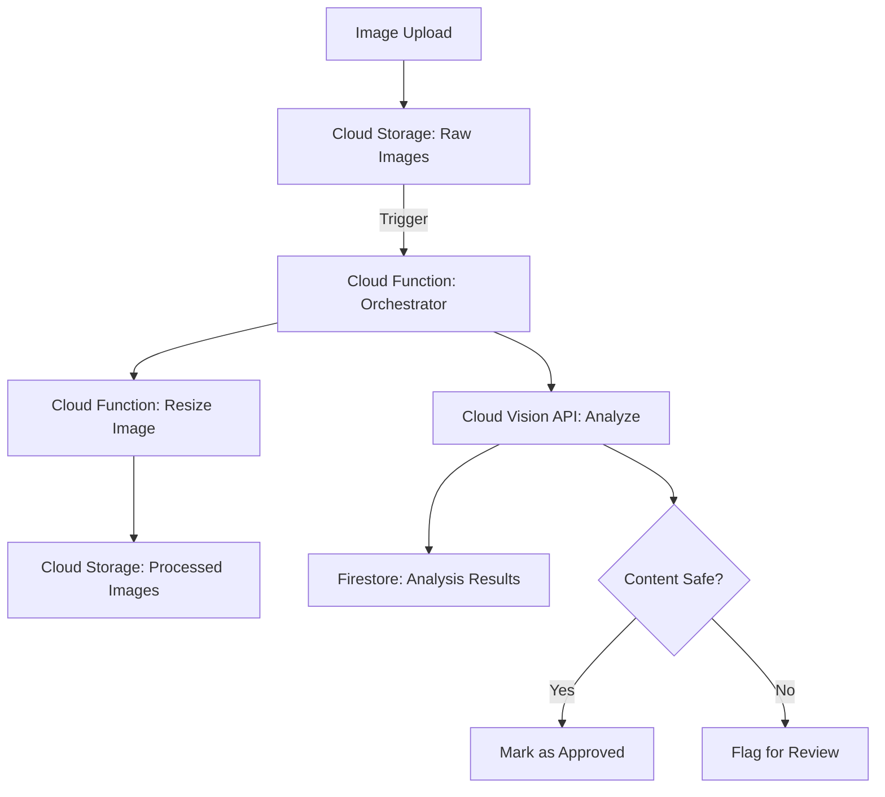

# How to Build a Serverless Image Processing Pipeline Using Cloud Functions and Cloud Vision API

Author: [nawazdhandala](https://www.github.com/nawazdhandala)

Tags: GCP, Cloud Functions, Cloud Vision API, Image Processing, Serverless, Cloud Storage

Description: A step-by-step guide to building a serverless image processing pipeline on GCP using Cloud Functions for orchestration and Cloud Vision API for analysis.

---

Processing images at scale - resizing, analyzing content, extracting text, detecting objects - used to require a fleet of servers with GPUs or specialized hardware. On GCP, you can build a fully serverless image processing pipeline that triggers automatically when images are uploaded, processes them through Cloud Vision API for analysis, and stores the results. No servers to manage, no GPU instances to provision.

This post covers building a complete pipeline that handles image upload, resizing, content analysis with Cloud Vision, and result storage.

## Pipeline Architecture



## Step 1: Set Up Cloud Storage Buckets

Create buckets for raw and processed images:

```bash
# Bucket for raw uploaded images
gsutil mb -l us-central1 gs://my-project-raw-images/

# Bucket for processed/resized images
gsutil mb -l us-central1 gs://my-project-processed-images/

# Enable the Vision API
gcloud services enable vision.googleapis.com --project=my-project
```

## Step 2: Build the Image Processing Functions

**Function 1: Orchestrator** - triggered by image upload, coordinates the pipeline:

```python
# orchestrator/main.py
import json
import logging
from google.cloud import storage
from google.cloud import vision
from google.cloud import firestore
from datetime import datetime

logging.basicConfig(level=logging.INFO)
logger = logging.getLogger(__name__)

storage_client = storage.Client()
vision_client = vision.ImageAnnotatorClient()
db = firestore.Client()

def process_image(event, context):
    """Triggered when an image is uploaded to the raw images bucket.

    Performs resizing, Vision API analysis, and stores results.
    """
    bucket_name = event["bucket"]
    file_name = event["name"]
    content_type = event.get("contentType", "")

    # Only process image files
    supported_types = ["image/jpeg", "image/png", "image/gif", "image/webp"]
    if content_type not in supported_types:
        logger.info(f"Skipping non-image file: {file_name} ({content_type})")
        return

    logger.info(f"Processing image: {file_name}")

    try:
        # Step 1: Analyze the image with Cloud Vision
        analysis = analyze_image(bucket_name, file_name)

        # Step 2: Resize the image to standard sizes
        resize_image(bucket_name, file_name)

        # Step 3: Check content safety
        safety = check_content_safety(analysis)

        # Step 4: Store the results in Firestore
        store_results(file_name, analysis, safety)

        logger.info(f"Image processing complete: {file_name}")

    except Exception as e:
        logger.error(f"Failed to process {file_name}: {e}")
        # Store the error for later review
        db.collection("processing_errors").add({
            "file_name": file_name,
            "error": str(e),
            "timestamp": firestore.SERVER_TIMESTAMP,
        })
        raise


def analyze_image(bucket_name, file_name):
    """Analyze an image using Cloud Vision API."""
    # Reference the image in Cloud Storage
    image = vision.Image()
    image.source.image_uri = f"gs://{bucket_name}/{file_name}"

    # Request multiple types of analysis
    features = [
        vision.Feature(type_=vision.Feature.Type.LABEL_DETECTION, max_results=10),
        vision.Feature(type_=vision.Feature.Type.OBJECT_LOCALIZATION, max_results=10),
        vision.Feature(type_=vision.Feature.Type.TEXT_DETECTION),
        vision.Feature(type_=vision.Feature.Type.FACE_DETECTION),
        vision.Feature(type_=vision.Feature.Type.SAFE_SEARCH_DETECTION),
        vision.Feature(type_=vision.Feature.Type.IMAGE_PROPERTIES),
    ]

    request = vision.AnnotateImageRequest(image=image, features=features)
    response = vision_client.annotate_image(request=request)

    # Check for API errors
    if response.error.message:
        raise Exception(f"Vision API error: {response.error.message}")

    # Extract results
    results = {
        "labels": [],
        "objects": [],
        "text": "",
        "faces": 0,
        "dominant_colors": [],
    }

    # Extract labels
    for label in response.label_annotations:
        results["labels"].append({
            "description": label.description,
            "score": round(label.score, 3),
        })

    # Extract detected objects
    for obj in response.localized_object_annotations:
        results["objects"].append({
            "name": obj.name,
            "score": round(obj.score, 3),
        })

    # Extract text
    if response.text_annotations:
        results["text"] = response.text_annotations[0].description

    # Count faces
    results["faces"] = len(response.face_annotations)

    # Extract dominant colors
    if response.image_properties_annotation:
        colors = response.image_properties_annotation.dominant_colors.colors
        for color in colors[:5]:
            results["dominant_colors"].append({
                "red": int(color.color.red),
                "green": int(color.color.green),
                "blue": int(color.color.blue),
                "score": round(color.score, 3),
                "pixel_fraction": round(color.pixel_fraction, 3),
            })

    # Store safe search results
    safe = response.safe_search_annotation
    results["safe_search"] = {
        "adult": safe.adult.name,
        "violence": safe.violence.name,
        "racy": safe.racy.name,
        "medical": safe.medical.name,
        "spoof": safe.spoof.name,
    }

    logger.info(f"Analysis complete: {len(results['labels'])} labels, "
                f"{len(results['objects'])} objects, {results['faces']} faces")

    return results


def check_content_safety(analysis):
    """Check if the image content is safe based on Vision API results."""
    safe_search = analysis.get("safe_search", {})

    # Define unsafe categories - LIKELY and VERY_LIKELY are flagged
    unsafe_levels = {"LIKELY", "VERY_LIKELY"}

    is_safe = True
    flags = []

    for category, level in safe_search.items():
        if level in unsafe_levels:
            is_safe = False
            flags.append(f"{category}: {level}")

    return {
        "is_safe": is_safe,
        "flags": flags,
    }
```

**Function 2: Image Resizer** - creates multiple sizes of the uploaded image:

```python
# resize/main.py
from google.cloud import storage
from PIL import Image
import io
import logging

logging.basicConfig(level=logging.INFO)
logger = logging.getLogger(__name__)

storage_client = storage.Client()

# Standard sizes to generate
SIZES = {
    "thumbnail": (150, 150),
    "small": (300, 300),
    "medium": (600, 600),
    "large": (1200, 1200),
}

def resize_image(bucket_name, file_name):
    """Download an image, resize it to multiple standard sizes, and upload."""
    # Download the original image
    bucket = storage_client.bucket(bucket_name)
    blob = bucket.blob(file_name)
    image_data = blob.download_as_bytes()

    # Open with Pillow
    img = Image.open(io.BytesIO(image_data))
    original_format = img.format or "JPEG"

    # Get the file extension
    name_parts = file_name.rsplit(".", 1)
    base_name = name_parts[0]
    extension = name_parts[1] if len(name_parts) > 1 else "jpg"

    # Create each size
    output_bucket = storage_client.bucket("my-project-processed-images")

    for size_name, dimensions in SIZES.items():
        # Create a copy and resize
        resized = img.copy()
        resized.thumbnail(dimensions, Image.Resampling.LANCZOS)

        # Save to bytes
        output = io.BytesIO()
        resized.save(output, format=original_format, quality=85, optimize=True)
        output.seek(0)

        # Upload to the processed bucket
        output_path = f"{size_name}/{base_name}.{extension}"
        output_blob = output_bucket.blob(output_path)
        output_blob.upload_from_file(output, content_type=f"image/{extension}")

        logger.info(f"Created {size_name}: {output_path} "
                    f"({resized.size[0]}x{resized.size[1]})")

    return True
```

**Store results in Firestore:**

```python
def store_results(file_name, analysis, safety):
    """Store image analysis results in Firestore."""
    doc_data = {
        "file_name": file_name,
        "labels": analysis["labels"],
        "objects": analysis["objects"],
        "text_content": analysis.get("text", "")[:1000],
        "face_count": analysis["faces"],
        "dominant_colors": analysis["dominant_colors"],
        "safe_search": analysis["safe_search"],
        "is_safe": safety["is_safe"],
        "safety_flags": safety["flags"],
        "processed_at": firestore.SERVER_TIMESTAMP,
        "processed_sizes": list(SIZES.keys()),
    }

    # Use the file name as the document ID (sanitized)
    doc_id = file_name.replace("/", "_").replace(".", "_")
    db.collection("image_analysis").document(doc_id).set(doc_data)

    logger.info(f"Results stored for {file_name}: safe={safety['is_safe']}")
```

## Step 3: Deploy the Functions

```bash
# Deploy the main orchestrator function
gcloud functions deploy process-image \
  --runtime=python311 \
  --trigger-resource=my-project-raw-images \
  --trigger-event=google.storage.object.finalize \
  --entry-point=process_image \
  --memory=1024MB \
  --timeout=300s \
  --region=us-central1 \
  --project=my-project
```

The `requirements.txt` for the function:

```
google-cloud-storage==2.14.0
google-cloud-vision==3.6.0
google-cloud-firestore==2.14.0
Pillow==10.2.0
```

## Step 4: Build a Query API

Create a Cloud Function that lets you search the analyzed images:

```python
# query/main.py
from flask import jsonify, request
from google.cloud import firestore

db = firestore.Client()

def search_images(request):
    """Search analyzed images by label, object, or safety status."""
    label = request.args.get("label")
    object_name = request.args.get("object")
    safe_only = request.args.get("safe", "true").lower() == "true"
    limit = int(request.args.get("limit", 20))

    query = db.collection("image_analysis")

    # Filter by safety status
    if safe_only:
        query = query.where("is_safe", "==", True)

    # Note: Firestore has limitations on array-contains queries
    # For label search, we query and filter in memory
    results = []
    for doc in query.limit(100).stream():
        data = doc.to_dict()

        # Filter by label if specified
        if label:
            label_names = [l["description"].lower() for l in data.get("labels", [])]
            if label.lower() not in label_names:
                continue

        # Filter by object if specified
        if object_name:
            obj_names = [o["name"].lower() for o in data.get("objects", [])]
            if object_name.lower() not in obj_names:
                continue

        results.append({
            "file_name": data["file_name"],
            "labels": data.get("labels", [])[:5],
            "objects": data.get("objects", [])[:5],
            "face_count": data.get("face_count", 0),
            "is_safe": data.get("is_safe", True),
        })

        if len(results) >= limit:
            break

    return jsonify({"results": results, "count": len(results)})
```

## Step 5: Test the Pipeline

```bash
# Upload a test image
gsutil cp sample-photo.jpg gs://my-project-raw-images/

# Check the function logs
gcloud functions logs read process-image --limit=20 --project=my-project

# Check the processed images bucket
gsutil ls gs://my-project-processed-images/thumbnail/
gsutil ls gs://my-project-processed-images/medium/

# Query the results from Firestore
curl "https://us-central1-my-project.cloudfunctions.net/search-images?label=outdoor&safe=true"
```

## Step 6: Add Batch Processing

For processing existing images that are already in your bucket, create a batch processing function:

```python
def batch_process(request):
    """Process all unprocessed images in the raw bucket."""
    bucket = storage_client.bucket("my-project-raw-images")
    blobs = bucket.list_blobs()

    processed = 0
    skipped = 0

    for blob in blobs:
        # Check if already processed
        doc_id = blob.name.replace("/", "_").replace(".", "_")
        doc = db.collection("image_analysis").document(doc_id).get()

        if doc.exists:
            skipped += 1
            continue

        # Process the image
        event = {"bucket": bucket.name, "name": blob.name, "contentType": blob.content_type}
        try:
            process_image(event, None)
            processed += 1
        except Exception as e:
            logger.error(f"Failed to process {blob.name}: {e}")

    return jsonify({"processed": processed, "skipped": skipped})
```

## Summary

A serverless image processing pipeline using Cloud Functions and Cloud Vision API handles the entire lifecycle from upload to analysis to storage, with no servers to manage. Cloud Storage triggers kick off processing automatically, Cloud Vision provides powerful AI analysis (labels, objects, text, faces, safety), and Firestore stores the results for querying. The pipeline scales to zero when idle and handles spikes in uploads automatically. Start with basic label detection and expand to more Vision API features as your needs grow.
