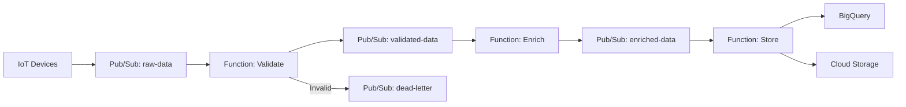

# How to Build a Serverless IoT Data Ingestion Pipeline Using Cloud Functions and Pub/Sub

Author: [nawazdhandala](https://www.github.com/nawazdhandala)

Tags: GCP, Cloud Functions, Pub/Sub, IoT, Serverless

Description: Build a fully serverless IoT data ingestion pipeline using Cloud Functions and Pub/Sub that scales automatically with zero infrastructure management.

---

Not every IoT project needs Dataflow. If your device fleet is moderate in size (thousands rather than millions of devices) and your processing logic is straightforward, Cloud Functions triggered by Pub/Sub gives you a serverless pipeline that requires zero infrastructure management. It scales automatically, costs nothing when idle, and you only write the processing logic.

In this guide, I will build a complete serverless ingestion pipeline that validates, transforms, enriches, and stores IoT data using nothing but Pub/Sub and Cloud Functions.

## Architecture

The pipeline uses a chain of Cloud Functions, each responsible for one stage of processing:



Each function does one thing and passes the result to the next stage via Pub/Sub. This makes each piece independently testable and replaceable.

## Prerequisites

- GCP project with Cloud Functions, Pub/Sub, BigQuery, and Cloud Storage APIs enabled
- Python 3.11
- `gcloud` CLI configured

## Step 1: Create the Pub/Sub Topics

```bash
# Create topics for each pipeline stage
gcloud pubsub topics create iot-raw-data
gcloud pubsub topics create iot-validated-data
gcloud pubsub topics create iot-enriched-data
gcloud pubsub topics create iot-dead-letter

# Create a subscription for monitoring the dead letter topic
gcloud pubsub subscriptions create iot-dead-letter-sub \
  --topic=iot-dead-letter
```

## Step 2: Build the Validation Function

The first function validates incoming messages, rejecting malformed data:

```python
# validate/main.py - Validates incoming IoT messages

import json
import base64
import time
from google.cloud import pubsub_v1
import functions_framework

publisher = pubsub_v1.PublisherClient()
PROJECT_ID = "your-project-id"

# Define the expected message schema
REQUIRED_FIELDS = ["device_id", "timestamp", "readings"]
VALID_SENSOR_TYPES = {"temperature", "humidity", "pressure", "vibration", "light"}

def validate_message(data):
    """Validates a sensor message against the expected schema.
    Returns a tuple of (is_valid, error_message)."""

    # Check required fields
    for field in REQUIRED_FIELDS:
        if field not in data:
            return False, f"Missing required field: {field}"

    # Validate device_id format
    device_id = data["device_id"]
    if not isinstance(device_id, str) or len(device_id) < 3:
        return False, f"Invalid device_id: {device_id}"

    # Validate timestamp is reasonable (not in the future, not too old)
    ts = data["timestamp"]
    now = time.time() * 1000
    if ts > now + 60000:  # Allow 1 minute clock skew
        return False, f"Timestamp is in the future: {ts}"
    if ts < now - 86400000:  # Reject data older than 24 hours
        return False, f"Timestamp too old: {ts}"

    # Validate readings
    readings = data["readings"]
    if not isinstance(readings, dict) or len(readings) == 0:
        return False, "Readings must be a non-empty dictionary"

    for sensor_type, value in readings.items():
        if sensor_type not in VALID_SENSOR_TYPES:
            return False, f"Unknown sensor type: {sensor_type}"
        if not isinstance(value, (int, float)):
            return False, f"Reading value must be numeric: {sensor_type}={value}"

    return True, None

@functions_framework.cloud_event
def validate(cloud_event):
    """Validates incoming IoT messages.
    Valid messages go to the validated topic.
    Invalid messages go to the dead letter topic."""

    raw_data = base64.b64decode(cloud_event.data["message"]["data"])
    attributes = cloud_event.data["message"].get("attributes", {})

    try:
        data = json.loads(raw_data)
    except json.JSONDecodeError as e:
        # Cannot even parse JSON - send to dead letter
        dead_letter_topic = publisher.topic_path(PROJECT_ID, "iot-dead-letter")
        publisher.publish(
            dead_letter_topic,
            data=raw_data,
            error=f"JSON parse error: {str(e)}",
            stage="validation",
        )
        return

    is_valid, error = validate_message(data)

    if is_valid:
        # Forward to the validated data topic
        validated_topic = publisher.topic_path(PROJECT_ID, "iot-validated-data")
        publisher.publish(
            validated_topic,
            data=json.dumps(data).encode("utf-8"),
            device_id=data["device_id"],
            **attributes,
        )
    else:
        # Send to dead letter with the error reason
        dead_letter_topic = publisher.topic_path(PROJECT_ID, "iot-dead-letter")
        publisher.publish(
            dead_letter_topic,
            data=json.dumps(data).encode("utf-8"),
            error=error,
            stage="validation",
            device_id=data.get("device_id", "unknown"),
        )
        print(f"Rejected message from {data.get('device_id', 'unknown')}: {error}")
```

## Step 3: Build the Enrichment Function

This function adds context to validated messages - device metadata, location, computed fields:

```python
# enrich/main.py - Enriches validated IoT messages with metadata

import json
import base64
from google.cloud import pubsub_v1, firestore
import functions_framework

publisher = pubsub_v1.PublisherClient()
db = firestore.Client()
PROJECT_ID = "your-project-id"

# Cache device metadata to avoid Firestore reads on every message
_device_cache = {}

def get_device_metadata(device_id):
    """Fetches device metadata from Firestore with in-memory caching.
    Cache entries are not expired since device metadata changes rarely."""

    if device_id in _device_cache:
        return _device_cache[device_id]

    doc = db.collection("devices").document(device_id).get()
    if doc.exists:
        metadata = doc.to_dict()
        _device_cache[device_id] = metadata
        return metadata

    # Return defaults for unregistered devices
    return {
        "location": "unknown",
        "zone": "unknown",
        "device_type": "unknown",
        "owner": "unknown",
    }

def compute_derived_fields(readings):
    """Computes derived metrics from raw sensor readings.
    These computed fields save downstream queries from doing the math."""

    derived = {}

    # Heat index from temperature and humidity
    temp = readings.get("temperature")
    humidity = readings.get("humidity")
    if temp is not None and humidity is not None:
        # Simplified heat index calculation
        derived["heat_index"] = temp + 0.5 * (humidity - 50)

    # Dew point approximation
    if temp is not None and humidity is not None:
        derived["dew_point"] = temp - ((100 - humidity) / 5)

    return derived

@functions_framework.cloud_event
def enrich(cloud_event):
    """Enriches validated messages with device metadata and derived fields."""

    raw_data = base64.b64decode(cloud_event.data["message"]["data"])
    data = json.loads(raw_data)
    attributes = cloud_event.data["message"].get("attributes", {})

    device_id = data["device_id"]

    # Add device metadata
    metadata = get_device_metadata(device_id)
    data["device_metadata"] = {
        "location": metadata.get("location", "unknown"),
        "zone": metadata.get("zone", "unknown"),
        "device_type": metadata.get("device_type", "unknown"),
    }

    # Compute derived fields from the sensor readings
    derived = compute_derived_fields(data["readings"])
    if derived:
        data["derived"] = derived

    # Add processing metadata
    import time
    data["processing"] = {
        "validated_at": int(time.time() * 1000),
        "enriched_at": int(time.time() * 1000),
        "pipeline_version": "1.0",
    }

    # Forward to the enriched data topic
    enriched_topic = publisher.topic_path(PROJECT_ID, "iot-enriched-data")
    publisher.publish(
        enriched_topic,
        data=json.dumps(data).encode("utf-8"),
        device_id=device_id,
        location=metadata.get("location", "unknown"),
        **attributes,
    )
```

## Step 4: Build the Storage Function

The final function writes enriched data to BigQuery and optionally to Cloud Storage:

```python
# store/main.py - Stores enriched IoT data in BigQuery and GCS

import json
import base64
import time
from datetime import datetime
from google.cloud import bigquery, storage
import functions_framework

bq_client = bigquery.Client()
gcs_client = storage.Client()

TABLE_ID = "your-project.iot_data.sensor_readings"
ARCHIVE_BUCKET = "your-iot-archive-bucket"

def flatten_for_bigquery(data):
    """Flattens the nested message structure for BigQuery insertion.
    BigQuery works best with flat rows rather than deeply nested JSON."""

    rows = []
    device_id = data["device_id"]
    timestamp = datetime.utcfromtimestamp(data["timestamp"] / 1000).isoformat()
    metadata = data.get("device_metadata", {})
    derived = data.get("derived", {})

    # Create one row per sensor reading
    for sensor_type, value in data["readings"].items():
        row = {
            "device_id": device_id,
            "timestamp": timestamp,
            "sensor_type": sensor_type,
            "value": float(value),
            "location": metadata.get("location", "unknown"),
            "zone": metadata.get("zone", "unknown"),
            "device_type": metadata.get("device_type", "unknown"),
            "ingested_at": datetime.utcnow().isoformat(),
        }

        # Add relevant derived fields
        if sensor_type == "temperature" and "heat_index" in derived:
            row["derived_heat_index"] = derived["heat_index"]

        rows.append(row)

    return rows

def archive_to_gcs(data):
    """Archives the raw enriched message to Cloud Storage.
    Uses a date-partitioned path for easy lifecycle management."""

    now = datetime.utcnow()
    path = f"raw/{now.year}/{now.month:02d}/{now.day:02d}/{data['device_id']}_{int(time.time() * 1000)}.json"

    bucket = gcs_client.bucket(ARCHIVE_BUCKET)
    blob = bucket.blob(path)
    blob.upload_from_string(
        json.dumps(data),
        content_type="application/json",
    )

@functions_framework.cloud_event
def store(cloud_event):
    """Stores enriched IoT data in BigQuery and archives to GCS."""

    raw_data = base64.b64decode(cloud_event.data["message"]["data"])
    data = json.loads(raw_data)

    # Write to BigQuery
    rows = flatten_for_bigquery(data)
    errors = bq_client.insert_rows_json(TABLE_ID, rows)
    if errors:
        print(f"BigQuery insert errors: {errors}")

    # Archive the full message to Cloud Storage
    archive_to_gcs(data)
```

## Step 5: Deploy All Functions

```bash
# Deploy the validation function
gcloud functions deploy iot-validate \
  --gen2 \
  --runtime=python311 \
  --trigger-topic=iot-raw-data \
  --region=us-central1 \
  --memory=256MB \
  --timeout=60s \
  --entry-point=validate \
  --source=validate/

# Deploy the enrichment function
gcloud functions deploy iot-enrich \
  --gen2 \
  --runtime=python311 \
  --trigger-topic=iot-validated-data \
  --region=us-central1 \
  --memory=256MB \
  --timeout=60s \
  --entry-point=enrich \
  --source=enrich/

# Deploy the storage function
gcloud functions deploy iot-store \
  --gen2 \
  --runtime=python311 \
  --trigger-topic=iot-enriched-data \
  --region=us-central1 \
  --memory=512MB \
  --timeout=120s \
  --entry-point=store \
  --source=store/
```

## Step 6: Test the Pipeline End to End

```bash
# Publish a test message to the raw data topic
gcloud pubsub topics publish iot-raw-data \
  --message='{"device_id":"sensor-001","timestamp":1708200000000,"readings":{"temperature":23.5,"humidity":55.2,"pressure":1013.25}}'

# Wait a few seconds for processing, then check BigQuery
bq query --use_legacy_sql=false \
  'SELECT * FROM iot_data.sensor_readings ORDER BY ingested_at DESC LIMIT 10'

# Check the dead letter topic for any rejected messages
gcloud pubsub subscriptions pull iot-dead-letter-sub --auto-ack --limit=5
```

## Cost Considerations

This serverless approach is very cost-effective for moderate-scale IoT:

- Cloud Functions: First 2 million invocations per month are free
- Pub/Sub: First 10 GB of messages per month are free
- You pay only for actual usage, with no idle costs

For high-throughput scenarios (over 10,000 messages per second sustained), Dataflow becomes more cost-effective because Cloud Functions have per-invocation overhead.

## Wrapping Up

The serverless pipeline pattern with Cloud Functions and Pub/Sub is the fastest way to get an IoT data pipeline running on GCP. Each function handles one concern, making the system easy to understand, test, and modify. The automatic scaling handles traffic spikes without any configuration, and the pay-per-use pricing means you are not paying for idle infrastructure during quiet periods. When you outgrow this pattern, you can swap individual functions for Dataflow stages without rebuilding the whole pipeline.
