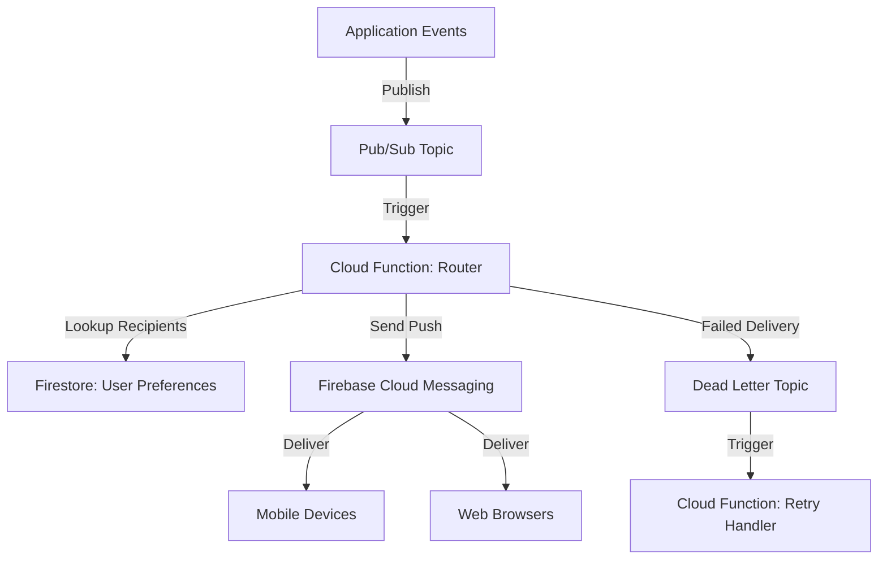

# How to Build a Serverless Real-Time Notification System Using Pub/Sub Cloud Functions and Firebase Cloud Messaging

Author: [nawazdhandala](https://www.github.com/nawazdhandala)

Tags: GCP, Pub/Sub, Cloud Functions, Firebase Cloud Messaging, Serverless, Notifications

Description: Build a serverless real-time notification system on Google Cloud using Pub/Sub, Cloud Functions, and Firebase Cloud Messaging for push notifications.

---

Push notifications are a critical part of modern applications. Users expect to know immediately when something happens - a new message, an order update, a system alert. Building a notification system that works reliably at scale is harder than it sounds. You need to handle device token management, message routing, delivery tracking, and failure recovery.

On Google Cloud, you can build this entirely serverless by combining Pub/Sub for message routing, Cloud Functions for processing logic, and Firebase Cloud Messaging (FCM) for the actual push delivery. This guide walks through setting up the entire pipeline.

## System Architecture

The notification system uses a fan-out pattern. Events from your application publish to Pub/Sub topics. Cloud Functions subscribe to these topics, determine which users should be notified, and dispatch push notifications through FCM.



## Setting Up the Infrastructure

Start by enabling the required APIs and creating the Pub/Sub topics.

```bash
# Enable all necessary APIs
gcloud services enable pubsub.googleapis.com
gcloud services enable cloudfunctions.googleapis.com
gcloud services enable firestore.googleapis.com
gcloud services enable fcm.googleapis.com

# Create the main notification topic
gcloud pubsub topics create notifications

# Create a dead letter topic for failed deliveries
gcloud pubsub topics create notification-dead-letters

# Create the subscription with dead letter policy
gcloud pubsub subscriptions create notifications-sub \
  --topic=notifications \
  --dead-letter-topic=notification-dead-letters \
  --max-delivery-attempts=5 \
  --ack-deadline=60
```

## Managing Device Tokens

Before sending notifications, you need to store and manage FCM device tokens. Each user can have multiple devices registered.

```python
# device_tokens.py - Manage FCM device tokens in Firestore
from google.cloud import firestore
from datetime import datetime

db = firestore.Client()


def register_device(user_id, token, platform):
    """Register a device token for a user."""
    doc_ref = db.collection("users").document(user_id)

    # Store tokens in a subcollection for easy management
    token_ref = doc_ref.collection("devices").document(token)
    token_ref.set({
        "token": token,
        "platform": platform,  # "android", "ios", or "web"
        "registered_at": datetime.utcnow(),
        "last_used": datetime.utcnow(),
        "active": True,
    })


def get_user_tokens(user_id):
    """Get all active device tokens for a user."""
    doc_ref = db.collection("users").document(user_id)
    devices = doc_ref.collection("devices").where("active", "==", True).stream()
    return [device.to_dict() for device in devices]


def deactivate_token(user_id, token):
    """Mark a token as inactive when FCM reports it invalid."""
    doc_ref = db.collection("users").document(user_id)
    token_ref = doc_ref.collection("devices").document(token)
    token_ref.update({"active": False, "deactivated_at": datetime.utcnow()})
```

## Publishing Notification Events

Your application publishes events to Pub/Sub whenever something notification-worthy happens.

```python
# publisher.py - Publish notification events from your application
from google.cloud import pubsub_v1
import json

publisher = pubsub_v1.PublisherClient()
TOPIC_PATH = publisher.topic_path("YOUR_PROJECT", "notifications")


def send_notification_event(event_type, recipient_ids, data):
    """Publish a notification event to Pub/Sub."""
    message = {
        "event_type": event_type,
        "recipients": recipient_ids,
        "data": data,
        "timestamp": datetime.utcnow().isoformat(),
    }

    # Publish with ordering key to maintain per-user ordering
    future = publisher.publish(
        TOPIC_PATH,
        json.dumps(message).encode("utf-8"),
        event_type=event_type,  # Attribute for filtering
    )

    return future.result()


# Example usage from your application code
def notify_order_shipped(order):
    """Notify the customer that their order has shipped."""
    send_notification_event(
        event_type="order_shipped",
        recipient_ids=[order["customer_id"]],
        data={
            "order_id": order["id"],
            "tracking_number": order["tracking_number"],
            "title": "Order Shipped",
            "body": f"Your order #{order['id']} has been shipped!",
        }
    )
```

## Cloud Function: Notification Router

This is the core function that receives events and dispatches push notifications.

```python
# router.py - Main notification routing function
import functions_framework
import base64
import json
import logging
from google.cloud import firestore
from firebase_admin import initialize_app, messaging
import firebase_admin

logger = logging.getLogger(__name__)

# Initialize Firebase Admin SDK
if not firebase_admin._apps:
    initialize_app()

db = firestore.Client()

# Notification templates for different event types
TEMPLATES = {
    "order_shipped": {
        "title": "Order Shipped",
        "icon": "shipping_icon",
        "channel": "orders",
    },
    "new_message": {
        "title": "New Message",
        "icon": "message_icon",
        "channel": "messages",
    },
    "payment_received": {
        "title": "Payment Received",
        "icon": "payment_icon",
        "channel": "payments",
    },
}


@functions_framework.cloud_event
def route_notification(cloud_event):
    """Process a notification event and send push notifications."""
    # Decode the Pub/Sub message
    message_data = base64.b64decode(cloud_event.data["message"]["data"])
    event = json.loads(message_data)

    event_type = event.get("event_type", "generic")
    recipients = event.get("recipients", [])
    data = event.get("data", {})

    logger.info(f"Processing {event_type} notification for {len(recipients)} recipients")

    template = TEMPLATES.get(event_type, {"title": "Notification", "channel": "default"})

    # Process each recipient
    for user_id in recipients:
        try:
            send_to_user(user_id, template, data, event_type)
        except Exception as e:
            logger.error(f"Failed to notify user {user_id}: {e}")


def send_to_user(user_id, template, data, event_type):
    """Send notification to all of a user's active devices."""
    # Check user notification preferences
    user_doc = db.collection("users").document(user_id).get()
    if not user_doc.exists:
        logger.warning(f"User {user_id} not found")
        return

    user_prefs = user_doc.to_dict().get("notification_preferences", {})

    # Check if user has opted out of this notification type
    if not user_prefs.get(event_type, True):
        logger.info(f"User {user_id} opted out of {event_type}")
        return

    # Get all active device tokens
    devices = db.collection("users").document(user_id)\
        .collection("devices").where("active", "==", True).stream()

    tokens = [d.to_dict()["token"] for d in devices]

    if not tokens:
        logger.info(f"No active tokens for user {user_id}")
        return

    # Build the FCM message
    notification = messaging.Notification(
        title=data.get("title", template["title"]),
        body=data.get("body", ""),
    )

    # Use multicast to send to all devices at once
    message = messaging.MulticastMessage(
        notification=notification,
        data={k: str(v) for k, v in data.items()},  # FCM data must be strings
        tokens=tokens,
        android=messaging.AndroidConfig(
            priority="high",
            notification=messaging.AndroidNotification(
                channel_id=template.get("channel", "default"),
                icon=template.get("icon"),
            ),
        ),
        apns=messaging.APNSConfig(
            payload=messaging.APNSPayload(
                aps=messaging.Aps(
                    badge=1,
                    sound="default",
                ),
            ),
        ),
    )

    # Send and handle the response
    response = messaging.send_each_for_multicast(message)

    # Handle failed tokens
    if response.failure_count > 0:
        for idx, send_response in enumerate(response.responses):
            if not send_response.success:
                error = send_response.exception
                # Deactivate invalid tokens
                if isinstance(error, (
                    messaging.UnregisteredError,
                    messaging.InvalidArgumentError,
                )):
                    logger.info(f"Deactivating invalid token for user {user_id}")
                    deactivate_token(user_id, tokens[idx])

    logger.info(
        f"Sent to user {user_id}: {response.success_count} success, "
        f"{response.failure_count} failures"
    )


def deactivate_token(user_id, token):
    """Mark a device token as inactive."""
    from datetime import datetime
    doc_ref = db.collection("users").document(user_id)
    token_ref = doc_ref.collection("devices").document(token)
    token_ref.update({"active": False, "deactivated_at": datetime.utcnow()})
```

Deploy the router function.

```bash
# Deploy the notification router
gcloud functions deploy notification-router \
  --gen2 \
  --runtime=python311 \
  --region=us-central1 \
  --source=./router \
  --entry-point=route_notification \
  --trigger-topic=notifications \
  --memory=512MB \
  --timeout=120s \
  --min-instances=1 \
  --set-env-vars="GOOGLE_CLOUD_PROJECT=YOUR_PROJECT"
```

## Tracking Delivery and Analytics

Store notification delivery results for analytics and debugging.

```python
# analytics.py - Track notification delivery metrics
from google.cloud import bigquery
from datetime import datetime

bq_client = bigquery.Client()

def log_delivery(user_id, event_type, success_count, failure_count, tokens_deactivated):
    """Log notification delivery results to BigQuery for analytics."""
    rows = [{
        "user_id": user_id,
        "event_type": event_type,
        "success_count": success_count,
        "failure_count": failure_count,
        "tokens_deactivated": tokens_deactivated,
        "timestamp": datetime.utcnow().isoformat(),
    }]

    table_ref = "YOUR_PROJECT.notifications.delivery_log"
    errors = bq_client.insert_rows_json(table_ref, rows)

    if errors:
        logger.error(f"BigQuery insert errors: {errors}")
```

## Rate Limiting and Batching

For high-volume notification scenarios, you may need to batch FCM calls and respect rate limits.

```python
# batch_sender.py - Batch notifications for high volume
from firebase_admin import messaging
import time

# FCM allows up to 500 tokens per multicast message
MAX_TOKENS_PER_BATCH = 500

def send_batch_notifications(notification, data, tokens):
    """Send notifications in batches respecting FCM limits."""
    total_success = 0
    total_failure = 0

    # Split tokens into batches of 500
    for i in range(0, len(tokens), MAX_TOKENS_PER_BATCH):
        batch = tokens[i:i + MAX_TOKENS_PER_BATCH]

        message = messaging.MulticastMessage(
            notification=notification,
            data=data,
            tokens=batch,
        )

        response = messaging.send_each_for_multicast(message)
        total_success += response.success_count
        total_failure += response.failure_count

        # Brief pause between batches to avoid rate limiting
        if i + MAX_TOKENS_PER_BATCH < len(tokens):
            time.sleep(0.1)

    return total_success, total_failure
```

## Wrapping Up

This serverless notification system handles the full lifecycle from event publishing through push delivery and token management. Pub/Sub decouples your application from the notification logic, Cloud Functions process events at scale, and FCM handles the last-mile delivery to devices. The dead letter queue catches persistent failures, and the token deactivation logic keeps your device registry clean. For most applications on GCP, this pattern gives you a production-ready notification system without any always-on infrastructure.
