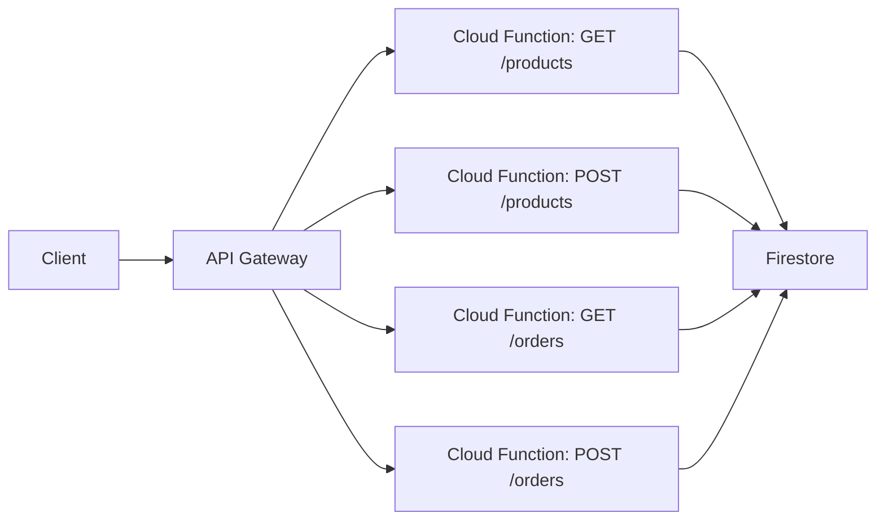

# How to Build a Serverless REST API on GCP Using Cloud Functions and API Gateway

Author: [nawazdhandala](https://www.github.com/nawazdhandala)

Tags: GCP, Serverless, REST API, Cloud Functions, API Gateway, Microservices

Description: A practical guide to building a serverless REST API on Google Cloud using Cloud Functions for business logic and API Gateway for routing, authentication, and rate limiting.

---

Building a REST API does not have to involve provisioning servers, configuring web servers, or managing load balancers. On GCP, Cloud Functions handle the business logic and API Gateway handles the routing, authentication, and rate limiting. You write the code for each endpoint as a separate function, define the API spec in OpenAPI format, and deploy. No servers to manage, no scaling to configure.

This post covers the complete process of building a REST API with multiple endpoints, connecting them through API Gateway, and adding authentication and monitoring.

## Architecture



API Gateway acts as the front door for your API. It receives requests, validates them against your OpenAPI spec, handles authentication, and routes them to the appropriate Cloud Function. Each function handles one or a few related endpoints.

## Step 1: Write the Cloud Functions

Each Cloud Function handles a specific API endpoint. Here are the functions for a simple product and order management API:

**Products - GET and POST:**

```python
# products/main.py - Cloud Functions for product endpoints
import json
from flask import jsonify, request
from google.cloud import firestore

db = firestore.Client()

def get_products(request):
    """Handle GET /products - list all products or filter by category."""
    # Get optional query parameters
    category = request.args.get("category")
    limit = int(request.args.get("limit", 50))

    # Query Firestore
    query = db.collection("products")
    if category:
        query = query.where("category", "==", category)
    query = query.limit(limit)

    products = []
    for doc in query.stream():
        product = doc.to_dict()
        product["id"] = doc.id
        products.append(product)

    return jsonify({"products": products, "count": len(products)}), 200


def create_product(request):
    """Handle POST /products - create a new product."""
    # Parse the request body
    data = request.get_json()

    # Validate required fields
    required_fields = ["name", "price", "category"]
    missing = [f for f in required_fields if f not in data]
    if missing:
        return jsonify({"error": f"Missing fields: {', '.join(missing)}"}), 400

    # Validate data types
    if not isinstance(data["price"], (int, float)) or data["price"] <= 0:
        return jsonify({"error": "Price must be a positive number"}), 400

    # Create the product in Firestore
    product_data = {
        "name": data["name"],
        "price": float(data["price"]),
        "category": data["category"],
        "description": data.get("description", ""),
        "created_at": firestore.SERVER_TIMESTAMP,
    }

    doc_ref = db.collection("products").add(product_data)
    product_data["id"] = doc_ref[1].id

    return jsonify(product_data), 201


def get_product_by_id(request):
    """Handle GET /products/{id} - get a single product."""
    # Extract the product ID from the path
    # API Gateway passes path parameters as query parameters
    product_id = request.args.get("product_id")

    if not product_id:
        return jsonify({"error": "Product ID is required"}), 400

    doc = db.collection("products").document(product_id).get()

    if not doc.exists:
        return jsonify({"error": "Product not found"}), 404

    product = doc.to_dict()
    product["id"] = doc.id

    return jsonify(product), 200
```

**Orders - GET and POST:**

```python
# orders/main.py - Cloud Functions for order endpoints
import json
from flask import jsonify, request
from google.cloud import firestore
from datetime import datetime

db = firestore.Client()

def get_orders(request):
    """Handle GET /orders - list orders, optionally filtered by customer."""
    customer_id = request.args.get("customer_id")
    limit = int(request.args.get("limit", 50))

    query = db.collection("orders")
    if customer_id:
        query = query.where("customer_id", "==", customer_id)
    query = query.order_by("created_at", direction=firestore.Query.DESCENDING)
    query = query.limit(limit)

    orders = []
    for doc in query.stream():
        order = doc.to_dict()
        order["id"] = doc.id
        # Convert timestamp to string for JSON serialization
        if order.get("created_at"):
            order["created_at"] = order["created_at"].isoformat()
        orders.append(order)

    return jsonify({"orders": orders, "count": len(orders)}), 200


def create_order(request):
    """Handle POST /orders - create a new order."""
    data = request.get_json()

    # Validate required fields
    required = ["customer_id", "product_id", "quantity"]
    missing = [f for f in required if f not in data]
    if missing:
        return jsonify({"error": f"Missing fields: {', '.join(missing)}"}), 400

    # Verify the product exists
    product_doc = db.collection("products").document(data["product_id"]).get()
    if not product_doc.exists:
        return jsonify({"error": "Product not found"}), 404

    product = product_doc.to_dict()

    # Create the order
    order_data = {
        "customer_id": data["customer_id"],
        "product_id": data["product_id"],
        "quantity": int(data["quantity"]),
        "unit_price": product["price"],
        "total": product["price"] * int(data["quantity"]),
        "status": "pending",
        "created_at": firestore.SERVER_TIMESTAMP,
    }

    doc_ref = db.collection("orders").add(order_data)
    order_data["id"] = doc_ref[1].id

    return jsonify(order_data), 201
```

## Step 2: Deploy the Cloud Functions

Deploy each function:

```bash
# Deploy the GET products function
gcloud functions deploy get-products \
  --runtime=python311 \
  --trigger-http \
  --allow-unauthenticated \
  --entry-point=get_products \
  --source=./products \
  --region=us-central1 \
  --project=my-project

# Deploy the POST products function
gcloud functions deploy create-product \
  --runtime=python311 \
  --trigger-http \
  --allow-unauthenticated \
  --entry-point=create_product \
  --source=./products \
  --region=us-central1 \
  --project=my-project

# Deploy the GET product by ID function
gcloud functions deploy get-product-by-id \
  --runtime=python311 \
  --trigger-http \
  --allow-unauthenticated \
  --entry-point=get_product_by_id \
  --source=./products \
  --region=us-central1 \
  --project=my-project

# Deploy the GET orders function
gcloud functions deploy get-orders \
  --runtime=python311 \
  --trigger-http \
  --allow-unauthenticated \
  --entry-point=get_orders \
  --source=./orders \
  --region=us-central1 \
  --project=my-project

# Deploy the POST orders function
gcloud functions deploy create-order \
  --runtime=python311 \
  --trigger-http \
  --allow-unauthenticated \
  --entry-point=create_order \
  --source=./orders \
  --region=us-central1 \
  --project=my-project
```

## Step 3: Create the OpenAPI Spec

API Gateway uses an OpenAPI 2.0 (Swagger) specification to define the API routes and their backend Cloud Functions:

```yaml
# api-spec.yaml - OpenAPI spec for the REST API
swagger: "2.0"
info:
  title: "Product & Order API"
  version: "1.0.0"
  description: "Serverless REST API for managing products and orders"
host: "my-api-gateway-url.apigateway.my-project.cloud.goog"
schemes:
  - "https"
produces:
  - "application/json"
consumes:
  - "application/json"

paths:
  /products:
    get:
      summary: "List products"
      operationId: "getProducts"
      parameters:
        - name: "category"
          in: "query"
          type: "string"
          required: false
        - name: "limit"
          in: "query"
          type: "integer"
          required: false
      x-google-backend:
        address: "https://us-central1-my-project.cloudfunctions.net/get-products"
      responses:
        200:
          description: "List of products"
    post:
      summary: "Create a product"
      operationId: "createProduct"
      x-google-backend:
        address: "https://us-central1-my-project.cloudfunctions.net/create-product"
      responses:
        201:
          description: "Product created"

  /products/{product_id}:
    get:
      summary: "Get a product by ID"
      operationId: "getProductById"
      parameters:
        - name: "product_id"
          in: "path"
          type: "string"
          required: true
      x-google-backend:
        address: "https://us-central1-my-project.cloudfunctions.net/get-product-by-id"
        path_translation: APPEND_PATH_TO_ADDRESS
      responses:
        200:
          description: "Product details"

  /orders:
    get:
      summary: "List orders"
      operationId: "getOrders"
      x-google-backend:
        address: "https://us-central1-my-project.cloudfunctions.net/get-orders"
      responses:
        200:
          description: "List of orders"
    post:
      summary: "Create an order"
      operationId: "createOrder"
      x-google-backend:
        address: "https://us-central1-my-project.cloudfunctions.net/create-order"
      responses:
        201:
          description: "Order created"
```

## Step 4: Deploy API Gateway

```bash
# Create an API
gcloud api-gateway apis create product-order-api \
  --project=my-project

# Create an API config from the OpenAPI spec
gcloud api-gateway api-configs create v1 \
  --api=product-order-api \
  --openapi-spec=api-spec.yaml \
  --project=my-project

# Create a gateway
gcloud api-gateway gateways create product-order-gateway \
  --api=product-order-api \
  --api-config=v1 \
  --location=us-central1 \
  --project=my-project
```

Get the gateway URL:

```bash
# Get the gateway URL
gcloud api-gateway gateways describe product-order-gateway \
  --location=us-central1 \
  --format="value(defaultHostname)" \
  --project=my-project
```

## Step 5: Test the API

```bash
# Get the gateway URL
GATEWAY_URL=$(gcloud api-gateway gateways describe product-order-gateway \
  --location=us-central1 \
  --format="value(defaultHostname)" \
  --project=my-project)

# Test GET /products
curl "https://${GATEWAY_URL}/products"

# Test POST /products
curl -X POST "https://${GATEWAY_URL}/products" \
  -H "Content-Type: application/json" \
  -d '{"name": "Test Product", "price": 29.99, "category": "electronics"}'

# Test GET /orders
curl "https://${GATEWAY_URL}/orders"
```

## Step 6: Add API Key Authentication

Update the OpenAPI spec to require API keys, then create and distribute API keys to your clients. This gives you usage tracking and the ability to revoke access.

```bash
# Enable the API for API key usage
gcloud services enable product-order-api-HASH.apigateway.my-project.cloud.goog

# Create an API key
gcloud alpha services api-keys create \
  --display-name="Client App Key" \
  --project=my-project
```

## Summary

Building a serverless REST API with Cloud Functions and API Gateway on GCP gives you a clean separation between your API definition (OpenAPI spec) and your business logic (Cloud Functions). API Gateway handles routing, authentication, and rate limiting while Cloud Functions handle the actual processing. Deploy new endpoints by writing a function and updating the spec. No servers, no scaling configuration, and you only pay for the requests you handle.
