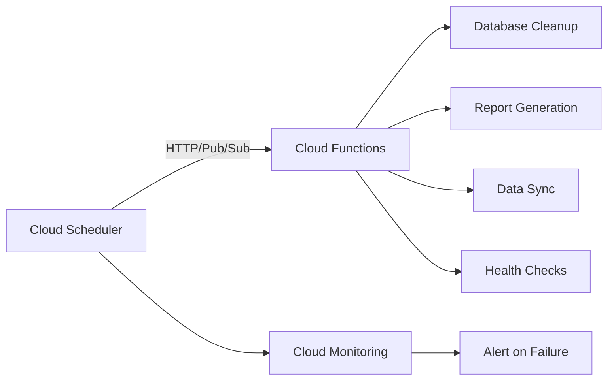

# How to Build a Serverless Scheduled Job System on GCP Using Cloud Scheduler and Cloud Functions

Author: [nawazdhandala](https://www.github.com/nawazdhandala)

Tags: GCP, Cloud Scheduler, Cloud Functions, Serverless, Cron Jobs, Task Scheduling

Description: Learn how to build a serverless scheduled job system on Google Cloud using Cloud Scheduler for timing and Cloud Functions for execution, with retry and monitoring.

---

Every application has tasks that need to run on a schedule - sending daily reports, cleaning up expired sessions, syncing data between systems, running health checks, or generating invoices. On traditional infrastructure, you would set up cron jobs on a server. The problem is that server needs to be running 24/7 just to execute a job that runs for 30 seconds once a day.

Cloud Scheduler and Cloud Functions give you a serverless alternative. Cloud Scheduler handles the timing (supporting cron syntax), and Cloud Functions handle the execution. You pay nothing when jobs are not running, and the system scales automatically.

## Architecture



Cloud Scheduler triggers Cloud Functions on a schedule. Each function performs its task and returns a result. Cloud Monitoring tracks whether the jobs succeeded or failed, and alerts you when something goes wrong.

## Step 1: Create Cloud Functions for Each Job

Start by writing the Cloud Functions that perform your scheduled tasks.

**Job 1: Database Cleanup** - removes expired records daily:

```python
# cleanup/main.py
import logging
from google.cloud import firestore
from datetime import datetime, timedelta

logging.basicConfig(level=logging.INFO)
logger = logging.getLogger(__name__)

db = firestore.Client()

def cleanup_expired_sessions(request):
    """Remove expired user sessions from Firestore.

    Runs daily at 2 AM. Deletes sessions older than 30 days.
    """
    cutoff_date = datetime.utcnow() - timedelta(days=30)

    # Query for expired sessions
    sessions_ref = db.collection("sessions")
    expired = sessions_ref.where("last_active", "<", cutoff_date).limit(500)

    deleted_count = 0
    batch = db.batch()

    for doc in expired.stream():
        batch.delete(doc.reference)
        deleted_count += 1

        # Commit in batches of 500 (Firestore limit)
        if deleted_count % 500 == 0:
            batch.commit()
            batch = db.batch()
            logger.info(f"Deleted {deleted_count} sessions so far")

    # Commit remaining
    if deleted_count % 500 != 0:
        batch.commit()

    logger.info(f"Cleanup complete: deleted {deleted_count} expired sessions")

    return f"Deleted {deleted_count} expired sessions", 200
```

**Job 2: Daily Report Generation** - generates and emails a summary report:

```python
# reports/main.py
import logging
from google.cloud import bigquery
from google.cloud import storage
from datetime import datetime, timedelta
import json

logging.basicConfig(level=logging.INFO)
logger = logging.getLogger(__name__)

bq_client = bigquery.Client()
storage_client = storage.Client()

def generate_daily_report(request):
    """Generate a daily summary report from BigQuery data.

    Runs daily at 7 AM. Queries yesterday's data and stores the report.
    """
    yesterday = (datetime.utcnow() - timedelta(days=1)).strftime("%Y-%m-%d")

    # Query BigQuery for yesterday's metrics
    query = f"""
    SELECT
        COUNT(*) as total_orders,
        SUM(total) as total_revenue,
        AVG(total) as avg_order_value,
        COUNT(DISTINCT customer_id) as unique_customers,
        region,
        COUNT(*) as orders_by_region
    FROM `my-project.sales_data.transactions`
    WHERE DATE(transaction_date) = '{yesterday}'
    GROUP BY region
    ORDER BY orders_by_region DESC
    """

    results = bq_client.query(query).result()

    # Build the report
    report = {
        "date": yesterday,
        "generated_at": datetime.utcnow().isoformat(),
        "summary": {},
        "by_region": [],
    }

    total_orders = 0
    total_revenue = 0.0

    for row in results:
        total_orders += row.total_orders
        total_revenue += float(row.total_revenue or 0)
        report["by_region"].append({
            "region": row.region,
            "orders": row.orders_by_region,
            "revenue": float(row.total_revenue or 0),
        })

    report["summary"] = {
        "total_orders": total_orders,
        "total_revenue": round(total_revenue, 2),
        "avg_order_value": round(total_revenue / max(total_orders, 1), 2),
    }

    # Store the report in Cloud Storage
    bucket = storage_client.bucket("my-project-reports")
    blob = bucket.blob(f"daily/{yesterday}.json")
    blob.upload_from_string(json.dumps(report, indent=2), content_type="application/json")

    logger.info(f"Daily report generated for {yesterday}: "
                f"{total_orders} orders, ${total_revenue:.2f} revenue")

    # Optionally send an email notification
    send_report_notification(report)

    return f"Report generated for {yesterday}", 200


def send_report_notification(report):
    """Send report summary notification (placeholder)."""
    # In production, use SendGrid, Mailgun, or another email service
    logger.info(f"Report notification: {report['summary']}")
```

**Job 3: Data Sync** - synchronizes data between systems:

```python
# sync/main.py
import logging
import requests
from google.cloud import firestore
from datetime import datetime

logging.basicConfig(level=logging.INFO)
logger = logging.getLogger(__name__)

db = firestore.Client()

def sync_external_data(request):
    """Sync product catalog from external API to Firestore.

    Runs every 6 hours. Fetches latest product data and updates Firestore.
    """
    # Fetch data from external API
    api_url = "https://api.external-service.com/products"
    headers = {"Authorization": "Bearer YOUR_API_KEY"}

    response = requests.get(api_url, headers=headers, timeout=30)
    response.raise_for_status()

    products = response.json().get("products", [])

    # Update Firestore with the latest data
    updated = 0
    created = 0

    for product in products:
        doc_ref = db.collection("products").document(str(product["id"]))
        doc = doc_ref.get()

        product_data = {
            "name": product["name"],
            "price": product["price"],
            "category": product["category"],
            "in_stock": product.get("in_stock", True),
            "last_synced": datetime.utcnow(),
        }

        if doc.exists:
            doc_ref.update(product_data)
            updated += 1
        else:
            doc_ref.set(product_data)
            created += 1

    logger.info(f"Sync complete: {created} created, {updated} updated, "
                f"{len(products)} total products")

    return f"Synced {len(products)} products ({created} new, {updated} updated)", 200
```

## Step 2: Deploy the Cloud Functions

```bash
# Deploy the cleanup function
gcloud functions deploy cleanup-expired-sessions \
  --runtime=python311 \
  --trigger-http \
  --no-allow-unauthenticated \
  --entry-point=cleanup_expired_sessions \
  --source=./cleanup \
  --memory=256MB \
  --timeout=300s \
  --region=us-central1 \
  --project=my-project

# Deploy the report generation function
gcloud functions deploy generate-daily-report \
  --runtime=python311 \
  --trigger-http \
  --no-allow-unauthenticated \
  --entry-point=generate_daily_report \
  --source=./reports \
  --memory=512MB \
  --timeout=540s \
  --region=us-central1 \
  --project=my-project

# Deploy the data sync function
gcloud functions deploy sync-external-data \
  --runtime=python311 \
  --trigger-http \
  --no-allow-unauthenticated \
  --entry-point=sync_external_data \
  --source=./sync \
  --memory=256MB \
  --timeout=300s \
  --region=us-central1 \
  --project=my-project
```

Note the `--no-allow-unauthenticated` flag. This ensures only Cloud Scheduler (with the right service account) can invoke these functions.

## Step 3: Create a Service Account for Cloud Scheduler

Cloud Scheduler needs a service account that has permission to invoke the Cloud Functions:

```bash
# Create a service account
gcloud iam service-accounts create scheduler-sa \
  --display-name="Cloud Scheduler Service Account" \
  --project=my-project

# Grant the Cloud Functions invoker role
gcloud projects add-iam-policy-binding my-project \
  --member="serviceAccount:scheduler-sa@my-project.iam.gserviceaccount.com" \
  --role="roles/cloudfunctions.invoker"
```

## Step 4: Create Cloud Scheduler Jobs

Now create the scheduler jobs that trigger each function on its schedule:

```bash
# Job 1: Cleanup expired sessions - daily at 2 AM UTC
gcloud scheduler jobs create http cleanup-sessions-job \
  --schedule="0 2 * * *" \
  --time-zone="UTC" \
  --uri="https://us-central1-my-project.cloudfunctions.net/cleanup-expired-sessions" \
  --http-method=POST \
  --oidc-service-account-email=scheduler-sa@my-project.iam.gserviceaccount.com \
  --oidc-token-audience="https://us-central1-my-project.cloudfunctions.net/cleanup-expired-sessions" \
  --attempt-deadline=600s \
  --max-retry-attempts=3 \
  --min-backoff=30s \
  --max-backoff=300s \
  --location=us-central1 \
  --project=my-project

# Job 2: Daily report - daily at 7 AM UTC
gcloud scheduler jobs create http daily-report-job \
  --schedule="0 7 * * *" \
  --time-zone="UTC" \
  --uri="https://us-central1-my-project.cloudfunctions.net/generate-daily-report" \
  --http-method=POST \
  --oidc-service-account-email=scheduler-sa@my-project.iam.gserviceaccount.com \
  --oidc-token-audience="https://us-central1-my-project.cloudfunctions.net/generate-daily-report" \
  --attempt-deadline=600s \
  --max-retry-attempts=2 \
  --location=us-central1 \
  --project=my-project

# Job 3: Data sync - every 6 hours
gcloud scheduler jobs create http sync-data-job \
  --schedule="0 */6 * * *" \
  --time-zone="UTC" \
  --uri="https://us-central1-my-project.cloudfunctions.net/sync-external-data" \
  --http-method=POST \
  --oidc-service-account-email=scheduler-sa@my-project.iam.gserviceaccount.com \
  --oidc-token-audience="https://us-central1-my-project.cloudfunctions.net/sync-external-data" \
  --attempt-deadline=600s \
  --max-retry-attempts=3 \
  --min-backoff=60s \
  --location=us-central1 \
  --project=my-project
```

## Step 5: Test the Jobs

Manually trigger each job to verify it works:

```bash
# Manually run the cleanup job
gcloud scheduler jobs run cleanup-sessions-job \
  --location=us-central1 \
  --project=my-project

# Check the function logs
gcloud functions logs read cleanup-expired-sessions \
  --limit=10 \
  --project=my-project

# Manually run the report job
gcloud scheduler jobs run daily-report-job \
  --location=us-central1 \
  --project=my-project

# List all scheduler jobs and their status
gcloud scheduler jobs list \
  --location=us-central1 \
  --project=my-project
```

## Step 6: Monitor Job Execution

Set up monitoring and alerting for your scheduled jobs:

```bash
# Create an alert for failed scheduler jobs
gcloud alpha monitoring policies create \
  --display-name="Scheduled Job Failed" \
  --condition-display-name="Cloud Scheduler job execution failed" \
  --condition-filter='resource.type="cloud_scheduler_job" AND metric.type="cloudscheduler.googleapis.com/job/attempt_count" AND metric.labels.status!="SUCCESS"' \
  --condition-threshold-value=1 \
  --condition-threshold-comparison=COMPARISON_GT \
  --condition-threshold-duration=0s \
  --notification-channels=projects/my-project/notificationChannels/12345 \
  --project=my-project
```

## Step 7: Advanced Patterns

**Passing parameters to jobs:** Cloud Scheduler can send a JSON body with the HTTP request, allowing you to parameterize your functions:

```bash
# Create a job with a custom payload
gcloud scheduler jobs create http parameterized-cleanup \
  --schedule="0 3 * * *" \
  --time-zone="UTC" \
  --uri="https://us-central1-my-project.cloudfunctions.net/cleanup-expired-sessions" \
  --http-method=POST \
  --headers="Content-Type=application/json" \
  --message-body='{"max_age_days": 30, "batch_size": 500, "dry_run": false}' \
  --oidc-service-account-email=scheduler-sa@my-project.iam.gserviceaccount.com \
  --location=us-central1 \
  --project=my-project
```

**Chaining jobs:** If job B should only run after job A completes, have job A publish a Pub/Sub message that triggers job B:

```python
from google.cloud import pubsub_v1

def job_a(request):
    """First job in the chain."""
    # Do the work
    result = do_work()

    # Trigger the next job by publishing to Pub/Sub
    publisher = pubsub_v1.PublisherClient()
    topic_path = publisher.topic_path("my-project", "job-chain")
    publisher.publish(topic_path, json.dumps(result).encode("utf-8"))

    return "Job A complete", 200
```

## Summary

Cloud Scheduler and Cloud Functions give you a zero-maintenance scheduled job system. Define your jobs as Cloud Functions, schedule them with Cloud Scheduler using cron syntax, and monitor them with Cloud Monitoring alerts. You get automatic retries, authentication, and the ability to parameterize jobs with custom payloads. No servers running 24/7 waiting to execute a job that takes 30 seconds - just the function, the schedule, and the result.
