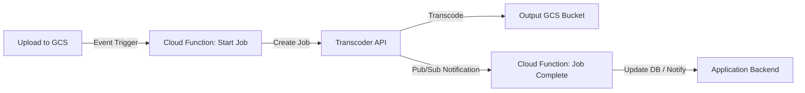

# How to Build a Serverless Video Transcoding Pipeline Using Cloud Functions and Transcoder API

Author: [nawazdhandala](https://www.github.com/nawazdhandala)

Tags: GCP, Cloud Functions, Transcoder API, Serverless, Video Processing

Description: Build a fully serverless video transcoding pipeline on Google Cloud using Cloud Functions and the Transcoder API to convert videos at scale.

---

Video transcoding is one of those workloads that seems simple until you try to do it at scale. You upload a video in one format and need it in several others - different resolutions, codecs, and container formats for different devices and bandwidth conditions. Doing this on your own servers means managing FFmpeg installations, dealing with CPU-intensive workloads, and figuring out scaling.

Google Cloud's Transcoder API takes all that pain away. Pair it with Cloud Functions for orchestration, and you get a pipeline that fires automatically when new videos arrive, transcodes them into whatever formats you need, and costs nothing when idle.

## Architecture Overview

The pipeline follows an event-driven pattern. When a video lands in a Cloud Storage bucket, a Cloud Function picks up the event, kicks off a transcoding job, and another function handles the completion notification.



## Prerequisites

Enable the required APIs and set up the storage buckets.

```bash
# Enable all necessary APIs
gcloud services enable transcoder.googleapis.com
gcloud services enable cloudfunctions.googleapis.com
gcloud services enable pubsub.googleapis.com
gcloud services enable storage.googleapis.com

# Create input and output buckets
gsutil mb -l us-central1 gs://YOUR_PROJECT-video-input
gsutil mb -l us-central1 gs://YOUR_PROJECT-video-output

# Create a Pub/Sub topic for job notifications
gcloud pubsub topics create transcoding-notifications
```

Set up the service account permissions.

```bash
# Grant the Transcoder service account access to your buckets
PROJECT_NUMBER=$(gcloud projects describe YOUR_PROJECT --format="value(projectNumber)")
SA="service-${PROJECT_NUMBER}@gcp-sa-transcoder.iam.gserviceaccount.com"

gsutil iam ch serviceAccount:${SA}:objectViewer gs://YOUR_PROJECT-video-input
gsutil iam ch serviceAccount:${SA}:objectCreator gs://YOUR_PROJECT-video-output
```

## Cloud Function: Trigger Transcoding

This function fires whenever a new file is uploaded to the input bucket. It validates the file, constructs the transcoding job configuration, and submits it to the Transcoder API.

```python
# main.py - Trigger function for video transcoding
import functions_framework
from google.cloud.video import transcoder_v1
from google.cloud.video.transcoder_v1.services.transcoder_service import TranscoderServiceClient
from google.cloud.video.transcoder_v1.types import (
    CreateJobRequest, Job, JobConfig, ElementaryStream,
    VideoStream, AudioStream, MuxStream, Output, PubsubDestination
)
import os
import logging

logger = logging.getLogger(__name__)

PROJECT_ID = os.environ.get("GCP_PROJECT")
LOCATION = "us-central1"
OUTPUT_BUCKET = os.environ.get("OUTPUT_BUCKET", f"gs://{PROJECT_ID}-video-output")
NOTIFICATION_TOPIC = f"projects/{PROJECT_ID}/topics/transcoding-notifications"

# File extensions we support for transcoding
SUPPORTED_EXTENSIONS = {".mp4", ".mov", ".avi", ".mkv", ".wmv", ".flv", ".webm"}


@functions_framework.cloud_event
def handle_video_upload(cloud_event):
    """Triggered by a new file in the video input bucket."""
    data = cloud_event.data
    bucket = data["bucket"]
    name = data["name"]

    # Check if the uploaded file is a video
    extension = os.path.splitext(name)[1].lower()
    if extension not in SUPPORTED_EXTENSIONS:
        logger.info(f"Skipping non-video file: {name}")
        return

    input_uri = f"gs://{bucket}/{name}"
    # Use the filename without extension as the output prefix
    base_name = os.path.splitext(name)[0]
    output_uri = f"{OUTPUT_BUCKET}/{base_name}/"

    logger.info(f"Starting transcoding for: {input_uri}")

    job = create_transcoding_job(input_uri, output_uri)
    logger.info(f"Created transcoding job: {job.name}")


def create_transcoding_job(input_uri, output_uri):
    """Submit a transcoding job with multiple output formats."""
    client = TranscoderServiceClient()
    parent = f"projects/{PROJECT_ID}/locations/{LOCATION}"

    # Define the job configuration with multiple resolutions
    job_config = JobConfig(
        elementary_streams=[
            # 1080p video stream
            ElementaryStream(
                key="video-stream-1080",
                video_stream=VideoStream(
                    h264=VideoStream.H264CodecSettings(
                        height_pixels=1080,
                        width_pixels=1920,
                        bitrate_bps=8000000,
                        frame_rate=30,
                        profile="high",
                    )
                ),
            ),
            # 720p video stream
            ElementaryStream(
                key="video-stream-720",
                video_stream=VideoStream(
                    h264=VideoStream.H264CodecSettings(
                        height_pixels=720,
                        width_pixels=1280,
                        bitrate_bps=5000000,
                        frame_rate=30,
                    )
                ),
            ),
            # 480p video stream for mobile
            ElementaryStream(
                key="video-stream-480",
                video_stream=VideoStream(
                    h264=VideoStream.H264CodecSettings(
                        height_pixels=480,
                        width_pixels=854,
                        bitrate_bps=2500000,
                        frame_rate=30,
                    )
                ),
            ),
            # Single audio stream shared across all outputs
            ElementaryStream(
                key="audio-stream",
                audio_stream=AudioStream(
                    codec="aac",
                    bitrate_bps=128000,
                    channel_count=2,
                    sample_rate_hertz=48000,
                ),
            ),
        ],
        mux_streams=[
            # Mux each video resolution with the audio stream
            MuxStream(
                key="1080p",
                container="mp4",
                elementary_streams=["video-stream-1080", "audio-stream"],
                file_name="1080p.mp4",
            ),
            MuxStream(
                key="720p",
                container="mp4",
                elementary_streams=["video-stream-720", "audio-stream"],
                file_name="720p.mp4",
            ),
            MuxStream(
                key="480p",
                container="mp4",
                elementary_streams=["video-stream-480", "audio-stream"],
                file_name="480p.mp4",
            ),
        ],
        output=Output(uri=output_uri),
        pubsub_destination=PubsubDestination(topic=NOTIFICATION_TOPIC),
    )

    job = Job(input_uri=input_uri, config=job_config)

    response = client.create_job(parent=parent, job=job)
    return response
```

Deploy the trigger function.

```bash
# Deploy the function triggered by Cloud Storage uploads
gcloud functions deploy video-transcoding-trigger \
  --gen2 \
  --runtime=python311 \
  --region=us-central1 \
  --source=./trigger \
  --entry-point=handle_video_upload \
  --trigger-event-filters="type=google.cloud.storage.object.v1.finalized" \
  --trigger-event-filters="bucket=YOUR_PROJECT-video-input" \
  --memory=256MB \
  --timeout=60s \
  --set-env-vars="GCP_PROJECT=YOUR_PROJECT,OUTPUT_BUCKET=gs://YOUR_PROJECT-video-output"
```

## Cloud Function: Handle Job Completion

The second function listens for Pub/Sub notifications from the Transcoder API and processes the results.

```python
# completion_handler.py - Process transcoding job completion events
import functions_framework
import base64
import json
import logging
from google.cloud import firestore
from datetime import datetime

logger = logging.getLogger(__name__)
db = firestore.Client()


@functions_framework.cloud_event
def handle_transcoding_complete(cloud_event):
    """Handle Pub/Sub notification when transcoding finishes."""
    # Decode the message from Pub/Sub
    message_data = base64.b64decode(cloud_event.data["message"]["data"])
    notification = json.loads(message_data)

    job_name = notification.get("job", {}).get("name", "unknown")
    state = notification.get("job", {}).get("state", "unknown")

    logger.info(f"Job {job_name} completed with state: {state}")

    if state == "SUCCEEDED":
        handle_success(notification)
    elif state == "FAILED":
        handle_failure(notification)


def handle_success(notification):
    """Update the database with transcoded video URLs."""
    job = notification["job"]
    input_uri = job.get("inputUri", "")

    # Extract the video name from the input URI
    video_name = input_uri.split("/")[-1].rsplit(".", 1)[0]

    # Build the output URLs from the job config
    output_uri = job.get("config", {}).get("output", {}).get("uri", "")

    video_doc = {
        "name": video_name,
        "input_uri": input_uri,
        "outputs": {
            "1080p": f"{output_uri}1080p.mp4",
            "720p": f"{output_uri}720p.mp4",
            "480p": f"{output_uri}480p.mp4",
        },
        "status": "ready",
        "completed_at": datetime.utcnow().isoformat(),
    }

    # Store the video metadata in Firestore
    db.collection("videos").document(video_name).set(video_doc, merge=True)
    logger.info(f"Video {video_name} is ready with all resolutions")


def handle_failure(notification):
    """Log the failure and update status."""
    job = notification["job"]
    input_uri = job.get("inputUri", "")
    video_name = input_uri.split("/")[-1].rsplit(".", 1)[0]
    error = job.get("error", {})

    db.collection("videos").document(video_name).set({
        "status": "failed",
        "error": str(error),
        "failed_at": datetime.utcnow().isoformat(),
    }, merge=True)

    logger.error(f"Transcoding failed for {video_name}: {error}")
```

Deploy the completion handler.

```bash
# Deploy the completion handler triggered by Pub/Sub
gcloud functions deploy transcoding-complete-handler \
  --gen2 \
  --runtime=python311 \
  --region=us-central1 \
  --source=./completion \
  --entry-point=handle_transcoding_complete \
  --trigger-topic=transcoding-notifications \
  --memory=256MB \
  --timeout=60s
```

## Using Job Templates for Consistency

If you transcode many videos with the same settings, create a job template instead of specifying the config each time.

```bash
# Create a reusable job template for standard web delivery
gcloud transcoder templates create web-delivery \
  --location=us-central1 \
  --file=template.json
```

The template JSON file contains your standard encoding configuration. This makes it easy to update encoding settings across all future jobs by modifying a single template.

## Cost Optimization Tips

Transcoding costs are based on the output duration and resolution. A few ways to keep costs down:

First, only transcode resolutions you actually need. If your analytics show that 90% of viewers watch at 720p or below, skip the 4K output.

Second, use presets for common configurations. The Transcoder API offers preset profiles that are optimized for quality and cost.

Third, set up lifecycle rules on your output bucket to move older transcoded files to Nearline or Coldline storage.

```bash
# Set a lifecycle rule to move files to Nearline after 30 days
gsutil lifecycle set lifecycle.json gs://YOUR_PROJECT-video-output
```

## Monitoring the Pipeline

Track your transcoding pipeline health by monitoring the Pub/Sub topic and function invocations.

```bash
# Check recent transcoding jobs and their status
gcloud transcoder jobs list \
  --location=us-central1 \
  --filter="state=FAILED" \
  --limit=10
```

You should also set up alerts for function errors and unusually long transcoding times. The Transcoder API sends progress updates through Pub/Sub, so you can build a progress tracking UI if needed.

## Wrapping Up

This pipeline handles the full video transcoding lifecycle without any servers to manage. Videos go in, multiple resolutions come out, and you get notified at every step. The event-driven architecture means each component does one thing well, and the whole system scales automatically based on upload volume. For most video processing needs on GCP, this combination of Cloud Functions and the Transcoder API is the simplest path to production.
