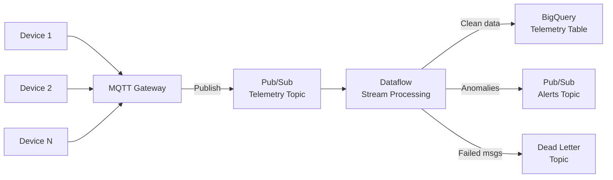

# How to Build a Streaming Data Pipeline from IoT Devices Through Pub/Sub to BigQuery

Author: [nawazdhandala](https://www.github.com/nawazdhandala)

Tags: GCP, IoT, Pub/Sub, Dataflow, BigQuery, Streaming, Apache Beam

Description: Build a complete streaming data pipeline that ingests telemetry from IoT devices through Pub/Sub, processes it with Dataflow, and stores it in BigQuery for analytics.

---

IoT devices generate a constant stream of telemetry data - temperature readings, GPS coordinates, sensor measurements, status updates. Getting that data from thousands of devices into a queryable analytics store in near real time is a core infrastructure challenge. On GCP, the proven pattern is Pub/Sub for ingestion, Dataflow for processing, and BigQuery for storage and analysis.

This guide builds the full pipeline end to end.

## Architecture



Devices send telemetry to an MQTT gateway (or directly via HTTP to Pub/Sub). Dataflow reads the stream, validates and transforms the data, writes clean records to BigQuery, and routes anomalies to an alerts topic.

## Step 1: Set Up Pub/Sub Topics

```bash
# Create the main telemetry topic
gcloud pubsub topics create iot-telemetry

# Create subscriptions
gcloud pubsub subscriptions create iot-telemetry-dataflow \
  --topic=iot-telemetry \
  --ack-deadline=120

# Create an alerts topic for anomalous readings
gcloud pubsub topics create iot-alerts

# Create a dead letter topic for failed messages
gcloud pubsub topics create iot-dead-letter
gcloud pubsub subscriptions create iot-dead-letter-sub \
  --topic=iot-dead-letter
```

## Step 2: Define the Telemetry Message Format

Standardize the message format across all devices.

```json
{
  "device_id": "sensor-farm-01-temp-003",
  "device_type": "temperature_sensor",
  "timestamp": "2026-02-17T14:30:00.123Z",
  "readings": {
    "temperature_celsius": 23.5,
    "humidity_percent": 65.2,
    "battery_voltage": 3.7
  },
  "metadata": {
    "firmware_version": "2.1.4",
    "location_id": "warehouse-east",
    "latitude": 41.8781,
    "longitude": -87.6298
  }
}
```

## Step 3: Create the BigQuery Table

```bash
# Create the dataset
bq mk --dataset MY_PROJECT:iot_analytics

# Create the telemetry table with partitioning and clustering
bq mk --table \
  --time_partitioning_field=timestamp \
  --time_partitioning_type=DAY \
  --clustering_fields=device_type,location_id \
  MY_PROJECT:iot_analytics.telemetry \
  device_id:STRING,device_type:STRING,timestamp:TIMESTAMP,temperature_celsius:FLOAT,humidity_percent:FLOAT,battery_voltage:FLOAT,firmware_version:STRING,location_id:STRING,latitude:FLOAT,longitude:FLOAT,processed_at:TIMESTAMP
```

Partitioning by timestamp and clustering by device_type and location_id makes queries fast and cost-effective.

## Step 4: Build the Dataflow Pipeline

```python
# iot_pipeline.py - Streaming IoT telemetry pipeline
import apache_beam as beam
from apache_beam.options.pipeline_options import PipelineOptions, StandardOptions
from apache_beam.transforms.window import FixedWindows
import json
from datetime import datetime

# Valid ranges for sensor readings - used for anomaly detection
VALID_RANGES = {
    'temperature_celsius': (-40, 85),
    'humidity_percent': (0, 100),
    'battery_voltage': (2.0, 4.5),
}

class ParseTelemetry(beam.DoFn):
    """Parse and validate raw telemetry messages."""
    def process(self, element):
        try:
            data = json.loads(element.decode('utf-8'))

            # Check required fields
            if 'device_id' not in data or 'timestamp' not in data:
                yield beam.pvalue.TaggedOutput('dead_letter', element)
                return

            yield data

        except json.JSONDecodeError:
            # Unparseable messages go to dead letter queue
            yield beam.pvalue.TaggedOutput('dead_letter', element)

class FlattenReadings(beam.DoFn):
    """Flatten nested readings into a flat row for BigQuery."""
    def process(self, data):
        readings = data.get('readings', {})
        metadata = data.get('metadata', {})

        row = {
            'device_id': data['device_id'],
            'device_type': data.get('device_type', 'unknown'),
            'timestamp': data['timestamp'],
            'temperature_celsius': readings.get('temperature_celsius'),
            'humidity_percent': readings.get('humidity_percent'),
            'battery_voltage': readings.get('battery_voltage'),
            'firmware_version': metadata.get('firmware_version', ''),
            'location_id': metadata.get('location_id', ''),
            'latitude': metadata.get('latitude'),
            'longitude': metadata.get('longitude'),
            'processed_at': datetime.utcnow().isoformat() + 'Z',
        }

        yield row

class DetectAnomalies(beam.DoFn):
    """Check readings against valid ranges and flag anomalies."""
    def process(self, data):
        readings = data.get('readings', {})
        anomalies = []

        for metric, (low, high) in VALID_RANGES.items():
            value = readings.get(metric)
            if value is not None and (value < low or value > high):
                anomalies.append({
                    'metric': metric,
                    'value': value,
                    'valid_range': f"{low} to {high}",
                })

        if anomalies:
            alert = {
                'device_id': data['device_id'],
                'timestamp': data['timestamp'],
                'anomalies': anomalies,
                'severity': 'high' if len(anomalies) > 1 else 'medium',
            }
            yield beam.pvalue.TaggedOutput('anomalies', alert)

        # Always pass through the original data for storage
        yield data

class FormatAlert(beam.DoFn):
    """Format anomaly alerts as JSON for Pub/Sub."""
    def process(self, alert):
        yield json.dumps(alert).encode('utf-8')

def run():
    options = PipelineOptions()
    options.view_as(StandardOptions).streaming = True

    with beam.Pipeline(options=options) as p:
        # Read raw telemetry from Pub/Sub
        raw = (
            p
            | "ReadTelemetry" >> beam.io.ReadFromPubSub(
                subscription="projects/MY_PROJECT/subscriptions/iot-telemetry-dataflow"
            )
        )

        # Parse and validate messages
        parsed = (
            raw
            | "ParseMessages" >> beam.ParDo(ParseTelemetry())
                .with_outputs('dead_letter', main='valid')
        )

        # Detect anomalies - passes through normal data, tags anomalies
        checked = (
            parsed.valid
            | "DetectAnomalies" >> beam.ParDo(DetectAnomalies())
                .with_outputs('anomalies', main='normal')
        )

        # Flatten readings and write to BigQuery
        (
            checked.normal
            | "FlattenReadings" >> beam.ParDo(FlattenReadings())
            | "WriteToBigQuery" >> beam.io.WriteToBigQuery(
                table='MY_PROJECT:iot_analytics.telemetry',
                write_disposition=beam.io.BigQueryDisposition.WRITE_APPEND,
                create_disposition=beam.io.BigQueryDisposition.CREATE_NEVER,
                method=beam.io.WriteToBigQuery.Method.STREAMING_INSERTS,
            )
        )

        # Publish anomaly alerts
        (
            checked.anomalies
            | "FormatAlerts" >> beam.ParDo(FormatAlert())
            | "PublishAlerts" >> beam.io.WriteToPubSub(
                topic="projects/MY_PROJECT/topics/iot-alerts"
            )
        )

        # Route dead letter messages
        (
            parsed.dead_letter
            | "PublishDeadLetter" >> beam.io.WriteToPubSub(
                topic="projects/MY_PROJECT/topics/iot-dead-letter"
            )
        )

if __name__ == '__main__':
    run()
```

## Step 5: Deploy the Pipeline

```bash
# Deploy to Dataflow
python iot_pipeline.py \
  --runner=DataflowRunner \
  --project=MY_PROJECT \
  --region=us-central1 \
  --temp_location=gs://MY_BUCKET/temp/ \
  --staging_location=gs://MY_BUCKET/staging/ \
  --job_name=iot-telemetry-pipeline \
  --streaming \
  --num_workers=2 \
  --max_num_workers=10 \
  --autoscaling_algorithm=THROUGHPUT_BASED \
  --experiments=enable_streaming_engine
```

The `enable_streaming_engine` flag offloads shuffling to the Dataflow service, which reduces costs and improves performance.

## Step 6: Simulate Device Data

For testing, publish some sample messages.

```bash
# Publish a normal reading
gcloud pubsub topics publish iot-telemetry --message='{
  "device_id": "sensor-001",
  "device_type": "temperature_sensor",
  "timestamp": "2026-02-17T14:30:00Z",
  "readings": {"temperature_celsius": 22.5, "humidity_percent": 55.0, "battery_voltage": 3.8},
  "metadata": {"location_id": "warehouse-east", "firmware_version": "2.1.4"}
}'

# Publish an anomalous reading - temperature way out of range
gcloud pubsub topics publish iot-telemetry --message='{
  "device_id": "sensor-002",
  "device_type": "temperature_sensor",
  "timestamp": "2026-02-17T14:31:00Z",
  "readings": {"temperature_celsius": 150.0, "humidity_percent": 55.0, "battery_voltage": 1.5},
  "metadata": {"location_id": "warehouse-east", "firmware_version": "2.1.4"}
}'
```

## Step 7: Query the Data

```sql
-- Average temperature by location over the last hour
SELECT
  location_id,
  AVG(temperature_celsius) AS avg_temp,
  MIN(temperature_celsius) AS min_temp,
  MAX(temperature_celsius) AS max_temp,
  COUNT(*) AS reading_count
FROM `iot_analytics.telemetry`
WHERE timestamp >= TIMESTAMP_SUB(CURRENT_TIMESTAMP(), INTERVAL 1 HOUR)
GROUP BY location_id
ORDER BY avg_temp DESC;

-- Devices with low battery
SELECT
  device_id,
  location_id,
  battery_voltage,
  timestamp
FROM `iot_analytics.telemetry`
WHERE battery_voltage < 3.0
  AND timestamp >= TIMESTAMP_SUB(CURRENT_TIMESTAMP(), INTERVAL 24 HOUR)
ORDER BY battery_voltage ASC;
```

## Scaling Considerations

For production deployments handling millions of devices:

- **Pub/Sub scales automatically** - no need to provision capacity
- **Dataflow autoscaling** adjusts worker count based on throughput
- **BigQuery streaming inserts** handle up to 1 million rows per second per table
- **Partition and cluster** BigQuery tables to keep query costs low
- **Use table decorators** for time-bounded queries to avoid scanning entire tables

## Wrapping Up

This pipeline handles the full journey from device to dashboard. Pub/Sub absorbs the bursty nature of IoT traffic, Dataflow processes and validates the stream in real time, and BigQuery stores everything in a format optimized for analytics. The anomaly detection layer catches bad readings before they pollute your data, and the dead letter queue makes sure nothing gets silently dropped. Once this foundation is in place, you can layer on more sophisticated processing - aggregation windows, ML-based anomaly detection, or real-time dashboards - without changing the underlying architecture.
