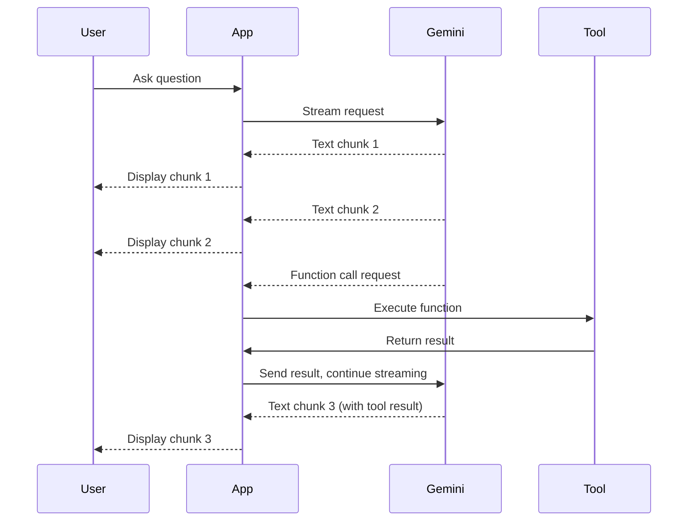

# How to Build a Streaming Function Call Application with Gemini on Vertex AI

Author: [nawazdhandala](https://www.github.com/nawazdhandala)

Tags: GCP, Gemini, Vertex AI, Streaming, Function Calling

Description: Learn how to build streaming function call applications with Gemini on Vertex AI for responsive AI agents that execute tools in real time.

---

Combining streaming with function calling gives you the best of both worlds: users see the model's response as it is generated, and the model can pause to call tools when it needs external data. This creates a smooth experience where the user sees progress even when the backend is fetching data from APIs or databases.

Building this requires handling the interleaved stream of text chunks and function call requests. It is more complex than basic streaming or basic function calling alone, but the result is worth it. Let me walk you through the implementation.

## Why Streaming Function Calls?

Without streaming, function-calling applications have noticeable pauses. The user sends a message, waits for the model to decide to call a function, waits for the function to execute, then waits for the model to generate its response. With streaming, the user can see the model start to respond immediately, and function calls happen seamlessly in the background.

The flow looks like this:


```mermaid
sequenceDiagram
    participant User
    participant App
    participant Gemini
    participant Tool

    User->>App: Ask question
    App->>Gemini: Stream request
    Gemini-->>App: Text chunk 1
    App-->>User: Display chunk 1
    Gemini-->>App: Text chunk 2
    App-->>User: Display chunk 2
    Gemini-->>App: Function call request
    App->>Tool: Execute function
    Tool->>App: Return result
    App->>Gemini: Send result, continue streaming
    Gemini-->>App: Text chunk 3 (with tool result)
    App-->>User: Display chunk 3
```

## Setting Up the Basics

Start by defining your tools and creating the client configuration.

```python
from google import genai
from google.genai import types

# Create a Gemini client that uses the Vertex AI backend
client = genai.Client(
    vertexai=True,
    project="your-project-id",
    location="us-central1",
)

MODEL_NAME = "gemini-2.5-flash"

# Define tools that the model can call
get_stock_price = types.FunctionDeclaration(
    name="get_stock_price",
    description="Get the current stock price for a ticker symbol.",
    parameters_json_schema={
        "type": "object",
        "properties": {
            "ticker": {
                "type": "string",
                "description": "Stock ticker symbol, e.g. GOOGL"
            }
        },
        "required": ["ticker"]
    }
)

get_company_info = types.FunctionDeclaration(
    name="get_company_info",
    description="Get basic company information like sector, market cap, and CEO.",
    parameters_json_schema={
        "type": "object",
        "properties": {
            "company_name": {
                "type": "string",
                "description": "The company name"
            }
        },
        "required": ["company_name"]
    }
)

# Bundle tools together
finance_tools = types.Tool(
    function_declarations=[get_stock_price, get_company_info]
)

# Create a generation config with tools
generation_config = types.GenerateContentConfig(
    tools=[finance_tools],
    system_instruction=(
        "You are a financial analysis assistant. Use the available tools "
        "to get real-time data when answering questions about stocks "
        "and companies."
    )
)
```

## Implementing the Tool Executor

You need a function that executes tool calls when the model requests them.

```python
import random

def execute_tool(function_name, args):
    """Execute a tool and return the result."""
    args_dict = dict(args)

    if function_name == "get_stock_price":
        # In production, call a real stock API
        ticker = args_dict.get("ticker", "UNKNOWN")
        price = round(random.uniform(50, 500), 2)
        return {
            "ticker": ticker,
            "price": price,
            "currency": "USD",
            "change_percent": round(random.uniform(-5, 5), 2),
            "volume": random.randint(1000000, 50000000)
        }

    elif function_name == "get_company_info":
        company = args_dict.get("company_name", "Unknown")
        return {
            "name": company,
            "sector": "Technology",
            "market_cap": "1.8T",
            "ceo": "Sample CEO",
            "employees": 150000
        }

    else:
        return {"error": f"Unknown function: {function_name}"}
```

## Handling the Streaming Response

The core of a streaming function call application is the response handler. It needs to process text chunks, detect function calls, execute them, and continue the stream.

```python
def process_streaming_response(client, user_message):
    """Process a streaming response that may include function calls."""
    user_content = types.Content(
        role="user",
        parts=[types.Part.from_text(text=user_message)],
    )
    history = [user_content]

    # Send message with streaming
    responses = client.models.generate_content_stream(
        model=MODEL_NAME,
        contents=history,
        config=generation_config,
    )

    collected_text = ""
    function_calls = []
    model_parts = []

    for chunk in responses:
        if chunk.candidates and chunk.candidates[0].content:
            model_parts.extend(chunk.candidates[0].content.parts or [])

        # Handle text chunks - stream them to the user
        if chunk.text:
            print(chunk.text, end="", flush=True)
            collected_text += chunk.text

        # Handle function call parts
        for fc in chunk.function_calls or []:
            function_calls.append({
                "name": fc.name,
                "args": dict(fc.args or {})
            })
            print(f"\n[Calling {fc.name}...]", flush=True)

    print()  # Newline after streaming

    # If there were function calls, execute them and continue
    if function_calls:
        history.append(types.Content(role="model", parts=model_parts))

        function_responses = []
        for fc in function_calls:
            result = execute_tool(fc["name"], fc["args"])
            function_responses.append(
                types.Part.from_function_response(
                    name=fc["name"],
                    response={"result": result}
                )
            )

        history.append(types.Content(role="tool", parts=function_responses))

        # Send function results back and stream the continuation
        continuation = client.models.generate_content_stream(
            model=MODEL_NAME,
            contents=history,
            config=generation_config,
        )

        for chunk in continuation:
            if chunk.text:
                print(chunk.text, end="", flush=True)
                collected_text += chunk.text

        print()

    return collected_text

# Usage
result = process_streaming_response(
    client,
    "What is the current stock price for Google and tell me about the company?"
)
```

## Building a Full Streaming Agent

Here is a more robust agent that handles multiple rounds of function calls and maintains conversation state.

```python
class StreamingFunctionAgent:
    """A streaming agent that can call functions during response generation."""

    def __init__(self, client, model_name, generation_config, tool_executor, max_tool_rounds=3):
        self.client = client
        self.model_name = model_name
        self.generation_config = generation_config
        self.tool_executor = tool_executor
        self.max_tool_rounds = max_tool_rounds
        self.history = []

    def process_message(self, message, on_text=None, on_tool_call=None):
        """Process a user message with streaming and function calls.

        Args:
            message: The user's message
            on_text: Callback for text chunks - on_text(text_chunk)
            on_tool_call: Callback for tool calls - on_tool_call(name, args)
        """
        if on_text is None:
            on_text = lambda t: print(t, end="", flush=True)
        if on_tool_call is None:
            on_tool_call = lambda n, a: print(f"\n[Tool: {n}({a})]")

        self.history.append(
            types.Content(
                role="user",
                parts=[types.Part.from_text(text=message)],
            )
        )
        full_response = ""

        for round_num in range(self.max_tool_rounds + 1):
            # Send message with streaming
            responses = self.client.models.generate_content_stream(
                model=self.model_name,
                contents=self.history,
                config=self.generation_config,
            )

            function_calls = []
            model_parts = []

            for chunk in responses:
                if chunk.candidates and chunk.candidates[0].content:
                    model_parts.extend(chunk.candidates[0].content.parts or [])

                if chunk.text:
                    on_text(chunk.text)
                    full_response += chunk.text

                for fc in chunk.function_calls or []:
                    on_tool_call(fc.name, dict(fc.args or {}))
                    function_calls.append(fc)

            if model_parts:
                self.history.append(types.Content(role="model", parts=model_parts))

            # If no function calls, we are done
            if not function_calls:
                break

            # Execute all function calls
            function_responses = []
            for fc in function_calls:
                result = self.tool_executor(fc.name, fc.args)
                function_responses.append(
                    types.Part.from_function_response(
                        name=fc.name,
                        response={"result": result}
                    )
                )

            # Continue with function results
            self.history.append(types.Content(role="tool", parts=function_responses))

        return full_response

# Create the agent
agent = StreamingFunctionAgent(
    client=client,
    model_name=MODEL_NAME,
    generation_config=generation_config,
    tool_executor=execute_tool
)

# Use the agent
print("Agent: ", end="")
response = agent.process_message(
    "Compare Google and Microsoft stock prices and give me a brief analysis."
)
print()
```

## Handling Errors During Streaming

Function calls can fail. You need graceful error handling that does not break the stream.

```python
def safe_tool_executor(function_name, args):
    """Execute a tool with error handling."""
    try:
        result = execute_tool(function_name, args)
        return result
    except TimeoutError:
        return {"error": "Tool call timed out. The service may be temporarily unavailable."}
    except ConnectionError:
        return {"error": "Could not connect to the external service."}
    except Exception as e:
        return {"error": f"Tool execution failed: {str(e)}"}

# Use the safe executor with the agent
agent = StreamingFunctionAgent(
    client=client,
    model_name=MODEL_NAME,
    generation_config=generation_config,
    tool_executor=safe_tool_executor
)
```

## Web Application Integration

In a web application, you stream responses to the client using server-sent events (SSE) or WebSockets.

```python
from flask import Flask, Response, request
import json

app = Flask(__name__)

@app.route("/chat", methods=["POST"])
def chat_endpoint():
    """Stream a chat response with function calling."""
    user_message = request.json.get("message", "")

    def generate():
        agent = StreamingFunctionAgent(
            client=client,
            model_name=MODEL_NAME,
            generation_config=generation_config,
            tool_executor=safe_tool_executor,
        )
        agent.history.append(
            types.Content(
                role="user",
                parts=[types.Part.from_text(text=user_message)],
            )
        )

        for _ in range(agent.max_tool_rounds + 1):
            responses = agent.client.models.generate_content_stream(
                model=agent.model_name,
                contents=agent.history,
                config=agent.generation_config,
            )

            function_calls = []
            model_parts = []

            for chunk in responses:
                if chunk.candidates and chunk.candidates[0].content:
                    model_parts.extend(chunk.candidates[0].content.parts or [])

                if chunk.text:
                    yield f"data: {json.dumps({'type': 'text', 'content': chunk.text})}\n\n"

                for fc in chunk.function_calls or []:
                    function_calls.append(fc)
                    yield f"data: {json.dumps({'type': 'tool_call', 'name': fc.name})}\n\n"

            if model_parts:
                agent.history.append(types.Content(role="model", parts=model_parts))

            if not function_calls:
                break

            function_responses = []
            for fc in function_calls:
                result = agent.tool_executor(fc.name, fc.args)
                function_responses.append(
                    types.Part.from_function_response(
                        name=fc.name,
                        response={"result": result},
                    )
                )

            agent.history.append(types.Content(role="tool", parts=function_responses))

        yield f"data: {json.dumps({'type': 'done'})}\n\n"

    return Response(generate(), mimetype="text/event-stream")
```

## Performance Considerations

Streaming function call applications have unique performance characteristics:

- Streaming improves perceived latency because you can display chunks before the complete response is finished
- Function call round-trips add latency proportional to your tool execution time
- Multiple parallel function calls should be executed concurrently when possible
- Keep tool responses small - large tool responses slow down the continuation generation

```python
import asyncio

async def execute_tools_parallel(function_calls):
    """Execute multiple tool calls in parallel."""
    async def async_execute_tool(name, args):
        return await asyncio.to_thread(execute_tool, name, args)

    tasks = []
    for fc in function_calls:
        task = asyncio.create_task(
            async_execute_tool(fc.name, dict(fc.args))
        )
        tasks.append((fc.name, task))

    results = []
    for name, task in tasks:
        result = await task
        results.append(
            types.Part.from_function_response(
                name=name,
                response={"result": result}
            )
        )

    return results
```

## Wrapping Up

Streaming function calls create responsive AI agents that feel fast even when they need to fetch external data. The implementation requires careful handling of interleaved text and function call chunks, but the patterns shown here give you a solid foundation. Start with a simple agent, add error handling, then integrate with your web framework. Monitor streaming performance and tool call latency with OneUptime to ensure your agent stays responsive as usage grows.
