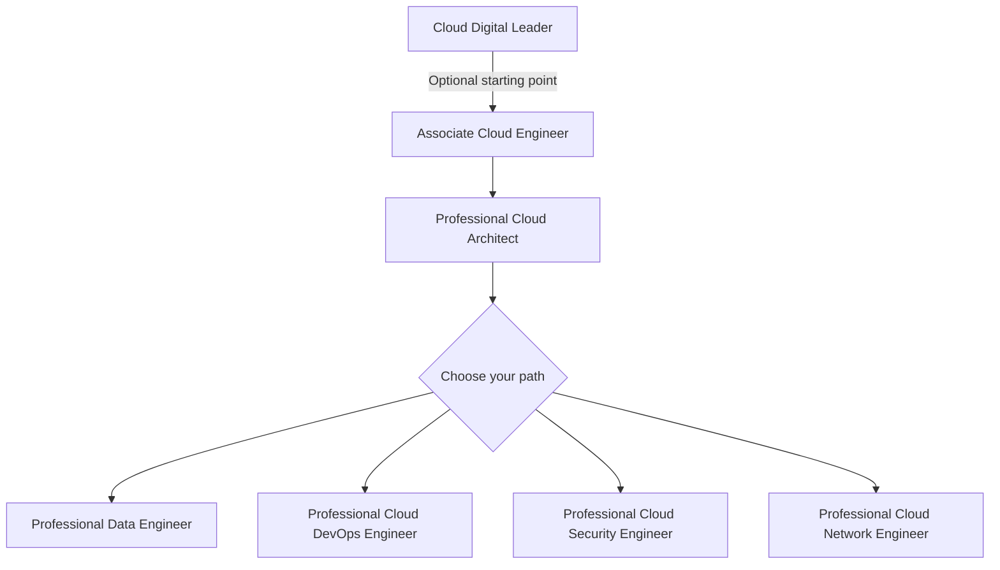

# How to Build a Study Plan for Passing Multiple GCP Certifications in Sequence

Author: [nawazdhandala](https://www.github.com/nawazdhandala)

Tags: GCP, Certification, Study Plan, Career Development, Google Cloud, Cloud Computing

Description: Create an efficient study plan for earning multiple Google Cloud certifications in sequence with strategies for maximizing knowledge overlap and minimizing study time.

---

If you are planning to earn multiple GCP certifications, studying for them in the right order makes a massive difference. There is significant overlap between the exams, and tackling them strategically means you build on previous knowledge instead of starting from scratch each time. I earned four GCP certifications over the course of eight months, and the sequencing strategy saved me weeks of study time.

Here is how to build an efficient study plan.

## The Certification Landscape

Google Cloud currently offers these certifications:

**Foundational**:
- Cloud Digital Leader (non-technical, business-focused)

**Associate**:
- Associate Cloud Engineer (ACE)

**Professional**:
- Professional Cloud Architect (PCA)
- Professional Data Engineer (PDE)
- Professional Cloud DevOps Engineer
- Professional Cloud Security Engineer
- Professional Cloud Network Engineer
- Professional Cloud Developer
- Professional Machine Learning Engineer
- Professional Cloud Database Engineer
- Professional Workspace Administrator

Each certification is valid for two years.

## The Optimal Sequence

Based on knowledge overlap, here is the sequence I recommend:



### Phase 1: Associate Cloud Engineer (Weeks 1-6)

Start here even if your goal is a professional certification. The ACE covers the foundational knowledge that every other exam builds on:

- Core compute services (Compute Engine, GKE, Cloud Run, App Engine)
- Storage services (Cloud Storage, Cloud SQL, Firestore)
- Networking (VPC, firewall rules, load balancing)
- IAM and security basics
- Monitoring and logging
- gcloud CLI proficiency

**Study approach**:
- Week 1-2: Compute and storage services. Practice creating resources with gcloud.
- Week 3-4: Networking and IAM. Build a VPC from scratch, configure firewall rules.
- Week 5: Monitoring, logging, and operations. Set up dashboards and alerts.
- Week 6: Review and practice exam. Take the official practice exam to identify weak areas.

**Resources**:
- Google Cloud Skills Boost courses for ACE
- Official practice exam (free)
- A GCP free tier project for hands-on practice

### Phase 2: Professional Cloud Architect (Weeks 7-14)

The PCA builds directly on the ACE. About 60% of the PCA knowledge base overlaps with the ACE, so you only need to learn the additional architecture-level topics:

- Solution design and trade-offs
- Migration strategies (rehost, replatform, refactor)
- Advanced networking (hybrid connectivity, VPC Service Controls)
- Advanced security (Cloud Armor, Binary Authorization, KMS)
- Case study analysis
- Cost optimization

**Study approach**:
- Week 7-8: Architecture design patterns. Study the official case studies (MountKirk Games, Dress4Win, TerramEarth).
- Week 9-10: Advanced security and compliance. VPC Service Controls, CMEK, organization policies.
- Week 11-12: Migration planning and hybrid connectivity. Cloud VPN, Interconnect, Anthos.
- Week 13: Database and compute selection for different scenarios.
- Week 14: Review, practice exam, case study practice.

**What transfers from ACE**: All core service knowledge, IAM fundamentals, basic networking, CLI proficiency.

### Phase 3: Choose Your Specialization (Weeks 15-22)

After PCA, pick the professional certification that aligns with your career goals. Here is what each one adds:

**Professional Data Engineer** (if you work with data pipelines and analytics):
- BigQuery deep dive (partitioning, clustering, ML)
- Dataflow and Apache Beam
- Pub/Sub for streaming
- Vertex AI and ML concepts
- Data governance and privacy

**Professional Cloud DevOps Engineer** (if you work in SRE or platform engineering):
- SRE principles (SLOs, error budgets, incident management)
- CI/CD pipeline design (Cloud Build, Cloud Deploy)
- Deployment strategies (canary, blue-green)
- Advanced monitoring and observability
- Infrastructure as Code

**Professional Cloud Security Engineer** (if you focus on security):
- Advanced IAM (organization policies, Workload Identity Federation)
- Network security (Cloud Armor, IDS, VPC Service Controls)
- Data protection (DLP, encryption, Key Management)
- Security Command Center
- Compliance frameworks

**Professional Cloud Network Engineer** (if you focus on networking):
- Advanced VPC design
- Hybrid connectivity (HA VPN, Interconnect)
- Load balancing deep dive
- DNS architecture
- Network monitoring and troubleshooting

## Building Daily Study Habits

The key to passing multiple certifications is consistent daily study, not cramming.

### Weekday Schedule (1.5-2 hours per day)

```
Morning (30 min): Review flashcards or notes from previous sessions
Lunch (30 min): Read documentation or watch a short video lesson
Evening (60 min): Hands-on practice in a GCP project
```

### Weekend Schedule (3-4 hours per day)

```
Saturday: Deep dive into a specific topic area. Build something.
Sunday: Practice questions and review weak areas.
```

### Tracking Progress

Keep a simple spreadsheet tracking:

| Topic | Read Docs | Watched Video | Hands-On Practice | Practice Questions | Confidence (1-5) |
|-------|-----------|---------------|--------------------|--------------------|-------------------|
| VPC Networks | Yes | Yes | Yes | 15/20 | 4 |
| Cloud SQL | Yes | No | Yes | 8/10 | 3 |
| GKE Autoscaling | Yes | Yes | No | 5/10 | 2 |

Focus your remaining study time on topics where your confidence is below 3.

## Maximizing Knowledge Overlap

The reason sequencing matters is the overlap between exams. Here is a rough breakdown:

**ACE to PCA overlap**: About 60%. The PCA assumes ACE-level knowledge and adds architecture design and case study analysis.

**PCA to DevOps Engineer overlap**: About 40%. GKE, monitoring, deployment concepts transfer directly. You need to learn SRE principles and CI/CD depth.

**PCA to Data Engineer overlap**: About 30%. Core services transfer. You need to learn BigQuery, Dataflow, and ML in depth.

**PCA to Security Engineer overlap**: About 45%. IAM and networking knowledge transfer heavily. You need to learn advanced security tools and compliance.

By studying in sequence, you never have to re-learn the overlapping material. It stays fresh from the previous exam.

## Practice Exam Strategy

Take practice exams strategically:

1. **Diagnostic**: Take a practice exam before you start studying to identify your baseline and weak areas.
2. **Mid-study checkpoint**: Take another practice exam halfway through your study period.
3. **Final readiness check**: Take the practice exam in the last week. If you are scoring above 80%, you are likely ready.

Do not memorize practice exam answers. Understand why each answer is correct and why the others are wrong.

## Hands-On Practice Projects

Build progressively complex projects that cover multiple certification topics:

### Project 1 (ACE level): Deploy a web application
- Create a VPC with subnets
- Deploy a Compute Engine instance with a startup script
- Set up Cloud SQL with private IP
- Configure a load balancer
- Set up monitoring and alerting

### Project 2 (PCA level): Design a multi-tier architecture
- Multi-region deployment with GKE
- Cloud CDN for static assets
- Cloud Armor for security
- Cloud SQL with read replicas
- VPC Service Controls for data protection

### Project 3 (Specialization level): Build for your target exam
- **Data Engineer**: Build an ETL pipeline with Dataflow, store in BigQuery, create a dashboard
- **DevOps Engineer**: Set up a complete CI/CD pipeline with canary deployments and SLO monitoring
- **Security Engineer**: Implement a complete security baseline with organization policies, VPC Service Controls, and Security Command Center

## Cost Management While Studying

GCP gives you $300 in free credits for new accounts. To make them last:

- Delete resources after each practice session (or use scripts to clean up)
- Use the smallest machine types (e2-micro for most practice)
- Use preemptible/spot VMs when possible
- Stop instances when not in use
- Set up billing alerts to avoid surprises

```bash
# Set up a billing alert at $50 to avoid surprise charges
gcloud billing budgets create \
  --billing-account=BILLING_ACCOUNT_ID \
  --display-name="Study Budget" \
  --budget-amount=50 \
  --threshold-rule=percent=50 \
  --threshold-rule=percent=90 \
  --threshold-rule=percent=100
```

## Timeline Summary

| Week | Activity | Target |
|------|----------|--------|
| 1-5 | Study for ACE | Build foundational knowledge |
| 6 | ACE exam prep and exam | Pass ACE |
| 7-13 | Study for PCA | Build architecture knowledge |
| 14 | PCA exam prep and exam | Pass PCA |
| 15-21 | Study for chosen specialization | Deep expertise |
| 22 | Specialization exam prep and exam | Pass third certification |

Add 2-4 weeks if you are starting with limited cloud experience. Reduce by 2-3 weeks if you already have hands-on GCP experience.

## Maintaining Certifications

Each certification is valid for two years. Plan recertification before expiry:

- Set a calendar reminder 3 months before each expiration
- Google sometimes offers renewal exams that are shorter and cheaper
- Continuing professional development reduces the study needed for renewal

## Wrapping Up

The most efficient path to multiple GCP certifications is sequential study that builds on previous knowledge. Start with the ACE for a solid foundation, progress to the PCA for architecture skills, then specialize based on your career goals. Consistent daily study (1.5-2 hours on weekdays, 3-4 hours on weekends) over 5-6 months can realistically get you three certifications. The key is hands-on practice - every concept you learn should be reinforced by building something real in a GCP project.
