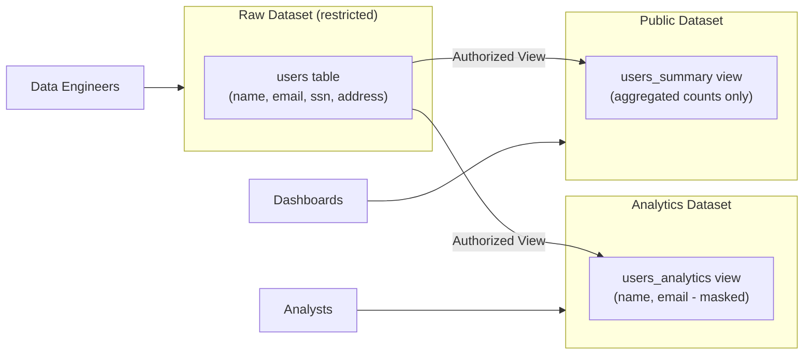

# How to Build a Terraform Module for BigQuery Datasets with Authorized Views and Column-Level Security

Author: [nawazdhandala](https://www.github.com/nawazdhandala)

Tags: GCP, Terraform, BigQuery, Data Security, Google Cloud Platform

Description: Build a Terraform module for BigQuery that creates datasets with authorized views for controlled data sharing and column-level security using policy tags to protect sensitive fields.

---

BigQuery is great for analytics, but the moment you start sharing data across teams or exposing it to external consumers, access control becomes critical. You do not want the marketing team seeing raw PII in the user table. You do not want the analytics dashboard querying the billing dataset directly. Authorized views and column-level security solve these problems.

Authorized views let you share a curated view of data without granting access to the underlying tables. Column-level security lets you restrict access to specific columns based on policy tags. Together, they give you fine-grained control over who sees what.

Let me show you how to build a Terraform module that sets all of this up.

## The Data Access Pattern

Here is the architecture we are building:



## Module Variables

Start by defining the inputs that make the module flexible:

```hcl
# variables.tf - Inputs for the BigQuery dataset module

variable "project_id" {
  description = "GCP project ID"
  type        = string
}

variable "region" {
  description = "Default region for the dataset"
  type        = string
  default     = "US"
}

variable "dataset_id" {
  description = "ID for the BigQuery dataset"
  type        = string
}

variable "dataset_description" {
  description = "Description of the dataset"
  type        = string
  default     = ""
}

variable "default_table_expiration_ms" {
  description = "Default expiration for tables in milliseconds (0 = no expiration)"
  type        = number
  default     = 0
}

variable "authorized_views" {
  description = "List of authorized views that can access tables in this dataset"
  type = list(object({
    project_id = string
    dataset_id = string
    table_id   = string
  }))
  default = []
}

variable "access_roles" {
  description = "IAM access bindings for the dataset"
  type = list(object({
    role          = string
    user_by_email = optional(string)
    group_by_email = optional(string)
    special_group  = optional(string)
  }))
  default = []
}

variable "tables" {
  description = "Tables to create in the dataset"
  type = map(object({
    schema_file     = string
    description     = optional(string, "")
    clustering      = optional(list(string), [])
    time_partitioning = optional(object({
      type  = string
      field = optional(string)
    }))
  }))
  default = {}
}

variable "policy_tags" {
  description = "Column-level security policy tags to create"
  type = map(object({
    display_name = string
    description  = optional(string, "")
  }))
  default = {}
}
```

## Creating the Dataset

The dataset resource includes access blocks for both users and authorized views:

```hcl
# main.tf - BigQuery dataset with access controls

resource "google_bigquery_dataset" "main" {
  project                    = var.project_id
  dataset_id                 = var.dataset_id
  friendly_name              = var.dataset_id
  description                = var.dataset_description
  location                   = var.region
  default_table_expiration_ms = var.default_table_expiration_ms

  # IAM access bindings for users and groups
  dynamic "access" {
    for_each = var.access_roles
    content {
      role           = access.value.role
      user_by_email  = access.value.user_by_email
      group_by_email = access.value.group_by_email
      special_group  = access.value.special_group
    }
  }

  # Authorized views - these views can query tables in this dataset
  # even if the view's users do not have direct access to the tables
  dynamic "access" {
    for_each = var.authorized_views
    content {
      view {
        project_id = access.value.project_id
        dataset_id = access.value.dataset_id
        table_id   = access.value.table_id
      }
    }
  }
}
```

## Creating Tables with Schemas

Tables are created with JSON schema files, which is the cleanest approach for complex schemas:

```hcl
# tables.tf - BigQuery tables with schemas loaded from JSON files

resource "google_bigquery_table" "tables" {
  for_each = var.tables

  project    = var.project_id
  dataset_id = google_bigquery_dataset.main.dataset_id
  table_id   = each.key

  description = each.value.description
  schema      = file(each.value.schema_file)

  # Optional clustering for query performance
  dynamic "clustering" {
    for_each = length(each.value.clustering) > 0 ? [1] : []
    content {
      fields = each.value.clustering
    }
  }

  # Optional time partitioning for large tables
  dynamic "time_partitioning" {
    for_each = each.value.time_partitioning != null ? [each.value.time_partitioning] : []
    content {
      type  = time_partitioning.value.type
      field = time_partitioning.value.field
    }
  }

  deletion_protection = true
}
```

Here is an example schema file with policy tag annotations for column-level security:

```json
[
  {
    "name": "user_id",
    "type": "STRING",
    "mode": "REQUIRED",
    "description": "Unique user identifier"
  },
  {
    "name": "name",
    "type": "STRING",
    "mode": "NULLABLE",
    "description": "User full name"
  },
  {
    "name": "email",
    "type": "STRING",
    "mode": "NULLABLE",
    "description": "User email address",
    "policyTags": {
      "names": ["projects/my-project/locations/us/taxonomies/1234/policyTags/5678"]
    }
  },
  {
    "name": "ssn",
    "type": "STRING",
    "mode": "NULLABLE",
    "description": "Social security number",
    "policyTags": {
      "names": ["projects/my-project/locations/us/taxonomies/1234/policyTags/9012"]
    }
  }
]
```

## Setting Up Column-Level Security with Policy Tags

Policy tags are organized in taxonomies. Think of a taxonomy as a classification system, and policy tags as the individual classifications (like "PII", "Confidential", "Public"):

```hcl
# policy_tags.tf - Data Catalog taxonomy for column-level security

# Create a taxonomy to organize policy tags
resource "google_data_catalog_taxonomy" "security" {
  project      = var.project_id
  region       = lower(var.region)
  display_name = "${var.dataset_id}-security-taxonomy"
  description  = "Column-level security classifications for ${var.dataset_id}"

  activated_policy_types = ["FINE_GRAINED_ACCESS_CONTROL"]
}

# Create individual policy tags within the taxonomy
resource "google_data_catalog_policy_tag" "tags" {
  for_each = var.policy_tags

  taxonomy     = google_data_catalog_taxonomy.security.id
  display_name = each.value.display_name
  description  = each.value.description
}

# Grant access to specific tags - users with this binding can read
# columns tagged with the specified policy tag
resource "google_data_catalog_policy_tag_iam_member" "fine_grained_reader" {
  for_each = var.policy_tag_readers

  policy_tag = google_data_catalog_policy_tag.tags[each.key].name
  role       = "roles/datacatalog.categoryFineGrainedReader"
  member     = each.value
}
```

## Creating Authorized Views

Authorized views are the bridge between restricted and accessible data. The view runs with the permissions of its dataset, not the querying user:

```hcl
# views.tf - Authorized views that provide controlled access to data

variable "views" {
  description = "Views to create that may reference tables in other datasets"
  type = map(object({
    query       = string
    description = optional(string, "")
    dataset_id  = optional(string)
  }))
  default = {}
}

resource "google_bigquery_table" "views" {
  for_each = var.views

  project    = var.project_id
  dataset_id = each.value.dataset_id != null ? each.value.dataset_id : google_bigquery_dataset.main.dataset_id
  table_id   = each.key

  description = each.value.description

  view {
    query          = each.value.query
    use_legacy_sql = false
  }

  # Views should not have deletion protection since they hold no data
  deletion_protection = false
}
```

## Putting It All Together

Here is how you use the module to create a raw dataset with a table, and an analytics dataset with an authorized view:

```hcl
# Raw dataset - only data engineers have access
module "raw_dataset" {
  source = "./modules/bigquery"

  project_id  = "my-project"
  dataset_id  = "raw_users"
  description = "Raw user data with PII"

  access_roles = [
    {
      role           = "OWNER"
      group_by_email = "data-engineers@myorg.com"
    }
  ]

  # Allow the analytics view to query tables in this dataset
  authorized_views = [
    {
      project_id = "my-project"
      dataset_id = "analytics"
      table_id   = "users_analytics"
    }
  ]

  tables = {
    users = {
      schema_file = "${path.module}/schemas/users.json"
      description = "User profile data"
      clustering  = ["country"]
      time_partitioning = {
        type  = "DAY"
        field = "created_at"
      }
    }
  }

  # Column-level security classifications
  policy_tags = {
    pii = {
      display_name = "PII"
      description  = "Personally identifiable information"
    }
    sensitive = {
      display_name = "Sensitive"
      description  = "Sensitive business data"
    }
  }
}

# Analytics dataset - analysts can access through authorized views
module "analytics_dataset" {
  source = "./modules/bigquery"

  project_id  = "my-project"
  dataset_id  = "analytics"
  description = "Curated analytics views"

  access_roles = [
    {
      role           = "READER"
      group_by_email = "analysts@myorg.com"
    }
  ]

  views = {
    users_analytics = {
      description = "User data with PII masked"
      query       = <<-SQL
        SELECT
          user_id,
          name,
          REGEXP_REPLACE(email, r'(.{2}).*@', '\\1***@') as masked_email,
          country,
          created_at
        FROM `my-project.raw_users.users`
      SQL
    }
  }
}
```

## Testing Access Controls

After deploying, verify that access controls work as expected:

```bash
# As a data engineer - should see all columns
bq query --project_id=my-project \
  "SELECT * FROM raw_users.users LIMIT 5"

# As an analyst - should only see masked data through the view
bq query --project_id=my-project \
  "SELECT * FROM analytics.users_analytics LIMIT 5"

# As an analyst - should be denied direct table access
bq query --project_id=my-project \
  "SELECT * FROM raw_users.users LIMIT 5"
# Expected: Access Denied
```

## Outputs

```hcl
# outputs.tf
output "dataset_id" {
  value = google_bigquery_dataset.main.dataset_id
}

output "policy_tag_ids" {
  value = { for k, v in google_data_catalog_policy_tag.tags : k => v.name }
}

output "table_ids" {
  value = { for k, v in google_bigquery_table.tables : k => v.table_id }
}
```

## Summary

This module creates a BigQuery setup where data access is controlled at multiple levels. Datasets have IAM-based access, authorized views provide curated data without exposing underlying tables, and policy tags enforce column-level restrictions on sensitive fields. Everything is defined in Terraform, so your data governance is as reproducible and auditable as the rest of your infrastructure.
