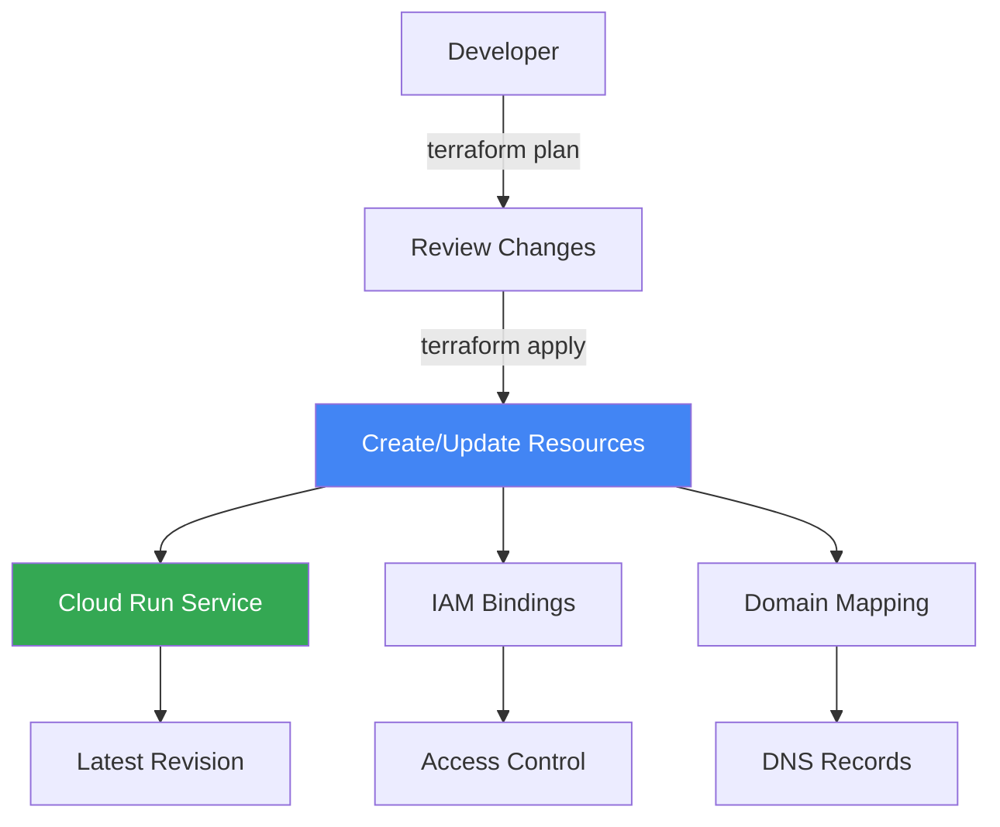

# How to Build a Terraform Module for Provisioning a Cloud Run Service with Custom Domain and IAM Bindings

Author: [nawazdhandala](https://www.github.com/nawazdhandala)

Tags: GCP, Terraform, Cloud Run, IAM, Infrastructure as Code, Google Cloud

Description: Build a reusable Terraform module that provisions a Cloud Run service with custom domain mapping, IAM bindings, and production-ready configuration.

---

Deploying a Cloud Run service through the console or CLI is quick, but it does not scale to managing dozens of services across multiple environments. Terraform modules give you repeatable, version-controlled infrastructure that your entire team can use.

In this post, I will build a Terraform module that provisions a complete Cloud Run setup - the service itself, IAM bindings for access control, and custom domain mapping. The module is designed to be reusable across projects and environments.

## Module Structure

A well-organized Terraform module has a clear structure:

```
modules/cloud-run-service/
  main.tf          # Core resources
  variables.tf     # Input variables
  outputs.tf       # Output values
  versions.tf      # Provider requirements
  iam.tf           # IAM-related resources
  domain.tf        # Custom domain resources
```

## Provider Requirements

Start with the version constraints.

```hcl
# versions.tf - Provider and Terraform version constraints
terraform {
  required_version = ">= 1.5"

  required_providers {
    google = {
      source  = "hashicorp/google"
      version = ">= 5.0"
    }
    google-beta = {
      source  = "hashicorp/google-beta"
      version = ">= 5.0"
    }
  }
}
```

## Input Variables

Define the inputs that make this module flexible.

```hcl
# variables.tf - All configurable parameters for the module

variable "project_id" {
  description = "GCP project ID"
  type        = string
}

variable "region" {
  description = "GCP region for the Cloud Run service"
  type        = string
  default     = "us-central1"
}

variable "service_name" {
  description = "Name of the Cloud Run service"
  type        = string

  validation {
    condition     = can(regex("^[a-z][a-z0-9-]{0,48}[a-z0-9]$", var.service_name))
    error_message = "Service name must be lowercase alphanumeric with hyphens, 2-50 characters."
  }
}

variable "image" {
  description = "Container image to deploy (e.g., gcr.io/project/image:tag)"
  type        = string
}

variable "env_vars" {
  description = "Environment variables for the container"
  type        = map(string)
  default     = {}
}

variable "secrets" {
  description = "Secret environment variables from Secret Manager"
  type = map(object({
    secret_name = string
    version     = string
  }))
  default = {}
}

variable "min_instances" {
  description = "Minimum number of instances (0 for scale to zero)"
  type        = number
  default     = 0
}

variable "max_instances" {
  description = "Maximum number of instances"
  type        = number
  default     = 100
}

variable "cpu" {
  description = "CPU allocation (e.g., '1', '2', '4')"
  type        = string
  default     = "1"
}

variable "memory" {
  description = "Memory allocation (e.g., '256Mi', '512Mi', '1Gi')"
  type        = string
  default     = "512Mi"
}

variable "timeout_seconds" {
  description = "Request timeout in seconds"
  type        = number
  default     = 300
}

variable "concurrency" {
  description = "Maximum concurrent requests per instance"
  type        = number
  default     = 80
}

variable "port" {
  description = "Container port"
  type        = number
  default     = 8080
}

variable "allow_unauthenticated" {
  description = "Whether to allow unauthenticated access"
  type        = bool
  default     = false
}

variable "invoker_members" {
  description = "IAM members allowed to invoke the service"
  type        = list(string)
  default     = []
}

variable "custom_domain" {
  description = "Custom domain to map to the service"
  type        = string
  default     = ""
}

variable "service_account_email" {
  description = "Service account for the Cloud Run service"
  type        = string
  default     = ""
}

variable "vpc_connector" {
  description = "VPC connector for the service (for private network access)"
  type        = string
  default     = ""
}

variable "cloudsql_connections" {
  description = "Cloud SQL instance connection names"
  type        = list(string)
  default     = []
}

variable "labels" {
  description = "Labels to apply to the service"
  type        = map(string)
  default     = {}
}
```

## Core Resources

The main Cloud Run service definition.

```hcl
# main.tf - Core Cloud Run service resource

resource "google_cloud_run_v2_service" "service" {
  name     = var.service_name
  location = var.region
  project  = var.project_id

  labels = merge(var.labels, {
    managed-by = "terraform"
  })

  template {
    # Service account for the container
    service_account = var.service_account_email != "" ? var.service_account_email : null

    # Scaling configuration
    scaling {
      min_instance_count = var.min_instances
      max_instance_count = var.max_instances
    }

    # VPC connector for private network access
    dynamic "vpc_access" {
      for_each = var.vpc_connector != "" ? [1] : []
      content {
        connector = var.vpc_connector
        egress    = "PRIVATE_RANGES_ONLY"
      }
    }

    # Container configuration
    containers {
      image = var.image

      ports {
        container_port = var.port
      }

      resources {
        limits = {
          cpu    = var.cpu
          memory = var.memory
        }
        cpu_idle = var.min_instances == 0
      }

      # Regular environment variables
      dynamic "env" {
        for_each = var.env_vars
        content {
          name  = env.key
          value = env.value
        }
      }

      # Secret environment variables from Secret Manager
      dynamic "env" {
        for_each = var.secrets
        content {
          name = env.key
          value_source {
            secret_key_ref {
              secret  = env.value.secret_name
              version = env.value.version
            }
          }
        }
      }

      # Startup probe
      startup_probe {
        http_get {
          path = "/health"
          port = var.port
        }
        initial_delay_seconds = 5
        period_seconds        = 10
        failure_threshold     = 3
      }

      # Liveness probe
      liveness_probe {
        http_get {
          path = "/health"
          port = var.port
        }
        period_seconds    = 30
        failure_threshold = 3
      }
    }

    # Request timeout
    timeout = "${var.timeout_seconds}s"

    # Max concurrent requests per instance
    max_instance_request_concurrency = var.concurrency

    # Cloud SQL connections
    dynamic "volumes" {
      for_each = length(var.cloudsql_connections) > 0 ? [1] : []
      content {
        name = "cloudsql"
        cloud_sql_instance {
          instances = var.cloudsql_connections
        }
      }
    }
  }

  # Traffic configuration - all traffic to latest revision
  traffic {
    type    = "TRAFFIC_TARGET_ALLOCATION_TYPE_LATEST"
    percent = 100
  }

  lifecycle {
    ignore_changes = [
      # Ignore changes to the image tag since CI/CD handles deployments
      template[0].containers[0].image,
    ]
  }
}
```

## IAM Bindings

```hcl
# iam.tf - IAM configuration for the Cloud Run service

# Allow unauthenticated access if specified
resource "google_cloud_run_v2_service_iam_member" "public" {
  count = var.allow_unauthenticated ? 1 : 0

  project  = var.project_id
  location = var.region
  name     = google_cloud_run_v2_service.service.name
  role     = "roles/run.invoker"
  member   = "allUsers"
}

# Grant invoker role to specific members
resource "google_cloud_run_v2_service_iam_member" "invoker" {
  for_each = toset(var.invoker_members)

  project  = var.project_id
  location = var.region
  name     = google_cloud_run_v2_service.service.name
  role     = "roles/run.invoker"
  member   = each.value
}
```

## Custom Domain Mapping

```hcl
# domain.tf - Custom domain mapping for the Cloud Run service

resource "google_cloud_run_domain_mapping" "custom_domain" {
  count = var.custom_domain != "" ? 1 : 0

  name     = var.custom_domain
  location = var.region
  project  = var.project_id

  metadata {
    namespace = var.project_id
  }

  spec {
    route_name = google_cloud_run_v2_service.service.name
  }
}
```

## Outputs

```hcl
# outputs.tf - Values exported from the module

output "service_url" {
  description = "The URL of the Cloud Run service"
  value       = google_cloud_run_v2_service.service.uri
}

output "service_name" {
  description = "The name of the Cloud Run service"
  value       = google_cloud_run_v2_service.service.name
}

output "service_id" {
  description = "The fully qualified ID of the service"
  value       = google_cloud_run_v2_service.service.id
}

output "latest_revision" {
  description = "The latest revision name"
  value       = google_cloud_run_v2_service.service.latest_ready_revision
}

output "custom_domain_records" {
  description = "DNS records needed for the custom domain"
  value = var.custom_domain != "" ? {
    for record in google_cloud_run_domain_mapping.custom_domain[0].status[0].resource_records :
    record.name => {
      type  = record.type
      value = record.rrdata
    }
  } : {}
}
```

## Using the Module

Here is how you use this module to deploy services.

```hcl
# environments/production/main.tf

module "api_service" {
  source = "../../modules/cloud-run-service"

  project_id   = "my-production-project"
  region       = "us-central1"
  service_name = "api-service"
  image        = "gcr.io/my-project/api:latest"

  cpu    = "2"
  memory = "1Gi"

  min_instances = 2
  max_instances = 50
  concurrency   = 100

  env_vars = {
    ENVIRONMENT = "production"
    LOG_LEVEL   = "info"
  }

  secrets = {
    DB_PASSWORD = {
      secret_name = "db-password"
      version     = "latest"
    }
    API_KEY = {
      secret_name = "api-key"
      version     = "3"
    }
  }

  service_account_email = "api-sa@my-project.iam.gserviceaccount.com"
  vpc_connector         = "projects/my-project/locations/us-central1/connectors/main-connector"

  cloudsql_connections = ["my-project:us-central1:main-db"]

  allow_unauthenticated = true
  custom_domain         = "api.mycompany.com"

  labels = {
    team        = "backend"
    environment = "production"
  }
}

# Internal admin service - authenticated access only
module "admin_service" {
  source = "../../modules/cloud-run-service"

  project_id   = "my-production-project"
  region       = "us-central1"
  service_name = "admin-dashboard"
  image        = "gcr.io/my-project/admin:latest"

  allow_unauthenticated = false
  invoker_members = [
    "group:engineering@mycompany.com",
    "serviceAccount:ci-cd@my-project.iam.gserviceaccount.com",
  ]

  labels = {
    team = "platform"
  }
}

# Output the URLs
output "api_url" {
  value = module.api_service.service_url
}

output "admin_url" {
  value = module.admin_service.service_url
}
```

## Module Usage Flow



## Wrapping Up

A well-built Terraform module turns Cloud Run deployments from a manual process into a repeatable, self-documenting operation. This module covers the common requirements - scaling, secrets, IAM, and custom domains - while staying flexible enough to work for different services and environments. Start with this foundation and extend it as your needs grow.

For monitoring the Cloud Run services you deploy with this module, OneUptime can provide uptime monitoring, performance tracking, and alerting that covers all your services from a single dashboard.
