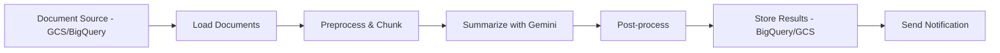

# How to Build a Text Summarization Pipeline with Gemini and Vertex AI Pipelines

Author: [nawazdhandala](https://www.github.com/nawazdhandala)

Tags: GCP, Vertex AI Pipelines, Gemini, Text Summarization, MLOps

Description: Build a scalable text summarization pipeline using Gemini models and Vertex AI Pipelines for processing large document collections on Google Cloud.

---

Summarizing a single document with Gemini is trivial - you call the API with a prompt and you are done. But when you need to summarize thousands of documents on a schedule, you need a pipeline. Vertex AI Pipelines gives you a managed orchestration platform for building these batch processing workflows. Combined with Gemini's strong summarization capabilities, you can build a pipeline that ingests documents, generates summaries, and stores the results, all running as a managed, repeatable workflow.

This guide walks through building a complete text summarization pipeline from scratch.

## Pipeline Architecture



## Prerequisites

- Google Cloud project with Vertex AI Pipelines API enabled
- Python 3.9+
- Documents to summarize in GCS or BigQuery

```bash
pip install google-cloud-aiplatform kfp
```

## Step 1: Define Pipeline Components

Vertex AI Pipelines uses KFP (Kubeflow Pipelines) components. Each step in the pipeline is a self-contained component.

### Document Loading Component

```python
from kfp import dsl
from kfp.dsl import Output, Dataset, Artifact

@dsl.component(
    base_image="python:3.11",
    packages_to_install=["google-cloud-storage"],
)
def load_documents(
    bucket_name: str,
    prefix: str,
    project_id: str,
    documents: Output[Dataset],
):
    """Load documents from Google Cloud Storage."""
    from google.cloud import storage
    import json

    client = storage.Client(project=project_id)
    bucket = client.bucket(bucket_name)
    blobs = bucket.list_blobs(prefix=prefix)

    docs = []
    for blob in blobs:
        # Only process text-based files
        if blob.name.endswith(('.txt', '.md', '.html')):
            content = blob.download_as_text()
            docs.append({
                "id": blob.name,
                "content": content,
                "size": len(content),
            })

    # Save the document list as a JSON file
    with open(documents.path, "w") as f:
        json.dump(docs, f)

    print(f"Loaded {len(docs)} documents from gs://{bucket_name}/{prefix}")
```

### Preprocessing Component

```python
@dsl.component(
    base_image="python:3.11",
)
def preprocess_documents(
    documents: dsl.Input[Dataset],
    max_chunk_size: int,
    processed_docs: Output[Dataset],
):
    """Preprocess documents - clean text and split large documents into chunks."""
    import json
    import re

    with open(documents.path, "r") as f:
        docs = json.load(f)

    processed = []
    for doc in docs:
        content = doc["content"]

        # Clean the text
        content = re.sub(r'\s+', ' ', content).strip()  # Normalize whitespace
        content = re.sub(r'<[^>]+>', '', content)  # Remove HTML tags

        # Skip very short documents
        if len(content) < 100:
            continue

        # Split large documents into chunks
        if len(content) > max_chunk_size:
            # Split at paragraph boundaries
            paragraphs = content.split('\n\n')
            current_chunk = ""

            for para in paragraphs:
                if len(current_chunk) + len(para) < max_chunk_size:
                    current_chunk += para + "\n\n"
                else:
                    if current_chunk:
                        processed.append({
                            "id": f"{doc['id']}_chunk_{len(processed)}",
                            "parent_id": doc["id"],
                            "content": current_chunk.strip(),
                        })
                    current_chunk = para + "\n\n"

            if current_chunk:
                processed.append({
                    "id": f"{doc['id']}_chunk_{len(processed)}",
                    "parent_id": doc["id"],
                    "content": current_chunk.strip(),
                })
        else:
            processed.append({
                "id": doc["id"],
                "parent_id": doc["id"],
                "content": content,
            })

    with open(processed_docs.path, "w") as f:
        json.dump(processed, f)

    print(f"Preprocessed into {len(processed)} chunks from {len(docs)} documents")
```

### Summarization Component

```python
@dsl.component(
    base_image="python:3.11",
    packages_to_install=["google-cloud-aiplatform", "vertexai"],
)
def summarize_documents(
    processed_docs: dsl.Input[Dataset],
    project_id: str,
    location: str,
    summary_style: str,
    summaries: Output[Dataset],
):
    """Summarize each document chunk using Gemini."""
    import json
    import time
    import vertexai
    from vertexai.generative_models import GenerativeModel

    # Initialize Vertex AI
    vertexai.init(project=project_id, location=location)
    model = GenerativeModel("gemini-1.5-flash")

    with open(processed_docs.path, "r") as f:
        docs = json.load(f)

    # Define summarization prompts based on style
    prompts = {
        "brief": "Summarize the following text in 2-3 sentences. Focus on the key points.",
        "detailed": "Provide a detailed summary of the following text. Include all important points, data, and conclusions. Use bullet points for clarity.",
        "executive": "Write an executive summary of the following text. Focus on business impact, key decisions needed, and actionable insights. Keep it under 200 words.",
    }

    prompt_template = prompts.get(summary_style, prompts["brief"])

    results = []
    for i, doc in enumerate(docs):
        try:
            # Build the full prompt
            full_prompt = f"{prompt_template}\n\nText:\n{doc['content']}"

            # Call Gemini for summarization
            response = model.generate_content(full_prompt)
            summary = response.text

            results.append({
                "id": doc["id"],
                "parent_id": doc["parent_id"],
                "summary": summary,
                "original_length": len(doc["content"]),
                "summary_length": len(summary),
                "compression_ratio": len(summary) / len(doc["content"]),
            })

            # Rate limiting - avoid hitting API quotas
            if (i + 1) % 10 == 0:
                time.sleep(1)
                print(f"Processed {i + 1}/{len(docs)} documents")

        except Exception as e:
            print(f"Error summarizing {doc['id']}: {e}")
            results.append({
                "id": doc["id"],
                "parent_id": doc["parent_id"],
                "summary": f"Error: {str(e)}",
                "original_length": len(doc["content"]),
                "summary_length": 0,
                "compression_ratio": 0,
            })

    with open(summaries.path, "w") as f:
        json.dump(results, f)

    # Print statistics
    successful = [r for r in results if not r["summary"].startswith("Error")]
    print(f"Successfully summarized {len(successful)}/{len(docs)} documents")
    if successful:
        avg_ratio = sum(r["compression_ratio"] for r in successful) / len(successful)
        print(f"Average compression ratio: {avg_ratio:.2%}")
```

### Storage Component

```python
@dsl.component(
    base_image="python:3.11",
    packages_to_install=["google-cloud-bigquery"],
)
def store_summaries(
    summaries: dsl.Input[Dataset],
    project_id: str,
    dataset_id: str,
    table_id: str,
):
    """Store summaries in BigQuery for downstream use."""
    import json
    from google.cloud import bigquery
    from datetime import datetime

    with open(summaries.path, "r") as f:
        results = json.load(f)

    client = bigquery.Client(project=project_id)
    table_ref = f"{project_id}.{dataset_id}.{table_id}"

    # Prepare rows for insertion
    rows = []
    for r in results:
        rows.append({
            "document_id": r["id"],
            "parent_document_id": r["parent_id"],
            "summary": r["summary"],
            "original_length": r["original_length"],
            "summary_length": r["summary_length"],
            "compression_ratio": r["compression_ratio"],
            "processed_at": datetime.utcnow().isoformat(),
        })

    # Insert into BigQuery
    errors = client.insert_rows_json(table_ref, rows)
    if errors:
        print(f"Errors inserting rows: {errors}")
    else:
        print(f"Successfully stored {len(rows)} summaries in {table_ref}")
```

## Step 2: Assemble the Pipeline

```python
from kfp import dsl

@dsl.pipeline(
    name="text-summarization-pipeline",
    description="Batch text summarization using Gemini and Vertex AI Pipelines",
)
def summarization_pipeline(
    bucket_name: str = "your-document-bucket",
    prefix: str = "documents/",
    project_id: str = "your-project-id",
    location: str = "us-central1",
    max_chunk_size: int = 10000,
    summary_style: str = "brief",
    bq_dataset: str = "summaries",
    bq_table: str = "document_summaries",
):
    """End-to-end text summarization pipeline."""

    # Step 1: Load documents from GCS
    load_task = load_documents(
        bucket_name=bucket_name,
        prefix=prefix,
        project_id=project_id,
    )

    # Step 2: Preprocess and chunk documents
    preprocess_task = preprocess_documents(
        documents=load_task.outputs["documents"],
        max_chunk_size=max_chunk_size,
    )

    # Step 3: Summarize each chunk with Gemini
    summarize_task = summarize_documents(
        processed_docs=preprocess_task.outputs["processed_docs"],
        project_id=project_id,
        location=location,
        summary_style=summary_style,
    )

    # Step 4: Store results in BigQuery
    store_task = store_summaries(
        summaries=summarize_task.outputs["summaries"],
        project_id=project_id,
        dataset_id=bq_dataset,
        table_id=bq_table,
    )
```

## Step 3: Compile and Run the Pipeline

```python
from kfp import compiler
from google.cloud import aiplatform

# Compile the pipeline to a YAML file
compiler.Compiler().compile(
    pipeline_func=summarization_pipeline,
    package_path="summarization_pipeline.yaml",
)

# Initialize Vertex AI
aiplatform.init(project="your-project-id", location="us-central1")

# Submit the pipeline for execution
job = aiplatform.PipelineJob(
    display_name="text-summarization-run",
    template_path="summarization_pipeline.yaml",
    parameter_values={
        "bucket_name": "your-document-bucket",
        "prefix": "documents/",
        "project_id": "your-project-id",
        "location": "us-central1",
        "summary_style": "executive",
    },
    pipeline_root="gs://your-pipeline-bucket/pipeline-runs",
)

# Run the pipeline
job.submit()
print(f"Pipeline submitted. View at: {job._dashboard_uri()}")
```

## Scheduling the Pipeline

For recurring summarization, schedule the pipeline with Cloud Scheduler.

```python
# Create a scheduled pipeline run
from google.cloud import aiplatform

schedule = aiplatform.PipelineJobSchedule(
    pipeline_job=job,
    display_name="daily-summarization",
)

schedule.create(
    cron="0 2 * * *",  # Run daily at 2 AM
    max_concurrent_run_count=1,
    max_run_count=365,
)

print(f"Pipeline scheduled to run daily")
```

## Monitoring Pipeline Runs

```python
def check_pipeline_status(project_id: str, location: str, job_name: str):
    """Check the status of a pipeline run."""
    aiplatform.init(project=project_id, location=location)

    # List recent pipeline runs
    jobs = aiplatform.PipelineJob.list(
        filter=f'display_name="{job_name}"',
        order_by="create_time desc",
    )

    for job in jobs[:5]:
        print(f"Run: {job.display_name}")
        print(f"  State: {job.state}")
        print(f"  Created: {job.create_time}")
        print(f"  Updated: {job.update_time}")
        print()
```

## Summary

Vertex AI Pipelines combined with Gemini gives you a scalable, maintainable approach to batch text summarization. Each pipeline component is independently testable, the orchestration handles retries and failures, and scheduling automates recurring runs. Start with the basic pipeline shown here, add error handling and monitoring as you validate the approach, then extend with additional post-processing steps as your needs grow. The pipeline pattern ensures your summarization workflow is reproducible, auditable, and can handle document collections of any size.
