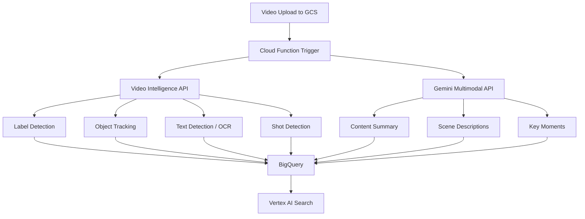

# How to Build a Video Content Analysis Pipeline with Vertex AI Video Intelligence and Gemini

Author: [nawazdhandala](https://www.github.com/nawazdhandala)

Tags: GCP, Vertex AI, Video Intelligence, Gemini, Content Analysis

Description: Build a video content analysis pipeline on GCP that combines Video Intelligence API for structured detection with Gemini for natural language understanding and summarization.

---

Analyzing video content at scale used to require specialized ML teams and months of development. Today, GCP offers two complementary services that handle different aspects of video analysis: the Video Intelligence API for structured detection (objects, labels, faces, text) and Gemini's multimodal capabilities for natural language understanding. Combining them gives you a pipeline that can both detect what's in a video and understand what it means.

In this post, I'll build a pipeline that processes uploaded videos, extracts structured metadata with Video Intelligence, generates natural language summaries with Gemini, and stores everything in a searchable format.

## Architecture



## Setting Up the Pipeline

Enable the required APIs and create the storage infrastructure:

```bash
# Enable Video Intelligence and Vertex AI APIs
gcloud services enable videointelligence.googleapis.com
gcloud services enable aiplatform.googleapis.com

# Create a GCS bucket for video uploads
gsutil mb -l us-central1 gs://YOUR_PROJECT-video-uploads

# Create a BigQuery dataset for analysis results
bq mk --dataset video_analysis

# Create the results table
bq mk --table video_analysis.results \
    video_uri:STRING,\
    upload_time:TIMESTAMP,\
    duration_seconds:FLOAT,\
    labels:STRING,\
    objects:STRING,\
    text_content:STRING,\
    shot_count:INTEGER,\
    gemini_summary:STRING,\
    scene_descriptions:STRING,\
    key_moments:STRING
```

## Video Intelligence Analysis

The Video Intelligence API handles structured detection. Here's the function that kicks off the analysis:

```python
from google.cloud import videointelligence_v1 as vi

def analyze_with_video_intelligence(video_uri):
    """Run Video Intelligence API analysis on a video"""
    client = vi.VideoIntelligenceServiceClient()

    # Configure which features to detect
    features = [
        vi.Feature.LABEL_DETECTION,
        vi.Feature.OBJECT_TRACKING,
        vi.Feature.TEXT_DETECTION,
        vi.Feature.SHOT_CHANGE_DETECTION,
        vi.Feature.SPEECH_TRANSCRIPTION,
    ]

    # Configure label detection sensitivity
    label_config = vi.LabelDetectionConfig(
        label_detection_mode=vi.LabelDetectionMode.SHOT_AND_FRAME_MODE,
        stationary_camera=False,
    )

    # Configure speech transcription
    speech_config = vi.SpeechTranscriptionConfig(
        language_code="en-US",
        enable_automatic_punctuation=True,
        # Support multiple speakers
        max_alternatives=1,
    )

    video_context = vi.VideoContext(
        label_detection_config=label_config,
        speech_transcription_config=speech_config,
    )

    # Start the asynchronous analysis
    operation = client.annotate_video(
        request={
            "input_uri": video_uri,
            "features": features,
            "video_context": video_context,
        }
    )

    print(f"Started Video Intelligence analysis for {video_uri}")
    print(f"Operation: {operation.operation.name}")

    # Wait for completion (for long videos, use async processing)
    result = operation.result(timeout=600)

    return parse_vi_results(result)

def parse_vi_results(result):
    """Parse Video Intelligence API results into structured data"""
    annotations = result.annotation_results[0]

    # Extract labels with confidence scores
    labels = []
    for label in annotations.segment_label_annotations:
        for segment in label.segments:
            labels.append({
                "label": label.entity.description,
                "confidence": round(segment.confidence, 3),
                "start_time": segment.segment.start_time_offset.seconds,
                "end_time": segment.segment.end_time_offset.seconds,
            })

    # Extract detected objects with tracking info
    objects = []
    for obj in annotations.object_annotations:
        objects.append({
            "object": obj.entity.description,
            "confidence": round(obj.confidence, 3),
            "track_id": obj.track_id,
            "start_time": obj.segment.start_time_offset.seconds,
            "end_time": obj.segment.end_time_offset.seconds,
        })

    # Extract text found in the video (OCR)
    text_content = []
    for text in annotations.text_annotations:
        text_content.append({
            "text": text.text,
            "segments": len(text.segments),
        })

    # Count shot changes
    shot_count = len(annotations.shot_annotations)

    # Extract speech transcription
    transcript = ""
    for speech in annotations.speech_transcriptions:
        for alternative in speech.alternatives:
            transcript += alternative.transcript + " "

    return {
        "labels": labels,
        "objects": objects,
        "text_content": text_content,
        "shot_count": shot_count,
        "transcript": transcript.strip(),
    }
```

## Gemini Multimodal Analysis

Gemini can watch video and provide natural language understanding that goes beyond what structured detection offers:

```python
import vertexai
from vertexai.generative_models import GenerativeModel, Part

def analyze_with_gemini(video_uri):
    """Use Gemini to generate natural language analysis of the video"""
    vertexai.init(project="your-project-id", location="us-central1")
    model = GenerativeModel("gemini-1.5-pro")

    # Reference the video from GCS
    video_part = Part.from_uri(video_uri, mime_type="video/mp4")

    # Generate a comprehensive summary
    summary_response = model.generate_content(
        [
            video_part,
            "Watch this video carefully and provide a detailed summary. "
            "Include the main topic, key visual elements, the setting, "
            "and any important actions or events that occur. "
            "Keep it concise but informative, around 200 words."
        ],
        generation_config={
            "temperature": 0.3,
            "max_output_tokens": 500,
        },
    )

    # Generate scene-by-scene descriptions
    scenes_response = model.generate_content(
        [
            video_part,
            "Break this video down into its main scenes or segments. "
            "For each scene, provide: "
            "1. Approximate timestamp range "
            "2. Brief description of what happens "
            "3. Key visual elements or subjects present. "
            "Format as a JSON array with fields: "
            "start_time, end_time, description, elements."
        ],
        generation_config={
            "temperature": 0.2,
            "max_output_tokens": 2000,
        },
    )

    # Identify key moments that would make good highlights
    moments_response = model.generate_content(
        [
            video_part,
            "Identify the 3-5 most important or interesting moments "
            "in this video. For each moment, provide: "
            "1. The approximate timestamp "
            "2. Why this moment is significant "
            "3. A short description suitable for a chapter title. "
            "Format as a JSON array with fields: "
            "timestamp, significance, title."
        ],
        generation_config={
            "temperature": 0.3,
            "max_output_tokens": 1000,
        },
    )

    return {
        "summary": summary_response.text,
        "scene_descriptions": scenes_response.text,
        "key_moments": moments_response.text,
    }
```

## The Main Pipeline Function

This Cloud Function ties everything together when a video is uploaded:

```python
import json
from google.cloud import bigquery
from google.cloud import storage
from datetime import datetime

def process_video(event, context):
    """Main pipeline triggered by video upload to GCS"""
    bucket_name = event["bucket"]
    file_name = event["name"]
    video_uri = f"gs://{bucket_name}/{file_name}"

    # Skip non-video files
    if not file_name.lower().endswith(('.mp4', '.avi', '.mov', '.mkv')):
        print(f"Skipping non-video file: {file_name}")
        return

    print(f"Processing video: {video_uri}")

    # Get video metadata
    storage_client = storage.Client()
    blob = storage_client.bucket(bucket_name).blob(file_name)
    blob.reload()

    # Run both analyses in parallel for faster processing
    # (In production, use Cloud Tasks or Workflows for better reliability)
    vi_results = analyze_with_video_intelligence(video_uri)
    gemini_results = analyze_with_gemini(video_uri)

    # Combine results and store in BigQuery
    combined_results = {
        "video_uri": video_uri,
        "upload_time": datetime.utcnow().isoformat(),
        "duration_seconds": vi_results.get("duration", 0),
        "labels": json.dumps(vi_results["labels"][:50]),
        "objects": json.dumps(vi_results["objects"][:50]),
        "text_content": json.dumps(vi_results["text_content"]),
        "shot_count": vi_results["shot_count"],
        "transcript": vi_results.get("transcript", ""),
        "gemini_summary": gemini_results["summary"],
        "scene_descriptions": gemini_results["scene_descriptions"],
        "key_moments": gemini_results["key_moments"],
    }

    # Write to BigQuery
    bq_client = bigquery.Client()
    table_id = "your-project.video_analysis.results"
    errors = bq_client.insert_rows_json(table_id, [combined_results])

    if errors:
        print(f"BigQuery insert errors: {errors}")
    else:
        print(f"Results stored for {video_uri}")

    return combined_results
```

## Deploying the Pipeline

```bash
# Deploy the Cloud Function triggered by GCS uploads
gcloud functions deploy process-video \
    --runtime python311 \
    --trigger-bucket YOUR_PROJECT-video-uploads \
    --timeout 540 \
    --memory 2GB \
    --service-account video-analyzer@YOUR_PROJECT.iam.gserviceaccount.com
```

## Searching Analyzed Videos

With results in BigQuery, you can run powerful queries across your video library:

```sql
-- Find videos that contain specific objects
SELECT
    video_uri,
    gemini_summary,
    JSON_EXTRACT_SCALAR(obj, '$.object') AS detected_object,
    JSON_EXTRACT_SCALAR(obj, '$.confidence') AS confidence
FROM `your-project.video_analysis.results`,
    UNNEST(JSON_EXTRACT_ARRAY(objects)) AS obj
WHERE JSON_EXTRACT_SCALAR(obj, '$.object') LIKE '%car%'
ORDER BY CAST(JSON_EXTRACT_SCALAR(obj, '$.confidence') AS FLOAT64) DESC

-- Search video transcripts and summaries
SELECT
    video_uri,
    gemini_summary,
    shot_count
FROM `your-project.video_analysis.results`
WHERE LOWER(gemini_summary) LIKE '%product launch%'
   OR LOWER(transcript) LIKE '%product launch%'
```

## Wrapping Up

Combining Video Intelligence API and Gemini gives you the best of both worlds for video analysis: structured, machine-readable detection results alongside natural language understanding that captures context and meaning. Video Intelligence tells you "there's a person and a car in this frame." Gemini tells you "a mechanic is inspecting the engine of a vintage car in a garage." Together, they make video content searchable, summarizable, and actionable at scale. Start with the video types most important to your use case, tune the Gemini prompts for your domain, and expand from there.
