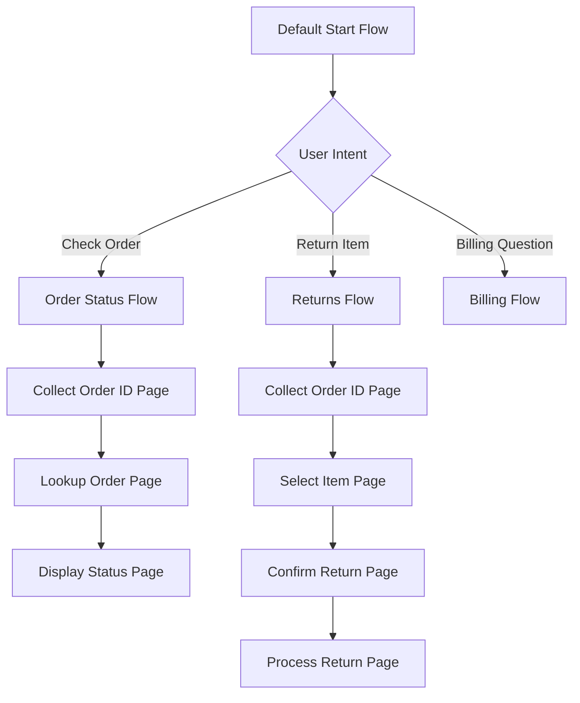

# How to Build a Virtual Agent with Dialogflow CX Using Flows and Pages for Conversation Design

Author: [nawazdhandala](https://www.github.com/nawazdhandala)

Tags: GCP, Dialogflow CX, Virtual Agent, Conversational AI, Chatbot, NLU, Google Cloud

Description: Build a production-ready virtual agent with Dialogflow CX using flows and pages to design structured multi-turn conversations for customer support.

---

Dialogflow CX is Google Cloud's enterprise-grade conversational AI platform. Unlike its predecessor Dialogflow ES, which uses a flat intent-based architecture, CX introduces flows and pages that let you model conversations as state machines. This is a big deal for complex use cases like customer support, order management, or appointment scheduling where the conversation branches and loops in ways that are hard to manage with intents alone.

In this post, I will build a complete virtual agent for an order management scenario, walking through flow design, page configuration, intent detection, parameter collection, and transitions.

## Flows and Pages Explained

Think of flows as chapters in a conversation, and pages as the paragraphs within each chapter.

- **Flows** represent high-level conversation topics (e.g., Order Status, Returns, Billing)
- **Pages** represent specific states within a flow (e.g., Collect Order Number, Display Order Status, Confirm Return)
- **Transitions** connect pages based on intents, conditions, or parameter values



## Prerequisites

- A Google Cloud project with the Dialogflow API enabled
- Familiarity with basic conversational AI concepts (intents, entities, parameters)
- The Dialogflow CX console access

## Step 1: Create the Agent

Start by creating a Dialogflow CX agent. You can do this through the console or the API.

This Python script creates the agent programmatically:

```python
from google.cloud import dialogflowcx_v3

def create_agent(project_id, location, display_name, time_zone, language):
    """Creates a Dialogflow CX agent."""
    client = dialogflowcx_v3.AgentsClient()

    agent = dialogflowcx_v3.Agent(
        display_name=display_name,
        default_language_code=language,
        time_zone=time_zone,
        # Enable speech adaptation for voice scenarios
        speech_to_text_settings=dialogflowcx_v3.SpeechToTextSettings(
            enable_speech_adaptation=True,
        ),
    )

    parent = f"projects/{project_id}/locations/{location}"

    response = client.create_agent(
        parent=parent,
        agent=agent,
    )
    print(f"Agent created: {response.name}")
    return response

agent = create_agent(
    "my-project",
    "us-central1",
    "Order Management Bot",
    "America/New_York",
    "en"
)
```

## Step 2: Create Intents

Define the intents that your agent needs to detect. Each intent represents something the user might want to do.

This script creates the core intents for order management:

```python
from google.cloud import dialogflowcx_v3

def create_intent(agent_name, display_name, training_phrases):
    """Creates an intent with training phrases."""
    client = dialogflowcx_v3.IntentsClient()

    # Build training phrase objects from the provided strings
    phrases = []
    for phrase_text in training_phrases:
        parts = [dialogflowcx_v3.Intent.TrainingPhrase.Part(text=phrase_text)]
        phrases.append(dialogflowcx_v3.Intent.TrainingPhrase(parts=parts, repeat_count=1))

    intent = dialogflowcx_v3.Intent(
        display_name=display_name,
        training_phrases=phrases,
    )

    response = client.create_intent(
        parent=agent_name,
        intent=intent,
    )
    print(f"Intent created: {response.display_name}")
    return response

# Create intents for order management
agent_name = "projects/my-project/locations/us-central1/agents/AGENT_ID"

create_intent(agent_name, "check.order.status", [
    "Where is my order?",
    "Check order status",
    "I want to track my package",
    "What happened to my order?",
    "Order tracking",
    "When will my order arrive?",
    "Is my order shipped yet?",
    "Track my delivery",
])

create_intent(agent_name, "return.item", [
    "I want to return an item",
    "How do I return something?",
    "Return my order",
    "I need to make a return",
    "Start a return",
    "Can I return this product?",
    "I want my money back",
])

create_intent(agent_name, "provide.order.id", [
    "My order number is 12345",
    "Order 67890",
    "It's ORD-12345",
    "The order ID is 54321",
])

create_intent(agent_name, "confirm.yes", [
    "Yes",
    "Yeah",
    "Sure",
    "That's right",
    "Correct",
    "Absolutely",
    "Yes please",
])

create_intent(agent_name, "confirm.no", [
    "No",
    "Nope",
    "That's not right",
    "Wrong",
    "No thanks",
    "Cancel",
])
```

## Step 3: Create Entity Types

Define entity types for parameters like order IDs that the agent needs to extract from user input.

```python
from google.cloud import dialogflowcx_v3

def create_entity_type(agent_name, display_name, kind, entities=None):
    """Creates an entity type for parameter extraction."""
    client = dialogflowcx_v3.EntityTypesClient()

    entity_type = dialogflowcx_v3.EntityType(
        display_name=display_name,
        kind=kind,
        auto_expansion_mode=dialogflowcx_v3.EntityType.AutoExpansionMode.AUTO_EXPANSION_MODE_DEFAULT,
    )

    if entities:
        entity_type.entities = [
            dialogflowcx_v3.EntityType.Entity(
                value=e["value"],
                synonyms=e["synonyms"]
            )
            for e in entities
        ]

    response = client.create_entity_type(
        parent=agent_name,
        entity_type=entity_type,
    )
    print(f"Entity type created: {response.display_name}")
    return response

# Create an entity type for order IDs (using regexp for pattern matching)
create_entity_type(
    agent_name,
    "order_id",
    dialogflowcx_v3.EntityType.Kind.KIND_REGEXP,
)
```

## Step 4: Create Flows

Now create the conversation flows. Each flow handles a specific topic.

```python
from google.cloud import dialogflowcx_v3

def create_flow(agent_name, display_name, description):
    """Creates a conversation flow."""
    client = dialogflowcx_v3.FlowsClient()

    flow = dialogflowcx_v3.Flow(
        display_name=display_name,
        description=description,
    )

    response = client.create_flow(
        parent=agent_name,
        flow=flow,
    )
    print(f"Flow created: {response.name}")
    return response

# Create the Order Status flow
order_flow = create_flow(
    agent_name,
    "Order Status",
    "Handles order tracking and status inquiries"
)

# Create the Returns flow
returns_flow = create_flow(
    agent_name,
    "Returns",
    "Handles product return requests"
)
```

## Step 5: Create Pages Within Flows

Pages are the states within each flow. Each page can have entry fulfillment (what the bot says when entering the page), parameters to collect, and transition routes.

```python
from google.cloud import dialogflowcx_v3

def create_page(flow_name, display_name, entry_message, form_parameters=None):
    """Creates a page within a flow."""
    client = dialogflowcx_v3.PagesClient()

    # Build the entry fulfillment message
    entry_fulfillment = dialogflowcx_v3.Fulfillment(
        messages=[
            dialogflowcx_v3.ResponseMessage(
                text=dialogflowcx_v3.ResponseMessage.Text(
                    text=[entry_message]
                )
            )
        ]
    )

    page = dialogflowcx_v3.Page(
        display_name=display_name,
        entry_fulfillment=entry_fulfillment,
    )

    # Add form parameters if this page collects information
    if form_parameters:
        page.form = dialogflowcx_v3.Form(
            parameters=[
                dialogflowcx_v3.Form.Parameter(
                    display_name=param["name"],
                    entity_type=param["entity_type"],
                    required=param.get("required", True),
                    fill_behavior=dialogflowcx_v3.Form.Parameter.FillBehavior(
                        initial_prompt_fulfillment=dialogflowcx_v3.Fulfillment(
                            messages=[
                                dialogflowcx_v3.ResponseMessage(
                                    text=dialogflowcx_v3.ResponseMessage.Text(
                                        text=[param["prompt"]]
                                    )
                                )
                            ]
                        ),
                    ),
                )
                for param in form_parameters
            ]
        )

    response = client.create_page(
        parent=flow_name,
        page=page,
    )
    print(f"Page created: {response.display_name}")
    return response

# Create pages for the Order Status flow
collect_order_page = create_page(
    order_flow.name,
    "Collect Order ID",
    "I'd be happy to help you check your order status.",
    form_parameters=[{
        "name": "order_id",
        "entity_type": "projects/my-project/locations/us-central1/agents/AGENT_ID/entityTypes/ENTITY_ID",
        "required": True,
        "prompt": "Could you please provide your order number?"
    }]
)

lookup_page = create_page(
    order_flow.name,
    "Lookup Order",
    "Let me look up order $session.params.order_id for you..."
)

display_status_page = create_page(
    order_flow.name,
    "Display Status",
    "Here's what I found for your order."
)
```

## Step 6: Configure Transition Routes

Transition routes connect pages together based on intents or conditions.

```python
from google.cloud import dialogflowcx_v3

def add_transition_route(page_name, intent=None, condition=None, target_page=None, target_flow=None):
    """Adds a transition route to a page."""
    client = dialogflowcx_v3.PagesClient()

    # Get the current page configuration
    page = client.get_page(name=page_name)

    # Build the transition route
    route = dialogflowcx_v3.TransitionRoute()
    if intent:
        route.intent = intent
    if condition:
        route.condition = condition
    if target_page:
        route.target_page = target_page
    if target_flow:
        route.target_flow = target_flow

    # Add the route to the page
    page.transition_routes.append(route)

    # Update the page with the new route
    client.update_page(
        page=page,
        update_mask={"paths": ["transition_routes"]},
    )
    print(f"Transition route added to {page.display_name}")

# After collecting order ID, transition to lookup page when form is complete
add_transition_route(
    collect_order_page.name,
    condition="$page.params.status = 'FINAL'",
    target_page=lookup_page.name,
)
```

## Testing the Agent

Use the Dialogflow CX test console to walk through conversation scenarios:

1. User says "Where is my order?" - triggers the `check.order.status` intent
2. Agent transitions to Order Status flow, Collect Order ID page
3. Agent asks "Could you please provide your order number?"
4. User says "ORD-12345" - fills the `order_id` parameter
5. Agent transitions to Lookup Order page, calls webhook for order data
6. Agent transitions to Display Status page with order information

## Summary

Building a virtual agent with Dialogflow CX is about modeling your conversation as a state machine. Flows organize your agent by topic, pages represent individual conversation states, and transition routes control how the conversation moves between states. The key advantage over flat intent-based systems is that you can handle complex multi-turn conversations without losing track of where you are in the dialog. Start with a simple flow, test it thoroughly, and then expand to handle more scenarios as you learn what your users actually ask for.
