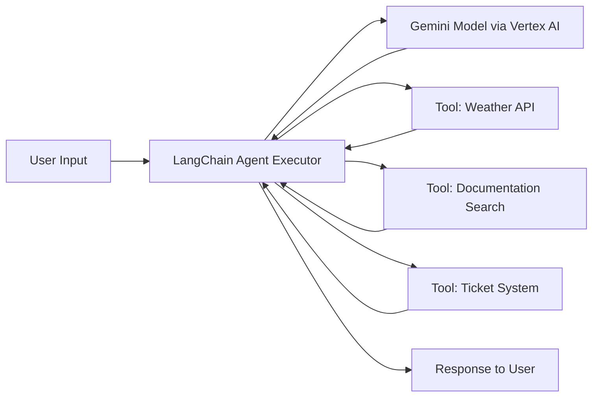

# How to Build AI Agents with LangChain and Vertex AI Gemini Models

Author: [nawazdhandala](https://www.github.com/nawazdhandala)

Tags: GCP, Vertex AI, LangChain, Gemini, AI Agents

Description: Learn how to build intelligent AI agents using LangChain framework and Vertex AI Gemini models on Google Cloud Platform for production-ready applications.

---

AI agents are becoming a foundational building block for modern applications. Instead of simply generating text, agents can reason about tasks, use tools, and take actions on behalf of users. When you combine LangChain - one of the most popular AI orchestration frameworks - with Google's Vertex AI Gemini models, you get a powerful combination for building production-grade agents on GCP.

In this guide, I will walk through the full process of building an AI agent using LangChain and Vertex AI Gemini. We will cover authentication, tool creation, agent configuration, and deployment considerations.

## Prerequisites

Before you start, make sure you have the following ready:

- A Google Cloud project with billing enabled
- Vertex AI API enabled in your project
- Python 3.9 or later
- The `gcloud` CLI installed and authenticated

Install the required packages with pip:

```bash
# Install LangChain core, the Google Vertex AI integration, and tools
pip install langchain langchain-google-vertexai langchain-core google-cloud-aiplatform
```

## Setting Up Authentication

The first thing to handle is authenticating with Google Cloud. LangChain's Vertex AI integration uses Application Default Credentials (ADC), so you need to make sure your environment is configured properly.

```bash
# Authenticate with your Google Cloud account
gcloud auth application-default login

# Set your project
gcloud config set project YOUR_PROJECT_ID
```

If you are running inside a GCP environment like Cloud Run or GKE, authentication happens automatically via the attached service account.

## Initializing the Gemini Model

LangChain provides a dedicated wrapper for Vertex AI Gemini models through the `langchain-google-vertexai` package. Here is how to set up the model.

```python
from langchain_google_vertexai import ChatVertexAI

# Initialize the Gemini model via Vertex AI
# You can choose gemini-1.5-pro or gemini-1.5-flash depending on your needs
model = ChatVertexAI(
    model_name="gemini-1.5-pro",
    project="your-gcp-project-id",
    location="us-central1",
    temperature=0.2,  # Lower temperature for more deterministic agent responses
    max_output_tokens=2048,
)
```

The `ChatVertexAI` class handles all the Vertex AI API communication. You can swap between Gemini model variants without changing the rest of your agent code.

## Defining Tools for the Agent

Agents need tools to interact with the outside world. LangChain makes tool creation straightforward with the `@tool` decorator.

```python
from langchain_core.tools import tool
import requests

@tool
def get_weather(city: str) -> str:
    """Get the current weather for a given city. Returns temperature and conditions."""
    # Using a public weather API as an example
    api_url = f"https://wttr.in/{city}?format=%C+%t"
    response = requests.get(api_url)
    return f"Weather in {city}: {response.text.strip()}"

@tool
def search_documentation(query: str) -> str:
    """Search internal documentation for relevant information about a topic."""
    # In production, this would connect to your actual search backend
    # For now, returning a placeholder response
    return f"Documentation results for '{query}': Found 3 relevant articles."

@tool
def create_support_ticket(title: str, description: str, priority: str) -> str:
    """Create a support ticket with the given title, description, and priority level."""
    # This would integrate with your ticketing system
    ticket_id = "TICKET-12345"
    return f"Created ticket {ticket_id}: {title} (Priority: {priority})"
```

Each tool needs a clear docstring because the agent uses that description to decide when and how to use the tool. Be specific in your descriptions.

## Building the Agent

Now let us wire everything together into a working agent. LangChain provides the `create_react_agent` function that builds a ReAct-style agent capable of reasoning and acting in a loop.

```python
from langchain.agents import create_react_agent, AgentExecutor
from langchain_core.prompts import ChatPromptTemplate, MessagesPlaceholder

# Define the system prompt that guides agent behavior
prompt = ChatPromptTemplate.from_messages([
    ("system", """You are a helpful customer support agent. You have access to tools
    for checking weather, searching documentation, and creating support tickets.
    Always try to help the user by using the appropriate tools.
    Think step by step before taking action."""),
    MessagesPlaceholder(variable_name="chat_history", optional=True),
    ("human", "{input}"),
    MessagesPlaceholder(variable_name="agent_scratchpad"),
])

# Collect all tools into a list
tools = [get_weather, search_documentation, create_support_ticket]

# Create the agent with Gemini as the brain
agent = create_react_agent(
    llm=model,
    tools=tools,
    prompt=prompt,
)

# Wrap the agent in an executor that handles the reasoning loop
agent_executor = AgentExecutor(
    agent=agent,
    tools=tools,
    verbose=True,  # Set to True to see the agent's reasoning process
    max_iterations=5,  # Prevent infinite loops
    handle_parsing_errors=True,  # Gracefully handle malformed outputs
)
```

## Running the Agent

With the agent built, you can invoke it with a user query:

```python
# Run the agent with a simple query
result = agent_executor.invoke({
    "input": "What is the weather in Tokyo and can you create a ticket about our monitoring dashboard being slow?",
    "chat_history": [],
})

print(result["output"])
```

The agent will reason about the input, decide to call `get_weather` for Tokyo, then call `create_support_ticket` for the dashboard issue, and combine the results into a coherent response.

## Adding Conversation Memory

For a multi-turn conversational experience, you will want to add memory so the agent remembers what was discussed previously.

```python
from langchain_core.messages import HumanMessage, AIMessage

# Maintain a conversation history list
chat_history = []

def chat_with_agent(user_input: str) -> str:
    """Send a message to the agent and maintain conversation history."""
    result = agent_executor.invoke({
        "input": user_input,
        "chat_history": chat_history,
    })

    # Append the exchange to history
    chat_history.append(HumanMessage(content=user_input))
    chat_history.append(AIMessage(content=result["output"]))

    return result["output"]

# Multi-turn conversation example
print(chat_with_agent("What is the weather in London?"))
print(chat_with_agent("Create a ticket about that - our outdoor event might be affected."))
```

## Structured Output from Agents

Sometimes you need the agent to return structured data rather than free-form text. Gemini supports structured output through function calling.

```python
from pydantic import BaseModel, Field
from typing import List

# Define the expected output structure
class TaskPlan(BaseModel):
    summary: str = Field(description="Brief summary of the plan")
    steps: List[str] = Field(description="Ordered list of action steps")
    estimated_time: str = Field(description="Estimated completion time")

# Use the model's structured output capability
structured_model = model.with_structured_output(TaskPlan)

result = structured_model.invoke(
    "Create a plan for migrating our database from MySQL to Cloud SQL"
)

print(f"Summary: {result.summary}")
for i, step in enumerate(result.steps, 1):
    print(f"  Step {i}: {step}")
print(f"Estimated time: {result.estimated_time}")
```

## Error Handling and Production Tips

When running agents in production, there are a few things you should account for.

First, always set `max_iterations` on the `AgentExecutor` to prevent runaway loops. An agent that keeps calling tools without converging will burn through your API quota fast.

Second, implement proper error handling around tool execution. If a tool fails, the agent should be able to recover gracefully rather than crashing.

```python
# Wrap the executor call with error handling
try:
    result = agent_executor.invoke({"input": user_query, "chat_history": []})
    return result["output"]
except Exception as e:
    # Log the error and return a fallback response
    print(f"Agent error: {e}")
    return "I encountered an issue processing your request. Please try again."
```

Third, use Vertex AI's built-in monitoring to track model usage, latency, and costs. You can view these metrics directly in the Google Cloud Console under the Vertex AI section.

## Architecture Overview

Here is a high-level view of how the components fit together:



## Wrapping Up

Building AI agents with LangChain and Vertex AI Gemini models gives you a solid foundation for creating intelligent, tool-using applications on GCP. The combination of LangChain's flexible orchestration and Gemini's strong reasoning capabilities means you can build agents that handle real workflows - not just chat.

Start with simple tools and a clear system prompt, test the agent's reasoning with verbose mode enabled, and expand the tool set as you validate the approach. Once you are confident in the agent's behavior, deploy it on Cloud Run for a scalable, serverless backend that can handle production traffic.
