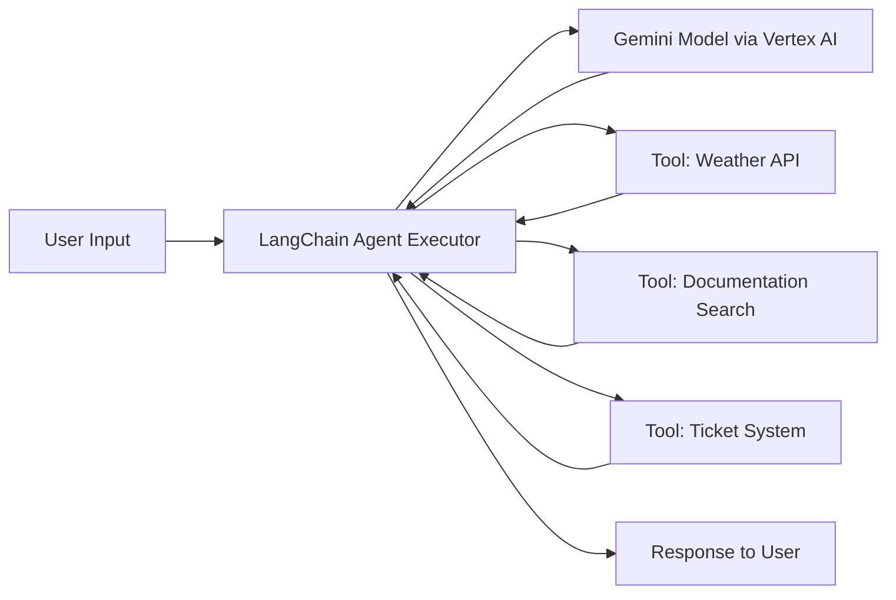

# How to Build AI Agents with LangChain and Vertex AI Gemini Models

Author: [nawazdhandala](https://www.github.com/nawazdhandala)

Tags: GCP, Vertex AI, LangChain, Gemini, AI Agents

Description: Learn how to build intelligent AI agents using LangChain framework and Vertex AI Gemini models on Google Cloud Platform for production-ready applications.

---

AI agents are becoming a foundational building block for modern applications. Instead of simply generating text, agents can reason about tasks, use tools, and take actions on behalf of users. When you combine LangChain - one of the most popular AI orchestration frameworks - with Google's Vertex AI Gemini models, you get a powerful combination for building production-grade agents on GCP.

In this guide, I will walk through the full process of building an AI agent using LangChain and Vertex AI Gemini. We will cover authentication, tool creation, agent configuration, and deployment considerations.

## Prerequisites

Before you start, make sure you have the following ready:

- A Google Cloud project with billing enabled
- Vertex AI API enabled in your project
- Python 3.9 or later
- The `gcloud` CLI installed and authenticated

Install the required packages with pip:

```bash
# Install LangChain core, the Google Gemini integration, and tools

pip install langchain langchain-google-genai langchain-core google-cloud-aiplatform requests langgraph
```

## Setting Up Authentication

The first thing to handle is authenticating with Google Cloud. LangChain's Vertex AI integration uses Application Default Credentials (ADC), so you need to make sure your environment is configured properly.

```bash
# Set your project
gcloud config set project YOUR_PROJECT_ID

# Authenticate with your Google Cloud account
gcloud auth application-default login

# Set the quota project used by client libraries
gcloud auth application-default set-quota-project YOUR_PROJECT_ID
```

If you are running inside a GCP environment like Cloud Run or GKE, authentication happens automatically via the attached service account.

## Initializing the Gemini Model

LangChain provides a dedicated wrapper for Gemini models through the `langchain-google-genai` package. For Vertex AI, configure the wrapper to use the Vertex AI backend. Here is how to set up the model.

```python
from langchain_google_genai import ChatGoogleGenerativeAI

# Initialize the Gemini model via Vertex AI
# You can choose gemini-2.5-pro or gemini-2.5-flash depending on your needs
model = ChatGoogleGenerativeAI(
    model="gemini-2.5-pro",
    vertexai=True,
    project="your-gcp-project-id",
    location="us-central1",
    temperature=0.2,  # Lower temperature for more deterministic agent responses
    max_tokens=2048,
)
```

The `ChatGoogleGenerativeAI` class handles the Gemini API communication and can use Vertex AI when `vertexai=True` is set. You can swap between Gemini model variants without changing the rest of your agent code.

## Defining Tools for the Agent

Agents need tools to interact with the outside world. LangChain makes tool creation straightforward with the `@tool` decorator.

```python
from langchain_core.tools import tool
import requests

@tool
def get_weather(city: str) -> str:
    """Get the current weather for a given city. Returns temperature and conditions."""
    # Using a public weather API as an example
    api_url = f"https://wttr.in/{city}?format=%C+%t"
    response = requests.get(api_url)
    return f"Weather in {city}: {response.text.strip()}"

@tool
def search_documentation(query: str) -> str:
    """Search internal documentation for relevant information about a topic."""
    # In production, this would connect to your actual search backend
    # For now, returning a placeholder response
    return f"Documentation results for '{query}': Found 3 relevant articles."

@tool
def create_support_ticket(title: str, description: str, priority: str) -> str:
    """Create a support ticket with the given title, description, and priority level."""
    # This would integrate with your ticketing system
    ticket_id = "TICKET-12345"
    return f"Created ticket {ticket_id}: {title} (Priority: {priority})"
```

Each tool needs a clear docstring because the agent uses that description to decide when and how to use the tool. Be specific in your descriptions.

## Building the Agent

Now let us wire everything together into a working agent. LangChain provides the `create_agent` function that builds an agent capable of using tools in a loop until it reaches a final answer.

```python
from langchain.agents import create_agent

# Define the system prompt that guides agent behavior
system_prompt = """You are a helpful customer support agent. You have access to tools
for checking weather, searching documentation, and creating support tickets.
Always try to help the user by using the appropriate tools."""

# Collect all tools into a list
tools = [get_weather, search_documentation, create_support_ticket]

# Create the agent with Gemini as the brain
agent = create_agent(
    model=model,
    tools=tools,
    system_prompt=system_prompt,
    debug=True,  # Set to True to see graph execution details while developing
)
```

## Running the Agent

With the agent built, you can invoke it with a user query:

```python
# Run the agent with a simple query
result = agent.invoke(
    {
        "messages": [
            {
                "role": "user",
                "content": "What is the weather in Tokyo and can you create a ticket about our monitoring dashboard being slow?",
            }
        ]
    },
    config={"recursion_limit": 10},
)

print(result["messages"][-1].content)
```

The agent will reason about the input, decide to call `get_weather` for Tokyo, then call `create_support_ticket` for the dashboard issue, and combine the results into a coherent response.

## Adding Conversation Memory

For a multi-turn conversational experience, you will want to add memory so the agent remembers what was discussed previously.

```python
from langchain_core.utils.uuid import uuid7
from langgraph.checkpoint.memory import InMemorySaver

# Configure the agent with a checkpointer
agent = create_agent(
    model=model,
    tools=tools,
    system_prompt=system_prompt,
    checkpointer=InMemorySaver(),
)

# Reuse the same thread ID for follow-up turns in one conversation
config = {
    "configurable": {"thread_id": str(uuid7())},
    "recursion_limit": 10,
}

def chat_with_agent(user_input: str) -> str:
    """Send a message to the agent and maintain conversation history."""
    result = agent.invoke(
        {"messages": [{"role": "user", "content": user_input}]},
        config=config,
    )

    return result["messages"][-1].content

# Multi-turn conversation example
print(chat_with_agent("What is the weather in London?"))
print(chat_with_agent("Create a ticket about that - our outdoor event might be affected."))
```

## Structured Output from the Model

Sometimes you need the model to return structured data rather than free-form text. Gemini supports native structured output.

```python
from pydantic import BaseModel, Field
from typing import List

# Define the expected output structure
class TaskPlan(BaseModel):
    summary: str = Field(description="Brief summary of the plan")
    steps: List[str] = Field(description="Ordered list of action steps")
    estimated_time: str = Field(description="Estimated completion time")

# Use the model's structured output capability
structured_model = model.with_structured_output(
    schema=TaskPlan.model_json_schema(),
    method="json_schema",
)

result = structured_model.invoke(
    "Create a plan for migrating our database from MySQL to Cloud SQL"
)

print(f"Summary: {result['summary']}")
for i, step in enumerate(result["steps"], 1):
    print(f"  Step {i}: {step}")
print(f"Estimated time: {result['estimated_time']}")
```

## Error Handling and Production Tips

When running agents in production, there are a few things you should account for.

First, set a reasonable `recursion_limit` when invoking the agent to prevent runaway loops. An agent that keeps calling tools without converging will burn through your API quota fast.

Second, implement proper error handling around tool execution. If a tool fails, the agent should be able to recover gracefully rather than crashing.

```python
def handle_user_query(user_query: str) -> str:
    """Wrap the agent call with error handling."""
    try:
        result = agent.invoke(
            {"messages": [{"role": "user", "content": user_query}]},
            config={"recursion_limit": 10},
        )
        return result["messages"][-1].content
    except Exception as e:
        # Log the error and return a fallback response
        print(f"Agent error: {e}")
        return "I encountered an issue processing your request. Please try again."
```

Third, use Vertex AI's built-in monitoring to track model usage, latency, and costs. You can view these metrics directly in the Google Cloud Console under the Vertex AI section.

## Architecture Overview

Here is a high-level view of how the components fit together:


```mermaid
graph LR
    A[User Input] --> B[LangChain Agent Executor]
    B --> C[Gemini Model via Vertex AI]
    C --> B
    B --> D[Tool: Weather API]
    B --> E[Tool: Documentation Search]
    B --> F[Tool: Ticket System]
    D --> B
    E --> B
    F --> B
    B --> G[Response to User]
```

## Wrapping Up

Building AI agents with LangChain and Vertex AI Gemini models gives you a solid foundation for creating intelligent, tool-using applications on GCP. The combination of LangChain's flexible orchestration and Gemini's strong reasoning capabilities means you can build agents that handle real workflows - not just chat.

Start with simple tools and a clear system prompt, test the agent's reasoning with verbose mode enabled, and expand the tool set as you validate the approach. Once you are confident in the agent's behavior, deploy it on Cloud Run for a scalable, serverless backend that can handle production traffic.
