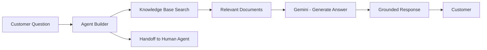

# How to Build an AI-Powered Help Desk with Vertex AI Agent Builder and Knowledge Bases

Author: [nawazdhandala](https://www.github.com/nawazdhandala)

Tags: GCP, Vertex AI, Agent Builder, Help Desk, AI, Customer Support, Google Cloud

Description: Build an AI-powered help desk that answers customer questions using Vertex AI Agent Builder with grounded knowledge bases on Google Cloud.

---

Most help desk tickets are repetitive. The same questions about password resets, billing, feature usage, and troubleshooting steps come in day after day. Your support team has already written the answers in documentation, knowledge base articles, and previous ticket responses. The problem is connecting customers to those answers fast enough. Vertex AI Agent Builder lets you create an AI agent that searches your knowledge base and generates accurate, grounded answers. Here is how to build one.

## What Vertex AI Agent Builder Provides

Agent Builder is Google's platform for creating conversational AI agents that are grounded in your data. Unlike a raw LLM that might hallucinate answers, Agent Builder retrieves relevant documents from your knowledge base and generates responses based only on that content. If the answer is not in your docs, it says so instead of making something up.



## Prerequisites

```bash
# Enable the required APIs
gcloud services enable \
    discoveryengine.googleapis.com \
    aiplatform.googleapis.com \
    dialogflow.googleapis.com \
    storage.googleapis.com \
    --project=your-project-id
```

## Step 1: Prepare Your Knowledge Base Content

Organize your support documentation for ingestion. Agent Builder supports various formats, but structured markdown or HTML works best:

```python
# prepare_knowledge_base.py - Organize and upload support docs to Cloud Storage
from google.cloud import storage
import os
import json

storage_client = storage.Client()
bucket = storage_client.bucket("your-knowledge-base-bucket")

def upload_knowledge_base(docs_directory):
    """Upload support documentation to Cloud Storage for Agent Builder ingestion.
    Each document should be a separate file with clear titles and sections."""

    metadata_entries = []

    for filename in os.listdir(docs_directory):
        if not filename.endswith((".md", ".html", ".txt")):
            continue

        filepath = os.path.join(docs_directory, filename)
        blob_name = f"knowledge-base/{filename}"
        blob = bucket.blob(blob_name)

        # Upload the file
        blob.upload_from_filename(filepath)

        # Track metadata for each document
        metadata_entries.append({
            "id": filename.replace(".", "_"),
            "uri": f"gs://your-knowledge-base-bucket/{blob_name}",
            "title": filename.replace("-", " ").replace(".md", "").title(),
        })

        print(f"Uploaded: {blob_name}")

    # Upload the metadata index
    metadata_blob = bucket.blob("knowledge-base/metadata.jsonl")
    metadata_content = "\n".join(json.dumps(entry) for entry in metadata_entries)
    metadata_blob.upload_from_string(metadata_content)

    print(f"Uploaded {len(metadata_entries)} documents to the knowledge base")

# Run the upload
upload_knowledge_base("./support-docs")
```

## Step 2: Create the Data Store

Set up a data store in Agent Builder that indexes your documentation:

```python
# create_data_store.py - Set up the Agent Builder data store
from google.cloud import discoveryengine_v1 as discoveryengine

client = discoveryengine.DataStoreServiceClient()
parent = f"projects/your-project-id/locations/global/collections/default_collection"

# Create the data store
data_store = client.create_data_store(
    parent=parent,
    data_store=discoveryengine.DataStore(
        display_name="Support Knowledge Base",
        industry_vertical=discoveryengine.IndustryVertical.GENERIC,
        solution_types=[discoveryengine.SolutionType.SOLUTION_TYPE_CHAT],
        content_config=discoveryengine.DataStore.ContentConfig.CONTENT_REQUIRED,
    ),
    data_store_id="support-knowledge-base",
)

print(f"Data store created: {data_store.name}")
```

Import your documents into the data store:

```python
# import_documents.py - Import documents from Cloud Storage
from google.cloud import discoveryengine_v1 as discoveryengine

client = discoveryengine.DocumentServiceClient()
parent = f"projects/your-project-id/locations/global/collections/default_collection/dataStores/support-knowledge-base/branches/default_branch"

# Import documents from Cloud Storage
import_request = discoveryengine.ImportDocumentsRequest(
    parent=parent,
    gcs_source=discoveryengine.GcsSource(
        input_uris=["gs://your-knowledge-base-bucket/knowledge-base/*"],
        data_schema="content",
    ),
    reconciliation_mode=discoveryengine.ImportDocumentsRequest.ReconciliationMode.INCREMENTAL,
)

operation = client.import_documents(request=import_request)
result = operation.result()  # Wait for import to complete

print(f"Import complete: {result}")
```

## Step 3: Create the Agent

Build the conversational agent that uses the knowledge base:

```python
# create_agent.py - Create the help desk agent
from google.cloud import discoveryengine_v1 as discoveryengine

client = discoveryengine.EngineServiceClient()
parent = f"projects/your-project-id/locations/global/collections/default_collection"

# Create the conversational search engine (agent)
engine = client.create_engine(
    parent=parent,
    engine=discoveryengine.Engine(
        display_name="Help Desk Agent",
        solution_type=discoveryengine.SolutionType.SOLUTION_TYPE_CHAT,
        chat_engine_config=discoveryengine.Engine.ChatEngineConfig(
            agent_creation_config=discoveryengine.Engine.ChatEngineConfig.AgentCreationConfig(
                business="Your Company Support",
                default_language_code="en",
                time_zone="America/New_York",
            ),
        ),
        data_store_ids=["support-knowledge-base"],
    ),
    engine_id="help-desk-agent",
)

print(f"Agent created: {engine.name}")
```

## Step 4: Configure Agent Behavior

Customize how the agent responds to different types of questions:

```python
# configure_agent.py - Set up agent behavior and responses
from google.cloud import dialogflow_v2 as dialogflow

# The agent creation generates a Dialogflow CX agent automatically
# Configure its behavior through the Dialogflow API

# Set the system instruction for how the agent should behave
SYSTEM_INSTRUCTION = """You are a helpful support agent for [Your Company].

Guidelines:
- Answer questions using only the information from the knowledge base
- If you cannot find the answer, say "I do not have information on that topic. Let me connect you with a support agent."
- Be concise and direct in your answers
- Include relevant links to documentation when available
- For account-specific questions (billing, subscription changes), offer to connect to a human agent
- Never make up information or speculate about features
- Use a friendly but professional tone"""

# This would be configured through the Dialogflow CX console or API
# The system instruction shapes all agent responses
```

## Step 5: Build the Chat Interface

Create an API endpoint that connects your help desk UI to the agent:

```python
# chat_api.py - API endpoint for the help desk chat
from flask import Flask, request, jsonify, session
from google.cloud import discoveryengine_v1 as discoveryengine
import uuid

app = Flask(__name__)
app.secret_key = "your-secret-key"

client = discoveryengine.ConversationalSearchServiceClient()
SERVING_CONFIG = (
    f"projects/your-project-id/locations/global/collections/default_collection"
    f"/engines/help-desk-agent/servingConfigs/default_config"
)


@app.route("/chat", methods=["POST"])
def chat():
    """Handle a chat message from the customer."""
    data = request.get_json()
    user_message = data.get("message", "")

    # Get or create a conversation ID for this session
    conversation_id = session.get("conversation_id")

    if not conversation_id:
        # Start a new conversation
        conversation = client.create_conversation(
            parent=f"projects/your-project-id/locations/global/collections/default_collection/engines/help-desk-agent",
            conversation=discoveryengine.Conversation(),
        )
        conversation_id = conversation.name
        session["conversation_id"] = conversation_id

    # Send the user's message to the agent
    response = client.converse_conversation(
        request=discoveryengine.ConverseConversationRequest(
            name=conversation_id,
            query=discoveryengine.TextInput(input=user_message),
            serving_config=SERVING_CONFIG,
            summary_spec=discoveryengine.SearchRequest.ContentSearchSpec.SummarySpec(
                summary_result_count=3,
                include_citations=True,
            ),
        )
    )

    # Extract the agent's reply and any source citations
    reply = response.reply.summary.summary_text if response.reply.summary else response.reply.reply
    citations = []
    if response.search_results:
        for result in response.search_results[:3]:
            doc = result.document
            citations.append({
                "title": doc.derived_struct_data.get("title", ""),
                "uri": doc.derived_struct_data.get("link", ""),
                "snippet": doc.derived_struct_data.get("snippet", ""),
            })

    return jsonify({
        "reply": reply,
        "citations": citations,
        "needs_human": "connect you with" in reply.lower(),
    })


@app.route("/handoff", methods=["POST"])
def handoff_to_human():
    """Transfer the conversation to a human support agent."""
    conversation_id = session.get("conversation_id")

    # Create a ticket in your ticketing system with the conversation history
    return jsonify({
        "status": "transferred",
        "message": "You have been connected to a support agent. They will have the full context of your conversation.",
        "ticket_id": str(uuid.uuid4()),
    })
```

## Step 6: Keep the Knowledge Base Updated

Set up a sync process that keeps the agent's knowledge current:

```python
# sync_knowledge_base.py - Periodic sync of knowledge base content
from google.cloud import discoveryengine_v1 as discoveryengine

def sync_knowledge_base():
    """Re-import documents to pick up changes in the knowledge base.
    Run this whenever documentation is updated."""

    client = discoveryengine.DocumentServiceClient()
    parent = (
        f"projects/your-project-id/locations/global/collections/default_collection"
        f"/dataStores/support-knowledge-base/branches/default_branch"
    )

    # Full re-import with reconciliation to handle updates and deletions
    operation = client.import_documents(
        request=discoveryengine.ImportDocumentsRequest(
            parent=parent,
            gcs_source=discoveryengine.GcsSource(
                input_uris=["gs://your-knowledge-base-bucket/knowledge-base/*"],
            ),
            reconciliation_mode=discoveryengine.ImportDocumentsRequest.ReconciliationMode.FULL,
        )
    )

    result = operation.result()
    print(f"Knowledge base synced: {result}")
```

## Measuring Agent Performance

Track these metrics to gauge how well the agent is working:

- **Resolution rate**: Percentage of conversations resolved without human handoff
- **Citation accuracy**: Whether the cited documents actually answer the question
- **Customer satisfaction**: Post-conversation feedback scores
- **Handoff rate**: How often the agent escalates to a human

Query your conversation logs to compute these:

```sql
-- Weekly agent performance metrics
SELECT
    DATE_TRUNC(created_at, WEEK) AS week,
    COUNT(*) AS total_conversations,
    COUNTIF(resolved_by_agent = TRUE) AS auto_resolved,
    COUNTIF(handed_off = TRUE) AS handed_off,
    ROUND(COUNTIF(resolved_by_agent = TRUE) / COUNT(*) * 100, 1) AS resolution_rate_pct,
    AVG(satisfaction_score) AS avg_csat
FROM `your-project.help_desk.conversations`
GROUP BY 1
ORDER BY 1 DESC;
```

## Monitoring

Use OneUptime to monitor the agent's availability and response latency. Set alerts for when the agent stops responding or when response times exceed your SLA thresholds. Also track the knowledge base sync job to make sure your agent always has access to the latest documentation.

## Summary

Vertex AI Agent Builder gives you an AI help desk agent that is grounded in your actual documentation, reducing hallucination and ensuring accurate answers. The key to success is the quality of your knowledge base - the better organized and more comprehensive your documentation is, the better the agent performs. Start by loading your most frequently asked questions, measure the resolution rate, and iteratively expand the knowledge base to cover more topics.
