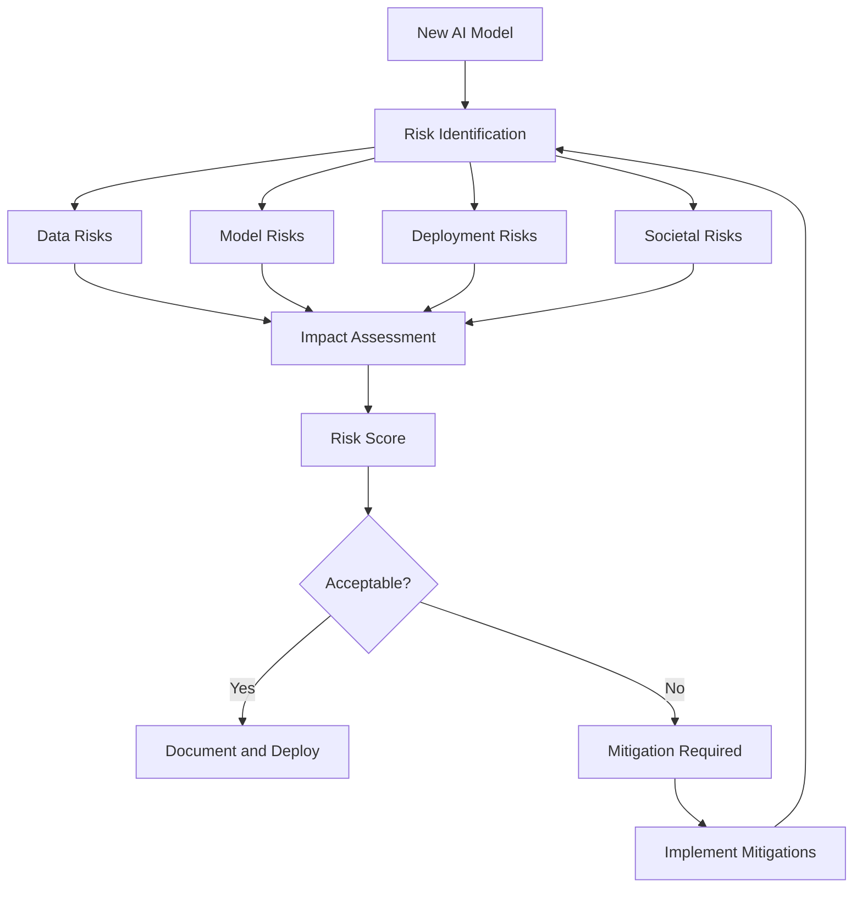

# How to Build an AI Risk Assessment Framework Using Google Cloud Responsible AI Tools

Author: [nawazdhandala](https://www.github.com/nawazdhandala)

Tags: GCP, Responsible AI, Risk Assessment, AI Safety, Vertex AI, Governance, Google Cloud

Description: Build a structured AI risk assessment framework using Google Cloud's responsible AI tools to evaluate and mitigate risks before deploying ML models.

---

Deploying an ML model without a risk assessment is like shipping software without testing. It might work fine, or it might cause real harm to real people. The EU AI Act, NIST AI Risk Management Framework, and various industry regulations all require documented risk assessments for AI systems. Google Cloud provides a set of responsible AI tools that make this process systematic rather than ad-hoc. Here is how to build a risk assessment framework using these tools.

## The Risk Assessment Framework

A good AI risk assessment covers four areas: what could go wrong (risk identification), how bad it would be (impact assessment), how likely it is (probability estimation), and what you are doing about it (mitigation).



## Step 1: Create the Risk Assessment Template

Build a structured assessment that gets filled in for every model before deployment:

```python
# risk_assessment.py - AI Risk Assessment Framework
from dataclasses import dataclass, field
from typing import List, Optional
from enum import Enum
from datetime import datetime
import json

class RiskLevel(Enum):
    LOW = "low"
    MEDIUM = "medium"
    HIGH = "high"
    CRITICAL = "critical"

class RiskCategory(Enum):
    DATA_QUALITY = "data_quality"
    BIAS_FAIRNESS = "bias_fairness"
    PRIVACY = "privacy"
    SAFETY = "safety"
    SECURITY = "security"
    RELIABILITY = "reliability"
    TRANSPARENCY = "transparency"
    ACCOUNTABILITY = "accountability"

@dataclass
class Risk:
    """A single identified risk with its assessment and mitigation plan."""
    category: RiskCategory
    description: str
    likelihood: RiskLevel
    impact: RiskLevel
    overall_risk: RiskLevel = None
    mitigation: str = ""
    residual_risk: RiskLevel = None
    owner: str = ""
    status: str = "identified"

    def __post_init__(self):
        # Calculate overall risk from likelihood and impact
        risk_matrix = {
            ("low", "low"): "low",
            ("low", "medium"): "low",
            ("low", "high"): "medium",
            ("low", "critical"): "medium",
            ("medium", "low"): "low",
            ("medium", "medium"): "medium",
            ("medium", "high"): "high",
            ("medium", "critical"): "high",
            ("high", "low"): "medium",
            ("high", "medium"): "high",
            ("high", "high"): "high",
            ("high", "critical"): "critical",
            ("critical", "low"): "medium",
            ("critical", "medium"): "high",
            ("critical", "high"): "critical",
            ("critical", "critical"): "critical",
        }
        if self.overall_risk is None:
            key = (self.likelihood.value, self.impact.value)
            self.overall_risk = RiskLevel(risk_matrix.get(key, "high"))


@dataclass
class AIRiskAssessment:
    """Complete risk assessment for an AI model or system."""
    model_name: str
    model_version: str
    assessment_date: str = field(default_factory=lambda: datetime.utcnow().isoformat())
    assessor: str = ""
    model_description: str = ""
    use_case: str = ""
    affected_populations: List[str] = field(default_factory=list)
    risks: List[Risk] = field(default_factory=list)
    approval_status: str = "pending"
    approver: str = ""

    def add_risk(self, risk: Risk):
        """Add an identified risk to the assessment."""
        self.risks.append(risk)

    def get_risk_summary(self):
        """Summarize risks by category and level."""
        summary = {"total": len(self.risks)}
        for level in RiskLevel:
            summary[level.value] = sum(
                1 for r in self.risks if r.overall_risk == level
            )
        return summary

    def is_deployable(self):
        """Check if the model can be deployed based on risk levels.
        No critical risks allowed; high risks must have mitigations."""
        critical_risks = [r for r in self.risks if r.overall_risk == RiskLevel.CRITICAL]
        if critical_risks:
            return False, "Critical risks must be resolved before deployment"

        unmitigated_high = [
            r for r in self.risks
            if r.overall_risk == RiskLevel.HIGH and r.status != "mitigated"
        ]
        if unmitigated_high:
            return False, f"{len(unmitigated_high)} high risks need mitigation plans"

        return True, "All deployment gates passed"

    def to_dict(self):
        """Serialize the assessment to a dictionary."""
        return {
            "model_name": self.model_name,
            "model_version": self.model_version,
            "assessment_date": self.assessment_date,
            "assessor": self.assessor,
            "model_description": self.model_description,
            "use_case": self.use_case,
            "affected_populations": self.affected_populations,
            "risk_summary": self.get_risk_summary(),
            "risks": [
                {
                    "category": r.category.value,
                    "description": r.description,
                    "likelihood": r.likelihood.value,
                    "impact": r.impact.value,
                    "overall_risk": r.overall_risk.value,
                    "mitigation": r.mitigation,
                    "residual_risk": r.residual_risk.value if r.residual_risk else None,
                    "owner": r.owner,
                    "status": r.status,
                }
                for r in self.risks
            ],
            "deployable": self.is_deployable(),
        }
```

## Step 2: Automate Data Risk Detection

Use Vertex AI and BigQuery to automatically detect data-related risks:

```python
# data_risk_detector.py - Automatically detect data risks
from google.cloud import bigquery
import pandas as pd

bq_client = bigquery.Client()

def detect_data_risks(dataset_uri):
    """Scan the training dataset for common data risks.
    Returns a list of Risk objects for any issues found."""

    risks = []

    # Load a sample of the data
    query = f"SELECT * FROM `{dataset_uri}` LIMIT 10000"
    df = bq_client.query(query).to_dataframe()

    # Check for class imbalance
    for col in df.select_dtypes(include=['object', 'bool']).columns:
        value_counts = df[col].value_counts(normalize=True)
        if value_counts.iloc[0] > 0.9:
            risks.append(Risk(
                category=RiskCategory.DATA_QUALITY,
                description=f"Severe class imbalance in column '{col}': {value_counts.iloc[0]:.1%} is one class",
                likelihood=RiskLevel.HIGH,
                impact=RiskLevel.MEDIUM,
                mitigation="Consider oversampling, undersampling, or class-weighted loss",
            ))

    # Check for missing values
    missing_pct = df.isnull().mean()
    for col, pct in missing_pct.items():
        if pct > 0.2:
            risks.append(Risk(
                category=RiskCategory.DATA_QUALITY,
                description=f"Column '{col}' has {pct:.1%} missing values",
                likelihood=RiskLevel.MEDIUM,
                impact=RiskLevel.MEDIUM,
                mitigation="Implement robust imputation or exclude column",
            ))

    # Check for potential proxy variables (correlated with sensitive attributes)
    sensitive_cols = [c for c in df.columns if any(
        term in c.lower() for term in ['gender', 'race', 'age', 'zip', 'postal']
    )]
    if sensitive_cols:
        risks.append(Risk(
            category=RiskCategory.BIAS_FAIRNESS,
            description=f"Potentially sensitive columns detected: {sensitive_cols}",
            likelihood=RiskLevel.HIGH,
            impact=RiskLevel.HIGH,
            mitigation="Review if these columns should be excluded or debiased",
        ))

    # Check dataset size
    total_rows = len(df)  # Note: this is sampled, check actual size
    if total_rows < 1000:
        risks.append(Risk(
            category=RiskCategory.RELIABILITY,
            description=f"Small dataset ({total_rows} rows sampled) may lead to unreliable model",
            likelihood=RiskLevel.MEDIUM,
            impact=RiskLevel.HIGH,
            mitigation="Collect more training data or use data augmentation",
        ))

    return risks
```

## Step 3: Automate Model Risk Detection

Use Vertex AI evaluation tools to detect model-level risks:

```python
# model_risk_detector.py - Detect model-level risks using Vertex AI
from google.cloud import aiplatform

def detect_model_risks(model_id):
    """Evaluate a trained model for common risks before deployment.
    Checks performance metrics, fairness, and robustness indicators."""

    risks = []

    model = aiplatform.Model(model_name=model_id)
    evaluations = list(model.list_model_evaluations())

    if not evaluations:
        risks.append(Risk(
            category=RiskCategory.RELIABILITY,
            description="No model evaluation found - model has not been evaluated on test data",
            likelihood=RiskLevel.HIGH,
            impact=RiskLevel.HIGH,
            mitigation="Run model evaluation on a representative test set",
        ))
        return risks

    metrics = evaluations[0].metrics

    # Check overall performance
    auc = metrics.get("auRoc", metrics.get("auPrc", 0))
    if auc < 0.7:
        risks.append(Risk(
            category=RiskCategory.RELIABILITY,
            description=f"Low model performance (AUC: {auc:.3f}). May not be reliable enough for production.",
            likelihood=RiskLevel.HIGH,
            impact=RiskLevel.HIGH,
            mitigation="Improve feature engineering, collect more data, or try different model type",
        ))

    # Check for overfitting indicators
    if "trainLoss" in metrics and "validationLoss" in metrics:
        train_loss = metrics["trainLoss"]
        val_loss = metrics["validationLoss"]
        if val_loss > train_loss * 1.5:
            risks.append(Risk(
                category=RiskCategory.RELIABILITY,
                description=f"Potential overfitting: validation loss ({val_loss:.4f}) significantly exceeds training loss ({train_loss:.4f})",
                likelihood=RiskLevel.MEDIUM,
                impact=RiskLevel.MEDIUM,
                mitigation="Add regularization, reduce model complexity, or collect more training data",
            ))

    # Check for calibration (if available)
    if metrics.get("logLoss", 0) > 0.7:
        risks.append(Risk(
            category=RiskCategory.RELIABILITY,
            description="High log loss suggests poor probability calibration",
            likelihood=RiskLevel.MEDIUM,
            impact=RiskLevel.MEDIUM,
            mitigation="Apply post-hoc calibration (Platt scaling or isotonic regression)",
        ))

    return risks
```

## Step 4: Generate the Complete Assessment

Combine automated detection with manual review:

```python
# run_assessment.py - Generate a complete risk assessment
def run_risk_assessment(model_name, model_version, model_id, dataset_uri, assessor):
    """Run the complete AI risk assessment pipeline.
    Combines automated risk detection with human oversight."""

    assessment = AIRiskAssessment(
        model_name=model_name,
        model_version=model_version,
        assessor=assessor,
        model_description="Loan approval prediction model using customer financial data",
        use_case="Pre-screen loan applications for automated and manual review",
        affected_populations=["Loan applicants", "Credit analysts", "Borrowers"],
    )

    # Automated data risk detection
    data_risks = detect_data_risks(dataset_uri)
    for risk in data_risks:
        assessment.add_risk(risk)

    # Automated model risk detection
    model_risks = detect_model_risks(model_id)
    for risk in model_risks:
        assessment.add_risk(risk)

    # Add manual risks that require human judgment
    assessment.add_risk(Risk(
        category=RiskCategory.SAFETY,
        description="Incorrect loan denials could cause financial harm to qualified applicants",
        likelihood=RiskLevel.MEDIUM,
        impact=RiskLevel.HIGH,
        mitigation="Human review required for all denied applications above a score threshold",
        owner="Risk Engineering Team",
    ))

    assessment.add_risk(Risk(
        category=RiskCategory.TRANSPARENCY,
        description="Applicants may not understand why their application was denied",
        likelihood=RiskLevel.HIGH,
        impact=RiskLevel.MEDIUM,
        mitigation="Implement Explainable AI to provide feature-level explanations with each decision",
        owner="ML Platform Team",
    ))

    # Check if the model can be deployed
    deployable, reason = assessment.is_deployable()
    assessment.approval_status = "approved" if deployable else "blocked"

    print(f"\nRisk Assessment Summary for {model_name} {model_version}")
    print(f"Total risks identified: {len(assessment.risks)}")
    summary = assessment.get_risk_summary()
    for level in ["critical", "high", "medium", "low"]:
        print(f"  {level.capitalize()}: {summary[level]}")
    print(f"\nDeployment status: {assessment.approval_status} - {reason}")

    return assessment
```

## Step 5: Store and Track Assessments

Persist assessments in BigQuery for audit trails and trend analysis:

```python
# Store the assessment in BigQuery
from google.cloud import bigquery
import json

def store_assessment(assessment):
    """Store the risk assessment in BigQuery for long-term tracking."""
    bq_client = bigquery.Client()

    record = {
        "assessment_date": assessment.assessment_date,
        "model_name": assessment.model_name,
        "model_version": assessment.model_version,
        "assessor": assessment.assessor,
        "total_risks": len(assessment.risks),
        "critical_risks": sum(1 for r in assessment.risks if r.overall_risk == RiskLevel.CRITICAL),
        "high_risks": sum(1 for r in assessment.risks if r.overall_risk == RiskLevel.HIGH),
        "approval_status": assessment.approval_status,
        "full_assessment": json.dumps(assessment.to_dict()),
    }

    table_ref = bq_client.dataset("ai_governance").table("risk_assessments")
    bq_client.insert_rows_json(table_ref, [record])
```

Query for governance dashboards:

```sql
-- Track risk assessment trends across models and time
SELECT
    model_name,
    model_version,
    assessment_date,
    total_risks,
    critical_risks,
    high_risks,
    approval_status
FROM `your-project.ai_governance.risk_assessments`
ORDER BY assessment_date DESC;

-- Models with the most unresolved high-risk findings
SELECT
    model_name,
    SUM(high_risks + critical_risks) AS severe_risks,
    COUNTIF(approval_status = 'blocked') AS blocked_deployments
FROM `your-project.ai_governance.risk_assessments`
WHERE assessment_date > TIMESTAMP_SUB(CURRENT_TIMESTAMP(), INTERVAL 90 DAY)
GROUP BY model_name
ORDER BY severe_risks DESC;
```

## Integrating into CI/CD

Make risk assessment a required step in your model deployment pipeline:

```python
# deployment_gate.py - Risk assessment as a deployment gate
def deployment_gate(model_name, model_version, model_id, dataset_uri):
    """Run risk assessment and block deployment if risks are not acceptable.
    This function is called as part of the CI/CD pipeline."""

    assessment = run_risk_assessment(
        model_name=model_name,
        model_version=model_version,
        model_id=model_id,
        dataset_uri=dataset_uri,
        assessor="automated-pipeline",
    )

    store_assessment(assessment)

    deployable, reason = assessment.is_deployable()
    if not deployable:
        raise Exception(f"Deployment blocked: {reason}")

    return assessment
```

## Monitoring

Use OneUptime to monitor the risk assessment pipeline itself. Alert on assessment failures, track deployment gate pass/fail rates, and monitor for models that are deployed without completing their risk assessments. The worst outcome is having a governance framework that gets silently bypassed.

## Summary

Building an AI risk assessment framework is about making risk evaluation systematic and repeatable rather than something that happens in a meeting once. By combining automated risk detection (data quality, model performance, bias) with structured manual assessment (safety, transparency, accountability), you get a comprehensive view of the risks each model introduces. Storing assessments in BigQuery creates the audit trail that regulators and compliance teams need, and integrating the assessment as a deployment gate ensures no model goes to production without being reviewed.
