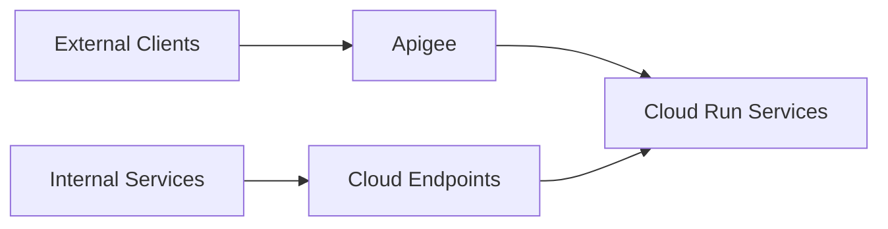

# How to Build an API Gateway for GCP Microservices Using Apigee and Cloud Endpoints

Author: [nawazdhandala](https://www.github.com/nawazdhandala)

Tags: GCP, Apigee, Cloud Endpoints, API Gateway, Microservices, API Management

Description: Learn how to build an API gateway for your GCP microservices using Apigee for full API management and Cloud Endpoints for lightweight API proxying.

---

When you have multiple microservices, clients should not need to know about each service individually. An API gateway sits between your clients and your backend services, handling routing, authentication, rate limiting, and monitoring in one place.

GCP offers two main options for API gateways: Apigee and Cloud Endpoints. They serve different needs. Apigee is a full-featured API management platform with developer portals, analytics, and monetization. Cloud Endpoints is a lighter-weight option that integrates tightly with Cloud Run and GKE. Understanding when to use each one and how to set them up is what this post covers.

## Cloud Endpoints - The Lightweight Option

Cloud Endpoints is built on the Extensible Service Proxy (ESP) and works well when you need basic API management without the overhead of a full API platform.

### Setting Up Cloud Endpoints with Cloud Run

First, create an OpenAPI specification for your API.

```yaml
# openapi-spec.yaml - OpenAPI 2.0 specification for Cloud Endpoints
swagger: "2.0"
info:
  title: "My Microservices API"
  description: "API Gateway for backend microservices"
  version: "1.0.0"
host: "api-gateway-xxxxx-uc.a.run.app"
x-google-endpoints:
  - name: "api-gateway-xxxxx-uc.a.run.app"
    allowCors: true
basePath: "/"
schemes:
  - "https"
consumes:
  - "application/json"
produces:
  - "application/json"

paths:
  /api/users:
    get:
      summary: "List users"
      operationId: "listUsers"
      x-google-backend:
        address: "https://user-service-xxxxx-uc.a.run.app"
        path_translation: APPEND_PATH_TO_ADDRESS
      responses:
        200:
          description: "Successful response"

  /api/users/{userId}:
    get:
      summary: "Get user by ID"
      operationId: "getUser"
      x-google-backend:
        address: "https://user-service-xxxxx-uc.a.run.app"
        path_translation: APPEND_PATH_TO_ADDRESS
      parameters:
        - name: userId
          in: path
          required: true
          type: string
      responses:
        200:
          description: "Successful response"

  /api/orders:
    get:
      summary: "List orders"
      operationId: "listOrders"
      x-google-backend:
        address: "https://order-service-xxxxx-uc.a.run.app"
        path_translation: APPEND_PATH_TO_ADDRESS
      responses:
        200:
          description: "Successful response"

  /health:
    get:
      summary: "Health check"
      operationId: "healthCheck"
      responses:
        200:
          description: "Service is healthy"
```

Deploy the API configuration.

```bash
# Deploy the OpenAPI spec to create the Endpoints service
gcloud endpoints services deploy openapi-spec.yaml
```

### Deploying ESP as a Cloud Run Service

Cloud Endpoints uses ESPv2 as a proxy. Deploy it as a Cloud Run service.

```bash
# Build the ESPv2 image with your API configuration
gcloud run deploy api-gateway \
    --image="gcr.io/endpoints-release/endpoints-runtime-serverless:2" \
    --region=us-central1 \
    --platform=managed \
    --allow-unauthenticated \
    --set-env-vars="ESPv2_ARGS=--cors_preset=basic"
```

For more control, create a custom Cloud Run configuration.

```yaml
# cloud-run-endpoints.yaml
apiVersion: serving.knative.dev/v1
kind: Service
metadata:
  name: api-gateway
spec:
  template:
    spec:
      containers:
        - image: gcr.io/endpoints-release/endpoints-runtime-serverless:2
          env:
            - name: ESPv2_ARGS
              value: >-
                --cors_preset=basic
                --rollout_strategy=managed
```

### Adding Authentication with Cloud Endpoints

Cloud Endpoints supports API key authentication and JWT-based authentication.

```yaml
# openapi-spec.yaml - With API key authentication
securityDefinitions:
  api_key:
    type: apiKey
    name: key
    in: query

# Apply API key requirement to all endpoints
security:
  - api_key: []

paths:
  /api/users:
    get:
      summary: "List users"
      operationId: "listUsers"
      security:
        - api_key: []
      x-google-backend:
        address: "https://user-service-xxxxx-uc.a.run.app"
```

For JWT authentication with Firebase or Google Identity Platform:

```yaml
# openapi-spec.yaml - With JWT authentication
securityDefinitions:
  firebase:
    authorizationUrl: ""
    flow: "implicit"
    type: "oauth2"
    x-google-issuer: "https://securetoken.google.com/my-project"
    x-google-jwks_uri: "https://www.googleapis.com/service_accounts/v1/metadata/x509/securetoken@system.gserviceaccount.com"
    x-google-audiences: "my-project"

security:
  - firebase: []
```

## Apigee - The Full API Management Platform

Apigee is for organizations that need comprehensive API management: developer portals, analytics dashboards, monetization, and complex routing policies.

### Setting Up Apigee

```bash
# Provision Apigee (this creates a full Apigee organization)
gcloud apigee organizations provision \
    --project=my-project \
    --authorized-network=default \
    --runtime-location=us-central1 \
    --analytics-region=us-central1

# Create an environment
gcloud apigee environments create dev \
    --organization=my-project \
    --display-name="Development"
```

### Creating an API Proxy in Apigee

An API proxy in Apigee defines how requests are routed and what policies are applied.

```xml
<!-- apiproxy/proxies/default.xml - Proxy endpoint configuration -->
<ProxyEndpoint name="default">
    <PreFlow name="PreFlow">
        <Request>
            <!-- Apply rate limiting -->
            <Step>
                <Name>SpikeArrest</Name>
            </Step>
            <!-- Verify API key -->
            <Step>
                <Name>VerifyAPIKey</Name>
            </Step>
        </Request>
    </PreFlow>

    <Flows>
        <!-- Route /users requests to the user service -->
        <Flow name="GetUsers">
            <Condition>(proxy.pathsuffix MatchesPath "/api/users") and (request.verb = "GET")</Condition>
            <Request/>
            <Response/>
        </Flow>

        <!-- Route /orders requests to the order service -->
        <Flow name="GetOrders">
            <Condition>(proxy.pathsuffix MatchesPath "/api/orders") and (request.verb = "GET")</Condition>
            <Request/>
            <Response/>
        </Flow>
    </Flows>

    <HTTPProxyConnection>
        <BasePath>/v1</BasePath>
        <VirtualHost>secure</VirtualHost>
    </HTTPProxyConnection>

    <RouteRule name="UserServiceRoute">
        <Condition>(proxy.pathsuffix MatchesPath "/api/users/**")</Condition>
        <TargetEndpoint>user-service</TargetEndpoint>
    </RouteRule>

    <RouteRule name="OrderServiceRoute">
        <Condition>(proxy.pathsuffix MatchesPath "/api/orders/**")</Condition>
        <TargetEndpoint>order-service</TargetEndpoint>
    </RouteRule>
</ProxyEndpoint>
```

```xml
<!-- apiproxy/targets/user-service.xml - Target endpoint for user service -->
<TargetEndpoint name="user-service">
    <HTTPTargetConnection>
        <URL>https://user-service-xxxxx-uc.a.run.app</URL>
        <SSLInfo>
            <Enabled>true</Enabled>
        </SSLInfo>
    </HTTPTargetConnection>
</TargetEndpoint>
```

### Rate Limiting Policy

```xml
<!-- apiproxy/policies/SpikeArrest.xml - Rate limiting policy -->
<SpikeArrest name="SpikeArrest">
    <Rate>100ps</Rate>  <!-- 100 requests per second -->
    <UseEffectiveCount>true</UseEffectiveCount>
</SpikeArrest>
```

### API Key Verification Policy

```xml
<!-- apiproxy/policies/VerifyAPIKey.xml -->
<VerifyAPIKey name="VerifyAPIKey">
    <APIKey ref="request.queryparam.apikey"/>
</VerifyAPIKey>
```

### Deploying the API Proxy

```bash
# Deploy the API proxy to the dev environment
gcloud apigee apis create my-api --project=my-project
gcloud apigee apis deploy --name=my-api \
    --environment=dev \
    --organization=my-project
```

## Comparing Cloud Endpoints and Apigee

Here is when to use which.

**Choose Cloud Endpoints when:**
- You need a simple API proxy with basic authentication
- Your APIs are internal or have a limited audience
- You want minimal management overhead
- Budget is a primary concern

**Choose Apigee when:**
- You need a developer portal for external API consumers
- You need detailed API analytics and monitoring
- You need complex traffic management policies
- You plan to monetize your APIs
- You need advanced security features like OAuth 2.0 flows

## A Hybrid Approach

Many organizations use both. Cloud Endpoints handles internal service-to-service communication, while Apigee manages external-facing APIs.



## Adding Monitoring

Both options integrate with Cloud Monitoring.

```bash
# View Endpoints metrics
gcloud monitoring dashboards create \
    --config-from-file=endpoints-dashboard.json

# View Apigee analytics
gcloud apigee analytics query \
    --organization=my-project \
    --environment=dev \
    --metrics=message_count,response_time \
    --dimensions=apiproxy \
    --time-range="last_7_days"
```

## Wrapping Up

GCP gives you two strong options for API gateways. Cloud Endpoints is the right choice for most internal APIs and simpler use cases - it is easy to set up and integrates natively with Cloud Run. Apigee is the answer when you need full API lifecycle management with developer portals, analytics, and policy enforcement. Both options centralize your API management, which means your microservices can focus on business logic while the gateway handles the cross-cutting concerns.
