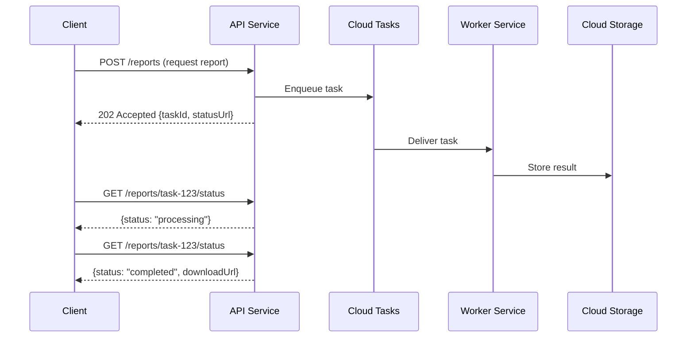

# How to Build an Asynchronous Request-Reply Pattern Using Cloud Tasks and Cloud Run

Author: [nawazdhandala](https://www.github.com/nawazdhandala)

Tags: GCP, Cloud Tasks, Cloud Run, Async Patterns, Microservices, Serverless

Description: Implement the asynchronous request-reply pattern on Google Cloud using Cloud Tasks for reliable task processing and Cloud Run for scalable service endpoints.

---

Some operations just take too long for a synchronous HTTP request. Generating a PDF report, processing a large dataset, running a machine learning inference job - these can take seconds or even minutes. Making the client wait that long is a bad user experience, and it wastes server resources holding the connection open. The asynchronous request-reply pattern solves this by accepting the request immediately, processing it in the background, and providing a way for the client to check the result later.

On Google Cloud, Cloud Tasks and Cloud Run make an excellent combination for this pattern. Cloud Tasks handles the reliable queuing and delivery of work items, while Cloud Run provides the serverless compute for both the API layer and the background workers.

## How the Pattern Works

The client sends a request to the API, which returns immediately with a task ID and a polling URL. The API enqueues the actual work as a Cloud Task. A worker service picks up the task, processes it, and stores the result. The client polls the status endpoint until the result is ready.



## Setting Up Cloud Tasks

Create a Cloud Tasks queue with appropriate rate limits and retry settings.

```bash
# Create a queue for report generation tasks
gcloud tasks queues create report-generation \
  --location=us-central1 \
  --max-dispatches-per-second=10 \
  --max-concurrent-dispatches=5 \
  --max-attempts=3 \
  --min-backoff=10s \
  --max-backoff=300s

# Verify the queue was created
gcloud tasks queues describe report-generation --location=us-central1
```

## Building the API Service

The API service accepts requests and enqueues work items. It returns immediately so the client does not have to wait.

```python
# api-service/main.py
import os
import uuid
import json
from datetime import datetime
from flask import Flask, request, jsonify
from google.cloud import tasks_v2
from google.cloud import firestore
from google.protobuf import timestamp_pb2

app = Flask(__name__)
db = firestore.Client()

# Cloud Tasks client setup
tasks_client = tasks_v2.CloudTasksClient()
project = os.environ['PROJECT_ID']
location = os.environ.get('LOCATION', 'us-central1')
queue = 'report-generation'
worker_url = os.environ['WORKER_URL']

@app.route('/reports', methods=['POST'])
def create_report():
    """Accept a report request and enqueue it for async processing."""
    data = request.get_json()

    # Generate a unique task ID
    task_id = f'report-{uuid.uuid4().hex[:12]}'

    # Store the initial task status in Firestore
    db.collection('tasks').document(task_id).set({
        'task_id': task_id,
        'type': data.get('report_type', 'summary'),
        'parameters': data.get('parameters', {}),
        'status': 'queued',
        'created_at': datetime.utcnow().isoformat(),
        'updated_at': datetime.utcnow().isoformat(),
    })

    # Create the Cloud Task
    parent = tasks_client.queue_path(project, location, queue)
    task = {
        'http_request': {
            'http_method': tasks_v2.HttpMethod.POST,
            'url': f'{worker_url}/process',
            'headers': {'Content-Type': 'application/json'},
            'body': json.dumps({
                'task_id': task_id,
                'report_type': data.get('report_type', 'summary'),
                'parameters': data.get('parameters', {}),
            }).encode(),
        },
        'name': f'{parent}/tasks/{task_id}',
    }

    # Set a deadline if the task should not run after a certain time
    if data.get('deadline_seconds'):
        deadline = timestamp_pb2.Timestamp()
        deadline.FromSeconds(
            int(datetime.utcnow().timestamp()) + data['deadline_seconds']
        )
        task['schedule_time'] = deadline

    tasks_client.create_task(request={'parent': parent, 'task': task})

    # Return immediately with the task ID and a status URL
    return jsonify({
        'task_id': task_id,
        'status': 'queued',
        'status_url': f'/reports/{task_id}/status',
    }), 202

@app.route('/reports/<task_id>/status', methods=['GET'])
def check_status(task_id):
    """Check the status of an async report task."""
    doc = db.collection('tasks').document(task_id).get()

    if not doc.exists:
        return jsonify({'error': 'Task not found'}), 404

    task_data = doc.to_dict()
    response = {
        'task_id': task_id,
        'status': task_data['status'],
        'created_at': task_data['created_at'],
    }

    # Include the download URL if the task is completed
    if task_data['status'] == 'completed':
        response['download_url'] = task_data.get('result_url')
        response['completed_at'] = task_data.get('completed_at')

    # Include error details if the task failed
    if task_data['status'] == 'failed':
        response['error'] = task_data.get('error_message')

    return jsonify(response), 200

if __name__ == '__main__':
    app.run(host='0.0.0.0', port=int(os.environ.get('PORT', 8080)))
```

## Building the Worker Service

The worker service receives tasks from Cloud Tasks and does the actual processing.

```python
# worker-service/main.py
import os
import io
import json
from datetime import datetime
from flask import Flask, request, jsonify
from google.cloud import firestore
from google.cloud import storage
import pandas as pd

app = Flask(__name__)
db = firestore.Client()
storage_client = storage.Client()
bucket_name = os.environ.get('RESULTS_BUCKET', 'my-project-report-results')

@app.route('/process', methods=['POST'])
def process_task():
    """Process a report generation task delivered by Cloud Tasks."""
    data = request.get_json()
    task_id = data['task_id']

    # Update status to processing
    db.collection('tasks').document(task_id).update({
        'status': 'processing',
        'started_at': datetime.utcnow().isoformat(),
        'updated_at': datetime.utcnow().isoformat(),
    })

    try:
        # Generate the report based on the type
        report_type = data['report_type']
        parameters = data.get('parameters', {})

        if report_type == 'summary':
            result = generate_summary_report(parameters)
        elif report_type == 'detailed':
            result = generate_detailed_report(parameters)
        else:
            raise ValueError(f'Unknown report type: {report_type}')

        # Upload the result to Cloud Storage
        bucket = storage_client.bucket(bucket_name)
        blob = bucket.blob(f'reports/{task_id}.csv')
        blob.upload_from_string(result, content_type='text/csv')

        # Generate a signed URL valid for 24 hours
        signed_url = blob.generate_signed_url(
            version='v4',
            expiration=86400,  # 24 hours
            method='GET',
        )

        # Update task status to completed
        db.collection('tasks').document(task_id).update({
            'status': 'completed',
            'result_url': signed_url,
            'completed_at': datetime.utcnow().isoformat(),
            'updated_at': datetime.utcnow().isoformat(),
        })

        return jsonify({'status': 'completed'}), 200

    except Exception as e:
        # Update task status to failed
        db.collection('tasks').document(task_id).update({
            'status': 'failed',
            'error_message': str(e),
            'updated_at': datetime.utcnow().isoformat(),
        })

        # Return 200 to prevent Cloud Tasks from retrying
        # (or return 5xx if you want automatic retries)
        return jsonify({'status': 'failed', 'error': str(e)}), 200

def generate_summary_report(parameters):
    """Generate a summary report - replace with your actual logic."""
    # Simulating report generation
    data = {
        'metric': ['Revenue', 'Users', 'Orders'],
        'value': [150000, 25000, 8500],
        'change': ['+12%', '+8%', '+15%'],
    }
    df = pd.DataFrame(data)
    return df.to_csv(index=False)

def generate_detailed_report(parameters):
    """Generate a detailed report - replace with your actual logic."""
    # Your detailed report logic here
    return "id,name,value\n1,item1,100\n2,item2,200"

if __name__ == '__main__':
    app.run(host='0.0.0.0', port=int(os.environ.get('PORT', 8080)))
```

## Adding Webhook Callbacks

Instead of making clients poll, you can support webhook callbacks so the client gets notified when the task is done.

```python
# Add callback support to the worker
import requests

def notify_callback(task_id, callback_url, status, result_url=None):
    """Send a webhook notification when the task completes."""
    payload = {
        'task_id': task_id,
        'status': status,
        'completed_at': datetime.utcnow().isoformat(),
    }
    if result_url:
        payload['result_url'] = result_url

    try:
        response = requests.post(
            callback_url,
            json=payload,
            headers={'Content-Type': 'application/json'},
            timeout=10,
        )
        response.raise_for_status()
    except Exception as e:
        # Log but do not fail the task if callback delivery fails
        print(f'Callback delivery failed for task {task_id}: {e}')
```

Update the API to accept a callback URL.

```python
@app.route('/reports', methods=['POST'])
def create_report_with_callback():
    data = request.get_json()
    task_id = f'report-{uuid.uuid4().hex[:12]}'

    # Store the callback URL with the task
    task_doc = {
        'task_id': task_id,
        'status': 'queued',
        'callback_url': data.get('callback_url'),  # Optional webhook URL
        'created_at': datetime.utcnow().isoformat(),
    }
    db.collection('tasks').document(task_id).set(task_doc)

    # ... enqueue the task as before
```

## Deploying the Services

```bash
# Deploy the API service
gcloud run deploy report-api \
  --source=./api-service \
  --region=us-central1 \
  --allow-unauthenticated \
  --set-env-vars="PROJECT_ID=my-project,WORKER_URL=https://report-worker-xxxx.run.app"

# Deploy the worker service (not publicly accessible)
gcloud run deploy report-worker \
  --source=./worker-service \
  --region=us-central1 \
  --no-allow-unauthenticated \
  --set-env-vars="RESULTS_BUCKET=my-project-report-results" \
  --memory=1Gi \
  --timeout=300

# Grant Cloud Tasks permission to invoke the worker
gcloud run services add-iam-policy-binding report-worker \
  --region=us-central1 \
  --member="serviceAccount:my-project@appspot.gserviceaccount.com" \
  --role="roles/run.invoker"
```

## Client-Side Implementation

Here is how a client would use this async API.

```javascript
// Client code using the async request-reply pattern
async function generateReport(reportType, parameters) {
  // Step 1: Submit the request
  const response = await fetch('https://report-api-xxxx.run.app/reports', {
    method: 'POST',
    headers: { 'Content-Type': 'application/json' },
    body: JSON.stringify({ report_type: reportType, parameters }),
  });

  const { task_id, status_url } = await response.json();
  console.log(`Task submitted: ${task_id}`);

  // Step 2: Poll for the result with exponential backoff
  let delay = 1000;  // Start with 1 second
  const maxDelay = 30000;  // Cap at 30 seconds

  while (true) {
    await new Promise(resolve => setTimeout(resolve, delay));

    const statusResponse = await fetch(`https://report-api-xxxx.run.app${status_url}`);
    const statusData = await statusResponse.json();

    if (statusData.status === 'completed') {
      console.log(`Report ready: ${statusData.download_url}`);
      return statusData;
    }

    if (statusData.status === 'failed') {
      throw new Error(`Report generation failed: ${statusData.error}`);
    }

    // Increase the delay but cap it
    delay = Math.min(delay * 1.5, maxDelay);
    console.log(`Still processing, checking again in ${delay / 1000}s...`);
  }
}
```

## Wrapping Up

The async request-reply pattern is essential for any operation that takes more than a few seconds. Cloud Tasks gives you reliable delivery with automatic retries, rate limiting, and scheduling. Cloud Run scales your workers based on demand. The combination handles everything from a few tasks per hour to thousands per minute without you managing any infrastructure.

Make sure to monitor your task queue depth, processing times, and failure rates. OneUptime can help you set up alerts when tasks are backing up in the queue or when worker failure rates exceed your threshold, helping you catch processing bottlenecks before they impact your users.
