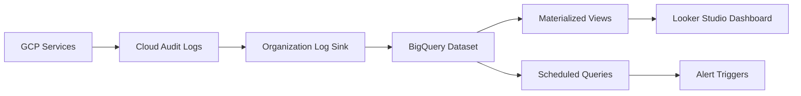

# How to Build an Audit Log Analysis Pipeline with BigQuery and Looker Studio on GCP

Author: [nawazdhandala](https://www.github.com/nawazdhandala)

Tags: GCP, Audit Logs, BigQuery, Looker Studio, Security Analytics

Description: Learn how to build a complete audit log analysis pipeline on Google Cloud, routing logs to BigQuery and creating Looker Studio dashboards for security monitoring and compliance.

---

Cloud Audit Logs contain a goldmine of security and operational intelligence. Every API call, every resource change, every authentication event is recorded. But raw audit logs in Cloud Logging are hard to query at scale, expire after a retention period, and are not easy to visualize. By routing them to BigQuery, you unlock SQL-based analysis, long-term retention, and the ability to build dashboards in Looker Studio that give your team real-time visibility into what is happening across your GCP organization.

This guide covers setting up the full pipeline from log export through analysis and visualization.

## Architecture

The pipeline is straightforward. Cloud Audit Logs are generated by GCP services. Organization-level log sinks route them to BigQuery. BigQuery stores and enables SQL analysis. Looker Studio connects to BigQuery for visualization. Cloud Scheduler triggers periodic analysis queries.



## Step 1: Create the BigQuery Dataset

Set up a dedicated dataset for audit logs with appropriate access controls and long retention.

```bash
# Create a BigQuery dataset in the audit project
bq mk --dataset \
  --location=US \
  --default_table_expiration=0 \
  --description="Organization-wide Cloud Audit Logs" \
  --label=purpose:security \
  audit-project:org_audit_logs

# Set access controls - only security team can query
bq update --set_label purpose:security \
  audit-project:org_audit_logs
```

## Step 2: Create Organization-Level Log Sinks

Route audit logs from every project in your organization to the central BigQuery dataset.

```bash
# Create a sink for Admin Activity logs
gcloud logging sinks create org-admin-activity-sink \
  --organization=ORG_ID \
  --log-filter='logName:"cloudaudit.googleapis.com/activity"' \
  --destination="bigquery.googleapis.com/projects/audit-project/datasets/org_audit_logs" \
  --include-children \
  --use-partitioned-tables

# Create a sink for Data Access logs
gcloud logging sinks create org-data-access-sink \
  --organization=ORG_ID \
  --log-filter='logName:"cloudaudit.googleapis.com/data_access"' \
  --destination="bigquery.googleapis.com/projects/audit-project/datasets/org_audit_logs" \
  --include-children \
  --use-partitioned-tables

# Create a sink for System Event logs
gcloud logging sinks create org-system-events-sink \
  --organization=ORG_ID \
  --log-filter='logName:"cloudaudit.googleapis.com/system_event"' \
  --destination="bigquery.googleapis.com/projects/audit-project/datasets/org_audit_logs" \
  --include-children \
  --use-partitioned-tables

# Grant the sink service accounts write access to BigQuery
for SINK_NAME in org-admin-activity-sink org-data-access-sink org-system-events-sink; do
  SINK_SA=$(gcloud logging sinks describe $SINK_NAME \
    --organization=ORG_ID \
    --format="value(writerIdentity)")

  bq add-iam-policy-binding \
    --member="$SINK_SA" \
    --role="roles/bigquery.dataEditor" \
    audit-project:org_audit_logs
done
```

## Step 3: Create Useful Materialized Views

Raw audit log tables are complex. Create materialized views that simplify common queries.

```sql
-- View: User activity summary
-- Tracks what each user has been doing across the organization
CREATE MATERIALIZED VIEW `audit-project.org_audit_logs.user_activity_summary`
PARTITION BY DATE(timestamp)
CLUSTER BY principal_email
AS
SELECT
    timestamp,
    protopayload_auditlog.authenticationInfo.principalEmail AS principal_email,
    protopayload_auditlog.methodName AS method,
    protopayload_auditlog.serviceName AS service,
    resource.type AS resource_type,
    resource.labels.project_id AS project_id,
    protopayload_auditlog.requestMetadata.callerIp AS source_ip,
    protopayload_auditlog.requestMetadata.callerSuppliedUserAgent AS user_agent,
    protopayload_auditlog.status.code AS status_code,
    protopayload_auditlog.status.message AS status_message,
    severity
FROM `audit-project.org_audit_logs.cloudaudit_googleapis_com_activity_*`
WHERE _TABLE_SUFFIX >= FORMAT_DATE('%Y%m%d', DATE_SUB(CURRENT_DATE(), INTERVAL 90 DAY));
```

```sql
-- View: IAM changes tracking
-- Shows all IAM policy modifications
CREATE MATERIALIZED VIEW `audit-project.org_audit_logs.iam_changes`
PARTITION BY DATE(timestamp)
AS
SELECT
    timestamp,
    protopayload_auditlog.authenticationInfo.principalEmail AS actor,
    protopayload_auditlog.methodName AS method,
    resource.labels.project_id AS project,
    protopayload_auditlog.resourceName AS resource,
    protopayload_auditlog.requestMetadata.callerIp AS source_ip,
    JSON_EXTRACT(protopayload_auditlog.request, '$.policy') AS new_policy,
    severity
FROM `audit-project.org_audit_logs.cloudaudit_googleapis_com_activity_*`
WHERE protopayload_auditlog.methodName LIKE '%SetIamPolicy%'
AND _TABLE_SUFFIX >= FORMAT_DATE('%Y%m%d', DATE_SUB(CURRENT_DATE(), INTERVAL 90 DAY));
```

## Step 4: Write Analysis Queries

Here are the most useful analysis queries for security monitoring.

```sql
-- Find failed authentication attempts (potential brute force)
SELECT
    protopayload_auditlog.authenticationInfo.principalEmail AS user,
    protopayload_auditlog.requestMetadata.callerIp AS ip,
    COUNT(*) AS failed_attempts,
    MIN(timestamp) AS first_attempt,
    MAX(timestamp) AS last_attempt
FROM `audit-project.org_audit_logs.cloudaudit_googleapis_com_activity_*`
WHERE protopayload_auditlog.status.code != 0
AND protopayload_auditlog.methodName LIKE '%Login%'
AND _TABLE_SUFFIX >= FORMAT_DATE('%Y%m%d', DATE_SUB(CURRENT_DATE(), INTERVAL 7 DAY))
GROUP BY user, ip
HAVING failed_attempts > 5
ORDER BY failed_attempts DESC;
```

```sql
-- Detect unusual service account usage (activity from unexpected IPs)
WITH sa_baseline AS (
    SELECT
        protopayload_auditlog.authenticationInfo.principalEmail AS sa_email,
        protopayload_auditlog.requestMetadata.callerIp AS ip,
        COUNT(*) AS request_count
    FROM `audit-project.org_audit_logs.cloudaudit_googleapis_com_activity_*`
    WHERE protopayload_auditlog.authenticationInfo.principalEmail LIKE '%gserviceaccount.com'
    AND _TABLE_SUFFIX >= FORMAT_DATE('%Y%m%d', DATE_SUB(CURRENT_DATE(), INTERVAL 30 DAY))
    AND _TABLE_SUFFIX < FORMAT_DATE('%Y%m%d', DATE_SUB(CURRENT_DATE(), INTERVAL 7 DAY))
    GROUP BY sa_email, ip
),
sa_recent AS (
    SELECT
        protopayload_auditlog.authenticationInfo.principalEmail AS sa_email,
        protopayload_auditlog.requestMetadata.callerIp AS ip,
        COUNT(*) AS request_count
    FROM `audit-project.org_audit_logs.cloudaudit_googleapis_com_activity_*`
    WHERE protopayload_auditlog.authenticationInfo.principalEmail LIKE '%gserviceaccount.com'
    AND _TABLE_SUFFIX >= FORMAT_DATE('%Y%m%d', DATE_SUB(CURRENT_DATE(), INTERVAL 7 DAY))
    GROUP BY sa_email, ip
)
SELECT
    r.sa_email,
    r.ip AS new_ip,
    r.request_count
FROM sa_recent r
LEFT JOIN sa_baseline b ON r.sa_email = b.sa_email AND r.ip = b.ip
WHERE b.ip IS NULL
ORDER BY r.request_count DESC;
```

```sql
-- Track resource deletion events (potential destructive activity)
SELECT
    timestamp,
    protopayload_auditlog.authenticationInfo.principalEmail AS actor,
    protopayload_auditlog.methodName AS method,
    protopayload_auditlog.resourceName AS resource,
    resource.labels.project_id AS project,
    protopayload_auditlog.requestMetadata.callerIp AS source_ip
FROM `audit-project.org_audit_logs.cloudaudit_googleapis_com_activity_*`
WHERE (
    protopayload_auditlog.methodName LIKE '%delete%' OR
    protopayload_auditlog.methodName LIKE '%Delete%' OR
    protopayload_auditlog.methodName LIKE '%destroy%'
)
AND _TABLE_SUFFIX >= FORMAT_DATE('%Y%m%d', DATE_SUB(CURRENT_DATE(), INTERVAL 7 DAY))
ORDER BY timestamp DESC
LIMIT 100;
```

## Step 5: Set Up Scheduled Queries for Alerting

Run detection queries on a schedule and send results to a separate table for alerting.

```bash
# Create a scheduled query that runs every hour looking for suspicious activity
bq query --use_legacy_sql=false --schedule="every 1 hours" \
  --display_name="Hourly Security Scan" \
  --destination_table="audit-project:org_audit_logs.security_alerts" \
  --append_table=true \
  '
  SELECT
    CURRENT_TIMESTAMP() AS detected_at,
    "UNUSUAL_SA_IP" AS alert_type,
    r.sa_email AS principal,
    r.ip AS suspicious_ip,
    r.request_count AS event_count
  FROM (
    SELECT
      protopayload_auditlog.authenticationInfo.principalEmail AS sa_email,
      protopayload_auditlog.requestMetadata.callerIp AS ip,
      COUNT(*) AS request_count
    FROM `audit-project.org_audit_logs.cloudaudit_googleapis_com_activity_*`
    WHERE protopayload_auditlog.authenticationInfo.principalEmail LIKE "%gserviceaccount.com"
    AND _TABLE_SUFFIX >= FORMAT_DATE("%Y%m%d", DATE_SUB(CURRENT_DATE(), INTERVAL 1 DAY))
    GROUP BY sa_email, ip
  ) r
  WHERE r.ip NOT IN ("private", "gce-internal")
  AND r.request_count > 100
  '
```

## Step 6: Build the Looker Studio Dashboard

Connect Looker Studio to your BigQuery views to create visual dashboards. Here are the key panels to include.

The activity heatmap shows activity volume by hour and day of week, making unusual patterns immediately visible. The top actors panel shows which users and service accounts are most active. The IAM changes timeline tracks every permission change over time. The failed operations panel highlights authentication failures and permission denied errors. The resource deletion tracker shows all destructive operations.

```sql
-- Query for the activity heatmap
-- Use this as a data source in Looker Studio
SELECT
    EXTRACT(DAYOFWEEK FROM timestamp) AS day_of_week,
    EXTRACT(HOUR FROM timestamp) AS hour_of_day,
    COUNT(*) AS event_count
FROM `audit-project.org_audit_logs.cloudaudit_googleapis_com_activity_*`
WHERE _TABLE_SUFFIX >= FORMAT_DATE('%Y%m%d', DATE_SUB(CURRENT_DATE(), INTERVAL 30 DAY))
GROUP BY day_of_week, hour_of_day
ORDER BY day_of_week, hour_of_day;
```

## Cost Management

Audit logs can generate significant BigQuery storage costs at scale. A few tips for managing this. Use partitioned tables (the log sinks create them automatically with the `--use-partitioned-tables` flag). Set up table expiration for older detailed logs while keeping materialized views for summarized data. Use BigQuery's long-term storage pricing by keeping tables untouched for over 90 days - the price drops automatically.

Building an audit log analysis pipeline with BigQuery gives your security team superpowers. Instead of manually searching through Cloud Logging, they get SQL-powered analysis across your entire organization with dashboards that update in real time. The upfront investment in setting up the sinks and views pays off every time someone asks "what happened?" and you have the answer in seconds instead of hours.
