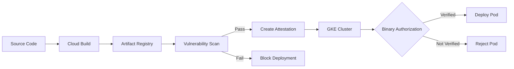

# How to Build an Automated Container Image Pipeline Using Cloud Build Artifact Registry and Binary Authorization

Author: [nawazdhandala](https://www.github.com/nawazdhandala)

Tags: GCP, Cloud Build, Artifact Registry, Binary Authorization, Container Security

Description: Learn how to build a secure automated container image pipeline on GCP using Cloud Build, Artifact Registry, and Binary Authorization to enforce deployment policies.

---

Running containers in production without verifying where they came from is a security gap most teams do not think about until it bites them. Binary Authorization on GCP closes this gap by ensuring that only container images that have been built by your CI pipeline, scanned for vulnerabilities, and signed with an attestation can be deployed to your GKE clusters.

In this post, I will walk through building a complete pipeline that builds images with Cloud Build, stores them in Artifact Registry, scans them for vulnerabilities, signs them with attestations, and enforces deployment policies using Binary Authorization.

## Architecture Overview



## Step 1: Set Up Artifact Registry

Create a Docker repository in Artifact Registry:

```bash
# Enable required APIs
gcloud services enable \
  artifactregistry.googleapis.com \
  cloudbuild.googleapis.com \
  containeranalysis.googleapis.com \
  binaryauthorization.googleapis.com

# Create the Docker repository
gcloud artifacts repositories create app-images \
  --repository-format=docker \
  --location=us-central1 \
  --description="Production container images"
```

## Step 2: Configure Cloud Build Pipeline

Create a Cloud Build configuration that builds, scans, and pushes images:

```yaml
# cloudbuild.yaml
steps:
  # Step 1: Build the container image
  - name: 'gcr.io/cloud-builders/docker'
    args:
      - 'build'
      - '-t'
      - 'us-central1-docker.pkg.dev/$PROJECT_ID/app-images/my-app:$SHORT_SHA'
      - '-t'
      - 'us-central1-docker.pkg.dev/$PROJECT_ID/app-images/my-app:latest'
      - '--build-arg'
      - 'BUILD_SHA=$SHORT_SHA'
      - '.'
    id: 'build'

  # Step 2: Push the image to Artifact Registry
  - name: 'gcr.io/cloud-builders/docker'
    args:
      - 'push'
      - 'us-central1-docker.pkg.dev/$PROJECT_ID/app-images/my-app:$SHORT_SHA'
    id: 'push'
    waitFor: ['build']

  # Step 3: Wait for vulnerability scanning to complete
  - name: 'gcr.io/cloud-builders/gcloud'
    entrypoint: 'bash'
    args:
      - '-c'
      - |
        # Wait for the vulnerability scan to finish
        echo "Waiting for vulnerability scan..."
        for i in $(seq 1 30); do
          SCAN_STATUS=$(gcloud artifacts docker images describe \
            us-central1-docker.pkg.dev/$PROJECT_ID/app-images/my-app:$SHORT_SHA \
            --format='value(image_summary.slsa_build_level)' 2>/dev/null || echo "pending")

          # Check if scan results are available
          VULN_COUNT=$(gcloud artifacts docker images list \
            us-central1-docker.pkg.dev/$PROJECT_ID/app-images/my-app \
            --include-tags \
            --filter="tags:$SHORT_SHA" \
            --format='value(VULNERABILITIES)' 2>/dev/null || echo "pending")

          if [ "$VULN_COUNT" != "pending" ]; then
            echo "Scan complete. Vulnerabilities: $VULN_COUNT"
            break
          fi

          echo "Scan in progress... (attempt $i/30)"
          sleep 10
        done
    id: 'wait-for-scan'
    waitFor: ['push']

  # Step 4: Check vulnerability scan results
  - name: 'gcr.io/cloud-builders/gcloud'
    entrypoint: 'bash'
    args:
      - '-c'
      - |
        # Get the image digest
        DIGEST=$(gcloud artifacts docker images describe \
          us-central1-docker.pkg.dev/$PROJECT_ID/app-images/my-app:$SHORT_SHA \
          --format='value(image_summary.digest)')

        echo "Image digest: $DIGEST"

        # Check for critical and high vulnerabilities
        CRITICAL=$(gcloud artifacts docker images describe \
          us-central1-docker.pkg.dev/$PROJECT_ID/app-images/my-app:$SHORT_SHA \
          --show-package-vulnerability \
          --format=json | jq '[.package_vulnerability[].vulnerability.effectiveSeverity | select(. == "CRITICAL")] | length')

        HIGH=$(gcloud artifacts docker images describe \
          us-central1-docker.pkg.dev/$PROJECT_ID/app-images/my-app:$SHORT_SHA \
          --show-package-vulnerability \
          --format=json | jq '[.package_vulnerability[].vulnerability.effectiveSeverity | select(. == "HIGH")] | length')

        echo "Critical vulnerabilities: $CRITICAL"
        echo "High vulnerabilities: $HIGH"

        if [ "$CRITICAL" -gt 0 ]; then
          echo "BLOCKED: Image has $CRITICAL critical vulnerabilities"
          exit 1
        fi

        if [ "$HIGH" -gt 5 ]; then
          echo "BLOCKED: Image has $HIGH high vulnerabilities (threshold: 5)"
          exit 1
        fi

        echo "Vulnerability check passed"
    id: 'vuln-check'
    waitFor: ['wait-for-scan']

  # Step 5: Create attestation
  - name: 'gcr.io/cloud-builders/gcloud'
    entrypoint: 'bash'
    args:
      - '-c'
      - |
        # Get the full image path with digest
        DIGEST=$(gcloud artifacts docker images describe \
          us-central1-docker.pkg.dev/$PROJECT_ID/app-images/my-app:$SHORT_SHA \
          --format='value(image_summary.digest)')

        IMAGE="us-central1-docker.pkg.dev/$PROJECT_ID/app-images/my-app@$DIGEST"

        echo "Creating attestation for: $IMAGE"

        # Create the attestation using the Cloud KMS key
        gcloud beta container binauthz attestations sign-and-create \
          --artifact-url="$IMAGE" \
          --attestor=build-attestor \
          --attestor-project=$PROJECT_ID \
          --keyversion-project=$PROJECT_ID \
          --keyversion-location=global \
          --keyversion-keyring=binauthz-keys \
          --keyversion-key=attestor-key \
          --keyversion=1

        echo "Attestation created successfully"
    id: 'create-attestation'
    waitFor: ['vuln-check']

images:
  - 'us-central1-docker.pkg.dev/$PROJECT_ID/app-images/my-app:$SHORT_SHA'
  - 'us-central1-docker.pkg.dev/$PROJECT_ID/app-images/my-app:latest'
```

## Step 3: Set Up Binary Authorization

Create the attestor, key, and policy:

```bash
# Create a Cloud KMS keyring and key for signing attestations
gcloud kms keyrings create binauthz-keys --location=global

gcloud kms keys create attestor-key \
  --keyring=binauthz-keys \
  --location=global \
  --purpose=asymmetric-signing \
  --default-algorithm=ec-sign-p256-sha256

# Create a Container Analysis note (required for attestors)
curl -X POST \
  "https://containeranalysis.googleapis.com/v1/projects/my-project/notes/?noteId=build-verified" \
  -H "Authorization: Bearer $(gcloud auth print-access-token)" \
  -H "Content-Type: application/json" \
  -d '{
    "attestation": {
      "hint": {
        "humanReadableName": "Build Pipeline Verified"
      }
    }
  }'

# Create the attestor
gcloud beta container binauthz attestors create build-attestor \
  --attestation-authority-note=build-verified \
  --attestation-authority-note-project=my-project

# Add the KMS key to the attestor
gcloud beta container binauthz attestors public-keys add \
  --attestor=build-attestor \
  --keyversion-project=my-project \
  --keyversion-location=global \
  --keyversion-keyring=binauthz-keys \
  --keyversion-key=attestor-key \
  --keyversion=1
```

## Step 4: Configure the Binary Authorization Policy

Create a policy that requires attestation for all deployments:

```bash
# Export the current policy
gcloud beta container binauthz policy export > policy.yaml
```

Edit the policy:

```yaml
# policy.yaml - Binary Authorization policy
admissionWhitelistPatterns:
  # Allow system images
  - namePattern: "gcr.io/google_containers/*"
  - namePattern: "gcr.io/google-containers/*"
  - namePattern: "k8s.gcr.io/*"
  - namePattern: "gke.gcr.io/*"
  # Allow Artifact Registry system images
  - namePattern: "us-central1-docker.pkg.dev/my-project/system-images/*"

defaultAdmissionRule:
  # Require attestation for all other images
  evaluationMode: REQUIRE_ATTESTATION
  enforcementMode: ENFORCED_BLOCK_AND_AUDIT_LOG
  requireAttestationsBy:
    - projects/my-project/attestors/build-attestor

globalPolicyEvaluationMode: ENABLE
```

Apply the policy:

```bash
# Import the updated policy
gcloud beta container binauthz policy import policy.yaml
```

## Step 5: Enable Binary Authorization on GKE

Enable Binary Authorization on your GKE cluster:

```bash
# For a new cluster
gcloud container clusters create secure-cluster \
  --zone=us-central1-a \
  --binauthz-evaluation-mode=PROJECT_SINGLETON_POLICY_ENFORCE

# For an existing cluster
gcloud container clusters update existing-cluster \
  --zone=us-central1-a \
  --binauthz-evaluation-mode=PROJECT_SINGLETON_POLICY_ENFORCE
```

## Step 6: Test the Pipeline

Deploy an attested image - it should succeed:

```bash
# Deploy an image that went through the pipeline (has attestation)
kubectl run verified-app \
  --image=us-central1-docker.pkg.dev/my-project/app-images/my-app:latest
# This should succeed
```

Try deploying an unattested image - it should be rejected:

```bash
# Try to deploy an image without attestation
kubectl run unverified-app \
  --image=docker.io/nginx:latest
# This should be rejected by Binary Authorization
# Error: denied by Binary Authorization policy
```

## Monitoring and Auditing

Set up alerts for Binary Authorization violations:

```bash
# View Binary Authorization audit logs
gcloud logging read \
  'resource.type="k8s_cluster" AND protoPayload.methodName="io.k8s.core.v1.pods.create" AND protoPayload.response.status.message:"denied by Binary Authorization"' \
  --limit=20

# Create an alert for policy violations
gcloud alpha monitoring policies create \
  --display-name="Binary Authorization Violation" \
  --condition-display-name="Deployment blocked by Binary Authorization" \
  --condition-filter='resource.type="k8s_cluster" AND log_id("cloudaudit.googleapis.com/activity") AND protoPayload.response.status.message:"denied by Binary Authorization"' \
  --notification-channels=projects/my-project/notificationChannels/security-team
```

## Wrapping Up

A container image pipeline with Cloud Build, Artifact Registry, and Binary Authorization gives you a provable chain of custody for your container images. Every image that runs in production was built by your CI pipeline, passed vulnerability scanning, and was signed with a cryptographic attestation. Any attempt to deploy an unsigned image is blocked and logged.

This is not just good security practice - it is increasingly a compliance requirement. Set it up once, and every deployment automatically goes through the same verification process.
