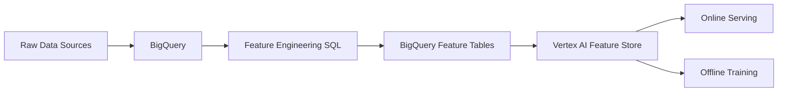

# How to Build an End-to-End ML Feature Store Pipeline Using BigQuery and Vertex AI Feature Store

Author: [nawazdhandala](https://www.github.com/nawazdhandala)

Tags: GCP, Vertex AI, BigQuery, Feature Store, Machine Learning

Description: Learn how to build an end-to-end ML feature store pipeline using BigQuery for feature engineering and Vertex AI Feature Store for serving features at scale.

---

If you have been working with machine learning models in production, you know that one of the hardest problems is not training the model itself - it is managing and serving features consistently. Feature stores solve this by providing a centralized place to define, store, and serve features for both training and online prediction. In this guide, I will walk you through building a complete pipeline using BigQuery for feature computation and Vertex AI Feature Store for serving.

## What Is a Feature Store and Why Do You Need One

A feature store sits between your raw data and your ML models. It handles the transformation of raw data into features, stores those features, and serves them to models during both training and inference. Without a feature store, teams often end up with training-serving skew - the features used during training differ from those used during prediction, which leads to degraded model performance.

Vertex AI Feature Store integrates tightly with BigQuery, which makes it a natural fit if your data already lives in GCP. BigQuery handles the heavy lifting of feature computation over large datasets, and Vertex AI Feature Store handles low-latency serving for online predictions.

## Architecture Overview

Here is how the pipeline looks at a high level:



The pipeline flows from raw data ingestion into BigQuery, through SQL-based feature engineering, into feature tables, and finally into the Vertex AI Feature Store where features are available for both online and offline consumption.

## Setting Up Your Environment

Before you start, make sure you have the necessary APIs enabled and the SDK installed.

```bash
# Enable the required APIs on your GCP project
gcloud services enable aiplatform.googleapis.com
gcloud services enable bigquery.googleapis.com

# Install the Python SDK
pip install google-cloud-aiplatform google-cloud-bigquery
```

You will also need to authenticate your environment:

```bash
# Authenticate with your GCP credentials
gcloud auth application-default login
```

## Step 1 - Create Feature Engineering Queries in BigQuery

The first step is writing SQL queries that transform your raw data into features. Let me use an example of a user behavior dataset for an e-commerce platform.

```sql
-- Compute user-level features from raw transaction data
CREATE OR REPLACE TABLE `my_project.features.user_features` AS
SELECT
    user_id,
    -- Aggregate purchase behavior
    COUNT(*) AS total_purchases,
    AVG(order_total) AS avg_order_value,
    MAX(order_total) AS max_order_value,
    -- Recency features
    DATE_DIFF(CURRENT_DATE(), MAX(DATE(order_timestamp)), DAY) AS days_since_last_purchase,
    -- Frequency features
    COUNT(DISTINCT DATE(order_timestamp)) AS unique_purchase_days,
    -- Category preferences
    APPROX_TOP_COUNT(product_category, 1)[OFFSET(0)].value AS top_category,
    -- Time-based features
    AVG(EXTRACT(HOUR FROM order_timestamp)) AS avg_purchase_hour
FROM
    `my_project.raw_data.transactions`
WHERE
    order_timestamp >= TIMESTAMP_SUB(CURRENT_TIMESTAMP(), INTERVAL 90 DAY)
GROUP BY
    user_id;
```

This query computes several features from raw transaction data: purchase counts, average order values, recency, frequency, and category preferences. You can schedule this query to run on a regular cadence using BigQuery scheduled queries or Cloud Composer.

## Step 2 - Create a Feature Store and Entity Type

Now let us set up the Vertex AI Feature Store resources.

```python
from google.cloud import aiplatform

# Initialize the SDK with your project details
aiplatform.init(
    project="my-project",
    location="us-central1"
)

# Create a feature store instance
feature_store = aiplatform.Featurestore.create(
    featurestore_id="ecommerce_features",
    online_serving_config=aiplatform.Featurestore.OnlineServingConfig(
        # Number of nodes for online serving - scale based on your QPS needs
        fixed_node_count=1
    ),
)

# Create an entity type for users
user_entity_type = feature_store.create_entity_type(
    entity_type_id="users",
    description="User-level features for the ecommerce platform"
)
```

## Step 3 - Define Features

With the entity type created, you now define the individual features.

```python
# Define each feature with its value type and description
features_config = {
    "total_purchases": {
        "value_type": "INT64",
        "description": "Total number of purchases in the last 90 days"
    },
    "avg_order_value": {
        "value_type": "DOUBLE",
        "description": "Average order value in the last 90 days"
    },
    "max_order_value": {
        "value_type": "DOUBLE",
        "description": "Maximum single order value in the last 90 days"
    },
    "days_since_last_purchase": {
        "value_type": "INT64",
        "description": "Days since the most recent purchase"
    },
    "unique_purchase_days": {
        "value_type": "INT64",
        "description": "Number of unique days with at least one purchase"
    },
    "top_category": {
        "value_type": "STRING",
        "description": "Most frequently purchased product category"
    },
    "avg_purchase_hour": {
        "value_type": "DOUBLE",
        "description": "Average hour of day when purchases happen"
    }
}

# Create all features in a batch
for feature_id, config in features_config.items():
    user_entity_type.create_feature(
        feature_id=feature_id,
        value_type=config["value_type"],
        description=config["description"]
    )
```

## Step 4 - Ingest Features from BigQuery

This is where BigQuery and Vertex AI Feature Store connect. You ingest the computed features directly from your BigQuery table.

```python
# Ingest features from the BigQuery table into the feature store
user_entity_type.ingest_from_bq(
    feature_ids=[
        "total_purchases",
        "avg_order_value",
        "max_order_value",
        "days_since_last_purchase",
        "unique_purchase_days",
        "top_category",
        "avg_purchase_hour"
    ],
    feature_time="feature_timestamp",  # Column in BQ table with the feature timestamp
    bq_source_uri="bq://my-project.features.user_features",
    entity_id_field="user_id",  # Column that maps to the entity ID
)
```

The ingestion job runs asynchronously and can handle large volumes of data. For production pipelines, you would trigger this after your scheduled BigQuery feature engineering queries complete.

## Step 5 - Serve Features Online

Once features are ingested, you can read them with low latency for online predictions.

```python
# Read features for a specific user during online prediction
online_features = feature_store.read(
    entity_type_id="users",
    entity_ids=["user_12345"],
    feature_ids=[
        "total_purchases",
        "avg_order_value",
        "days_since_last_purchase"
    ]
)

# The response contains feature values you can pass to your model
print(online_features)
```

## Step 6 - Serve Features Offline for Training

For training, you can perform a batch read that joins features with your training labels based on point-in-time correctness.

```python
from google.cloud.aiplatform_v1.types import FeatureSelector, IdMatcher

# Define the serving config for batch reads
batch_read = feature_store.batch_serve_to_bq(
    bq_destination_output_uri="bq://my-project.training_data.training_set",
    serving_feature_ids={
        "users": [
            "total_purchases",
            "avg_order_value",
            "max_order_value",
            "days_since_last_purchase",
            "unique_purchase_days",
            "top_category",
            "avg_purchase_hour"
        ]
    },
    # This table has entity_ids and timestamps for point-in-time joins
    read_instances_uri="bq://my-project.training_data.training_instances",
)
```

Point-in-time correctness matters because you want training features to reflect what was known at the time of each training example, not what is known now. This prevents data leakage.

## Automating the Pipeline

To run this end-to-end, you can wire everything together using Cloud Composer (Airflow) or Vertex AI Pipelines.

```python
from kfp import dsl
from kfp.v2 import compiler

@dsl.pipeline(name="feature-pipeline")
def feature_pipeline():
    # Step 1: Run the BigQuery feature engineering query
    bq_task = dsl.ContainerOp(
        name="compute-features",
        image="google/cloud-sdk:latest",
        command=["bq", "query", "--use_legacy_sql=false"],
        arguments=["--destination_table=my_project:features.user_features",
                    "SELECT ... FROM raw_data.transactions ..."]
    )

    # Step 2: Ingest features into the feature store
    ingest_task = dsl.ContainerOp(
        name="ingest-features",
        image="python:3.9",
        command=["python", "ingest_features.py"],
    )
    # Make sure ingestion happens after computation
    ingest_task.after(bq_task)

# Compile the pipeline
compiler.Compiler().compile(
    pipeline_func=feature_pipeline,
    package_path="feature_pipeline.json"
)
```

## Monitoring and Best Practices

A few things to keep in mind when running this in production:

- **Feature freshness**: Monitor how stale your features are. Set up alerts if ingestion jobs fail or run late.
- **Schema evolution**: Plan for adding new features. Vertex AI Feature Store supports adding features to existing entity types without downtime.
- **Cost management**: Online serving nodes cost money even when idle. Size them based on actual QPS requirements and consider scaling down during off-peak hours.
- **Data quality**: Add validation checks between the BigQuery computation and the ingestion step. Bad features lead to bad predictions.

## Wrapping Up

Building a feature store pipeline with BigQuery and Vertex AI Feature Store gives you a solid foundation for serving ML features at scale. BigQuery handles the compute-heavy feature engineering work, while the feature store provides consistent, low-latency access for both training and serving. The tight integration between these two services means less glue code and fewer opportunities for training-serving skew. Once this pipeline is in place, adding new features becomes a matter of writing a SQL query and registering the new feature - your serving infrastructure stays the same.
