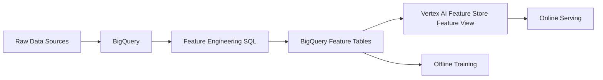

# How to Build an End-to-End ML Feature Store Pipeline Using BigQuery

Author: [nawazdhandala](https://www.github.com/nawazdhandala)

Tags: GCP, Vertex AI, BigQuery, Feature Store, Machine Learning

Description: Learn how to build an end-to-end ML feature store pipeline using BigQuery for feature engineering and Vertex AI Feature Store for serving features at scale.

---

If you have been working with machine learning models in production, you know that one of the hardest problems is not training the model itself - it is managing and serving features consistently. Feature stores solve this by providing a centralized place to define, store, and serve features for both training and online prediction. In this guide, I will walk you through building a complete pipeline using BigQuery for feature computation and Vertex AI Feature Store for serving.

## What Is a Feature Store and Why Do You Need One

A feature store sits between your raw data and your ML models. It handles the transformation of raw data into features, stores those features, and serves them to models during both training and inference. Without a feature store, teams often end up with training-serving skew - the features used during training differ from those used during prediction, which leads to degraded model performance.

Vertex AI Feature Store integrates tightly with BigQuery, which makes it a natural fit if your data already lives in GCP. BigQuery handles the heavy lifting of feature computation over large datasets, and Vertex AI Feature Store handles low-latency serving for online predictions.

## Architecture Overview

Here is how the pipeline looks at a high level:


```mermaid
flowchart LR
    A[Raw Data Sources] --> B[BigQuery]
    B --> C[Feature Engineering SQL]
    C --> D[BigQuery Feature Tables]
    D --> E[Vertex AI Feature Store Feature View]
    E --> F[Online Serving]
    D --> G[Offline Training]
```

The pipeline flows from raw data ingestion into BigQuery, through SQL-based feature engineering, into feature tables, and finally into a Vertex AI Feature Store feature view for online serving. BigQuery remains the offline store for training data.

## Setting Up Your Environment

Before you start, make sure you have the necessary APIs enabled and the SDK installed.

```bash
# Enable the required APIs on your GCP project

gcloud services enable aiplatform.googleapis.com
gcloud services enable bigquery.googleapis.com

# Install the Python SDK
pip install google-cloud-aiplatform google-cloud-bigquery
```

You will also need to authenticate your environment:

```bash
# Authenticate with your GCP credentials
gcloud auth application-default login
```

## Step 1 - Create Feature Engineering Queries in BigQuery

The first step is writing SQL queries that transform your raw data into features. Let me use an example of a user behavior dataset for an e-commerce platform.

```sql
-- Compute user-level features from raw transaction data
CREATE OR REPLACE TABLE `my-project.features.user_features` AS
SELECT
    user_id,
    CURRENT_TIMESTAMP() AS feature_timestamp,
    -- Aggregate purchase behavior
    COUNT(*) AS total_purchases,
    AVG(order_total) AS avg_order_value,
    MAX(order_total) AS max_order_value,
    -- Recency features
    DATE_DIFF(CURRENT_DATE(), MAX(DATE(order_timestamp)), DAY) AS days_since_last_purchase,
    -- Frequency features
    COUNT(DISTINCT DATE(order_timestamp)) AS unique_purchase_days,
    -- Category preferences
    APPROX_TOP_COUNT(product_category, 1)[OFFSET(0)].value AS top_category,
    -- Time-based features
    AVG(EXTRACT(HOUR FROM order_timestamp)) AS avg_purchase_hour
FROM
    `my-project.raw_data.transactions`
WHERE
    order_timestamp >= TIMESTAMP_SUB(CURRENT_TIMESTAMP(), INTERVAL 90 DAY)
GROUP BY
    user_id;
```

This query computes several features from raw transaction data: purchase counts, average order values, recency, frequency, and category preferences. You can schedule this query to run on a regular cadence using BigQuery scheduled queries or Cloud Composer.

## Step 2 - Create an Online Store and Feature Group

Now let us set up the Vertex AI Feature Store resources.

```python
from google.cloud import aiplatform
from vertexai.resources.preview import feature_store

# Initialize the SDK with your project details
aiplatform.init(
    project="my-project",
    location="us-central1"
)

# Create an online store for Bigtable online serving
online_store = feature_store.FeatureOnlineStore.create_bigtable_store(
    "ecommerce_features"
)

# Register the BigQuery table as a feature group
user_feature_group = feature_store.FeatureGroup.create(
    name="ecommerce_user_features",
    source=feature_store.utils.FeatureGroupBigQuerySource(
        uri="bq://my-project.features.user_features",
        entity_id_columns=["user_id"],
    ),
)
```

## Step 3 - Define Features

With the feature group created, you now define the individual features. Each feature maps to a column in the BigQuery source table.

```python
# Define each feature with its BigQuery source column and description
features_config = {
    "total_purchases": {
        "version_column_name": "total_purchases",
        "description": "Total number of purchases in the last 90 days"
    },
    "avg_order_value": {
        "version_column_name": "avg_order_value",
        "description": "Average order value in the last 90 days"
    },
    "max_order_value": {
        "version_column_name": "max_order_value",
        "description": "Maximum single order value in the last 90 days"
    },
    "days_since_last_purchase": {
        "version_column_name": "days_since_last_purchase",
        "description": "Days since the most recent purchase"
    },
    "unique_purchase_days": {
        "version_column_name": "unique_purchase_days",
        "description": "Number of unique days with at least one purchase"
    },
    "top_category": {
        "version_column_name": "top_category",
        "description": "Most frequently purchased product category"
    },
    "avg_purchase_hour": {
        "version_column_name": "avg_purchase_hour",
        "description": "Average hour of day when purchases happen"
    }
}

# Create all features in a batch
for feature_id, config in features_config.items():
    user_feature_group.create_feature(
        name=feature_id,
        version_column_name=config["version_column_name"],
        description=config["description"]
    )
```

## Step 4 - Create a Feature View from BigQuery

This is where BigQuery and Vertex AI Feature Store connect. You create a feature view that syncs the latest feature values from the registered BigQuery table into the online store.

```json
{
  "feature_registry_source": {
    "feature_groups": [
      {
        "feature_group_id": "ecommerce_user_features",
        "feature_ids": [
          "total_purchases",
          "avg_order_value",
          "max_order_value",
          "days_since_last_purchase",
          "unique_purchase_days",
          "top_category",
          "avg_purchase_hour"
        ]
      }
    ]
  },
  "sync_config": {
    "cron": "0 * * * *"
  }
}
```

Save this JSON as `feature_view.json`, then create the feature view:

```bash
curl -X POST \
  -H "Authorization: Bearer $(gcloud auth print-access-token)" \
  -H "Content-Type: application/json; charset=utf-8" \
  -d @feature_view.json \
  "https://us-central1-aiplatform.googleapis.com/v1/projects/my-project/locations/us-central1/featureOnlineStores/ecommerce_features/featureViews?feature_view_id=ecommerce_user_view"
```

The feature view syncs from BigQuery on the schedule you configure. For production pipelines, you would schedule the sync after your BigQuery feature engineering query completes, or manually trigger a sync when the feature table is updated.

## Step 5 - Serve Features Online

Once the feature view has synced, you can read features with low latency for online predictions.

```python
from google.cloud import aiplatform
from vertexai.resources.preview.feature_store import FeatureOnlineStore, FeatureView

aiplatform.init(project="my-project", location="us-central1")

online_store = FeatureOnlineStore("ecommerce_features")
feature_view = FeatureView(
    "ecommerce_user_view",
    feature_online_store_id=online_store.name,
)

# Read features for a specific user during online prediction
online_features = feature_view.read("user_12345")

# The response contains feature values you can pass to your model
print(online_features)
```

## Step 6 - Serve Features Offline for Training

For training, you can use BigQuery to join features with your training labels based on point-in-time correctness.

```sql
-- Build a point-in-time training set in BigQuery.
-- training_instances contains user_id, label_timestamp, and labels.
CREATE OR REPLACE TABLE `my-project.training_data.training_set` AS
SELECT
    labels.*,
    features.* EXCEPT (user_id, feature_timestamp)
FROM
    `my-project.training_data.training_instances` AS labels
LEFT JOIN
    `my-project.features.user_features_history` AS features
ON
    labels.user_id = features.user_id
    AND features.feature_timestamp <= labels.label_timestamp
QUALIFY
    ROW_NUMBER() OVER (
        PARTITION BY labels.user_id, labels.label_timestamp
        ORDER BY features.feature_timestamp DESC
    ) = 1;
```

Point-in-time correctness matters because you want training features to reflect what was known at the time of each training example, not what is known now. This prevents data leakage.

## Automating the Pipeline

To run this end-to-end, you can wire everything together using Cloud Composer (Airflow) or Vertex AI Pipelines.

```python
from kfp import compiler, dsl

@dsl.container_component
def compute_features():
    return dsl.ContainerSpec(
        image="google/cloud-sdk:latest",
        command=["bq", "query"],
        args=[
            "--use_legacy_sql=false",
            "--destination_table=my-project:features.user_features",
            "SELECT ... FROM raw_data.transactions ..."
        ],
    )

@dsl.container_component
def sync_feature_view():
    return dsl.ContainerSpec(
        image="python:3.11",
        command=["python", "sync_feature_view.py"],
    )

@dsl.pipeline(name="feature-pipeline")
def feature_pipeline():
    bq_task = compute_features()
    sync_feature_view().after(bq_task)

# Compile the pipeline
compiler.Compiler().compile(
    pipeline_func=feature_pipeline,
    package_path="feature_pipeline.yaml"
)
```

## Monitoring and Best Practices

A few things to keep in mind when running this in production:

- **Feature freshness**: Monitor how stale your features are. Set up alerts if feature view sync jobs fail or run late.
- **Schema evolution**: Plan for adding new features. Vertex AI Feature Store supports adding features to existing feature groups.
- **Cost management**: Online store resources cost money while provisioned. Size them based on actual QPS requirements and avoid overly frequent sync schedules.
- **Data quality**: Add validation checks between the BigQuery computation and the feature view sync step. Bad features lead to bad predictions.

## Wrapping Up

Building a feature store pipeline with BigQuery and Vertex AI Feature Store gives you a solid foundation for serving ML features at scale. BigQuery handles the compute-heavy feature engineering work and offline training data, while the feature store provides consistent, low-latency access for online serving. The tight integration between these two services means less glue code and fewer opportunities for training-serving skew. Once this pipeline is in place, adding new features becomes a matter of writing a SQL query and registering the new feature - your serving infrastructure stays the same.
