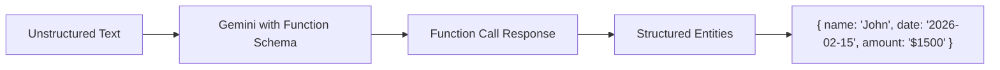

# How to Build an Entity Extraction System with Vertex AI and Gemini Function Calling

Author: [nawazdhandala](https://www.github.com/nawazdhandala)

Tags: GCP, Vertex AI, Gemini, Entity Extraction, Function Calling

Description: Build a structured entity extraction system using Vertex AI Gemini models with function calling to pull structured data from unstructured text at scale.

---

Extracting structured entities from unstructured text is a foundational task in many applications - processing invoices, parsing support tickets, analyzing contracts, or cataloging product descriptions. Traditional NER (Named Entity Recognition) models require training data and handle a fixed set of entity types. Gemini's function calling capability offers a different approach: you define the entity schema you want, and the model extracts matching entities from any text without custom training.

This guide covers building a production entity extraction system using Vertex AI and Gemini function calling.

## How Function Calling Enables Entity Extraction

The trick is to define a "function" whose parameters match the entities you want to extract. You do not actually call a function - instead, the model populates the function parameters with extracted values from the input text. This gives you structured output in a predictable format.



## Prerequisites

- Google Cloud project with Vertex AI API enabled
- Python 3.9+

```bash
pip install google-cloud-aiplatform vertexai
```

## Basic Entity Extraction

### Define the Entity Schema

Start by defining what entities you want to extract. The schema uses the function calling format.

```python
import vertexai
from vertexai.generative_models import (
    GenerativeModel,
    FunctionDeclaration,
    Tool,
)

# Initialize Vertex AI
vertexai.init(project="your-project-id", location="us-central1")

# Define the entity extraction schema as a function declaration
extract_invoice_entities = FunctionDeclaration(
    name="extract_invoice_data",
    description="Extract structured data from an invoice or receipt",
    parameters={
        "type": "object",
        "properties": {
            "vendor_name": {
                "type": "string",
                "description": "The name of the vendor or company that issued the invoice",
            },
            "invoice_number": {
                "type": "string",
                "description": "The invoice or receipt number",
            },
            "invoice_date": {
                "type": "string",
                "description": "The date of the invoice in YYYY-MM-DD format",
            },
            "due_date": {
                "type": "string",
                "description": "The payment due date in YYYY-MM-DD format",
            },
            "total_amount": {
                "type": "number",
                "description": "The total amount due on the invoice",
            },
            "currency": {
                "type": "string",
                "description": "The currency code (e.g., USD, EUR, GBP)",
            },
            "line_items": {
                "type": "array",
                "description": "Individual line items on the invoice",
                "items": {
                    "type": "object",
                    "properties": {
                        "description": {"type": "string"},
                        "quantity": {"type": "number"},
                        "unit_price": {"type": "number"},
                        "total": {"type": "number"},
                    },
                },
            },
        },
        "required": ["vendor_name", "total_amount", "currency"],
    },
)

# Create a tool from the function declaration
extraction_tool = Tool(function_declarations=[extract_invoice_entities])
```

### Run Extraction

```python
# Initialize the Gemini model
model = GenerativeModel("gemini-1.5-pro")

# Sample invoice text
invoice_text = """
INVOICE
From: CloudTech Solutions Inc.
Invoice #: INV-2026-0142
Date: February 10, 2026
Due: March 10, 2026

Bill To: Acme Corporation

Items:
1. Cloud Hosting (Standard) - 12 months @ $99/month = $1,188.00
2. SSL Certificate - 1 year @ $49.99 = $49.99
3. Technical Support (Premium) - 12 months @ $199/month = $2,388.00

Subtotal: $3,625.99
Tax (8%): $290.08
Total Due: $3,916.07 USD

Payment Terms: Net 30
"""

# Extract entities using function calling
response = model.generate_content(
    f"Extract the structured data from this invoice:\n\n{invoice_text}",
    tools=[extraction_tool],
)

# Parse the extracted entities from the function call response
if response.candidates[0].content.parts:
    for part in response.candidates[0].content.parts:
        if hasattr(part, 'function_call') and part.function_call:
            fc = part.function_call
            print(f"Function: {fc.name}")
            print(f"Extracted entities:")
            for key, value in fc.args.items():
                print(f"  {key}: {value}")
```

## Building a Reusable Extraction System

### Entity Extractor Class

```python
from vertexai.generative_models import GenerativeModel, FunctionDeclaration, Tool
import json

class EntityExtractor:
    """A reusable entity extraction system using Gemini function calling."""

    def __init__(self, project_id: str, location: str):
        vertexai.init(project=project_id, location=location)
        self.model = GenerativeModel("gemini-1.5-flash")  # Flash for speed on extraction tasks
        self.schemas = {}

    def register_schema(self, name: str, description: str, properties: dict, required: list = None):
        """Register an entity extraction schema."""
        func_declaration = FunctionDeclaration(
            name=f"extract_{name}",
            description=description,
            parameters={
                "type": "object",
                "properties": properties,
                "required": required or [],
            },
        )

        self.schemas[name] = Tool(function_declarations=[func_declaration])
        print(f"Registered extraction schema: {name}")

    def extract(self, text: str, schema_name: str) -> dict:
        """Extract entities from text using a registered schema."""
        if schema_name not in self.schemas:
            raise ValueError(f"Schema '{schema_name}' not registered")

        tool = self.schemas[schema_name]

        response = self.model.generate_content(
            f"Extract the structured data from the following text. Be precise and only extract information that is explicitly stated.\n\nText:\n{text}",
            tools=[tool],
        )

        # Parse the function call response
        entities = {}
        for part in response.candidates[0].content.parts:
            if hasattr(part, 'function_call') and part.function_call:
                for key, value in part.function_call.args.items():
                    entities[key] = value

        return entities

    def extract_batch(self, texts: list, schema_name: str) -> list:
        """Extract entities from multiple texts."""
        results = []
        for i, text in enumerate(texts):
            try:
                entities = self.extract(text, schema_name)
                results.append({"index": i, "entities": entities, "error": None})
            except Exception as e:
                results.append({"index": i, "entities": {}, "error": str(e)})

            if (i + 1) % 10 == 0:
                print(f"Processed {i + 1}/{len(texts)} texts")

        return results
```

### Registering Different Schemas

```python
extractor = EntityExtractor("your-project-id", "us-central1")

# Schema for support tickets
extractor.register_schema(
    name="support_ticket",
    description="Extract structured information from a customer support message",
    properties={
        "customer_name": {"type": "string", "description": "The customer's name"},
        "issue_type": {
            "type": "string",
            "description": "Category of the issue",
            "enum": ["billing", "technical", "account", "feature_request", "other"],
        },
        "severity": {
            "type": "string",
            "description": "Severity level based on the urgency described",
            "enum": ["low", "medium", "high", "critical"],
        },
        "product_mentioned": {"type": "string", "description": "Any product or service mentioned"},
        "summary": {"type": "string", "description": "One-sentence summary of the issue"},
        "action_requested": {"type": "string", "description": "What the customer wants done"},
    },
    required=["issue_type", "severity", "summary"],
)

# Schema for job postings
extractor.register_schema(
    name="job_posting",
    description="Extract structured data from a job posting",
    properties={
        "job_title": {"type": "string", "description": "The title of the position"},
        "company": {"type": "string", "description": "The company name"},
        "location": {"type": "string", "description": "Job location or remote status"},
        "salary_range": {"type": "string", "description": "Salary range if mentioned"},
        "experience_required": {"type": "string", "description": "Years of experience required"},
        "skills": {
            "type": "array",
            "description": "Required technical skills",
            "items": {"type": "string"},
        },
        "employment_type": {
            "type": "string",
            "description": "Full-time, part-time, contract, etc.",
        },
    },
    required=["job_title", "company"],
)

# Schema for contact information
extractor.register_schema(
    name="contact_info",
    description="Extract contact information from text",
    properties={
        "name": {"type": "string", "description": "Person's full name"},
        "email": {"type": "string", "description": "Email address"},
        "phone": {"type": "string", "description": "Phone number"},
        "company": {"type": "string", "description": "Company or organization"},
        "title": {"type": "string", "description": "Job title or role"},
        "address": {"type": "string", "description": "Physical address"},
    },
    required=["name"],
)
```

### Running Extraction

```python
# Extract from a support ticket
ticket_text = """
Hi, my name is Sarah Chen and I've been a customer for 3 years. I'm reaching out
because my Pro plan dashboard has been loading extremely slowly for the past two days.
It takes over 30 seconds to load any page. This is blocking my team from doing their
work. We need this fixed urgently as we have a product launch next week and rely on
the monitoring dashboards. Please escalate this to your engineering team.
"""

ticket_entities = extractor.extract(ticket_text, "support_ticket")
print(json.dumps(ticket_entities, indent=2))

# Extract from a job posting
job_text = """
Senior Backend Engineer - Acme Cloud (San Francisco, CA - Hybrid)

We're looking for a senior backend engineer to join our platform team. You'll work
on our core API infrastructure serving millions of requests daily.

Requirements:
- 5+ years experience with Python or Go
- Experience with Kubernetes and cloud infrastructure
- Strong understanding of distributed systems
- Experience with PostgreSQL and Redis

Salary: $180,000 - $240,000 + equity
Full-time position with competitive benefits
"""

job_entities = extractor.extract(job_text, "job_posting")
print(json.dumps(job_entities, indent=2))
```

## Batch Processing at Scale

For processing large volumes of text, use Vertex AI batch prediction.

```python
from google.cloud import aiplatform
import json

def batch_extract(
    texts: list,
    schema_name: str,
    extractor: EntityExtractor,
    output_path: str,
):
    """Process a large batch of texts and save results."""
    results = extractor.extract_batch(texts, schema_name)

    # Save results
    with open(output_path, "w") as f:
        json.dump(results, f, indent=2)

    # Print summary
    successful = [r for r in results if r["error"] is None]
    failed = [r for r in results if r["error"] is not None]

    print(f"\nBatch extraction complete:")
    print(f"  Total: {len(results)}")
    print(f"  Successful: {len(successful)}")
    print(f"  Failed: {len(failed)}")

    return results
```

## Validation and Quality Checks

Always validate extracted entities before using them downstream.

```python
def validate_extraction(entities: dict, schema_name: str) -> dict:
    """Validate extracted entities against expected constraints."""
    issues = []

    if schema_name == "support_ticket":
        # Check required fields are present and non-empty
        for field in ["issue_type", "severity", "summary"]:
            if not entities.get(field):
                issues.append(f"Missing required field: {field}")

        # Validate enum values
        valid_severities = ["low", "medium", "high", "critical"]
        if entities.get("severity") not in valid_severities:
            issues.append(f"Invalid severity: {entities.get('severity')}")

    elif schema_name == "contact_info":
        # Basic email validation
        email = entities.get("email", "")
        if email and "@" not in email:
            issues.append(f"Invalid email format: {email}")

    return {
        "valid": len(issues) == 0,
        "issues": issues,
        "entities": entities,
    }

# Validate the extraction
validation = validate_extraction(ticket_entities, "support_ticket")
if validation["valid"]:
    print("Extraction is valid")
else:
    print(f"Validation issues: {validation['issues']}")
```

## Performance Tips

When building an entity extraction system at scale, keep these points in mind.

Use `gemini-1.5-flash` instead of `gemini-1.5-pro` for extraction tasks. Flash is significantly cheaper and faster, and extraction is a well-defined task where the extra reasoning capability of Pro is not needed.

Batch your API calls and implement rate limiting to stay within quota. The Vertex AI API has per-minute request limits that you will hit quickly with batch processing.

Cache extraction results to avoid re-processing the same text. A hash of the input text makes a good cache key.

Keep your schemas focused. A schema with 30 fields is harder for the model to fill accurately than one with 5-10 fields. If you need many entities, split them into multiple focused schemas and run separate extractions.

## Summary

Gemini function calling provides a flexible, no-training-required approach to entity extraction. Define your entity schema once, and the model handles extraction from any text. The approach scales well from single documents to batch processing thousands of texts through Vertex AI. Start with a focused schema, validate the extraction quality against a set of test examples, and expand the schema as you confirm accuracy. For production systems, add validation, caching, and batch processing to handle volume efficiently.
