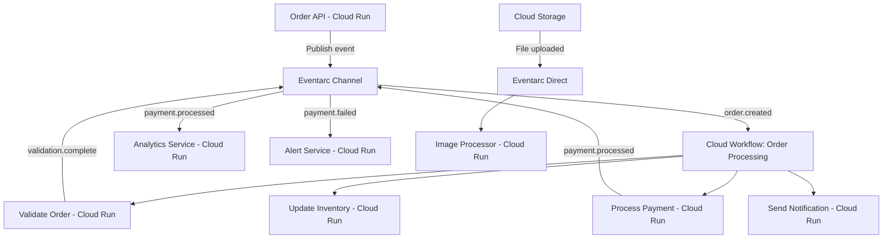

# How to Build an Event-Driven Architecture on GCP Using Eventarc Workflows and Cloud Run

Author: [nawazdhandala](https://www.github.com/nawazdhandala)

Tags: GCP, Eventarc, Cloud Workflows, Cloud Run, Event-Driven Architecture

Description: A comprehensive guide to building an event-driven architecture on Google Cloud Platform using Eventarc for routing, Cloud Workflows for orchestration, and Cloud Run for processing.

---

Event-driven architecture is about building systems where services react to events rather than being called directly. Instead of Service A calling Service B, Service A emits an event, and Service B subscribes to that event. This decouples your services, makes them independently deployable, and makes the system easier to extend - adding a new consumer is just adding a new subscription.

On GCP, the building blocks for event-driven architecture are Eventarc (event routing), Cloud Workflows (orchestration), and Cloud Run (compute). In this post, I will show you how to combine all three to build a production-ready event-driven system.

## Architecture Overview

Here is the system we will build - an order processing platform where events drive the entire workflow.



## Setting Up the Foundation

Enable all required APIs and create the base infrastructure.

```bash
# Enable all required APIs
gcloud services enable \
  run.googleapis.com \
  workflows.googleapis.com \
  eventarc.googleapis.com \
  eventarcpublishing.googleapis.com \
  pubsub.googleapis.com

# Create the Eventarc channel for custom application events
gcloud eventarc channels create order-platform-events \
  --location=us-central1

# Create service accounts
gcloud iam service-accounts create order-platform-sa \
  --display-name="Order Platform SA"

gcloud iam service-accounts create eventarc-trigger-sa \
  --display-name="Eventarc Trigger SA"

gcloud iam service-accounts create workflow-sa \
  --display-name="Workflow SA"
```

## Building the Microservices

### Order API Service

This is the entry point. It receives orders and emits events.

```javascript
// order-api/server.js
// Order API that accepts orders and publishes events to Eventarc
const express = require("express");
const { EventarcPublisherClient } = require("@google-cloud/eventarc-publishing");
const { v4: uuidv4 } = require("uuid");

const app = express();
app.use(express.json());

const publisher = new EventarcPublisherClient();
const PROJECT = process.env.GOOGLE_CLOUD_PROJECT;
const CHANNEL = `projects/${PROJECT}/locations/us-central1/channels/order-platform-events`;

async function emitEvent(type, data) {
  await publisher.publishEvents({
    channel: CHANNEL,
    events: [{
      id: uuidv4(),
      type,
      source: "//order-platform/order-api",
      specVersion: "1.0",
      textData: JSON.stringify(data),
    }],
  });
}

app.post("/api/orders", async (req, res) => {
  const orderId = `ORD-${Date.now()}`;
  const order = {
    orderId,
    ...req.body,
    status: "created",
    createdAt: new Date().toISOString(),
  };

  // Save order to database (simplified)
  console.log(`Order created: ${orderId}`);

  // Emit the order.created event - this triggers the entire workflow
  await emitEvent("custom.orderplatform.order.created", order);

  res.status(201).json({ orderId, status: "created" });
});

const PORT = process.env.PORT || 8080;
app.listen(PORT, () => console.log(`Order API on port ${PORT}`));
```

### Validation Service

```javascript
// validation-service/server.js
// Validates order data and returns validation result
const express = require("express");
const app = express();
app.use(express.json());

app.post("/validate", async (req, res) => {
  const order = req.body;
  console.log(`Validating order: ${order.orderId}`);

  const errors = [];

  // Check required fields
  if (!order.customerId) errors.push("Missing customerId");
  if (!order.items || order.items.length === 0) errors.push("No items in order");

  // Validate each item
  if (order.items) {
    for (const item of order.items) {
      if (item.quantity <= 0) errors.push(`Invalid quantity for ${item.sku}`);
      if (item.price <= 0) errors.push(`Invalid price for ${item.sku}`);
    }
  }

  // Check order total
  if (order.items) {
    const calculatedTotal = order.items.reduce(
      (sum, item) => sum + item.quantity * item.price, 0
    );
    if (Math.abs(calculatedTotal - order.total) > 0.01) {
      errors.push("Order total does not match item sum");
    }
  }

  const isValid = errors.length === 0;
  console.log(`Order ${order.orderId} validation: ${isValid ? "PASSED" : "FAILED"}`);

  res.status(200).json({
    orderId: order.orderId,
    valid: isValid,
    errors,
  });
});

const PORT = process.env.PORT || 8080;
app.listen(PORT, () => console.log(`Validation service on port ${PORT}`));
```

### Payment Service

```javascript
// payment-service/server.js
// Processes payments for orders
const express = require("express");
const app = express();
app.use(express.json());

app.post("/charge", async (req, res) => {
  const { orderId, customerId, amount, paymentMethod } = req.body;
  console.log(`Processing payment for order ${orderId}: $${amount}`);

  try {
    // Simulate payment processing
    const transactionId = `TXN-${Date.now()}`;

    // In production, call your payment provider here
    console.log(`Payment processed: ${transactionId}`);

    res.status(200).json({
      orderId,
      transactionId,
      status: "charged",
      amount,
    });
  } catch (error) {
    console.error(`Payment failed: ${error.message}`);
    res.status(200).json({
      orderId,
      status: "failed",
      error: error.message,
    });
  }
});

const PORT = process.env.PORT || 8080;
app.listen(PORT, () => console.log(`Payment service on port ${PORT}`));
```

Deploy all services.

```bash
# Deploy each microservice
gcloud run deploy order-api \
  --source=./order-api --region=us-central1 \
  --allow-unauthenticated --memory=256Mi

gcloud run deploy validation-service \
  --source=./validation-service --region=us-central1 \
  --no-allow-unauthenticated --memory=256Mi

gcloud run deploy payment-service \
  --source=./payment-service --region=us-central1 \
  --no-allow-unauthenticated --memory=256Mi

gcloud run deploy notification-service \
  --source=./notification-service --region=us-central1 \
  --no-allow-unauthenticated --memory=256Mi
```

## The Orchestration Workflow

Cloud Workflows ties the microservices together. When an `order.created` event arrives, this workflow runs the full order processing pipeline.

```yaml
# order-processing-workflow.yaml
# Orchestrates the order processing pipeline
# Triggered by order.created events via Eventarc
main:
  params: [event]
  steps:
    - extract_order:
        assign:
          - order: ${json.decode(event.data)}
          - project_id: ${sys.get_env("GOOGLE_CLOUD_PROJECT_ID")}

    - log_start:
        call: sys.log
        args:
          text: ${"Processing order " + order.orderId}
          severity: "INFO"

    # Step 1: Validate the order
    - validate:
        try:
          call: http.post
          args:
            url: ${"https://validation-service-abc123-uc.a.run.app/validate"}
            auth:
              type: OIDC
            body: ${order}
          result: validation_result
        except:
          as: e
          steps:
            - validation_error:
                call: publish_event
                args:
                  type: "custom.orderplatform.order.validation_failed"
                  data:
                    orderId: ${order.orderId}
                    error: ${e.message}
            - fail_validation:
                raise: ${"Validation failed - " + e.message}

    - check_validation:
        switch:
          - condition: ${validation_result.body.valid == false}
            steps:
              - reject_order:
                  call: publish_event
                  args:
                    type: "custom.orderplatform.order.rejected"
                    data:
                      orderId: ${order.orderId}
                      reasons: ${validation_result.body.errors}
              - return_rejected:
                  return:
                    status: "rejected"
                    orderId: ${order.orderId}

    # Step 2: Process payment
    - process_payment:
        try:
          call: http.post
          args:
            url: "https://payment-service-abc123-uc.a.run.app/charge"
            auth:
              type: OIDC
            body:
              orderId: ${order.orderId}
              customerId: ${order.customerId}
              amount: ${order.total}
              paymentMethod: ${order.paymentMethod}
          result: payment_result
        except:
          as: e
          steps:
            - payment_error:
                call: publish_event
                args:
                  type: "custom.orderplatform.payment.failed"
                  data:
                    orderId: ${order.orderId}
                    error: ${e.message}
            - fail_payment:
                raise: ${"Payment failed - " + e.message}

    - check_payment:
        switch:
          - condition: ${payment_result.body.status == "failed"}
            steps:
              - emit_payment_failed:
                  call: publish_event
                  args:
                    type: "custom.orderplatform.payment.failed"
                    data:
                      orderId: ${order.orderId}
                      error: ${payment_result.body.error}
              - return_payment_failed:
                  return:
                    status: "payment_failed"

    # Step 3: Emit payment success event
    - emit_payment_success:
        call: publish_event
        args:
          type: "custom.orderplatform.payment.processed"
          data:
            orderId: ${order.orderId}
            transactionId: ${payment_result.body.transactionId}
            amount: ${payment_result.body.amount}

    # Step 4: Post-payment tasks in parallel
    - post_payment:
        parallel:
          branches:
            - notify:
                steps:
                  - send_notification:
                      call: http.post
                      args:
                        url: "https://notification-service-abc123-uc.a.run.app/send"
                        auth:
                          type: OIDC
                        body:
                          orderId: ${order.orderId}
                          type: "order_confirmation"
                          recipient: ${order.customerEmail}
            - emit_completed:
                steps:
                  - order_completed_event:
                      call: publish_event
                      args:
                        type: "custom.orderplatform.order.completed"
                        data:
                          orderId: ${order.orderId}
                          total: ${order.total}

    - return_success:
        return:
          status: "completed"
          orderId: ${order.orderId}

# Subworkflow to publish events to the Eventarc channel
publish_event:
  params: [type, data]
  steps:
    - publish:
        call: http.post
        args:
          url: ${"https://eventarcpublishing.googleapis.com/v1/projects/" + sys.get_env("GOOGLE_CLOUD_PROJECT_ID") + "/locations/us-central1/channels/order-platform-events:publishEvents"}
          auth:
            type: OAuth2
          body:
            events:
              - id: ${sys.get_env("GOOGLE_CLOUD_WORKFLOW_EXECUTION_ID") + "-" + type}
                type: ${type}
                source: "//order-platform/workflow"
                specversion: "1.0"
                textData: ${json.encode_to_string(data)}
```

Deploy the workflow.

```bash
# Deploy the workflow
gcloud workflows deploy order-processing \
  --source=order-processing-workflow.yaml \
  --service-account=workflow-sa@YOUR_PROJECT.iam.gserviceaccount.com \
  --location=us-central1
```

## Connecting Events to the Workflow

Create an Eventarc trigger that starts the workflow when an order is created.

```bash
# Grant the trigger SA permission to invoke the workflow
gcloud projects add-iam-policy-binding YOUR_PROJECT \
  --member="serviceAccount:eventarc-trigger-sa@YOUR_PROJECT.iam.gserviceaccount.com" \
  --role="roles/workflows.invoker"

# Create the trigger: order.created -> workflow
gcloud eventarc triggers create order-created-to-workflow \
  --location=us-central1 \
  --destination-workflow=order-processing \
  --destination-workflow-location=us-central1 \
  --event-filters="type=custom.orderplatform.order.created" \
  --channel=order-platform-events \
  --service-account=eventarc-trigger-sa@YOUR_PROJECT.iam.gserviceaccount.com
```

Create additional triggers for downstream event consumers.

```bash
# Route payment events to analytics service
gcloud eventarc triggers create payment-to-analytics \
  --location=us-central1 \
  --destination-run-service=analytics-service \
  --destination-run-region=us-central1 \
  --event-filters="type=custom.orderplatform.payment.processed" \
  --channel=order-platform-events \
  --service-account=eventarc-trigger-sa@YOUR_PROJECT.iam.gserviceaccount.com

# Route payment failures to alert service
gcloud eventarc triggers create payment-failure-alert \
  --location=us-central1 \
  --destination-run-service=alert-service \
  --destination-run-region=us-central1 \
  --event-filters="type=custom.orderplatform.payment.failed" \
  --channel=order-platform-events \
  --service-account=eventarc-trigger-sa@YOUR_PROJECT.iam.gserviceaccount.com
```

## Adding Cloud Storage Event Processing

Combine custom events with Google Cloud events. Add image processing for product photos.

```bash
# Trigger for product image uploads
gcloud eventarc triggers create product-image-uploaded \
  --location=us-central1 \
  --destination-run-service=image-processor \
  --destination-run-region=us-central1 \
  --event-filters="type=google.cloud.storage.object.v1.finalized" \
  --event-filters="bucket=product-images" \
  --service-account=eventarc-trigger-sa@YOUR_PROJECT.iam.gserviceaccount.com
```

## Testing the Full Flow

Test the entire event-driven pipeline.

```bash
# Submit an order to the API
curl -X POST https://order-api-abc123-uc.a.run.app/api/orders \
  -H "Content-Type: application/json" \
  -d '{
    "customerId": "CUST-001",
    "customerEmail": "buyer@example.com",
    "items": [
      {"sku": "WIDGET-1", "quantity": 2, "price": 19.99}
    ],
    "total": 39.98,
    "paymentMethod": "card_ending_4242"
  }'

# Check workflow executions
gcloud workflows executions list order-processing \
  --location=us-central1 \
  --limit=5

# Check Cloud Run service logs
gcloud run services logs read validation-service --region=us-central1 --limit=5
gcloud run services logs read payment-service --region=us-central1 --limit=5
```

## Benefits of This Architecture

**Loose coupling**: The Order API does not know about the payment service, notification service, or analytics service. It just emits events.

**Independent scaling**: Each service scales independently based on its own traffic patterns.

**Easy to extend**: Adding a new consumer (like a fraud detection service) is just adding a new trigger. No changes to existing services.

**Visibility**: Cloud Workflows gives you a clear view of the orchestration flow, and Eventarc shows you how events are routed.

**Resilience**: If one service is down, events queue up and are delivered when it recovers.

## Wrapping Up

Building an event-driven architecture on GCP with Eventarc, Cloud Workflows, and Cloud Run gives you a powerful, managed platform for building loosely coupled systems. Eventarc handles event routing, Cloud Workflows handles multi-step orchestration, and Cloud Run provides the compute. Start small - maybe with one event type and one consumer - and grow the architecture as your needs evolve. The patterns shown here scale from simple webhook integrations to complex, multi-service processing pipelines.
