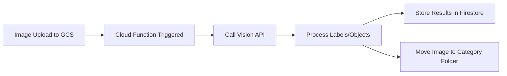

# How to Build an Image Classification Pipeline Using the Cloud Vision API and Cloud Functions

Author: [nawazdhandala](https://www.github.com/nawazdhandala)

Tags: GCP, Cloud Vision API, Cloud Functions, Serverless, Image Classification

Description: Build a serverless image classification pipeline using Google Cloud Vision API and Cloud Functions that automatically categorizes images on upload to Cloud Storage.

---

Manually classifying images does not scale. Whether you are organizing product photos, moderating user uploads, or categorizing medical images, you need an automated pipeline that processes images as they arrive. Combining Cloud Vision API with Cloud Functions gives you a serverless, event-driven pipeline that classifies images automatically when they are uploaded to Cloud Storage.

In this post, I will walk through building this pipeline from scratch, covering the Cloud Function trigger, Vision API integration, result storage, and error handling.

## Architecture Overview

The pipeline follows a straightforward event-driven pattern:



1. A user or system uploads an image to a Cloud Storage bucket
2. The upload event triggers a Cloud Function
3. The function calls Cloud Vision API for label detection and object localization
4. Results are stored in Firestore for querying
5. The image is optionally copied to a category-specific folder

## Setting Up the Project

Start by enabling the required APIs and creating the needed resources:

```bash
# Enable required APIs
gcloud services enable \
    vision.googleapis.com \
    cloudfunctions.googleapis.com \
    cloudbuild.googleapis.com \
    firestore.googleapis.com

# Create the input bucket for image uploads
gsutil mb -l us-central1 gs://your-project-image-uploads

# Create a Firestore database (if you do not have one)
gcloud firestore databases create --location=us-central1
```

## Writing the Cloud Function

Create a directory for your function with the following files:

The main function file handles the Cloud Storage event and calls Vision API:

```python
# main.py - Cloud Function for image classification
import functions_framework
from google.cloud import vision
from google.cloud import storage
from google.cloud import firestore
from datetime import datetime
import json

# Initialize clients outside the function for connection reuse
vision_client = vision.ImageAnnotatorClient()
storage_client = storage.Client()
firestore_client = firestore.Client()

# Configuration
CONFIDENCE_THRESHOLD = 0.7
MAX_LABELS = 15
RESULTS_COLLECTION = "image_classifications"

@functions_framework.cloud_event
def classify_image(cloud_event):
    """Triggered by a new file upload to the Cloud Storage bucket."""
    data = cloud_event.data
    bucket_name = data["bucket"]
    file_name = data["name"]

    # Only process image files
    supported_extensions = (".jpg", ".jpeg", ".png", ".gif", ".bmp", ".webp")
    if not file_name.lower().endswith(supported_extensions):
        print(f"Skipping non-image file: {file_name}")
        return

    print(f"Classifying image: gs://{bucket_name}/{file_name}")

    try:
        # Build the GCS URI for the uploaded image
        gcs_uri = f"gs://{bucket_name}/{file_name}"
        image = vision.Image(
            source=vision.ImageSource(gcs_image_uri=gcs_uri)
        )

        # Request multiple Vision API features in one call
        features = [
            vision.Feature(
                type_=vision.Feature.Type.LABEL_DETECTION,
                max_results=MAX_LABELS,
            ),
            vision.Feature(
                type_=vision.Feature.Type.OBJECT_LOCALIZATION,
                max_results=10,
            ),
            vision.Feature(
                type_=vision.Feature.Type.SAFE_SEARCH_DETECTION,
            ),
        ]

        request = vision.AnnotateImageRequest(image=image, features=features)
        response = vision_client.annotate_image(request=request)

        # Check for API errors
        if response.error.message:
            print(f"Vision API error: {response.error.message}")
            return

        # Process the results
        classification = process_results(response, file_name, bucket_name)

        # Store results in Firestore
        store_classification(classification)

        # Organize the image into category folders
        organize_image(bucket_name, file_name, classification)

        print(f"Classification complete: {classification['primary_category']}")

    except Exception as e:
        print(f"Error classifying {file_name}: {str(e)}")
        raise


def process_results(response, file_name, bucket_name):
    """Process Vision API response into a structured classification."""
    # Extract labels above confidence threshold
    labels = [
        {"name": label.description, "confidence": round(label.score, 3)}
        for label in response.label_annotations
        if label.score >= CONFIDENCE_THRESHOLD
    ]

    # Extract detected objects with bounding boxes
    objects = [
        {
            "name": obj.name,
            "confidence": round(obj.score, 3),
            "bounds": [
                {"x": v.x, "y": v.y}
                for v in obj.bounding_poly.normalized_vertices
            ],
        }
        for obj in response.localized_object_annotations
        if obj.score >= CONFIDENCE_THRESHOLD
    ]

    # Determine the primary category from the top label
    primary_category = labels[0]["name"] if labels else "uncategorized"

    # Check content safety
    safe = response.safe_search_annotation
    is_safe = (
        safe.adult.name in ("VERY_UNLIKELY", "UNLIKELY")
        and safe.violence.name in ("VERY_UNLIKELY", "UNLIKELY")
    )

    return {
        "file_name": file_name,
        "bucket": bucket_name,
        "gcs_uri": f"gs://{bucket_name}/{file_name}",
        "primary_category": primary_category.lower(),
        "labels": labels,
        "objects": objects,
        "is_safe": is_safe,
        "classified_at": datetime.utcnow().isoformat(),
    }


def store_classification(classification):
    """Store classification results in Firestore."""
    doc_id = classification["file_name"].replace("/", "_")

    firestore_client.collection(RESULTS_COLLECTION).document(doc_id).set(
        classification
    )

    print(f"Stored classification in Firestore: {doc_id}")


def organize_image(bucket_name, file_name, classification):
    """Copy the image to a category-based folder structure."""
    category = classification["primary_category"]
    bucket = storage_client.bucket(bucket_name)

    source_blob = bucket.blob(file_name)
    dest_name = f"classified/{category}/{file_name.split('/')[-1]}"
    dest_blob = bucket.blob(dest_name)

    # Copy to category folder
    bucket.copy_blob(source_blob, bucket, dest_name)
    print(f"Copied to: {dest_name}")
```

The requirements file lists the dependencies:

```text
# requirements.txt
functions-framework==3.*
google-cloud-vision==3.*
google-cloud-storage==2.*
google-cloud-firestore==2.*
```

## Deploying the Cloud Function

Deploy the function with a Cloud Storage trigger:

```bash
# Deploy the Cloud Function
gcloud functions deploy classify-image \
    --gen2 \
    --runtime=python311 \
    --region=us-central1 \
    --source=. \
    --entry-point=classify_image \
    --trigger-event-filters="type=google.cloud.storage.object.v1.finalized" \
    --trigger-event-filters="bucket=your-project-image-uploads" \
    --memory=512MB \
    --timeout=120s \
    --min-instances=0 \
    --max-instances=10
```

## Testing the Pipeline

Upload an image to trigger the pipeline:

```bash
# Upload a test image
gsutil cp test_photo.jpg gs://your-project-image-uploads/

# Check the function logs
gcloud functions logs read classify-image --region=us-central1 --limit=20
```

## Querying Classification Results

With results stored in Firestore, you can query them for various use cases:

```python
from google.cloud import firestore

def search_by_category(category, limit=20):
    """Find all images classified under a specific category."""
    db = firestore.Client()

    # Query Firestore for images with matching category
    query = (
        db.collection("image_classifications")
        .where("primary_category", "==", category.lower())
        .order_by("classified_at", direction=firestore.Query.DESCENDING)
        .limit(limit)
    )

    results = []
    for doc in query.stream():
        data = doc.to_dict()
        results.append({
            "file": data["file_name"],
            "labels": [l["name"] for l in data["labels"][:5]],
            "objects": [o["name"] for o in data["objects"]],
        })

    return results

def search_by_label(label_name, min_confidence=0.8):
    """Find images that contain a specific label above a confidence threshold."""
    db = firestore.Client()

    # Get all classifications and filter by label
    # Note: For large datasets, consider a more optimized data model
    docs = db.collection("image_classifications").stream()

    results = []
    for doc in docs:
        data = doc.to_dict()
        for label in data.get("labels", []):
            if label["name"].lower() == label_name.lower() and label["confidence"] >= min_confidence:
                results.append(data)
                break

    return results

# Find all food-related images
food_images = search_by_category("food")
print(f"Found {len(food_images)} food images")
```

## Adding Notification Support

Extend the pipeline to notify downstream systems when specific content is detected:

```python
from google.cloud import pubsub_v1

publisher = pubsub_v1.PublisherClient()

def notify_classification(project_id, classification):
    """Publish classification events to Pub/Sub for downstream processing."""
    topic_path = publisher.topic_path(project_id, "image-classifications")

    # Publish the classification result
    message = json.dumps(classification).encode("utf-8")

    future = publisher.publish(
        topic_path,
        message,
        category=classification["primary_category"],
        is_safe=str(classification["is_safe"]),
    )

    print(f"Published notification: {future.result()}")
```

## Error Handling and Retries

Cloud Functions automatically retry on failure for event-driven functions. Make sure your function is idempotent:

```python
def classify_image_safe(cloud_event):
    """Idempotent version that checks if already processed."""
    data = cloud_event.data
    file_name = data["name"]
    doc_id = file_name.replace("/", "_")

    # Check if already classified (idempotency check)
    existing = firestore_client.collection(RESULTS_COLLECTION).document(doc_id).get()
    if existing.exists:
        print(f"Already classified: {file_name}, skipping")
        return

    # Proceed with classification
    classify_image(cloud_event)
```

## Wrapping Up

This pipeline gives you a fully automated, serverless image classification system that scales with demand. Images are classified as soon as they are uploaded, results are stored for querying, and everything runs without managing any servers. The combination of Cloud Storage triggers, Cloud Functions, and Vision API creates a clean, maintainable architecture.

For monitoring the health of your classification pipeline, tracking function execution rates, and alerting on failures, [OneUptime](https://oneuptime.com) provides the observability tools you need to keep your serverless systems running smoothly.
