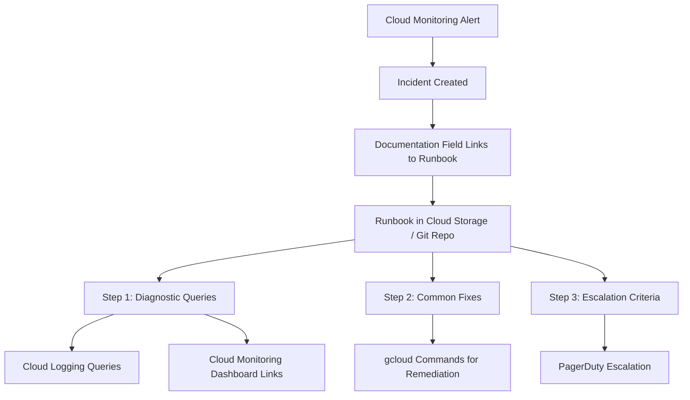

# How to Build an Incident Response Runbook System Using Google Cloud Operations Suite

Author: [nawazdhandala](https://www.github.com/nawazdhandala)

Tags: GCP, Incident Response, Runbooks, Cloud Operations Suite, SRE, Google Cloud Monitoring

Description: Learn how to build a structured incident response runbook system integrated with Google Cloud Operations Suite for faster and more consistent incident resolution.

---

Every on-call engineer has been there. It is 2 AM, your phone buzzes with a page, and you are staring at an alert that says something vague like "High CPU on instance-group-1." You know there is a runbook somewhere, but you cannot find it. Maybe it is in a Google Doc. Maybe it is in Confluence. Maybe it was in someone's head and they left the company six months ago.

A runbook system that is tightly integrated with your monitoring and alerting infrastructure solves this problem. When an alert fires, the runbook should be right there in the incident, telling the responder exactly what to check and what to do. Google Cloud Operations Suite provides the pieces you need to build this: Cloud Monitoring for alerting, documentation fields on alerting policies, and Cloud Logging for diagnostic steps.

## What Makes a Good Runbook

Before building the system, let us define what a good runbook actually looks like. A runbook should answer these questions for the on-call engineer:

1. What does this alert mean in plain language?
2. What is the likely impact on users?
3. What should I check first?
4. What are the common fixes?
5. When should I escalate, and to whom?

Each runbook should be short enough to read in under five minutes and specific enough to be actionable. Generic advice like "check the logs" is not helpful. "Run this specific query in Cloud Logging to find the error" is.

## Architecture of the Runbook System

Here is the overall architecture for a runbook system built on GCP:



## Step 1: Structure Your Runbooks

Store your runbooks in a Git repository so they are version-controlled and reviewable. Use a consistent structure for every runbook. Here is a template:

```markdown
# Runbook: [Alert Name]

## Alert Description
What this alert means and why it fires.

## Impact Assessment
- Who is affected (users, internal services, background jobs)
- Severity: Critical / High / Medium / Low

## Diagnostic Steps
1. Check the dashboard: [link to Cloud Monitoring dashboard]
2. Run this Cloud Logging query: [query]
3. Check recent deployments: [link to deployment history]

## Common Causes and Fixes
### Cause 1: [Description]
- How to verify: [command or query]
- How to fix: [steps]

### Cause 2: [Description]
- How to verify: [command or query]
- How to fix: [steps]

## Escalation
- If not resolved within 30 minutes, escalate to [team/person]
- Page: [PagerDuty escalation policy]
```

## Step 2: Link Runbooks to Alerting Policies

Google Cloud Monitoring alerting policies have a documentation field that supports Markdown. Use this field to include the runbook content directly, or link to the full runbook in your repository.

Here is how to create an alerting policy with embedded runbook documentation:

```bash
# Create an alerting policy with inline runbook documentation
gcloud alpha monitoring policies create \
  --display-name="High Error Rate - API Gateway" \
  --condition-display-name="5xx error rate above 5%" \
  --condition-filter='resource.type="cloud_run_revision" AND resource.labels.service_name="api-gateway" AND metric.type="run.googleapis.com/request_count" AND metric.labels.response_code_class="5xx"' \
  --condition-threshold-value=0.05 \
  --condition-threshold-comparison=COMPARISON_GT \
  --condition-threshold-duration=300s \
  --notification-channels=projects/my-project/notificationChannels/12345 \
  --documentation-content='## Runbook: High Error Rate - API Gateway

### What is happening
The API Gateway is returning more than 5% 5xx errors. Users are likely experiencing failures.

### Check first
1. Open the [API Gateway Dashboard](https://console.cloud.google.com/monitoring/dashboards/custom/api-gateway?project=my-project)
2. Check Cloud Logging: resource.type="cloud_run_revision" AND resource.labels.service_name="api-gateway" AND severity>=ERROR
3. Check if a deployment happened recently: gcloud run revisions list --service=api-gateway --region=us-central1

### Common fixes
- **Bad deployment**: Roll back with `gcloud run services update-traffic api-gateway --to-revisions=PREVIOUS_REVISION=100 --region=us-central1`
- **Downstream dependency down**: Check status of dependent services in the Services dashboard
- **Resource exhaustion**: Scale up with `gcloud run services update api-gateway --max-instances=100 --region=us-central1`

### Escalation
If not resolved in 30 minutes, escalate to the Platform Team lead.' \
  --documentation-mime-type="text/markdown"
```

## Step 3: Build Diagnostic Dashboards

Each runbook should reference a specific Cloud Monitoring dashboard that shows the metrics relevant to that alert. Create focused dashboards for each service:

```json
{
  "displayName": "API Gateway - Incident Dashboard",
  "mosaicLayout": {
    "tiles": [
      {
        "width": 6,
        "height": 4,
        "widget": {
          "title": "Request Rate by Response Code",
          "xyChart": {
            "dataSets": [
              {
                "timeSeriesQuery": {
                  "timeSeriesFilter": {
                    "filter": "resource.type=\"cloud_run_revision\" AND resource.labels.service_name=\"api-gateway\" AND metric.type=\"run.googleapis.com/request_count\"",
                    "aggregation": {
                      "alignmentPeriod": "60s",
                      "perSeriesAligner": "ALIGN_RATE",
                      "groupByFields": ["metric.labels.response_code_class"]
                    }
                  }
                },
                "plotType": "STACKED_AREA"
              }
            ]
          }
        }
      },
      {
        "xPos": 6,
        "width": 6,
        "height": 4,
        "widget": {
          "title": "P99 Latency",
          "xyChart": {
            "dataSets": [
              {
                "timeSeriesQuery": {
                  "timeSeriesFilter": {
                    "filter": "resource.type=\"cloud_run_revision\" AND resource.labels.service_name=\"api-gateway\" AND metric.type=\"run.googleapis.com/request_latencies\"",
                    "aggregation": {
                      "alignmentPeriod": "60s",
                      "perSeriesAligner": "ALIGN_PERCENTILE_99"
                    }
                  }
                },
                "plotType": "LINE"
              }
            ]
          }
        }
      }
    ]
  }
}
```

Deploy the dashboard:

```bash
# Create the diagnostic dashboard
gcloud monitoring dashboards create \
  --config-from-file=api-gateway-incident-dashboard.json \
  --project=my-project
```

## Step 4: Embed Cloud Logging Queries in Runbooks

The most useful part of a runbook is often the diagnostic query. Instead of making the on-call engineer figure out the right log query, give it to them pre-built.

Here are example Cloud Logging queries to include in runbooks:

```
# Find all errors in the API Gateway in the last hour
resource.type="cloud_run_revision"
resource.labels.service_name="api-gateway"
severity>=ERROR
timestamp>="2026-02-17T00:00:00Z"

# Find slow requests (over 5 seconds)
resource.type="cloud_run_revision"
resource.labels.service_name="api-gateway"
httpRequest.latency>"5s"

# Check for recent deployment events
resource.type="cloud_run_revision"
resource.labels.service_name="api-gateway"
protoPayload.methodName="google.cloud.run.v1.Services.ReplaceService"
```

You can generate clickable Cloud Logging links that pre-populate the query. The URL format is:

```
https://console.cloud.google.com/logs/query;query=ENCODED_QUERY?project=my-project
```

## Step 5: Automate Runbook Updates

Runbooks go stale fast. Automate checks to ensure your runbooks stay current:

```python
import os
import json
from google.cloud import monitoring_v3

def audit_runbook_coverage(project_id):
    """Check that every alerting policy has runbook documentation."""
    client = monitoring_v3.AlertPolicyServiceClient()
    project_name = f"projects/{project_id}"

    policies = client.list_alert_policies(name=project_name)

    missing_runbooks = []
    outdated_runbooks = []

    for policy in policies:
        # Check if documentation exists
        if not policy.documentation or not policy.documentation.content:
            missing_runbooks.append(policy.display_name)
            continue

        # Check if documentation contains required sections
        content = policy.documentation.content
        required_sections = [
            "What is happening",
            "Check first",
            "Common fixes",
            "Escalation",
        ]

        for section in required_sections:
            if section.lower() not in content.lower():
                outdated_runbooks.append(
                    f"{policy.display_name}: missing '{section}' section"
                )

    # Report findings
    if missing_runbooks:
        print("Policies missing runbooks:")
        for name in missing_runbooks:
            print(f"  - {name}")

    if outdated_runbooks:
        print("Policies with incomplete runbooks:")
        for issue in outdated_runbooks:
            print(f"  - {issue}")

    return len(missing_runbooks) == 0 and len(outdated_runbooks) == 0

# Run the audit
audit_runbook_coverage("my-project")
```

Run this audit script weekly as part of your CI/CD pipeline or as a scheduled Cloud Function. It checks that every alerting policy has documentation and that the documentation includes all required sections.

## Step 6: Track Runbook Effectiveness

After incidents, track whether the runbook was used and whether it helped. Add a question to your post-incident review template: "Was the runbook accurate and helpful?" Feed this data back into runbook improvements.

You can store this data in BigQuery and build a dashboard showing runbook usage and effectiveness over time. Track metrics like the percentage of incidents where the runbook led to resolution, average time to resolution for incidents with runbooks versus without, and how often runbooks need updating after an incident.

## Summary

A good runbook system is not just documentation - it is an integrated part of your incident response infrastructure. By embedding runbooks directly in Google Cloud Monitoring alerting policies, linking them to diagnostic dashboards and pre-built log queries, and automating coverage audits, you create a system where on-call engineers always have the information they need right when they need it. Start with your top five most common alerts, write solid runbooks for each, and expand from there.
