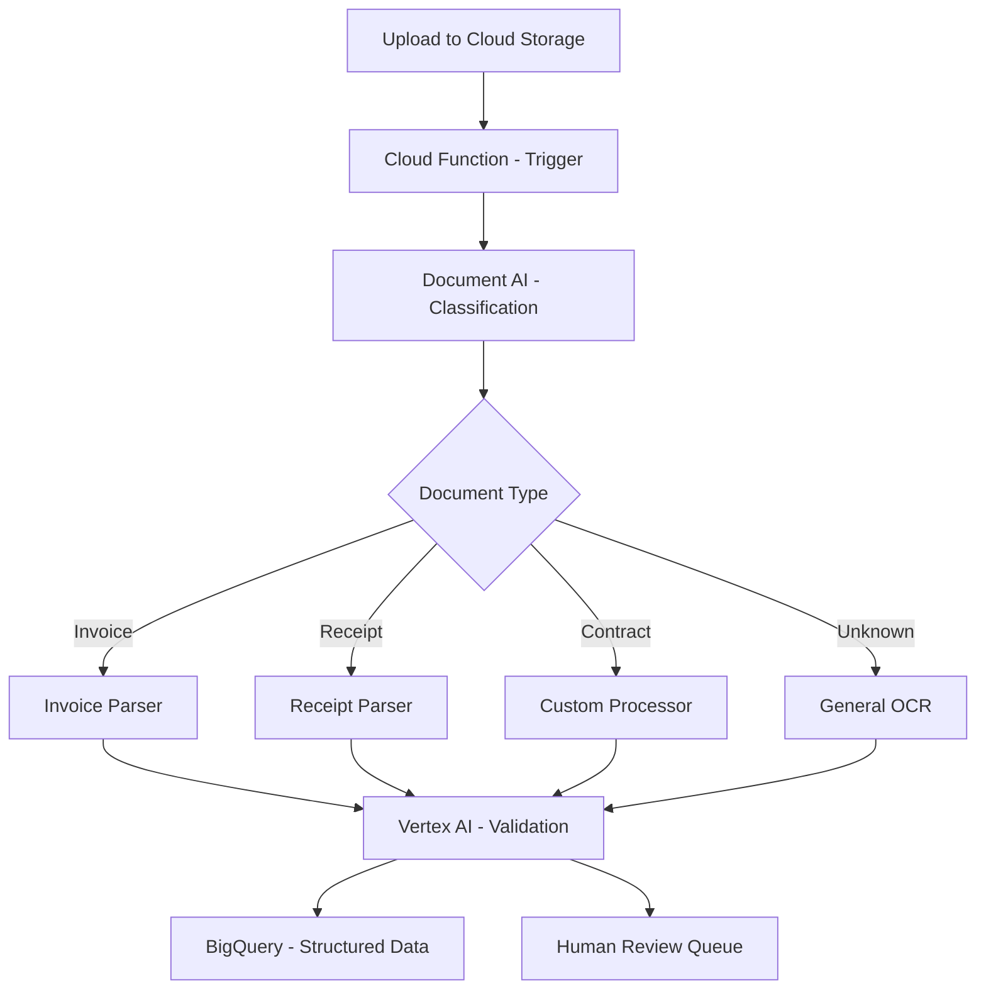

# How to Build an Intelligent Document Processing Pipeline with Document AI and Vertex AI

Author: [nawazdhandala](https://www.github.com/nawazdhandala)

Tags: GCP, Document AI, Vertex AI, Document Processing, OCR, AI, Google Cloud

Description: Build an intelligent document processing pipeline combining Google Document AI for extraction and Vertex AI for classification and enrichment on GCP.

---

Processing documents manually is one of those problems that seems small until you see the actual volume. Insurance claims, purchase orders, invoices, contracts - organizations handle thousands of these daily, and someone has to read each one, extract the relevant data, and enter it into a system. Document AI on Google Cloud automates the extraction part, and when you combine it with Vertex AI for classification and validation, you get an end-to-end pipeline that handles documents with minimal human intervention.

## Pipeline Architecture

Documents come in through Cloud Storage, get classified by type, then routed to the appropriate Document AI processor for extraction. Vertex AI handles post-processing validation and enrichment.



## Prerequisites

Enable the required APIs:

```bash
# Enable Document AI, Vertex AI, and supporting services
gcloud services enable \
    documentai.googleapis.com \
    aiplatform.googleapis.com \
    storage.googleapis.com \
    cloudfunctions.googleapis.com \
    bigquery.googleapis.com \
    --project=your-project-id
```

Install the Python packages:

```bash
pip install google-cloud-documentai google-cloud-aiplatform google-cloud-storage google-cloud-bigquery
```

## Step 1: Create Document AI Processors

Set up processors for each document type you need to handle:

```python
# setup_processors.py - Create Document AI processors
from google.cloud import documentai_v1 as documentai

client = documentai.DocumentProcessorServiceClient()
parent = client.common_location_path("your-project-id", "us")

# Create an invoice parser - uses Google's pre-trained model
invoice_processor = client.create_processor(
    parent=parent,
    processor=documentai.Processor(
        display_name="invoice-parser",
        type_="INVOICE_PROCESSOR",
    ),
)
print(f"Invoice processor: {invoice_processor.name}")

# Create a receipt parser
receipt_processor = client.create_processor(
    parent=parent,
    processor=documentai.Processor(
        display_name="receipt-parser",
        type_="EXPENSE_PROCESSOR",
    ),
)
print(f"Receipt processor: {receipt_processor.name}")

# Create a general OCR processor for unknown document types
ocr_processor = client.create_processor(
    parent=parent,
    processor=documentai.Processor(
        display_name="general-ocr",
        type_="OCR_PROCESSOR",
    ),
)
print(f"OCR processor: {ocr_processor.name}")
```

## Step 2: Build the Document Classification Module

Use Gemini to classify incoming documents before routing them to the right processor:

```python
# classifier.py - Classify documents using Gemini's vision capabilities
import vertexai
from vertexai.generative_models import GenerativeModel, Part
import json

vertexai.init(project="your-project-id", location="us-central1")
model = GenerativeModel("gemini-2.0-flash")

def classify_document(document_bytes, mime_type="application/pdf"):
    """Classify a document by sending it to Gemini for visual analysis.
    Returns the document type and confidence score."""

    prompt = """Look at this document and classify it into one of these categories:
    - invoice
    - receipt
    - contract
    - purchase_order
    - tax_form
    - unknown

    Return a JSON object with:
    - document_type: one of the categories above
    - confidence: float from 0.0 to 1.0
    - language: detected language code (e.g., "en", "es", "de")
    - page_count_estimate: estimated number of pages

    Return ONLY the JSON object."""

    # Send the document as a multimodal input
    document_part = Part.from_data(data=document_bytes, mime_type=mime_type)

    response = model.generate_content(
        [prompt, document_part],
        generation_config={"temperature": 0.1, "max_output_tokens": 256}
    )

    return json.loads(response.text)
```

## Step 3: Process Documents with Document AI

Create the extraction module that sends documents to the right processor:

```python
# extractor.py - Extract structured data using Document AI
from google.cloud import documentai_v1 as documentai

client = documentai.DocumentProcessorServiceClient()

# Map document types to processor names
PROCESSORS = {
    "invoice": "projects/your-project-id/locations/us/processors/INVOICE_PROCESSOR_ID",
    "receipt": "projects/your-project-id/locations/us/processors/RECEIPT_PROCESSOR_ID",
    "default": "projects/your-project-id/locations/us/processors/OCR_PROCESSOR_ID",
}

def extract_document_data(document_bytes, mime_type, document_type):
    """Send a document to the appropriate Document AI processor.
    Returns structured entities and full text content."""

    processor_name = PROCESSORS.get(document_type, PROCESSORS["default"])

    # Build the processing request
    raw_document = documentai.RawDocument(
        content=document_bytes,
        mime_type=mime_type,
    )

    request = documentai.ProcessRequest(
        name=processor_name,
        raw_document=raw_document,
    )

    result = client.process_document(request=request)
    document = result.document

    # Extract entities into a clean dictionary
    entities = {}
    for entity in document.entities:
        field_name = entity.type_
        field_value = entity.mention_text
        confidence = entity.confidence

        # Store with confidence for downstream validation
        entities[field_name] = {
            "value": field_value,
            "confidence": confidence,
        }

    return {
        "text": document.text,
        "entities": entities,
        "pages": len(document.pages),
    }
```

## Step 4: Validate and Enrich with Vertex AI

After extraction, use Gemini to validate the data and catch errors:

```python
# validator.py - Validate extracted data using Gemini
import vertexai
from vertexai.generative_models import GenerativeModel
import json

vertexai.init(project="your-project-id", location="us-central1")
model = GenerativeModel("gemini-2.0-flash")

def validate_extraction(extracted_data, document_type):
    """Use Gemini to validate extracted data and flag potential errors.
    This catches issues like misread numbers, swapped fields, etc."""

    prompt = f"""You are validating data extracted from a {document_type}.
Check the following extracted fields for errors, inconsistencies, or missing required fields.

Extracted data:
{json.dumps(extracted_data['entities'], indent=2)}

Full document text (for reference):
{extracted_data['text'][:2000]}

Return a JSON object with:
- is_valid: boolean - true if all critical fields look correct
- issues: array of objects with "field", "issue", and "severity" (low/medium/high)
- corrections: object mapping field names to corrected values (only for fields with errors)
- missing_fields: array of required field names that are missing
- needs_human_review: boolean - true if any high-severity issues found

Return ONLY the JSON object."""

    response = model.generate_content(
        prompt,
        generation_config={"temperature": 0.1, "max_output_tokens": 1024}
    )

    return json.loads(response.text)
```

## Step 5: The Orchestrator Cloud Function

Tie everything together with a Cloud Function triggered by file uploads:

```python
# main.py - Orchestrator triggered by Cloud Storage uploads
import functions_framework
from google.cloud import storage, bigquery
from classifier import classify_document
from extractor import extract_document_data
from validator import validate_extraction
import json
from datetime import datetime

storage_client = storage.Client()
bq_client = bigquery.Client()

@functions_framework.cloud_event
def process_document(cloud_event):
    """Main pipeline: classify, extract, validate, and store document data."""

    # Get the uploaded file details from the event
    data = cloud_event.data
    bucket_name = data["bucket"]
    file_name = data["name"]

    # Skip non-document files
    if not file_name.lower().endswith((".pdf", ".png", ".jpg", ".tiff")):
        return

    # Download the file
    bucket = storage_client.bucket(bucket_name)
    blob = bucket.blob(file_name)
    document_bytes = blob.download_as_bytes()

    # Determine MIME type
    mime_map = {".pdf": "application/pdf", ".png": "image/png",
                ".jpg": "image/jpeg", ".tiff": "image/tiff"}
    ext = "." + file_name.rsplit(".", 1)[-1].lower()
    mime_type = mime_map.get(ext, "application/pdf")

    # Step 1: Classify the document
    classification = classify_document(document_bytes, mime_type)
    doc_type = classification["document_type"]

    # Step 2: Extract structured data
    extracted = extract_document_data(document_bytes, mime_type, doc_type)

    # Step 3: Validate the extraction
    validation = validate_extraction(extracted, doc_type)

    # Step 4: Store results in BigQuery
    record = {
        "file_name": file_name,
        "document_type": doc_type,
        "classification_confidence": classification["confidence"],
        "entities": json.dumps(extracted["entities"]),
        "validation_result": json.dumps(validation),
        "needs_review": validation.get("needs_human_review", False),
        "processed_at": datetime.utcnow().isoformat(),
    }

    table_ref = bq_client.dataset("document_processing").table("processed_documents")
    bq_client.insert_rows_json(table_ref, [record])

    print(f"Processed {file_name}: type={doc_type}, valid={validation.get('is_valid')}")
```

Deploy the function:

```bash
# Deploy triggered by Cloud Storage uploads
gcloud functions deploy process-document \
    --gen2 \
    --runtime=python311 \
    --region=us-central1 \
    --source=./document-pipeline \
    --entry-point=process_document \
    --trigger-bucket=your-document-upload-bucket \
    --memory=1GB \
    --timeout=300s
```

## Handling Large Documents

For documents with many pages, use Document AI's batch processing mode instead of the synchronous API. Batch processing handles documents up to 5,000 pages and runs asynchronously:

```python
# Use batch processing for large documents
from google.cloud import documentai_v1 as documentai

def batch_process(gcs_input_uri, gcs_output_uri, processor_name):
    """Process large documents asynchronously using batch mode."""
    client = documentai.DocumentProcessorServiceClient()

    gcs_document = documentai.GcsDocument(
        gcs_uri=gcs_input_uri,
        mime_type="application/pdf",
    )

    input_config = documentai.BatchDocumentsInputConfig(
        gcs_documents=documentai.GcsDocuments(documents=[gcs_document])
    )

    output_config = documentai.DocumentOutputConfig(
        gcs_output_config=documentai.DocumentOutputConfig.GcsOutputConfig(
            gcs_uri=gcs_output_uri
        )
    )

    # Start the batch operation - returns a long-running operation
    operation = client.batch_process_documents(
        request=documentai.BatchProcessRequest(
            name=processor_name,
            input_documents=input_config,
            document_output_config=output_config,
        )
    )

    # Wait for completion
    result = operation.result(timeout=600)
    return result
```

## Monitoring the Pipeline

Track processing volume, error rates, and extraction confidence scores. Use OneUptime to monitor your Cloud Functions, Document AI API availability, and end-to-end processing latency. Set alerts for when the human review queue grows beyond your team's capacity to handle it.

## Summary

Combining Document AI for extraction with Vertex AI for classification and validation gives you an intelligent document processing pipeline that handles diverse document types accurately. The key is layering the services - Document AI handles the OCR and entity extraction it was built for, while Gemini fills in the gaps with classification and validation logic that would be hard to build with rules alone. Start with your highest-volume document type, validate the extraction accuracy, and expand to other types once the pipeline is proven.
