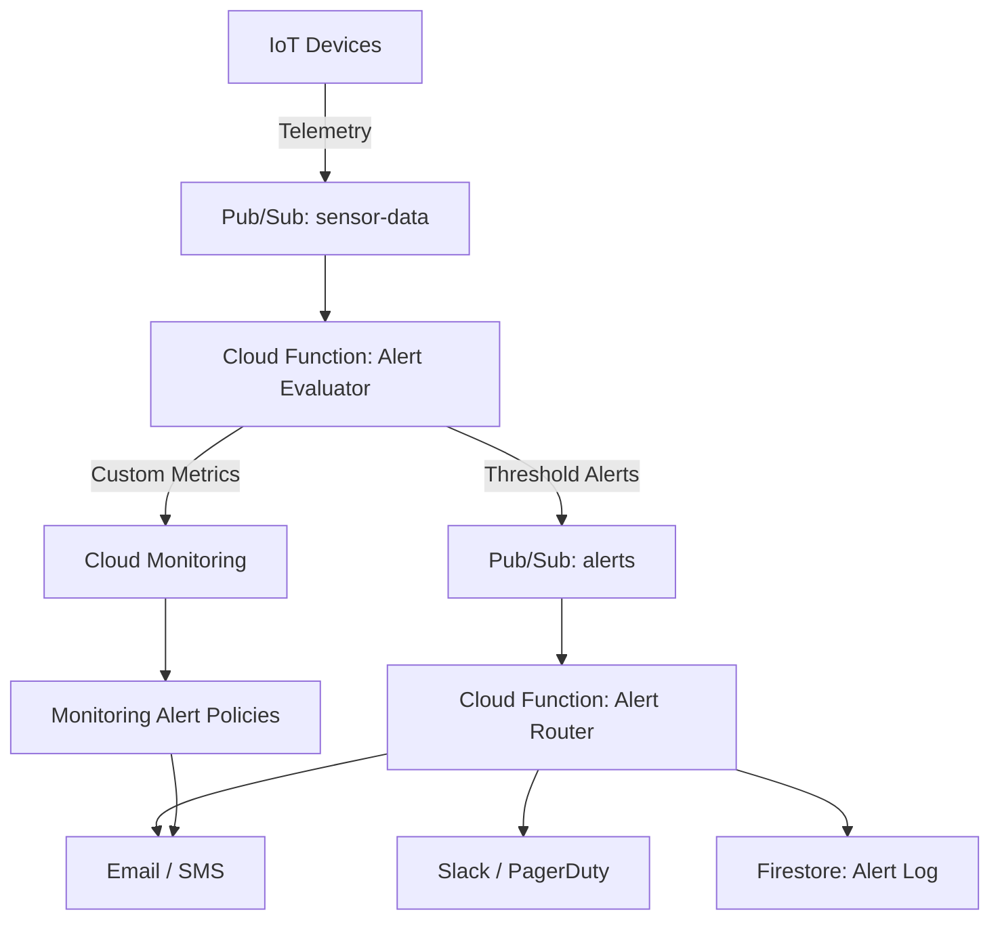

# How to Build an IoT Alerting System with Pub/Sub Cloud Functions and Google Cloud Monitoring

Author: [nawazdhandala](https://www.github.com/nawazdhandala)

Tags: GCP, IoT, Alerting, Cloud Functions, Cloud Monitoring

Description: Build a real-time IoT alerting system using Pub/Sub for message ingestion, Cloud Functions for processing, and Cloud Monitoring for alerting.

---

IoT systems generate data constantly, but not all data points are equal. When a temperature sensor reads 22C, that is business as usual. When it reads 85C, something is probably on fire. You need an alerting system that processes sensor data in real time and triggers notifications when thresholds are crossed or anomalous patterns emerge.

In this guide, I will build a complete IoT alerting pipeline using Pub/Sub for data ingestion, Cloud Functions for alert evaluation, and Cloud Monitoring for notification delivery.

## System Architecture

The system has three layers: data ingestion, alert evaluation, and notification delivery.



## Prerequisites

- GCP project with Cloud Functions, Pub/Sub, Cloud Monitoring, and Firestore APIs enabled
- Notification channels configured in Cloud Monitoring (email, Slack, PagerDuty, etc.)
- IoT devices publishing telemetry to Pub/Sub

## Step 1: Create the Infrastructure

Set up the Pub/Sub topics and Firestore collections:

```bash
# Topic for incoming sensor data
gcloud pubsub topics create sensor-data

# Topic for evaluated alerts
gcloud pubsub topics create sensor-alerts

# Topic for resolved alerts (when conditions return to normal)
gcloud pubsub topics create alert-resolved

# Subscription for alert processing
gcloud pubsub subscriptions create sensor-alerts-sub \
  --topic=sensor-alerts
```

## Step 2: Define Alert Rules

Store alert rules in Firestore so they can be updated without redeploying the function:

```python
# setup_alert_rules.py - Initializes alert rules in Firestore

from google.cloud import firestore

db = firestore.Client()

# Define alert rules per sensor type
alert_rules = [
    {
        "rule_id": "high-temperature",
        "sensor_type": "temperature",
        "condition": "above",
        "threshold": 60.0,
        "severity": "critical",
        "message": "Temperature exceeds safe operating range",
        "cooldown_seconds": 300,  # Do not re-alert for 5 minutes
        "enabled": True,
    },
    {
        "rule_id": "low-battery",
        "sensor_type": "battery",
        "condition": "below",
        "threshold": 15.0,
        "severity": "warning",
        "message": "Device battery critically low",
        "cooldown_seconds": 3600,  # Alert at most once per hour
        "enabled": True,
    },
    {
        "rule_id": "high-humidity",
        "sensor_type": "humidity",
        "condition": "above",
        "threshold": 90.0,
        "severity": "warning",
        "message": "Humidity exceeds safe range for equipment",
        "cooldown_seconds": 600,
        "enabled": True,
    },
    {
        "rule_id": "pressure-drop",
        "sensor_type": "pressure",
        "condition": "below",
        "threshold": 950.0,
        "severity": "warning",
        "message": "Atmospheric pressure dropped below threshold",
        "cooldown_seconds": 1800,
        "enabled": True,
    },
    {
        "rule_id": "device-offline",
        "sensor_type": "heartbeat",
        "condition": "missing",
        "threshold": 300,  # No heartbeat for 5 minutes
        "severity": "critical",
        "message": "Device has stopped sending data",
        "cooldown_seconds": 900,
        "enabled": True,
    },
]

# Write rules to Firestore
for rule in alert_rules:
    db.collection("alert_rules").document(rule["rule_id"]).set(rule)
    print(f"Created alert rule: {rule['rule_id']}")
```

## Step 3: Build the Alert Evaluator Function

This Cloud Function processes every sensor message and checks it against the alert rules:

```python
# alert_evaluator/main.py - Evaluates sensor data against alert rules

import json
import time
import base64
from google.cloud import firestore
from google.cloud import pubsub_v1
import functions_framework

db = firestore.Client()
publisher = pubsub_v1.PublisherClient()
PROJECT_ID = "your-project-id"

# Cache alert rules to avoid reading Firestore on every invocation
_rules_cache = None
_rules_cache_time = 0
RULES_CACHE_TTL = 60  # Refresh rules every 60 seconds

def get_alert_rules():
    """Fetches alert rules from Firestore with caching.
    Rules are cached for 60 seconds to reduce Firestore reads."""
    global _rules_cache, _rules_cache_time

    if _rules_cache and (time.time() - _rules_cache_time) < RULES_CACHE_TTL:
        return _rules_cache

    rules = {}
    docs = db.collection("alert_rules").where("enabled", "==", True).stream()
    for doc in docs:
        rule = doc.to_dict()
        sensor_type = rule["sensor_type"]
        if sensor_type not in rules:
            rules[sensor_type] = []
        rules[sensor_type].append(rule)

    _rules_cache = rules
    _rules_cache_time = time.time()
    return rules

def check_cooldown(device_id, rule_id):
    """Checks if an alert is in cooldown period for this device.
    Returns True if we should suppress the alert."""
    doc = db.collection("alert_cooldowns").document(
        f"{device_id}_{rule_id}"
    ).get()

    if doc.exists:
        last_alert = doc.to_dict().get("last_alert_time", 0)
        cooldown = doc.to_dict().get("cooldown_seconds", 0)
        if time.time() - last_alert < cooldown:
            return True
    return False

def set_cooldown(device_id, rule_id, cooldown_seconds):
    """Records when an alert was fired to enforce cooldown periods."""
    db.collection("alert_cooldowns").document(
        f"{device_id}_{rule_id}"
    ).set({
        "last_alert_time": time.time(),
        "cooldown_seconds": cooldown_seconds,
        "device_id": device_id,
        "rule_id": rule_id,
    })

def evaluate_condition(value, condition, threshold):
    """Evaluates a single alert condition against a sensor value."""
    if condition == "above":
        return value > threshold
    elif condition == "below":
        return value < threshold
    elif condition == "equals":
        return value == threshold
    return False

@functions_framework.cloud_event
def evaluate_alerts(cloud_event):
    """Main entry point. Processes a sensor data message and
    checks all applicable alert rules."""

    # Decode the Pub/Sub message
    data = base64.b64decode(cloud_event.data["message"]["data"])
    message = json.loads(data)

    device_id = message.get("device_id", "unknown")
    sensor_type = message.get("sensor_type", "")
    value = message.get("value")
    timestamp = message.get("timestamp", int(time.time() * 1000))

    if value is None:
        return

    # Get applicable rules for this sensor type
    rules = get_alert_rules()
    applicable_rules = rules.get(sensor_type, [])

    for rule in applicable_rules:
        # Check if the condition is met
        triggered = evaluate_condition(value, rule["condition"], rule["threshold"])

        if triggered:
            # Check cooldown to prevent alert fatigue
            if check_cooldown(device_id, rule["rule_id"]):
                continue

            # Fire the alert
            alert = {
                "alert_id": f"{device_id}_{rule['rule_id']}_{timestamp}",
                "device_id": device_id,
                "rule_id": rule["rule_id"],
                "sensor_type": sensor_type,
                "value": value,
                "threshold": rule["threshold"],
                "condition": rule["condition"],
                "severity": rule["severity"],
                "message": rule["message"],
                "timestamp": timestamp,
                "fired_at": int(time.time() * 1000),
            }

            # Publish to the alerts topic
            topic_path = publisher.topic_path(PROJECT_ID, "sensor-alerts")
            publisher.publish(
                topic_path,
                data=json.dumps(alert).encode("utf-8"),
                severity=rule["severity"],
                device_id=device_id,
            )

            # Set cooldown
            set_cooldown(device_id, rule["rule_id"], rule["cooldown_seconds"])

            # Log the alert to Firestore
            db.collection("alert_history").add(alert)

            print(f"Alert fired: {rule['rule_id']} for device {device_id}")
```

## Step 4: Build the Alert Router

The router sends alerts to the appropriate notification channels based on severity:

```python
# alert_router/main.py - Routes alerts to notification channels

import json
import base64
import requests
from google.cloud import firestore
import functions_framework

db = firestore.Client()

# Notification channel configuration
SLACK_WEBHOOK = "https://hooks.slack.com/services/YOUR/SLACK/WEBHOOK"
PAGERDUTY_KEY = "your-pagerduty-integration-key"

def send_slack_notification(alert):
    """Sends an alert notification to Slack with color coding by severity."""
    color = "#ff0000" if alert["severity"] == "critical" else "#ffaa00"

    payload = {
        "attachments": [{
            "color": color,
            "title": f"IoT Alert: {alert['rule_id']}",
            "text": alert["message"],
            "fields": [
                {"title": "Device", "value": alert["device_id"], "short": True},
                {"title": "Severity", "value": alert["severity"], "short": True},
                {"title": "Value", "value": str(alert["value"]), "short": True},
                {"title": "Threshold", "value": str(alert["threshold"]), "short": True},
            ],
        }]
    }
    requests.post(SLACK_WEBHOOK, json=payload, timeout=10)

def trigger_pagerduty(alert):
    """Creates a PagerDuty incident for critical alerts."""
    payload = {
        "routing_key": PAGERDUTY_KEY,
        "event_action": "trigger",
        "dedup_key": f"{alert['device_id']}_{alert['rule_id']}",
        "payload": {
            "summary": f"{alert['message']} - Device: {alert['device_id']}",
            "severity": alert["severity"],
            "source": alert["device_id"],
            "custom_details": {
                "sensor_type": alert["sensor_type"],
                "value": alert["value"],
                "threshold": alert["threshold"],
            },
        },
    }
    requests.post(
        "https://events.pagerduty.com/v2/enqueue",
        json=payload,
        timeout=10,
    )

@functions_framework.cloud_event
def route_alert(cloud_event):
    """Routes alerts to the appropriate notification channels
    based on severity level."""

    data = base64.b64decode(cloud_event.data["message"]["data"])
    alert = json.loads(data)
    severity = alert.get("severity", "info")

    # All alerts go to Slack
    send_slack_notification(alert)

    # Critical alerts also trigger PagerDuty
    if severity == "critical":
        trigger_pagerduty(alert)

    print(f"Routed {severity} alert for device {alert['device_id']}")
```

Deploy both functions:

```bash
# Deploy the alert evaluator
gcloud functions deploy evaluate-alerts \
  --gen2 \
  --runtime=python311 \
  --trigger-topic=sensor-data \
  --region=us-central1 \
  --memory=256MB \
  --entry-point=evaluate_alerts

# Deploy the alert router
gcloud functions deploy route-alerts \
  --gen2 \
  --runtime=python311 \
  --trigger-topic=sensor-alerts \
  --region=us-central1 \
  --memory=256MB \
  --entry-point=route_alert
```

## Step 5: Test the Alerting System

Publish a test message that should trigger an alert:

```bash
# Publish a high temperature reading that exceeds the threshold
gcloud pubsub topics publish sensor-data \
  --message='{"device_id":"sensor-042","sensor_type":"temperature","value":75.5,"timestamp":1708200000000}'
```

You should see the alert appear in Slack within a few seconds and, if critical, in PagerDuty as well.

## Wrapping Up

This alerting system gives you real-time, rule-based alerts across your IoT fleet without managing any servers. The Firestore-backed rules engine means you can add, modify, or disable alert rules without redeploying code. The cooldown mechanism prevents alert fatigue, and the severity-based routing ensures critical issues get immediate attention through the right channels. For production use, add alert acknowledgment and resolution tracking to close the loop.
