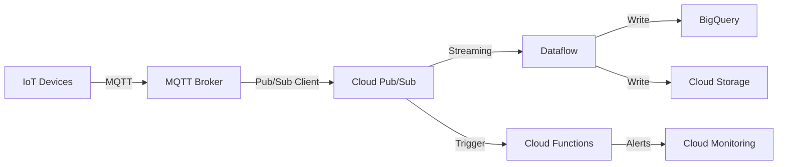

# How to Build an IoT Telemetry Pipeline on Google Cloud Using Pub/Sub and Dataflow After IoT Core Retirement

Author: [nawazdhandala](https://www.github.com/nawazdhandala)

Tags: GCP, IoT, Pub/Sub, Dataflow, Telemetry

Description: Build a production-ready IoT telemetry pipeline on Google Cloud using Pub/Sub and Dataflow now that IoT Core has been retired.

---

Google Cloud IoT Core was officially retired in August 2023, and if you are building a new IoT project on GCP or migrating an existing one, you need a different approach. The good news is that Pub/Sub and Dataflow - the core data processing components that most IoT Core setups relied on anyway - are still very much alive and capable of handling IoT telemetry at scale.

In this post, I will walk through building a complete IoT telemetry pipeline that ingests device data through Pub/Sub, processes it with Dataflow, and stores it in BigQuery for analysis.

## The Post-IoT Core Architecture

With IoT Core gone, the architecture shifts to using third-party MQTT brokers (like EMQX, HiveMQ, or Mosquitto) for device connectivity, while keeping Pub/Sub as the central message bus and Dataflow for stream processing.

Here is what the pipeline looks like:



The MQTT broker handles device connections, authentication, and the MQTT protocol. It then forwards messages to Pub/Sub, which acts as the durable, scalable message queue. Dataflow picks up messages from Pub/Sub, transforms them, and writes them to your storage layer.

## Prerequisites

You need a GCP project with billing enabled and the following APIs turned on:

- Cloud Pub/Sub API
- Dataflow API
- BigQuery API
- Cloud Storage API

You will also need the `gcloud` CLI installed and an MQTT broker deployed somewhere accessible to your devices.

## Step 1: Create Pub/Sub Topics and Subscriptions

Start by creating the Pub/Sub infrastructure. You need a topic for incoming telemetry and a subscription for Dataflow to read from.

```bash
# Create the main telemetry topic where device data arrives
gcloud pubsub topics create iot-telemetry

# Create a dead-letter topic for messages that fail processing
gcloud pubsub topics create iot-telemetry-dead-letter

# Create a subscription for Dataflow to pull from
gcloud pubsub subscriptions create iot-telemetry-sub \
  --topic=iot-telemetry \
  --ack-deadline=60 \
  --dead-letter-topic=iot-telemetry-dead-letter \
  --max-delivery-attempts=5
```

## Step 2: Define Your Telemetry Message Schema

It helps to define a clear schema for your telemetry messages. Pub/Sub supports schema validation, which prevents malformed data from entering your pipeline.

```bash
# Create a schema definition file (schema.json)
# This defines the structure every telemetry message must follow
```

Create a file called `schema.json`:

```json
{
  "type": "record",
  "name": "IoTTelemetry",
  "fields": [
    {"name": "device_id", "type": "string"},
    {"name": "timestamp", "type": "long"},
    {"name": "temperature", "type": "float"},
    {"name": "humidity", "type": "float"},
    {"name": "battery_level", "type": "float"},
    {"name": "location", "type": {
      "type": "record",
      "name": "Location",
      "fields": [
        {"name": "lat", "type": "double"},
        {"name": "lng", "type": "double"}
      ]
    }}
  ]
}
```

Apply the schema to your topic:

```bash
# Create the schema in Pub/Sub
gcloud pubsub schemas create iot-telemetry-schema \
  --type=avro \
  --definition-file=schema.json

# Attach the schema to the topic
gcloud pubsub topics update iot-telemetry \
  --schema=iot-telemetry-schema \
  --message-encoding=json
```

## Step 3: Set Up the MQTT Broker to Pub/Sub Bridge

You need a process that subscribes to topics on your MQTT broker and publishes messages to Pub/Sub. Here is a Python script that does this:

```python
import json
import paho.mqtt.client as mqtt
from google.cloud import pubsub_v1

# Configuration for connecting to MQTT broker and Pub/Sub
MQTT_BROKER = "your-mqtt-broker.example.com"
MQTT_PORT = 8883
MQTT_TOPIC = "devices/+/telemetry"
GCP_PROJECT = "your-gcp-project"
PUBSUB_TOPIC = "iot-telemetry"

# Initialize the Pub/Sub publisher client
publisher = pubsub_v1.PublisherClient()
topic_path = publisher.topic_path(GCP_PROJECT, PUBSUB_TOPIC)

def on_connect(client, userdata, flags, rc):
    """Called when the MQTT client connects to the broker."""
    print(f"Connected to MQTT broker with result code {rc}")
    # Subscribe to all device telemetry topics
    client.subscribe(MQTT_TOPIC)

def on_message(client, userdata, msg):
    """Called when a message is received from the MQTT broker.
    Forwards the message to Google Cloud Pub/Sub."""
    try:
        payload = msg.payload.decode("utf-8")
        # Extract device ID from the MQTT topic path
        device_id = msg.topic.split("/")[1]

        # Publish to Pub/Sub with device_id as an attribute
        # Attributes allow downstream consumers to filter by device
        future = publisher.publish(
            topic_path,
            data=payload.encode("utf-8"),
            device_id=device_id,
            source_topic=msg.topic,
        )
        future.result()  # Block until publish completes
        print(f"Published message from device {device_id}")
    except Exception as e:
        print(f"Error publishing to Pub/Sub: {e}")

# Set up the MQTT client with TLS for secure communication
client = mqtt.Client()
client.tls_set()
client.on_connect = on_connect
client.on_message = on_message

client.connect(MQTT_BROKER, MQTT_PORT, 60)
client.loop_forever()
```

Deploy this bridge service on a Compute Engine instance or as a container on Cloud Run.

## Step 4: Create the BigQuery Destination Table

Dataflow needs a destination to write to. Create a BigQuery dataset and table:

```bash
# Create a dataset for IoT data
bq mk --dataset --location=US your_project:iot_telemetry

# Create the destination table with the appropriate schema
bq mk --table \
  your_project:iot_telemetry.sensor_data \
  device_id:STRING,timestamp:TIMESTAMP,temperature:FLOAT,humidity:FLOAT,battery_level:FLOAT,latitude:FLOAT,longitude:FLOAT,ingestion_time:TIMESTAMP
```

## Step 5: Build the Dataflow Pipeline

Now for the core of the pipeline. This Dataflow job reads from Pub/Sub, transforms the messages, and writes to BigQuery.

```python
import apache_beam as beam
from apache_beam.options.pipeline_options import PipelineOptions, StandardOptions
from apache_beam.io.gcp.bigquery import WriteToBigQuery
import json
from datetime import datetime

class ParseTelemetry(beam.DoFn):
    """Parses raw JSON telemetry messages into BigQuery-compatible rows.
    Also adds an ingestion timestamp for tracking pipeline latency."""

    def process(self, element):
        try:
            # Decode the Pub/Sub message
            data = json.loads(element.decode("utf-8"))

            # Build the output row matching our BigQuery schema
            yield {
                "device_id": data["device_id"],
                "timestamp": datetime.utcfromtimestamp(
                    data["timestamp"] / 1000
                ).isoformat(),
                "temperature": float(data["temperature"]),
                "humidity": float(data["humidity"]),
                "battery_level": float(data["battery_level"]),
                "latitude": float(data["location"]["lat"]),
                "longitude": float(data["location"]["lng"]),
                "ingestion_time": datetime.utcnow().isoformat(),
            }
        except (json.JSONDecodeError, KeyError) as e:
            # Log the error and skip malformed messages
            print(f"Failed to parse message: {e}")

def run():
    """Main entry point for the Dataflow streaming pipeline."""
    options = PipelineOptions()
    options.view_as(StandardOptions).streaming = True

    with beam.Pipeline(options=options) as p:
        (
            p
            # Read messages from the Pub/Sub subscription
            | "ReadFromPubSub" >> beam.io.ReadFromPubSub(
                subscription="projects/your-project/subscriptions/iot-telemetry-sub"
            )
            # Parse each JSON message into a BigQuery row
            | "ParseTelemetry" >> beam.ParDo(ParseTelemetry())
            # Write parsed rows to BigQuery using streaming inserts
            | "WriteToBigQuery" >> WriteToBigQuery(
                table="your-project:iot_telemetry.sensor_data",
                write_disposition=beam.io.BigQueryDisposition.WRITE_APPEND,
                create_disposition=beam.io.BigQueryDisposition.CREATE_NEVER,
            )
        )

if __name__ == "__main__":
    run()
```

Deploy the pipeline to Dataflow:

```bash
# Submit the Dataflow streaming job
python pipeline.py \
  --runner=DataflowRunner \
  --project=your-project \
  --region=us-central1 \
  --temp_location=gs://your-bucket/temp \
  --staging_location=gs://your-bucket/staging \
  --streaming
```

## Step 6: Verify the Pipeline

Send a test message through your MQTT broker and trace it through the pipeline:

```bash
# Publish a test message directly to Pub/Sub to verify the pipeline
gcloud pubsub topics publish iot-telemetry \
  --message='{"device_id":"test-001","timestamp":1708200000000,"temperature":22.5,"humidity":45.0,"battery_level":87.3,"location":{"lat":37.7749,"lng":-122.4194}}' \
  --attribute=device_id=test-001
```

Then check BigQuery:

```bash
# Query the destination table to confirm data arrived
bq query --use_legacy_sql=false \
  'SELECT * FROM iot_telemetry.sensor_data ORDER BY ingestion_time DESC LIMIT 5'
```

## Scaling Considerations

This pipeline scales horizontally. Pub/Sub handles millions of messages per second without any configuration changes. Dataflow autoscales workers based on backlog. BigQuery handles the write throughput.

For very high-throughput scenarios (millions of devices), consider:

- Using Pub/Sub Lite for cost savings on predictable workloads
- Adding windowing in Dataflow to batch writes to BigQuery
- Partitioning your BigQuery table by date for better query performance

## Wrapping Up

Even without IoT Core, Google Cloud provides all the building blocks for a robust IoT telemetry pipeline. Pub/Sub gives you the reliable message ingestion, Dataflow handles the real-time processing, and BigQuery provides the analytics layer. The main difference is that you now need to bring your own MQTT broker for device connectivity, which honestly gives you more flexibility than IoT Core ever did.
