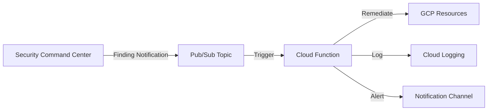

# How to Build Automated Remediation Workflows for SCC Findings with Cloud Functions

Author: [nawazdhandala](https://www.github.com/nawazdhandala)

Tags: GCP, Security Command Center, Cloud Functions, Automation, Security

Description: Build automated remediation workflows that respond to Security Command Center findings using Cloud Functions and Pub/Sub on Google Cloud.

---

Security Command Center (SCC) is great at finding problems in your Google Cloud environment. But findings are useless if nobody acts on them. In most teams, security findings pile up in dashboards, and engineers get around to fixing them days or weeks later - if at all.

The better approach is to remediate automatically where it is safe to do so. Close open firewall rules, remove public bucket access, disable compromised service accounts - all without waiting for a human to click buttons in the console.

This post walks through building an automated remediation system that listens for SCC findings and takes action using Cloud Functions.

## Architecture Overview

The flow works like this: SCC detects a misconfiguration, publishes a notification to Pub/Sub, a Cloud Function picks up the message, determines the appropriate remediation action, and executes it. Everything gets logged for audit purposes.



## Setting Up SCC Notifications

First, you need to configure SCC to publish findings to Pub/Sub. This Terraform configuration creates the notification config and topic:

```hcl
# scc-notifications.tf
# Creates Pub/Sub topic and SCC notification config for findings

resource "google_pubsub_topic" "scc_findings" {
  name    = "scc-findings-notifications"
  project = var.project_id
}

resource "google_scc_notification_config" "high_severity" {
  config_id    = "high-severity-findings"
  organization = var.org_id
  description  = "Notifications for high and critical severity SCC findings"
  pubsub_topic = google_pubsub_topic.scc_findings.id

  # Only notify on high and critical findings that are active
  streaming_config {
    filter = "severity=\"HIGH\" OR severity=\"CRITICAL\" AND state=\"ACTIVE\""
  }
}

# Grant SCC permission to publish to the topic
resource "google_pubsub_topic_iam_member" "scc_publisher" {
  project = var.project_id
  topic   = google_pubsub_topic.scc_findings.name
  role    = "roles/pubsub.publisher"
  member  = "serviceAccount:service-org-${var.org_id}@gcp-sa-scc-notification.iam.gserviceaccount.com"
}
```

## Building the Remediation Cloud Function

Now for the core piece. This Cloud Function handles incoming SCC findings and applies the right remediation based on the finding category.

This is the main function entry point that routes findings to specific handlers:

```python
# main.py
# Cloud Function that automatically remediates SCC findings
import base64
import json
import logging
from google.cloud import compute_v1
from google.cloud import storage
from google.cloud import iam_admin_v1
from google.cloud import logging as cloud_logging

# Set up structured logging
logging.basicConfig(level=logging.INFO)
logger = logging.getLogger(__name__)

# Map SCC finding categories to remediation functions
REMEDIATION_MAP = {
    "PUBLIC_BUCKET_ACL": "remediate_public_bucket",
    "OPEN_FIREWALL": "remediate_open_firewall",
    "OPEN_SSH_PORT": "remediate_open_ssh",
    "OPEN_RDP_PORT": "remediate_open_rdp",
    "MFA_NOT_ENFORCED": "notify_only",
    "OVER_PRIVILEGED_ACCOUNT": "remediate_over_privileged_account",
    "PUBLIC_IP_ADDRESS": "notify_only",
}

def handle_scc_finding(event, context):
    """Main entry point - triggered by Pub/Sub message."""
    # Decode the Pub/Sub message
    pubsub_message = base64.b64decode(event['data']).decode('utf-8')
    finding_data = json.loads(pubsub_message)

    finding = finding_data.get('finding', {})
    category = finding.get('category', '')
    resource_name = finding.get('resourceName', '')
    severity = finding.get('severity', '')

    logger.info(f"Received SCC finding: {category} for {resource_name}")

    # Look up the remediation handler
    handler_name = REMEDIATION_MAP.get(category)

    if handler_name is None:
        logger.info(f"No remediation configured for category: {category}")
        return

    if handler_name == "notify_only":
        send_notification(category, resource_name, severity)
        return

    # Call the appropriate remediation function
    handler = globals().get(handler_name)
    if handler:
        try:
            handler(finding)
            log_remediation(category, resource_name, "SUCCESS")
            send_notification(category, resource_name, severity, remediated=True)
        except Exception as e:
            logger.error(f"Remediation failed for {category}: {str(e)}")
            log_remediation(category, resource_name, "FAILED", str(e))
            send_notification(category, resource_name, severity, error=str(e))
```

Here are the individual remediation handlers for common finding types:

```python
# remediation_handlers.py
# Individual handlers for each SCC finding type

def remediate_public_bucket(finding):
    """Remove public access from a Cloud Storage bucket."""
    resource_name = finding['resourceName']
    # Extract bucket name from resource path
    bucket_name = resource_name.split('/')[-1]

    client = storage.Client()
    bucket = client.get_bucket(bucket_name)

    # Remove allUsers and allAuthenticatedUsers bindings
    policy = bucket.get_iam_policy(requested_policy_version=3)

    new_bindings = []
    for binding in policy.bindings:
        # Filter out public access members
        members = [
            m for m in binding['members']
            if m not in ('allUsers', 'allAuthenticatedUsers')
        ]
        if members:
            binding['members'] = members
            new_bindings.append(binding)

    policy.bindings = new_bindings
    bucket.set_iam_policy(policy)

    # Also disable uniform bucket-level access override
    bucket.iam_configuration.public_access_prevention = "enforced"
    bucket.patch()

    logger.info(f"Removed public access from bucket: {bucket_name}")


def remediate_open_firewall(finding):
    """Remove or restrict overly permissive firewall rules."""
    resource_name = finding['resourceName']

    # Parse project and firewall rule name from resource path
    parts = resource_name.split('/')
    project_id = parts[parts.index('projects') + 1]
    firewall_name = parts[-1]

    client = compute_v1.FirewallsClient()
    firewall = client.get(project=project_id, firewall=firewall_name)

    # Check if the rule allows traffic from 0.0.0.0/0
    has_open_range = False
    for source_range in firewall.source_ranges:
        if source_range in ('0.0.0.0/0', '::/0'):
            has_open_range = True
            break

    if not has_open_range:
        logger.info(f"Firewall rule {firewall_name} does not have open ranges")
        return

    # Disable the rule rather than deleting it to allow review
    firewall.disabled = True
    operation = client.patch(
        project=project_id,
        firewall=firewall_name,
        firewall_resource=firewall
    )
    operation.result()  # Wait for completion

    logger.info(f"Disabled open firewall rule: {firewall_name} in {project_id}")


def remediate_open_ssh(finding):
    """Block SSH access from the public internet."""
    resource_name = finding['resourceName']
    parts = resource_name.split('/')
    project_id = parts[parts.index('projects') + 1]
    firewall_name = parts[-1]

    client = compute_v1.FirewallsClient()
    firewall = client.get(project=project_id, firewall=firewall_name)

    # Replace 0.0.0.0/0 with IAP range for SSH
    iap_range = "35.235.240.0/20"  # Google IAP forwarding range
    firewall.source_ranges = [iap_range]

    operation = client.patch(
        project=project_id,
        firewall=firewall_name,
        firewall_resource=firewall
    )
    operation.result()

    logger.info(f"Restricted SSH rule {firewall_name} to IAP range only")


def remediate_over_privileged_account(finding):
    """Remove overly broad roles from service accounts."""
    resource_name = finding['resourceName']

    # This is a notification + recommendation approach
    # Fully automated role removal requires careful testing
    logger.warning(
        f"Over-privileged account detected: {resource_name}. "
        "Generating role recommendation report."
    )

    # Use IAM Recommender API to get suggestions
    # In practice, auto-remediation of IAM is risky
    # Better to create a ticket and let a human review
    send_notification(
        "OVER_PRIVILEGED_ACCOUNT",
        resource_name,
        "HIGH",
        action_required=True
    )
```

And the notification and logging helpers:

```python
# notification_helpers.py
# Helpers for logging and sending alerts about remediations

from google.cloud import pubsub_v1
import json

def log_remediation(category, resource, status, error=None):
    """Log remediation action to Cloud Logging with structured data."""
    log_entry = {
        "remediation_category": category,
        "resource": resource,
        "status": status,
        "error": error,
    }

    # Structured log that can be queried in Cloud Logging
    logger.info(json.dumps(log_entry))


def send_notification(category, resource, severity,
                      remediated=False, error=None, action_required=False):
    """Send notification about the finding to a Pub/Sub topic."""
    publisher = pubsub_v1.PublisherClient()
    topic_path = publisher.topic_path("your-project", "security-notifications")

    message = {
        "category": category,
        "resource": resource,
        "severity": severity,
        "auto_remediated": remediated,
        "error": error,
        "action_required": action_required,
    }

    publisher.publish(
        topic_path,
        data=json.dumps(message).encode('utf-8')
    )
```

## Deploying the Cloud Function

Deploy the function with the right permissions using gcloud:

```bash
# Deploy the remediation Cloud Function
gcloud functions deploy scc-auto-remediate \
  --gen2 \
  --runtime python311 \
  --trigger-topic scc-findings-notifications \
  --entry-point handle_scc_finding \
  --memory 512MB \
  --timeout 300s \
  --service-account scc-remediation@${PROJECT_ID}.iam.gserviceaccount.com \
  --project ${PROJECT_ID} \
  --region us-central1
```

The service account needs specific roles. Here is the Terraform for that:

```hcl
# service-account.tf
# Service account for the remediation function with minimal permissions

resource "google_service_account" "remediation" {
  account_id   = "scc-remediation"
  display_name = "SCC Auto-Remediation"
  project      = var.project_id
}

# Only grant the specific permissions needed for remediation
resource "google_organization_iam_member" "storage_admin" {
  org_id = var.org_id
  role   = "roles/storage.admin"
  member = "serviceAccount:${google_service_account.remediation.email}"
}

resource "google_organization_iam_member" "compute_security" {
  org_id = var.org_id
  role   = "roles/compute.securityAdmin"
  member = "serviceAccount:${google_service_account.remediation.email}"
}

resource "google_organization_iam_member" "logging_writer" {
  org_id = var.org_id
  role   = "roles/logging.logWriter"
  member = "serviceAccount:${google_service_account.remediation.email}"
}
```

## Testing Safely

Never deploy auto-remediation straight to production without testing. Start with a dry-run mode:

```python
# Add a dry-run flag that logs what would happen without taking action
DRY_RUN = True  # Set to False when ready for production

def remediate_public_bucket(finding):
    """Remove public access from a Cloud Storage bucket."""
    bucket_name = finding['resourceName'].split('/')[-1]

    if DRY_RUN:
        logger.info(f"[DRY RUN] Would remove public access from: {bucket_name}")
        return

    # Actual remediation code follows...
```

Run it in dry-run mode for a week, review the logs, and make sure it would have done the right thing every time before flipping the switch.

## Handling Edge Cases

Some findings should never be auto-remediated. Public buckets hosting a static website, for example, are intentionally public. Use labels to mark exceptions:

```python
def is_excluded(resource_name, category):
    """Check if a resource is excluded from auto-remediation."""
    # Check for exclusion label on the resource
    if category == "PUBLIC_BUCKET_ACL":
        client = storage.Client()
        bucket_name = resource_name.split('/')[-1]
        bucket = client.get_bucket(bucket_name)

        labels = bucket.labels or {}
        if labels.get("auto-remediation") == "excluded":
            logger.info(f"Resource {bucket_name} is excluded from remediation")
            return True

    return False
```

## Wrapping Up

Automated remediation turns your security posture from reactive to proactive. Start with the easy wins - public buckets and open firewall rules - and gradually expand your coverage. The key is to always have a dry-run mode, exclusion labels for intentional exceptions, and comprehensive logging so you can audit every action the system takes. Over time, your SCC findings dashboard will go from a wall of red to something your security team can actually manage.
