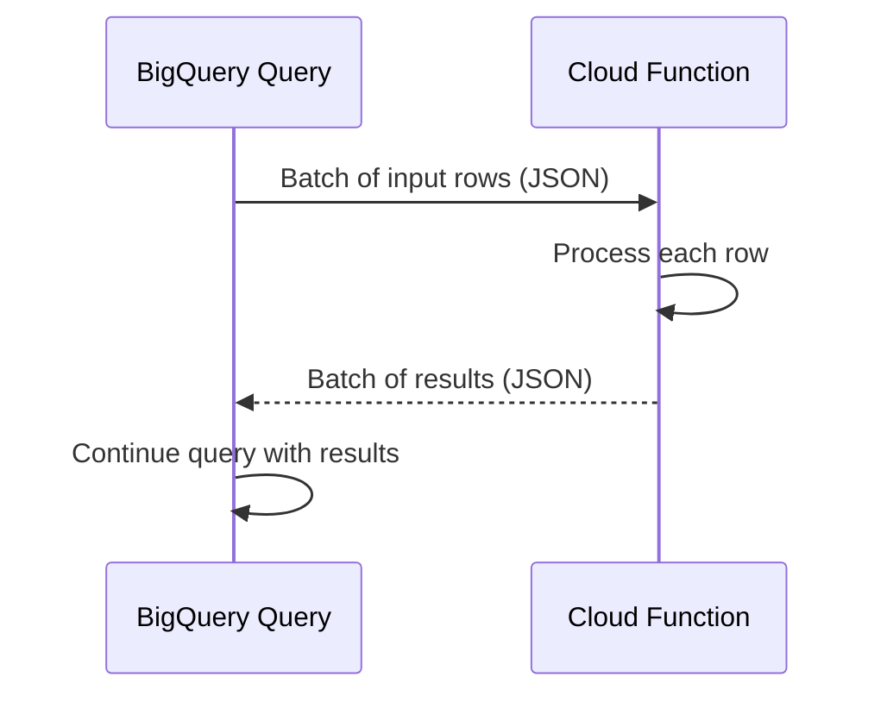

# How to Build BigQuery Remote Functions That Call Cloud Functions

Author: [nawazdhandala](https://www.github.com/nawazdhandala)

Tags: GCP, BigQuery, Remote Functions, Cloud Functions, Serverless

Description: Step-by-step guide to building BigQuery remote functions that call Cloud Functions for custom processing like ML inference, API calls, and complex transformations.

---

Sometimes your BigQuery transformation needs to do something that SQL and even JavaScript UDFs cannot handle - call an external API, run a machine learning model, perform geocoding, or interact with another service. BigQuery remote functions bridge this gap by letting you call Cloud Functions or Cloud Run services directly from SQL queries.

This is one of those features that opens up a huge range of possibilities. I have used remote functions for everything from sentiment analysis on customer feedback to real-time currency conversion in financial reports.

## How Remote Functions Work

When you call a remote function in a BigQuery query, BigQuery batches the input rows and sends them as HTTP requests to your Cloud Function. The function processes the batch and returns the results. BigQuery then incorporates those results back into the query.



## Prerequisites

Before creating a remote function, you need:

1. A Cloud Function (or Cloud Run service) to call
2. A BigQuery connection resource
3. IAM permissions for the connection to invoke the function

## Step 1: Create the Cloud Function

Let me start with a practical example - a Cloud Function that performs text sentiment analysis.

```python
# main.py - Cloud Function for sentiment analysis
import functions_framework
import json

@functions_framework.http
def analyze_sentiment(request):
    """Process a batch of text inputs and return sentiment scores."""
    try:
        # BigQuery sends data in a specific format
        request_json = request.get_json()
        calls = request_json.get('calls', [])

        results = []
        for call in calls:
            # Each call is a list of arguments matching the UDF signature
            text = call[0]

            if not text:
                results.append(None)
                continue

            # Simple rule-based sentiment (replace with ML model in production)
            score = calculate_sentiment(text)
            results.append(score)

        # Return results in the expected format
        return json.dumps({'replies': results})

    except Exception as e:
        return json.dumps({'errorMessage': str(e)}), 400


def calculate_sentiment(text):
    """Calculate a basic sentiment score between -1 and 1."""
    positive_words = {'good', 'great', 'excellent', 'love', 'happy', 'best', 'amazing', 'wonderful'}
    negative_words = {'bad', 'terrible', 'awful', 'hate', 'worst', 'horrible', 'poor', 'disappointing'}

    words = text.lower().split()
    pos_count = sum(1 for w in words if w in positive_words)
    neg_count = sum(1 for w in words if w in negative_words)
    total = pos_count + neg_count

    if total == 0:
        return 0.0
    return round((pos_count - neg_count) / total, 2)
```

Deploy the Cloud Function.

```bash
# Deploy the sentiment analysis function
gcloud functions deploy analyze-sentiment \
  --gen2 \
  --runtime python311 \
  --trigger-http \
  --entry-point analyze_sentiment \
  --region us-central1 \
  --memory 256MB \
  --timeout 120s \
  --no-allow-unauthenticated
```

## Step 2: Create a BigQuery Connection

BigQuery connections manage the authentication between BigQuery and external services.

```bash
# Create a BigQuery connection for Cloud Functions
bq mk --connection \
  --connection_type=CLOUD_RESOURCE \
  --project_id=my_project \
  --location=US \
  my-cloud-function-connection
```

Get the service account associated with the connection.

```bash
# Get the connection's service account
bq show --connection --format=json my_project.US.my-cloud-function-connection | jq '.cloudResource.serviceAccountId'
```

This returns something like `bqcx-123456789-abc@gcp-sa-bigquery-condel.iam.gserviceaccount.com`.

## Step 3: Grant Permissions

The connection's service account needs permission to invoke the Cloud Function.

```bash
# Grant the BigQuery connection service account permission to invoke the function
gcloud functions add-iam-policy-binding analyze-sentiment \
  --gen2 \
  --region=us-central1 \
  --member="serviceAccount:bqcx-123456789-abc@gcp-sa-bigquery-condel.iam.gserviceaccount.com" \
  --role="roles/cloudfunctions.invoker"

# For Gen2 functions, also grant Cloud Run invoker
gcloud run services add-iam-policy-binding analyze-sentiment \
  --region=us-central1 \
  --member="serviceAccount:bqcx-123456789-abc@gcp-sa-bigquery-condel.iam.gserviceaccount.com" \
  --role="roles/run.invoker"
```

## Step 4: Create the Remote Function

Now create the BigQuery remote function that references your Cloud Function.

```sql
-- Create the remote function in BigQuery
CREATE OR REPLACE FUNCTION `my_project.my_dataset.sentiment_score`(text STRING)
RETURNS FLOAT64
REMOTE WITH CONNECTION `my_project.US.my-cloud-function-connection`
OPTIONS (
  endpoint = 'https://us-central1-my_project.cloudfunctions.net/analyze-sentiment',
  max_batching_rows = 1000
);
```

The `max_batching_rows` option controls how many rows are sent in each HTTP request. Higher values are more efficient but require the function to handle larger payloads.

## Step 5: Use the Remote Function

Now you can use the function in any SQL query.

```sql
-- Analyze sentiment of customer reviews
SELECT
  review_id,
  review_text,
  `my_project.my_dataset.sentiment_score`(review_text) AS sentiment
FROM `my_project.my_dataset.customer_reviews`
WHERE review_date >= '2026-02-01'
ORDER BY sentiment ASC
LIMIT 100;
```

## Multi-Parameter Remote Functions

Remote functions can accept multiple parameters. Each parameter is passed as an element in the call array.

```python
# main.py - Cloud Function with multiple parameters
import functions_framework
import json
import requests

@functions_framework.http
def geocode_address(request):
    """Geocode addresses with a specified country hint."""
    request_json = request.get_json()
    calls = request_json.get('calls', [])

    results = []
    for call in calls:
        # Parameters match the BigQuery function signature
        address = call[0]
        country = call[1]

        if not address:
            results.append(json.dumps({'lat': None, 'lng': None}))
            continue

        # Call geocoding service (simplified example)
        coords = lookup_coordinates(address, country)
        results.append(json.dumps(coords))

    return json.dumps({'replies': results})


def lookup_coordinates(address, country):
    """Look up coordinates for an address."""
    # Replace with actual geocoding API call
    return {'lat': 37.7749, 'lng': -122.4194}
```

```sql
-- Remote function with multiple parameters
CREATE OR REPLACE FUNCTION `my_project.my_dataset.geocode`(
  address STRING,
  country STRING
)
RETURNS JSON
REMOTE WITH CONNECTION `my_project.US.my-cloud-function-connection`
OPTIONS (
  endpoint = 'https://us-central1-my_project.cloudfunctions.net/geocode-address'
);

-- Use it in a query
SELECT
  store_name,
  address,
  `my_project.my_dataset.geocode`(address, 'US') AS coordinates
FROM `my_project.my_dataset.stores`;
```

## Returning Complex Types

Remote functions can return JSON for complex return values.

```python
# Cloud Function that returns structured data
@functions_framework.http
def enrich_company(request):
    """Enrich company data with external information."""
    request_json = request.get_json()
    calls = request_json.get('calls', [])

    results = []
    for call in calls:
        domain = call[0]

        if not domain:
            results.append(json.dumps(None))
            continue

        # Look up company info (simplified)
        info = {
            'industry': 'Technology',
            'employee_count': 5000,
            'founded_year': 2010,
            'headquarters': 'San Francisco, CA'
        }
        results.append(json.dumps(info))

    return json.dumps({'replies': results})
```

```sql
-- Parse the JSON response in BigQuery
SELECT
  company_name,
  domain,
  JSON_VALUE(enriched, '$.industry') AS industry,
  CAST(JSON_VALUE(enriched, '$.employee_count') AS INT64) AS employees,
  JSON_VALUE(enriched, '$.headquarters') AS hq_location
FROM (
  SELECT
    company_name,
    domain,
    `my_project.my_dataset.enrich_company`(domain) AS enriched
  FROM `my_project.my_dataset.companies`
);
```

## Performance Tips

Remote functions involve network calls, so they are slower than native SQL functions. Here is how to manage performance.

**Batch size matters**: Set `max_batching_rows` appropriately. Larger batches mean fewer HTTP round trips but more memory per request.

**Filter before calling**: Reduce the number of rows that need to go through the remote function.

```sql
-- Filter first, then call the remote function on fewer rows
SELECT
  review_id,
  review_text,
  `my_project.my_dataset.sentiment_score`(review_text) AS sentiment
FROM `my_project.my_dataset.customer_reviews`
WHERE review_date = CURRENT_DATE()  -- Filter to reduce rows
  AND LENGTH(review_text) > 10;      -- Skip very short reviews
```

**Cache results**: If the same inputs produce the same outputs, consider materializing results to avoid redundant function calls.

```sql
-- Materialize sentiment scores to avoid recomputing
CREATE OR REPLACE TABLE `my_project.my_dataset.review_sentiments` AS
SELECT
  review_id,
  `my_project.my_dataset.sentiment_score`(review_text) AS sentiment
FROM `my_project.my_dataset.customer_reviews`
WHERE review_id NOT IN (
  SELECT review_id FROM `my_project.my_dataset.review_sentiments`
);
```

## Error Handling

Handle errors gracefully in your Cloud Function. If a single row fails, you can return null for that row instead of failing the entire batch.

```python
# Robust error handling in the Cloud Function
results = []
for call in calls:
    try:
        text = call[0]
        result = process_text(text)
        results.append(result)
    except Exception as e:
        # Return null for failed rows instead of failing the batch
        results.append(None)
```

## Wrapping Up

BigQuery remote functions let you extend SQL with any computation that can run in a Cloud Function or Cloud Run service. Whether it is ML inference, API calls, or complex business logic, you can call it directly from your SQL queries. The setup requires a few moving parts - Cloud Function, BigQuery connection, and IAM permissions - but once configured, the integration is seamless.

For monitoring the health and latency of your remote functions and the queries that depend on them, [OneUptime](https://oneuptime.com) provides end-to-end observability across your GCP services.
