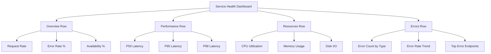

# How to Build Custom Dashboards Using Monitoring Query Language on Google Cloud

Author: [nawazdhandala](https://www.github.com/nawazdhandala)

Tags: GCP, MQL, Cloud Monitoring, Dashboards, Google Cloud, Observability

Description: Learn how to build custom dashboards in Google Cloud Monitoring using Monitoring Query Language for flexible and powerful metric visualization.

---

The visual dashboard builder in Google Cloud Monitoring works fine for simple charts, but the moment you need to do math between metrics, filter on complex conditions, or create custom aggregations, you hit its limits. That is where Monitoring Query Language (MQL) comes in. MQL gives you a text-based query language for Cloud Monitoring that can express things the GUI simply cannot. In this post, I will show you how to build production dashboards using MQL queries.

## What is MQL?

MQL is a text-based query language specific to Google Cloud Monitoring. Think of it like SQL for your metrics. You can fetch time series, filter them, align them in time, aggregate across dimensions, join different metrics, and apply math operations. It is significantly more powerful than the filter-based query builder in the Cloud Console.

## Getting Started with MQL Syntax

Every MQL query follows the same structure: you start with a data source, then apply operations using the pipe operator.

```
fetch gce_instance::compute.googleapis.com/instance/cpu/utilization
| filter zone =~ "us-central1.*"
| group_by [zone], mean(val())
| every 5m
```

Let me break that down. `fetch` selects the metric type and resource type. The pipe `|` passes results to the next operation. `filter` narrows down the time series. `group_by` aggregates across a dimension. `every` sets the alignment period.

## Building a CPU Utilization Dashboard

Let us start with a practical example. Here is a dashboard that shows CPU utilization across your GCE fleet.

```
# Average CPU utilization per zone, aligned to 5-minute intervals
fetch gce_instance::compute.googleapis.com/instance/cpu/utilization
| group_by [resource.zone], mean(val())
| every 5m
```

To add a threshold line at 80% for visual reference, you can use the `union` operation.

```
# CPU utilization with an 80% threshold line
{
  fetch gce_instance::compute.googleapis.com/instance/cpu/utilization
  | group_by [resource.zone], mean(val())
  | every 5m
  ;
  fetch gce_instance::compute.googleapis.com/instance/cpu/utilization
  | group_by [], mean(val())
  | every 5m
  | value [threshold: cast_double(0.8)]
}
| union
```

## Creating a Request Rate and Error Rate Dashboard

For services that expose HTTP metrics, here is how to build a dashboard panel showing request rates alongside error rates.

```
# Total request rate per service
fetch gae_app::appengine.googleapis.com/http/server/response_count
| group_by [resource.module_id], rate(val())
| every 1m
```

For error rate as a percentage.

```
# Error rate as a percentage - errors divided by total
{
  # Fetch error responses (5xx status codes)
  fetch gae_app::appengine.googleapis.com/http/server/response_count
  | filter metric.response_code >= 500
  | group_by [resource.module_id], sum(val())
  | every 1m
  ;
  # Fetch total responses
  fetch gae_app::appengine.googleapis.com/http/server/response_count
  | group_by [resource.module_id], sum(val())
  | every 1m
}
| ratio
| mul(100)
```

## Building the Dashboard via API

You can create dashboards programmatically using the Cloud Monitoring API. Here is how to create a dashboard with MQL widgets using gcloud.

```bash
# Create a dashboard JSON definition
cat > dashboard.json << 'DASHBOARD'
{
  "displayName": "Service Health Dashboard",
  "mosaicLayout": {
    "columns": 12,
    "tiles": [
      {
        "width": 6,
        "height": 4,
        "widget": {
          "title": "CPU Utilization by Zone",
          "xyChart": {
            "dataSets": [{
              "timeSeriesQuery": {
                "timeSeriesQueryLanguage": "fetch gce_instance::compute.googleapis.com/instance/cpu/utilization | group_by [resource.zone], mean(val()) | every 5m"
              },
              "plotType": "LINE"
            }],
            "timeshiftDuration": "0s"
          }
        }
      },
      {
        "xPos": 6,
        "width": 6,
        "height": 4,
        "widget": {
          "title": "Memory Usage",
          "xyChart": {
            "dataSets": [{
              "timeSeriesQuery": {
                "timeSeriesQueryLanguage": "fetch gce_instance::agent.googleapis.com/memory/percent_used | filter state = 'used' | group_by [resource.instance_id], mean(val()) | every 5m"
              },
              "plotType": "LINE"
            }],
            "timeshiftDuration": "0s"
          }
        }
      },
      {
        "yPos": 4,
        "width": 12,
        "height": 4,
        "widget": {
          "title": "Error Rate by Service (%)",
          "xyChart": {
            "dataSets": [{
              "timeSeriesQuery": {
                "timeSeriesQueryLanguage": "{ fetch gae_app::appengine.googleapis.com/http/server/response_count | filter metric.response_code >= 500 | group_by [resource.module_id], sum(val()) | every 1m ; fetch gae_app::appengine.googleapis.com/http/server/response_count | group_by [resource.module_id], sum(val()) | every 1m } | ratio | mul(100)"
              },
              "plotType": "LINE"
            }],
            "timeshiftDuration": "0s"
          }
        }
      }
    ]
  }
}
DASHBOARD

# Create the dashboard using the API
gcloud monitoring dashboards create --config-from-file=dashboard.json
```

## Advanced MQL Techniques

Here are some MQL patterns I use regularly.

**Comparing current values to the same period last week.**

```
# Show current CPU vs same time last week for trend comparison
{
  fetch gce_instance::compute.googleapis.com/instance/cpu/utilization
  | group_by [], mean(val())
  | every 1h
  ;
  fetch gce_instance::compute.googleapis.com/instance/cpu/utilization
  | group_by [], mean(val())
  | every 1h
  | time_shift 7d
}
| union
```

**Calculating percentiles.**

```
# 95th percentile response latency per service
fetch https_lb_rule::loadbalancing.googleapis.com/https/total_latencies
| group_by [resource.url_map_name],
    percentile(val(), 95)
| every 5m
```

**Top N consumers.**

```
# Top 5 instances by CPU utilization
fetch gce_instance::compute.googleapis.com/instance/cpu/utilization
| top 5
| every 5m
```

**Conditional alerting thresholds.**

```
# Disk usage above 90% with minimum disk size filter
fetch gce_instance::compute.googleapis.com/instance/disk/write_bytes_count
| group_by [resource.instance_id, metric.device_name], sum(val())
| every 5m
| condition val() > 1000000000
```

## Dashboard Layout Architecture

Here is how to think about organizing your MQL dashboard.



## Using Terraform to Manage Dashboards

For infrastructure-as-code management, use the Terraform Google provider.

```hcl
# Define a Cloud Monitoring dashboard with MQL widgets
resource "google_monitoring_dashboard" "service_health" {
  dashboard_json = jsonencode({
    displayName = "Service Health - Managed by Terraform"
    mosaicLayout = {
      columns = 12
      tiles = [
        {
          width  = 6
          height = 4
          widget = {
            title = "Request Rate"
            xyChart = {
              dataSets = [{
                timeSeriesQuery = {
                  timeSeriesQueryLanguage = <<-MQL
                    fetch gae_app::appengine.googleapis.com/http/server/response_count
                    | group_by [resource.module_id], rate(val())
                    | every 1m
                  MQL
                }
                plotType = "LINE"
              }]
            }
          }
        },
        {
          xPos   = 6
          width  = 6
          height = 4
          widget = {
            title = "P95 Latency"
            xyChart = {
              dataSets = [{
                timeSeriesQuery = {
                  timeSeriesQueryLanguage = <<-MQL
                    fetch https_lb_rule::loadbalancing.googleapis.com/https/total_latencies
                    | group_by [resource.url_map_name], percentile(val(), 95)
                    | every 5m
                  MQL
                }
                plotType = "LINE"
              }]
            }
          }
        }
      ]
    }
  })
}
```

## Tips for Effective MQL Dashboards

Keep your alignment periods consistent across panels in the same row. If one chart shows data every 1 minute and the adjacent chart shows data every 5 minutes, they look out of sync when you pan the time window.

Use `group_by` with meaningful dimensions. Grouping by instance ID gives you per-instance detail but creates noisy charts. Grouping by zone or service name gives you a cleaner overview.

For ratio calculations, always make sure both the numerator and denominator have the same alignment period and grouping dimensions. Mismatched dimensions will produce empty results.

## Wrapping Up

MQL gives you precise control over what your Cloud Monitoring dashboards display. Whether you need to calculate error rates as percentages, compare metrics across time periods, or build complex aggregations, MQL can express it clearly and concisely. Managing dashboards as code through Terraform or the API means your monitoring configuration lives alongside your infrastructure definitions and goes through the same review process. Start with the basic fetch and filter pattern, and layer on complexity as your monitoring needs grow.
