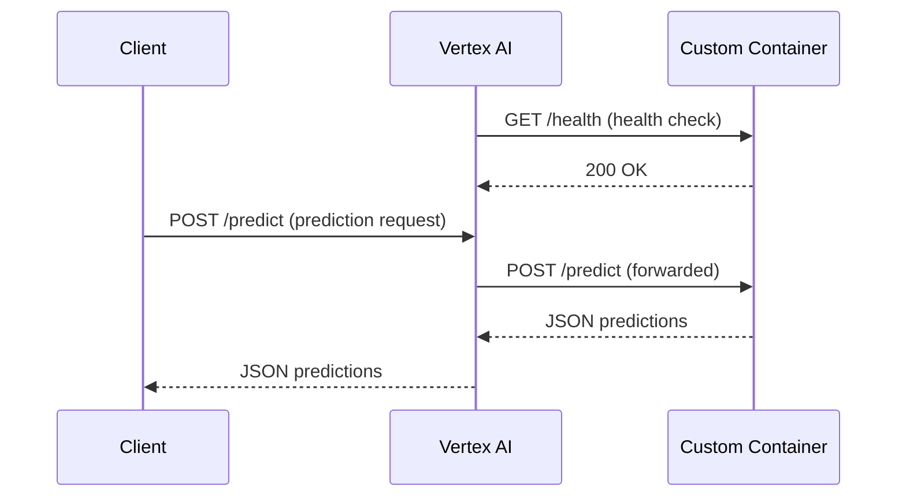

# How to Build Custom Serving Containers for Vertex AI Prediction Endpoints

Author: [nawazdhandala](https://www.github.com/nawazdhandala)

Tags: GCP, Vertex AI, Custom Containers, Model Serving, Docker

Description: Learn how to build and deploy custom serving containers for Vertex AI Prediction endpoints when pre-built containers do not meet your requirements.

---

Vertex AI provides pre-built serving containers for TensorFlow, PyTorch, scikit-learn, and XGBoost. But what happens when your model uses a framework that is not covered, or you need custom preprocessing logic at serving time? That is when you build a custom serving container.

A custom container gives you full control over the prediction server - the framework, the dependencies, the request handling, everything. The trade-off is that you are responsible for making sure the container meets Vertex AI's requirements for health checks and prediction endpoints.

## What Vertex AI Expects from Your Container

Vertex AI sends prediction requests to your container and expects specific behavior. Your container must expose an HTTP server on the port specified by the `AIP_HTTP_PORT` environment variable (defaults to 8080). It needs two endpoints: a health check endpoint and a prediction endpoint.

The health check endpoint must return a 200 status code when the server is ready to accept requests. The prediction endpoint receives JSON payloads and returns JSON responses.



## Building a Basic Custom Container

Let us build a custom serving container for a model that uses a combination of scikit-learn for preprocessing and a custom inference engine. We will use Flask as the HTTP server.

This is the main prediction server code:

```python
# app.py - Custom prediction server for Vertex AI

import os
import json
import pickle
import numpy as np
from flask import Flask, request, jsonify

app = Flask(__name__)

# Load model artifacts at startup
# AIP_STORAGE_URI points to the GCS location of your model artifacts
MODEL_DIR = os.environ.get("AIP_STORAGE_URI", "/models")

# Global variables for model components
preprocessor = None
model = None

def load_model():
    """Load the model and preprocessor from disk."""
    global preprocessor, model

    # Load the sklearn preprocessor
    with open(os.path.join(MODEL_DIR, "preprocessor.pkl"), "rb") as f:
        preprocessor = pickle.load(f)

    # Load the model weights
    with open(os.path.join(MODEL_DIR, "model.pkl"), "rb") as f:
        model = pickle.load(f)

    print("Model and preprocessor loaded successfully")

@app.route("/health", methods=["GET"])
def health():
    """Health check endpoint required by Vertex AI."""
    if model is not None and preprocessor is not None:
        return jsonify({"status": "healthy"}), 200
    return jsonify({"status": "not ready"}), 503

@app.route("/predict", methods=["POST"])
def predict():
    """Prediction endpoint that receives JSON and returns predictions."""
    try:
        # Parse the request body
        request_json = request.get_json()
        instances = request_json.get("instances", [])

        if not instances:
            return jsonify({"error": "No instances provided"}), 400

        # Convert instances to numpy array
        input_data = np.array(instances)

        # Apply preprocessing
        processed_data = preprocessor.transform(input_data)

        # Run inference
        predictions = model.predict(processed_data)
        probabilities = model.predict_proba(processed_data)

        # Format the response
        response = {
            "predictions": [
                {
                    "class": int(pred),
                    "probabilities": probs.tolist()
                }
                for pred, probs in zip(predictions, probabilities)
            ]
        }

        return jsonify(response), 200

    except Exception as e:
        return jsonify({"error": str(e)}), 500

if __name__ == "__main__":
    # Load the model before starting the server
    load_model()

    # Start the server on the port Vertex AI expects
    port = int(os.environ.get("AIP_HTTP_PORT", 8080))
    app.run(host="0.0.0.0", port=port)
```

## Writing the Dockerfile

The Dockerfile packages your server code, dependencies, and any system libraries your model needs.

This Dockerfile builds the custom serving container:

```dockerfile
# Use a slim Python base image
FROM python:3.10-slim

# Set the working directory
WORKDIR /app

# Install system dependencies if needed
RUN apt-get update && apt-get install -y --no-install-recommends \
    libgomp1 \
    && rm -rf /var/lib/apt/lists/*

# Copy requirements and install Python dependencies
COPY requirements.txt .
RUN pip install --no-cache-dir -r requirements.txt

# Copy the application code
COPY app.py .

# Set environment variables
ENV AIP_HTTP_PORT=8080
ENV AIP_HEALTH_ROUTE=/health
ENV AIP_PREDICT_ROUTE=/predict

# Expose the port
EXPOSE 8080

# Run the server using gunicorn for production
CMD ["gunicorn", "--bind", "0.0.0.0:8080", "--workers", "2", "--timeout", "120", "app:app"]
```

The requirements.txt file for this container:

```
flask==3.0.0
gunicorn==21.2.0
numpy==1.26.0
scikit-learn==1.3.2
```

## Building and Pushing to Artifact Registry

Before deploying to Vertex AI, you need to build the container image and push it to Google Artifact Registry.

These commands build and push the container:

```bash
# Set variables
PROJECT_ID="your-project-id"
REGION="us-central1"
REPO_NAME="ml-serving"
IMAGE_NAME="custom-predictor"
IMAGE_TAG="v1"

# Create an Artifact Registry repository if it does not exist
gcloud artifacts repositories create $REPO_NAME \
    --repository-format=docker \
    --location=$REGION \
    --description="ML serving containers"

# Configure Docker authentication for Artifact Registry
gcloud auth configure-docker ${REGION}-docker.pkg.dev

# Build the image
docker build -t ${REGION}-docker.pkg.dev/${PROJECT_ID}/${REPO_NAME}/${IMAGE_NAME}:${IMAGE_TAG} .

# Push to Artifact Registry
docker push ${REGION}-docker.pkg.dev/${PROJECT_ID}/${REPO_NAME}/${IMAGE_NAME}:${IMAGE_TAG}
```

## Deploying to a Vertex AI Endpoint

With the container in Artifact Registry and your model artifacts in GCS, you can deploy to a Vertex AI endpoint.

This code uploads the model and deploys it:

```python
from google.cloud import aiplatform

aiplatform.init(project="your-project-id", location="us-central1")

# Upload the model with your custom container
model = aiplatform.Model.upload(
    display_name="custom-predictor-model",
    artifact_uri="gs://your-bucket/models/custom-model/",  # Where model files live
    serving_container_image_uri=(
        "us-central1-docker.pkg.dev/your-project-id/"
        "ml-serving/custom-predictor:v1"
    ),
    serving_container_health_route="/health",
    serving_container_predict_route="/predict",
    serving_container_ports=[8080]
)

print(f"Model uploaded: {model.resource_name}")

# Create an endpoint
endpoint = aiplatform.Endpoint.create(display_name="custom-predictor-endpoint")

# Deploy the model to the endpoint
model.deploy(
    endpoint=endpoint,
    machine_type="n1-standard-4",
    min_replica_count=1,
    max_replica_count=3,  # Enable autoscaling
    traffic_percentage=100
)

print(f"Model deployed to: {endpoint.resource_name}")
```

## Testing the Deployment

After deployment, verify that predictions are working correctly.

This code sends a test prediction request:

```python
from google.cloud import aiplatform

aiplatform.init(project="your-project-id", location="us-central1")

endpoint = aiplatform.Endpoint("projects/your-project-id/locations/us-central1/endpoints/YOUR_ENDPOINT_ID")

# Send test instances
test_instances = [
    [25, 50000, 720, 3, 1],  # Sample feature vector
    [45, 85000, 680, 7, 0]   # Another sample
]

response = endpoint.predict(instances=test_instances)

for prediction in response.predictions:
    print(f"Class: {prediction['class']}, Probabilities: {prediction['probabilities']}")
```

## Advanced: Multi-Stage Containers with Model Download

For larger models, you might want the container to download model artifacts from GCS at startup rather than baking them into the image.

This updated app.py handles GCS model download:

```python
# app.py - Advanced version with GCS model download

import os
import json
import pickle
import numpy as np
from flask import Flask, request, jsonify
from google.cloud import storage

app = Flask(__name__)

preprocessor = None
model = None

def download_model_from_gcs():
    """Download model artifacts from GCS to local directory."""
    model_uri = os.environ.get("AIP_STORAGE_URI", "")
    local_dir = "/tmp/model"
    os.makedirs(local_dir, exist_ok=True)

    if model_uri.startswith("gs://"):
        # Parse bucket and prefix from the URI
        parts = model_uri.replace("gs://", "").split("/", 1)
        bucket_name = parts[0]
        prefix = parts[1] if len(parts) > 1 else ""

        # Download all files from the GCS prefix
        client = storage.Client()
        bucket = client.bucket(bucket_name)
        blobs = bucket.list_blobs(prefix=prefix)

        for blob in blobs:
            # Compute local path preserving directory structure
            relative_path = blob.name[len(prefix):].lstrip("/")
            local_path = os.path.join(local_dir, relative_path)
            os.makedirs(os.path.dirname(local_path), exist_ok=True)
            blob.download_to_filename(local_path)
            print(f"Downloaded: {blob.name} -> {local_path}")

    return local_dir

def load_model():
    """Download and load the model."""
    global preprocessor, model

    model_dir = download_model_from_gcs()

    with open(os.path.join(model_dir, "preprocessor.pkl"), "rb") as f:
        preprocessor = pickle.load(f)

    with open(os.path.join(model_dir, "model.pkl"), "rb") as f:
        model = pickle.load(f)

    print("Model loaded from GCS successfully")
```

## Debugging Tips

When your container fails to start on Vertex AI, checking the logs is the first step. Use this command to view container logs:

```bash
# View logs for your deployed model
gcloud ai models describe YOUR_MODEL_ID \
    --region=us-central1 \
    --format="json"

# Check endpoint logs
gcloud logging read 'resource.type="aiplatform.googleapis.com/Endpoint"' \
    --limit=50 \
    --format="table(timestamp, jsonPayload.message)"
```

Common issues include the container not listening on the correct port, the health check returning non-200 status codes during startup, and missing model artifacts. Always test your container locally with `docker run` before deploying to Vertex AI - it saves a lot of debugging time.

Custom serving containers open up the full power of Vertex AI's managed prediction infrastructure to any framework or custom logic you need. The initial setup takes more effort than using pre-built containers, but the flexibility is worth it for complex serving scenarios.
