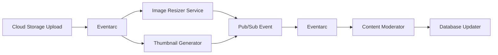

# How to Build Event-Driven Microservices on GCP Using Eventarc and Cloud Run

Author: [nawazdhandala](https://www.github.com/nawazdhandala)

Tags: GCP, Eventarc, Cloud Run, Event-Driven Architecture, Microservices, Serverless

Description: A practical guide to building event-driven microservices on Google Cloud using Eventarc for event routing and Cloud Run for scalable service execution.

---

Event-driven architecture has become the go-to pattern for building loosely coupled, scalable microservices. Instead of services calling each other directly, they communicate through events. A service publishes an event when something happens, and other services react to it. This removes direct dependencies between services and makes the system much easier to extend.

Google Cloud's Eventarc service makes this pattern straightforward to implement. It acts as an event router that connects event sources - Cloud Storage uploads, Firestore changes, Pub/Sub messages, and even custom events - to Cloud Run services. In this guide, I will show you how to build a real-world event-driven system using these two services together.

## Architecture Overview

Let us build an image processing pipeline. When a user uploads an image to Cloud Storage, our system will automatically resize it, generate a thumbnail, run content moderation, and update a database record. Each of these steps runs as an independent Cloud Run service triggered by events.



## Setting Up the Project

Before diving into code, enable the required APIs and set up the environment.

```bash
# Enable the APIs we need
gcloud services enable run.googleapis.com
gcloud services enable eventarc.googleapis.com
gcloud services enable cloudbuild.googleapis.com
gcloud services enable storage.googleapis.com

# Create a storage bucket for image uploads
gcloud storage buckets create gs://my-project-image-uploads \
  --location=us-central1

# Grant Eventarc permission to invoke Cloud Run
gcloud projects add-iam-policy-binding my-project \
  --member="serviceAccount:$(gcloud projects describe my-project --format='value(projectNumber)')-compute@developer.gserviceaccount.com" \
  --role="roles/eventarc.eventReceiver"
```

## Building the Image Resizer Service

The first service resizes uploaded images. It receives a CloudEvent from Eventarc when a file lands in the storage bucket.

```python
# image-resizer/main.py
import os
import json
from flask import Flask, request
from google.cloud import storage
from PIL import Image
import io

app = Flask(__name__)
storage_client = storage.Client()

@app.route('/', methods=['POST'])
def resize_image():
    """Triggered by a Cloud Storage upload event via Eventarc."""
    # Parse the CloudEvent payload
    cloud_event = request.get_json()
    bucket_name = cloud_event['bucket']
    file_name = cloud_event['name']

    # Skip if this is not an image file
    if not file_name.lower().endswith(('.png', '.jpg', '.jpeg', '.webp')):
        return 'Not an image, skipping', 200

    # Download the original image from Cloud Storage
    bucket = storage_client.bucket(bucket_name)
    blob = bucket.blob(file_name)
    image_data = blob.download_as_bytes()

    # Resize the image to standard dimensions
    img = Image.open(io.BytesIO(image_data))
    sizes = {
        'large': (1920, 1080),
        'medium': (800, 600),
        'small': (400, 300),
    }

    for size_name, dimensions in sizes.items():
        resized = img.copy()
        resized.thumbnail(dimensions, Image.LANCZOS)

        # Save each resized version to the processed bucket
        output = io.BytesIO()
        resized.save(output, format=img.format or 'JPEG')
        output.seek(0)

        dest_blob = bucket.blob(f'resized/{size_name}/{file_name}')
        dest_blob.upload_from_file(output, content_type=blob.content_type)

    print(f'Resized {file_name} to {len(sizes)} sizes')
    return 'OK', 200

if __name__ == '__main__':
    port = int(os.environ.get('PORT', 8080))
    app.run(host='0.0.0.0', port=port)
```

Here is the Dockerfile for the service.

```dockerfile
# image-resizer/Dockerfile
FROM python:3.11-slim

WORKDIR /app
COPY requirements.txt .
RUN pip install --no-cache-dir -r requirements.txt

COPY main.py .
CMD ["python", "main.py"]
```

## Deploying and Connecting with Eventarc

Deploy the service to Cloud Run and create an Eventarc trigger that routes storage events to it.

```bash
# Build and deploy the image resizer service
gcloud run deploy image-resizer \
  --source=./image-resizer \
  --region=us-central1 \
  --no-allow-unauthenticated \
  --memory=512Mi

# Create an Eventarc trigger for Cloud Storage uploads
gcloud eventarc triggers create image-upload-trigger \
  --destination-run-service=image-resizer \
  --destination-run-region=us-central1 \
  --event-filters="type=google.cloud.storage.object.v1.finalized" \
  --event-filters="bucket=my-project-image-uploads" \
  --service-account="$(gcloud projects describe my-project --format='value(projectNumber)')-compute@developer.gserviceaccount.com" \
  --location=us-central1
```

## Building the Content Moderator Service

This service checks uploaded images for inappropriate content using the Cloud Vision API. It is triggered after the resizing is complete.

```python
# content-moderator/main.py
import os
from flask import Flask, request
from google.cloud import vision
from google.cloud import firestore
from google.cloud import pubsub_v1

app = Flask(__name__)
vision_client = vision.ImageAnnotatorClient()
db = firestore.Client()
publisher = pubsub_v1.PublisherClient()

@app.route('/', methods=['POST'])
def moderate_content():
    """Check uploaded images for inappropriate content."""
    cloud_event = request.get_json()
    bucket_name = cloud_event['bucket']
    file_name = cloud_event['name']

    # Only moderate original uploads, not resized versions
    if file_name.startswith('resized/'):
        return 'Skipping resized image', 200

    # Use Vision API to check for unsafe content
    image = vision.Image(
        source=vision.ImageSource(
            gcs_image_uri=f'gs://{bucket_name}/{file_name}'
        )
    )

    response = vision_client.safe_search_detection(image=image)
    safe_search = response.safe_search_annotation

    # Map the likelihood values to a simple pass/fail
    is_safe = all([
        safe_search.adult < 4,      # Likelihood enum: 4 = LIKELY
        safe_search.violence < 4,
        safe_search.racy < 4,
    ])

    # Store moderation results in Firestore
    doc_ref = db.collection('image_moderation').document(file_name.replace('/', '_'))
    doc_ref.set({
        'file_name': file_name,
        'bucket': bucket_name,
        'is_safe': is_safe,
        'adult_score': safe_search.adult,
        'violence_score': safe_search.violence,
        'moderated_at': firestore.SERVER_TIMESTAMP,
    })

    # Publish result for downstream services
    topic_path = publisher.topic_path(os.environ['PROJECT_ID'], 'moderation-results')
    publisher.publish(topic_path, data=b'', attributes={
        'file_name': file_name,
        'is_safe': str(is_safe),
    })

    return f'Moderation complete: {"safe" if is_safe else "flagged"}', 200

if __name__ == '__main__':
    port = int(os.environ.get('PORT', 8080))
    app.run(host='0.0.0.0', port=port)
```

## Publishing Custom Events

Eventarc also supports custom events through Pub/Sub. This lets your services emit their own domain events.

```python
# Publishing a custom event that Eventarc can route
from google.cloud import pubsub_v1
import json

publisher = pubsub_v1.PublisherClient()

def publish_custom_event(project_id, event_type, data):
    """Publish a custom domain event via Pub/Sub for Eventarc routing."""
    topic_path = publisher.topic_path(project_id, 'custom-events')

    # Include the event type as a message attribute for filtering
    future = publisher.publish(
        topic_path,
        data=json.dumps(data).encode('utf-8'),
        eventType=event_type,
        source='image-processing-pipeline',
    )

    print(f'Published event {event_type}: {future.result()}')
```

Then create an Eventarc trigger that filters on the custom event type.

```bash
# Create a Pub/Sub topic for custom events
gcloud pubsub topics create custom-events

# Route custom events to a specific Cloud Run service
gcloud eventarc triggers create custom-event-trigger \
  --destination-run-service=notification-service \
  --destination-run-region=us-central1 \
  --transport-topic=custom-events \
  --event-filters="type=google.cloud.pubsub.topic.v1.messagePublished" \
  --service-account="$(gcloud projects describe my-project --format='value(projectNumber)')-compute@developer.gserviceaccount.com" \
  --location=us-central1
```

## Handling Errors and Retries

Cloud Run services that receive events from Eventarc should return appropriate HTTP status codes. Eventarc retries on 5xx errors and does not retry on 2xx or 4xx responses.

```python
@app.route('/', methods=['POST'])
def handle_event():
    try:
        cloud_event = request.get_json()
        process_event(cloud_event)
        return 'OK', 200
    except TransientError as e:
        # Return 500 so Eventarc retries the delivery
        print(f'Transient error, will retry: {e}')
        return str(e), 500
    except PermanentError as e:
        # Return 400 so Eventarc does not retry - log it for investigation
        print(f'Permanent error, not retrying: {e}')
        return str(e), 400
```

## Monitoring the Event Pipeline

Set up structured logging so you can trace events across services.

```python
import json
import logging

def log_event(service_name, event_id, action, details=None):
    """Structured log entry for tracing events across services."""
    log_entry = {
        'service': service_name,
        'event_id': event_id,
        'action': action,
        'details': details or {},
    }
    logging.info(json.dumps(log_entry))
```

## Wrapping Up

Eventarc and Cloud Run make a powerful combination for event-driven architectures. Eventarc handles the routing and filtering of events, while Cloud Run provides the serverless compute layer that scales with demand. The key advantages are loose coupling between services, automatic scaling, and the ability to add new event consumers without modifying existing services.

For production systems, make sure you have proper monitoring in place. OneUptime can help you track the health and response times of each Cloud Run service in your event pipeline, alerting you when event processing latency increases or error rates climb. This visibility is essential when debugging issues that span multiple services in an event-driven architecture.
