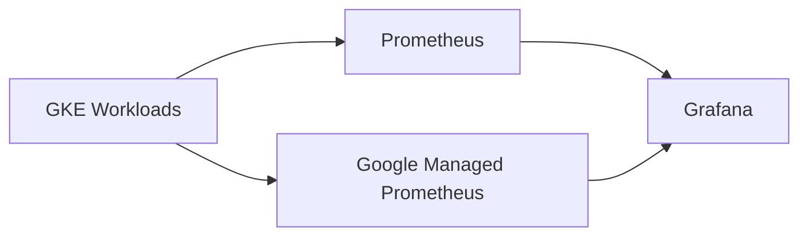

# How to Build Grafana Dashboards for GKE Metrics Using the Prometheus Data Source on GCP

Author: [nawazdhandala](https://www.github.com/nawazdhandala)

Tags: GCP, Grafana, GKE, Prometheus, Kubernetes, Dashboards, Monitoring

Description: Learn how to set up Grafana with the Prometheus data source to build dashboards for GKE cluster metrics on Google Cloud Platform.

---

Google Cloud Monitoring provides solid dashboarding capabilities, but many teams prefer Grafana for its flexibility, community dashboard ecosystem, and PromQL query language. If you are running workloads on GKE and using Google Managed Prometheus (GMP) or self-hosted Prometheus, Grafana gives you a powerful way to visualize your cluster and application metrics.

This post covers setting up Grafana on GKE, connecting it to Prometheus as a data source, and building dashboards that give you visibility into your cluster health and application performance.

## Architecture Overview

There are several ways to get Prometheus metrics from GKE into Grafana:

1. **Self-hosted Prometheus on GKE + Grafana**: Run both Prometheus and Grafana in your cluster
2. **Google Managed Prometheus + Grafana**: Use GMP for collection and Grafana for visualization
3. **Grafana Cloud + GMP**: Use Grafana's SaaS offering with GMP as the data source

This post focuses on option 1 (self-hosted) since it gives you the most control, but I will also cover connecting Grafana to Google Managed Prometheus.



## Step 1: Deploy Prometheus on GKE

The easiest way to deploy Prometheus is using the kube-prometheus-stack Helm chart, which bundles Prometheus, Grafana, and common exporters:

```bash
# Add the Prometheus community Helm repo
helm repo add prometheus-community https://prometheus-community.github.io/helm-charts
helm repo update

# Create a monitoring namespace
kubectl create namespace monitoring

# Install the kube-prometheus-stack
helm install prometheus prometheus-community/kube-prometheus-stack \
  --namespace monitoring \
  --set prometheus.prometheusSpec.retention=15d \
  --set prometheus.prometheusSpec.storageSpec.volumeClaimTemplate.spec.resources.requests.storage=50Gi \
  --set grafana.enabled=true \
  --set grafana.adminPassword=your-secure-password
```

Verify the deployment:

```bash
# Check that all pods are running
kubectl get pods -n monitoring

# You should see pods for:
# - prometheus-prometheus-kube-prometheus-prometheus-0 (Prometheus server)
# - prometheus-grafana-xxx (Grafana)
# - prometheus-kube-prometheus-operator-xxx (Operator)
# - prometheus-kube-state-metrics-xxx (kube-state-metrics)
# - prometheus-prometheus-node-exporter-xxx (per-node exporter)
```

## Step 2: Access Grafana

Expose Grafana through a LoadBalancer or use port forwarding:

```bash
# Option 1: Port forward for local access
kubectl port-forward svc/prometheus-grafana 3000:80 -n monitoring

# Option 2: Expose via LoadBalancer (for persistent access)
kubectl patch svc prometheus-grafana -n monitoring \
  -p '{"spec": {"type": "LoadBalancer"}}'

# Get the external IP
kubectl get svc prometheus-grafana -n monitoring \
  -o jsonpath='{.status.loadBalancer.ingress[0].ip}'
```

Log in to Grafana at http://localhost:3000 (or the external IP) with username `admin` and the password you set during installation.

## Step 3: Configure the Prometheus Data Source

If you used the kube-prometheus-stack, Grafana comes pre-configured with Prometheus as a data source. If you need to add it manually:

1. Go to Configuration, then Data Sources, then Add data source
2. Select Prometheus
3. Set the URL to `http://prometheus-kube-prometheus-prometheus.monitoring.svc.cluster.local:9090`
4. Click Save and Test

For Google Managed Prometheus, the data source URL is different:

```
https://monitoring.googleapis.com/v1/projects/YOUR_PROJECT_ID/location/global/prometheus
```

You will also need to configure authentication. Create a GCP service account with the Monitoring Viewer role and download the JSON key:

```bash
# Create a service account for Grafana
gcloud iam service-accounts create grafana-reader \
  --display-name="Grafana Prometheus Reader" \
  --project=my-project

# Grant the monitoring viewer role
gcloud projects add-iam-policy-binding my-project \
  --member="serviceAccount:grafana-reader@my-project.iam.gserviceaccount.com" \
  --role="roles/monitoring.viewer"

# Create a key file
gcloud iam service-accounts keys create grafana-key.json \
  --iam-account=grafana-reader@my-project.iam.gserviceaccount.com
```

## Step 4: Build a GKE Cluster Health Dashboard

Here are the essential panels for a GKE cluster health dashboard. Each panel uses a PromQL query.

**Panel 1: CPU Usage by Namespace**

```promql
sum(rate(container_cpu_usage_seconds_total{namespace!="kube-system",namespace!=""}[5m])) by (namespace)
```

**Panel 2: Memory Usage by Namespace**

```promql
sum(container_memory_working_set_bytes{namespace!="kube-system",namespace!=""}) by (namespace) / 1024 / 1024 / 1024
```

**Panel 3: Pod Count by Namespace**

```promql
count(kube_pod_info{}) by (namespace)
```

**Panel 4: Node CPU Utilization**

```promql
100 - (avg by(instance) (rate(node_cpu_seconds_total{mode="idle"}[5m])) * 100)
```

**Panel 5: Node Memory Utilization**

```promql
(1 - (node_memory_MemAvailable_bytes / node_memory_MemTotal_bytes)) * 100
```

**Panel 6: Pod Restart Count**

```promql
increase(kube_pod_container_status_restarts_total{}[1h])
```

## Step 5: Build an Application Performance Dashboard

For your application-specific metrics, create a dashboard that shows request rate, error rate, and latency. This assumes your application exposes Prometheus metrics.

**Panel 1: Request Rate**

```promql
sum(rate(http_requests_total{job="my-app"}[5m])) by (method, endpoint)
```

**Panel 2: Error Rate Percentage**

```promql
sum(rate(http_requests_total{job="my-app",status=~"5.."}[5m])) / sum(rate(http_requests_total{job="my-app"}[5m])) * 100
```

**Panel 3: P99 Latency**

```promql
histogram_quantile(0.99, sum(rate(http_request_duration_seconds_bucket{job="my-app"}[5m])) by (le, endpoint))
```

**Panel 4: P50 Latency**

```promql
histogram_quantile(0.50, sum(rate(http_request_duration_seconds_bucket{job="my-app"}[5m])) by (le, endpoint))
```

## Step 6: Import Community Dashboards

The Grafana community has thousands of pre-built dashboards. Here are some essential ones for GKE:

```bash
# Import dashboards via Grafana API
# Dashboard ID 315: Kubernetes cluster monitoring
curl -X POST http://localhost:3000/api/dashboards/import \
  -H "Content-Type: application/json" \
  -u admin:your-password \
  -d '{
    "dashboard": {
      "id": null,
      "uid": null,
      "title": "Kubernetes Cluster Monitoring"
    },
    "pluginId": "prometheus",
    "overwrite": true,
    "inputs": [
      {
        "name": "DS_PROMETHEUS",
        "type": "datasource",
        "pluginId": "prometheus",
        "value": "Prometheus"
      }
    ],
    "folderId": 0
  }'
```

Popular community dashboards for GKE:
- **ID 315**: Kubernetes cluster overview
- **ID 6417**: Kubernetes Pods
- **ID 11074**: Node Exporter Full
- **ID 7249**: Kubernetes Cluster (by CoreDNS)

## Step 7: Set Up Grafana Alerts

Grafana has its own alerting system that can complement Cloud Monitoring alerts:

Create an alert rule in Grafana for high error rate:

1. Open the dashboard panel for error rate
2. Click the panel title, then Edit
3. Go to the Alert tab
4. Set the condition: When `avg()` of query `A` is above `5` for `5m`
5. Configure notification channels (Slack, PagerDuty, email)

## Step 8: Persistent Storage for Grafana

Make sure Grafana's dashboard configurations survive pod restarts by using a PersistentVolumeClaim:

```yaml
# grafana-pvc.yaml
apiVersion: v1
kind: PersistentVolumeClaim
metadata:
  name: grafana-storage
  namespace: monitoring
spec:
  accessModes:
    - ReadWriteOnce
  resources:
    requests:
      storage: 10Gi
  storageClassName: standard-rwo
```

If using the Helm chart, enable persistence in values:

```bash
# Update Helm release with persistent storage
helm upgrade prometheus prometheus-community/kube-prometheus-stack \
  --namespace monitoring \
  --set grafana.persistence.enabled=true \
  --set grafana.persistence.size=10Gi \
  --set grafana.persistence.storageClassName=standard-rwo
```

## Dashboard Organization Tips

As your dashboard collection grows, organize them effectively:

- Create folders by team (Platform, Backend, Frontend)
- Use a naming convention: `[Team] - [Service] - [Dashboard Type]`
- Tag dashboards with relevant labels (production, staging, cluster)
- Create a "home" dashboard that links to the most commonly used dashboards
- Use dashboard variables for project, namespace, and service selection so one dashboard works across environments

## Summary

Grafana on GKE with Prometheus gives you a flexible, powerful monitoring visualization layer. The kube-prometheus-stack Helm chart gets you up and running in minutes with Prometheus, Grafana, and essential exporters. Build dashboards for cluster health and application performance, import community dashboards for common use cases, and use Grafana's alerting for additional coverage. Whether you use self-hosted Prometheus or Google Managed Prometheus as your data source, Grafana provides the visualization flexibility that many teams need for effective monitoring.
