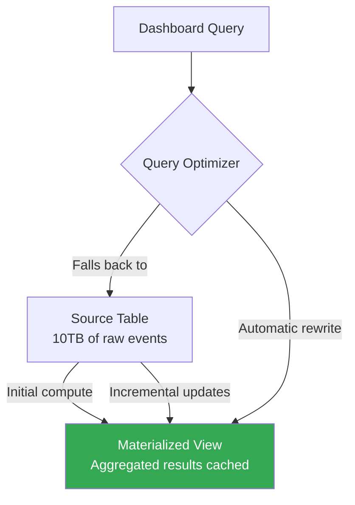

# How to Build Materialized Views in BigQuery for Faster Dashboard Queries

Author: [nawazdhandala](https://www.github.com/nawazdhandala)

Tags: GCP, BigQuery, Materialized Views, Performance, Dashboards, Cost Optimization

Description: Learn how to create and manage BigQuery materialized views to speed up dashboard queries and reduce costs by precomputing common aggregations and filters.

---

If you have a dashboard that runs the same expensive aggregation query every time someone opens it, you are paying for the same computation over and over. Materialized views solve this by precomputing and caching query results. BigQuery automatically keeps them up to date as the underlying data changes.

Unlike regular views, which run the full query every time, materialized views store their results physically. When you query a materialized view, BigQuery reads the cached results instead of scanning the entire source table. This makes dashboard queries faster and cheaper.

## How Materialized Views Work

When you create a materialized view, BigQuery runs the query once and stores the results. When the source table changes, BigQuery incrementally updates the materialized view - it does not recompute the entire result set. This is efficient and largely transparent.



The query optimizer can automatically rewrite queries to use materialized views, even if the user does not reference the materialized view directly. This is called smart tuning.

## Creating a Basic Materialized View

Here is a materialized view that precomputes daily sales metrics.

```sql
-- Create a materialized view for daily sales aggregations
CREATE MATERIALIZED VIEW `my-project-id.analytics.daily_sales_summary`
AS
SELECT
    DATE(order_timestamp) AS order_date,
    product_category,
    region,
    COUNT(*) AS order_count,
    SUM(order_amount) AS total_revenue,
    AVG(order_amount) AS avg_order_value,
    COUNT(DISTINCT customer_id) AS unique_customers
FROM
    `my-project-id.raw_data.orders`
GROUP BY
    order_date, product_category, region;
```

Now when your dashboard queries daily sales data, BigQuery can read from the materialized view instead of scanning the entire orders table.

## Dashboard Query Optimization

Without a materialized view, your dashboard query scans the full table:

```sql
-- This scans the entire orders table every time (expensive)
SELECT
    DATE(order_timestamp) AS order_date,
    SUM(order_amount) AS total_revenue
FROM
    `my-project-id.raw_data.orders`
WHERE
    DATE(order_timestamp) >= DATE_SUB(CURRENT_DATE(), INTERVAL 30 DAY)
GROUP BY order_date
ORDER BY order_date;
```

With the materialized view in place, BigQuery automatically rewrites this query to use the cached results:

```sql
-- BigQuery may automatically rewrite this to read from the materialized view
-- Even though you are querying the base table
SELECT
    order_date,
    SUM(total_revenue) AS total_revenue
FROM
    `my-project-id.analytics.daily_sales_summary`
WHERE
    order_date >= DATE_SUB(CURRENT_DATE(), INTERVAL 30 DAY)
GROUP BY order_date
ORDER BY order_date;
```

## Materialized Views over Partitioned Tables

Materialized views work particularly well with partitioned tables. They respect partition boundaries, which means incremental updates only process new partitions.

```sql
-- Source table is partitioned by date
CREATE TABLE `my-project-id.raw_data.events` (
    event_id STRING,
    event_type STRING,
    user_id STRING,
    event_timestamp TIMESTAMP,
    properties JSON
)
PARTITION BY DATE(event_timestamp)
CLUSTER BY event_type;

-- Materialized view over the partitioned table
CREATE MATERIALIZED VIEW `my-project-id.analytics.event_counts`
PARTITION BY event_date
CLUSTER BY event_type
AS
SELECT
    DATE(event_timestamp) AS event_date,
    event_type,
    COUNT(*) AS event_count,
    COUNT(DISTINCT user_id) AS unique_users
FROM
    `my-project-id.raw_data.events`
GROUP BY
    event_date, event_type;
```

The materialized view inherits partitioning, so queries that filter by date are even more efficient.

## Supported Operations

Materialized views have some restrictions on what SQL they can contain.

**Supported:**
- Aggregations: COUNT, SUM, AVG, MIN, MAX, COUNT DISTINCT, ANY_VALUE
- GROUP BY clauses
- Filters in WHERE clause (limited)
- INNER JOIN between a fact table and dimension tables
- Partitioning and clustering

**Not supported:**
- OUTER JOINs
- Subqueries
- Window functions (OVER clause)
- UNION, INTERSECT, EXCEPT
- Non-deterministic functions (CURRENT_TIMESTAMP, RAND)
- UDFs

## Materialized Views with Joins

You can create materialized views that join tables - useful for denormalized dashboard queries.

```sql
-- Materialized view that joins orders with product details
CREATE MATERIALIZED VIEW `my-project-id.analytics.order_product_summary`
AS
SELECT
    DATE(o.order_timestamp) AS order_date,
    p.product_name,
    p.category,
    COUNT(*) AS order_count,
    SUM(o.quantity) AS total_quantity,
    SUM(o.order_amount) AS total_revenue
FROM
    `my-project-id.raw_data.orders` o
INNER JOIN
    `my-project-id.raw_data.products` p
    ON o.product_id = p.product_id
GROUP BY
    order_date, p.product_name, p.category;
```

Note: Only INNER JOINs are supported in materialized views.

## Configuring Refresh Settings

By default, BigQuery automatically refreshes materialized views when the base tables change. You can control this behavior.

```sql
-- Create a materialized view with custom refresh settings
CREATE MATERIALIZED VIEW `my-project-id.analytics.hourly_metrics`
OPTIONS (
    enable_refresh = true,
    refresh_interval_minutes = 30  -- Refresh at most every 30 minutes
)
AS
SELECT
    TIMESTAMP_TRUNC(event_timestamp, HOUR) AS event_hour,
    event_type,
    COUNT(*) AS event_count
FROM
    `my-project-id.raw_data.events`
GROUP BY
    event_hour, event_type;
```

You can also manually trigger a refresh:

```bash
# Manually refresh a materialized view
bq query --nouse_legacy_sql \
    "CALL BQ.REFRESH_MATERIALIZED_VIEW('my-project-id.analytics.hourly_metrics')"
```

## Disabling Automatic Refresh

For views where you want full control over when data is refreshed:

```sql
-- Create a materialized view without automatic refresh
CREATE MATERIALIZED VIEW `my-project-id.analytics.monthly_report`
OPTIONS (
    enable_refresh = false
)
AS
SELECT
    DATE_TRUNC(order_date, MONTH) AS month,
    region,
    SUM(revenue) AS total_revenue,
    COUNT(DISTINCT customer_id) AS customer_count
FROM
    `my-project-id.raw_data.order_summary`
GROUP BY
    month, region;
```

Then refresh it on your schedule:

```bash
# Refresh monthly at the start of each month via a scheduled script
bq query --nouse_legacy_sql \
    "CALL BQ.REFRESH_MATERIALIZED_VIEW('my-project-id.analytics.monthly_report')"
```

## Smart Tuning (Automatic Query Rewrite)

BigQuery can automatically rewrite queries to use materialized views, even when the query references the base table. This feature is called smart tuning.

For example, if you have this materialized view:

```sql
CREATE MATERIALIZED VIEW `my-project-id.analytics.product_daily_sales`
AS
SELECT
    product_id,
    DATE(sale_timestamp) AS sale_date,
    SUM(amount) AS daily_total,
    COUNT(*) AS sale_count
FROM `my-project-id.sales.transactions`
GROUP BY product_id, sale_date;
```

Then this query against the base table:

```sql
-- User writes this query against the base table
SELECT
    product_id,
    SUM(amount) AS weekly_total
FROM `my-project-id.sales.transactions`
WHERE sale_timestamp >= TIMESTAMP('2026-02-10')
GROUP BY product_id;
```

BigQuery may automatically rewrite it to use the materialized view, scanning much less data.

To check if a query used a materialized view, look at the execution details in the query results or use the `INFORMATION_SCHEMA`:

```sql
-- Check materialized view usage statistics
SELECT
    table_name,
    last_refresh_time,
    refresh_watermark
FROM
    `my-project-id.analytics.INFORMATION_SCHEMA.MATERIALIZED_VIEWS`;
```

## Cost Comparison

Here is a rough comparison for a typical dashboard scenario:

| Approach | Data Scanned per Query | Monthly Cost (100 queries/day) |
|----------|----------------------|-------------------------------|
| Direct query on 10TB table | 10 TB | ~$15,000 |
| Materialized view (100 GB cached) | 100 GB | ~$1,500 |
| Materialized view with partition pruning | 10 GB | ~$150 |

The savings scale with query frequency and source table size.

## Monitoring Materialized Views

Track the health and usage of your materialized views.

```sql
-- Check the last refresh time and data staleness
SELECT
    table_catalog,
    table_schema,
    table_name,
    last_refresh_time,
    refresh_watermark
FROM
    `my-project-id.analytics.INFORMATION_SCHEMA.MATERIALIZED_VIEWS`
ORDER BY last_refresh_time DESC;
```

## Common Issues

**Materialized view not being used by optimizer**: Check that smart tuning is not disabled. Also, the query must be compatible with the materialized view - if it uses columns or filters not covered by the view, BigQuery falls back to the base table.

**Refresh failures**: If the source table schema changes in an incompatible way, the materialized view refresh can fail. Monitor for refresh errors.

**Stale data**: If you disabled automatic refresh, the materialized view shows data as of the last refresh. Dashboard users may see outdated numbers.

**Storage costs**: Materialized views consume storage. For very large materialized views, weigh the storage cost against the query cost savings.

## Summary

Materialized views are the easiest way to speed up BigQuery dashboards. Create them over your most frequently queried aggregations, let BigQuery handle incremental refreshes, and watch your query costs drop. The optimizer can automatically rewrite queries to use materialized views, so you do not even need to change your dashboard SQL. Just make sure the aggregations in your view match what your dashboards compute, and BigQuery does the rest.
