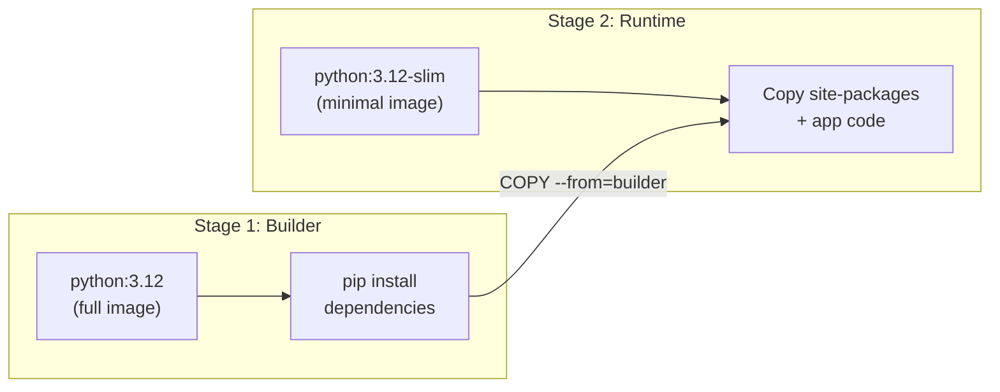

# How to Build Multi-Stage Docker Images for Python Applications and Deploy Them to Cloud Run via Artifact Registry

Author: [nawazdhandala](https://www.github.com/nawazdhandala)

Tags: GCP, Docker, Python, Cloud Run, Artifact Registry, Google Cloud Platform

Description: Build optimized multi-stage Docker images for Python applications that minimize image size and attack surface, then deploy them to Cloud Run through Artifact Registry.

---

A typical Python Docker image built the naive way is over a gigabyte. It includes pip, build tools, development headers, and cached package downloads that your running application never uses. Multi-stage builds fix this by using one stage to build your dependencies and another to run your application, resulting in images that are a fraction of the size.

Smaller images mean faster deploys, faster scaling on Cloud Run (cold starts depend on image size), and a smaller attack surface. Let me show you how to build this properly for a Python application and deploy it to Cloud Run.

## The Problem with Single-Stage Builds

Here is what a typical single-stage Dockerfile looks like:

```dockerfile
# DO NOT use this in production - image will be ~1.2GB
FROM python:3.12

WORKDIR /app
COPY requirements.txt .
RUN pip install -r requirements.txt
COPY . .

CMD ["python", "main.py"]
```

This image includes the entire Python distribution, pip, setuptools, wheel, C compilers (in some base images), and every intermediate file generated during package installation. Most of that is useless at runtime.

## Multi-Stage Build Strategy

The multi-stage approach uses two stages:

1. **Builder stage** - installs dependencies with all necessary build tools
2. **Runtime stage** - copies only the installed packages and application code into a minimal base image



## The Optimized Dockerfile

Here is the multi-stage Dockerfile for a Python web application:

```dockerfile
# Stage 1: Builder - installs all dependencies with build tools
FROM python:3.12-slim AS builder

# Install system dependencies needed for building Python packages
# These are only needed during pip install, not at runtime
RUN apt-get update && apt-get install -y --no-install-recommends \
    build-essential \
    libpq-dev \
    && rm -rf /var/lib/apt/lists/*

# Create a virtual environment for clean package isolation
RUN python -m venv /opt/venv
ENV PATH="/opt/venv/bin:$PATH"

# Install Python dependencies
# Copy requirements first for better Docker cache utilization
COPY requirements.txt .
RUN pip install --no-cache-dir --upgrade pip && \
    pip install --no-cache-dir -r requirements.txt


# Stage 2: Runtime - minimal image with only what we need
FROM python:3.12-slim AS runtime

# Install only runtime system dependencies (no build tools)
RUN apt-get update && apt-get install -y --no-install-recommends \
    libpq5 \
    curl \
    && rm -rf /var/lib/apt/lists/*

# Create a non-root user for security
RUN groupadd -r appuser && useradd -r -g appuser -d /app -s /sbin/nologin appuser

# Copy the virtual environment from the builder stage
COPY --from=builder /opt/venv /opt/venv
ENV PATH="/opt/venv/bin:$PATH"

# Set working directory
WORKDIR /app

# Copy application code
COPY --chown=appuser:appuser . .

# Switch to non-root user
USER appuser

# Cloud Run sets the PORT environment variable
ENV PORT=8080
EXPOSE 8080

# Health check endpoint
HEALTHCHECK --interval=30s --timeout=5s --start-period=10s --retries=3 \
    CMD curl -f http://localhost:8080/health || exit 1

# Run the application with gunicorn for production
CMD ["gunicorn", "main:app", \
     "--bind", "0.0.0.0:8080", \
     "--workers", "2", \
     "--threads", "4", \
     "--timeout", "120", \
     "--access-logfile", "-", \
     "--error-logfile", "-"]
```

The key optimizations here:

- **Virtual environment** in the builder stage provides a clean directory to copy
- **`--no-cache-dir`** prevents pip from storing downloaded packages
- **`python:3.12-slim`** for both stages avoids the full Debian image
- **Non-root user** for security best practices
- **Only runtime libraries** in the final image (libpq5 instead of libpq-dev)

## The Application Code

Here is a minimal Flask application that works with this setup:

```python
# main.py - Flask application entry point
import os
from flask import Flask, jsonify

app = Flask(__name__)

@app.route("/health")
def health():
    """Health check endpoint for Cloud Run."""
    return jsonify({"status": "healthy"}), 200

@app.route("/")
def index():
    return jsonify({"message": "Hello from Cloud Run"}), 200

if __name__ == "__main__":
    port = int(os.environ.get("PORT", 8080))
    app.run(host="0.0.0.0", port=port)
```

And the requirements file:

```
# requirements.txt
flask==3.0.0
gunicorn==21.2.0
psycopg2-binary==2.9.9
```

## Setting Up Artifact Registry

Create a Docker repository in Artifact Registry to store the images:

```bash
# Create the Artifact Registry repository
gcloud artifacts repositories create backend \
  --repository-format=docker \
  --location=us-central1 \
  --project=my-project \
  --description="Backend service Docker images"

# Configure Docker authentication for the registry
gcloud auth configure-docker us-central1-docker.pkg.dev
```

## Building and Pushing the Image

Build the image and push it to Artifact Registry:

```bash
# Set variables for the image path
PROJECT_ID="my-project"
REGION="us-central1"
REPO="backend"
IMAGE="my-app"
TAG="v1.0.0"
FULL_IMAGE="${REGION}-docker.pkg.dev/${PROJECT_ID}/${REPO}/${IMAGE}:${TAG}"

# Build the image
docker build -t ${FULL_IMAGE} .

# Check the image size - should be much smaller than a single-stage build
docker images ${FULL_IMAGE}
# Expected: ~200-300MB vs ~1.2GB for single-stage

# Push to Artifact Registry
docker push ${FULL_IMAGE}
```

## Building with Cloud Build

For CI/CD, use Cloud Build instead of building locally:

```yaml
# cloudbuild.yaml - Build and push with Cloud Build
steps:
  # Build the Docker image
  - name: 'gcr.io/cloud-builders/docker'
    args:
      - 'build'
      - '-t'
      - '${_REGION}-docker.pkg.dev/$PROJECT_ID/${_REPO}/${_IMAGE}:$SHORT_SHA'
      - '-t'
      - '${_REGION}-docker.pkg.dev/$PROJECT_ID/${_REPO}/${_IMAGE}:latest'
      - '--cache-from'
      - '${_REGION}-docker.pkg.dev/$PROJECT_ID/${_REPO}/${_IMAGE}:latest'
      - '.'

  # Push both tags
  - name: 'gcr.io/cloud-builders/docker'
    args: ['push', '--all-tags', '${_REGION}-docker.pkg.dev/$PROJECT_ID/${_REPO}/${_IMAGE}']

  # Deploy to Cloud Run
  - name: 'gcr.io/google.com/cloudsdktool/cloud-sdk'
    entrypoint: gcloud
    args:
      - 'run'
      - 'deploy'
      - '${_SERVICE_NAME}'
      - '--image'
      - '${_REGION}-docker.pkg.dev/$PROJECT_ID/${_REPO}/${_IMAGE}:$SHORT_SHA'
      - '--region'
      - '${_REGION}'
      - '--platform'
      - 'managed'

substitutions:
  _REGION: us-central1
  _REPO: backend
  _IMAGE: my-app
  _SERVICE_NAME: my-app

images:
  - '${_REGION}-docker.pkg.dev/$PROJECT_ID/${_REPO}/${_IMAGE}'
```

## Deploying to Cloud Run

Deploy the image from Artifact Registry to Cloud Run:

```bash
# Deploy to Cloud Run
gcloud run deploy my-app \
  --image=us-central1-docker.pkg.dev/my-project/backend/my-app:v1.0.0 \
  --region=us-central1 \
  --platform=managed \
  --allow-unauthenticated \
  --port=8080 \
  --memory=512Mi \
  --cpu=1 \
  --min-instances=0 \
  --max-instances=10 \
  --set-env-vars="ENVIRONMENT=production"
```

Or with Terraform:

```hcl
# cloud-run.tf - Deploy the Docker image to Cloud Run

resource "google_cloud_run_v2_service" "app" {
  project  = var.project_id
  name     = "my-app"
  location = var.region

  template {
    containers {
      # Reference the image in Artifact Registry
      image = "${var.region}-docker.pkg.dev/${var.project_id}/backend/my-app:${var.image_tag}"

      ports {
        container_port = 8080
      }

      resources {
        limits = {
          cpu    = "1"
          memory = "512Mi"
        }
      }

      # Startup probe using the health endpoint
      startup_probe {
        http_get {
          path = "/health"
          port = 8080
        }
        initial_delay_seconds = 5
        period_seconds        = 5
        failure_threshold     = 3
      }

      # Liveness probe
      liveness_probe {
        http_get {
          path = "/health"
          port = 8080
        }
        period_seconds = 30
      }
    }

    scaling {
      min_instance_count = 0
      max_instance_count = 10
    }
  }
}
```

## Further Optimizations

Here are additional techniques to make your images even smaller:

**Use pip-tools for deterministic builds.** Pin exact versions of every dependency, including transitive ones:

```bash
# Generate a locked requirements file
pip-compile requirements.in --output-file=requirements.txt
```

**Use .dockerignore.** Prevent unnecessary files from being copied into the build context:

```
# .dockerignore
.git
.github
__pycache__
*.pyc
*.pyo
.env
.venv
tests/
docs/
*.md
.dockerignore
Dockerfile
docker-compose.yml
```

**Cache pip downloads between builds.** Use Docker BuildKit cache mounts:

```dockerfile
# Enable BuildKit cache for pip
RUN --mount=type=cache,target=/root/.cache/pip \
    pip install -r requirements.txt
```

## Image Size Comparison

Here is what you can expect with different approaches:

| Approach | Image Size |
|----------|-----------|
| python:3.12 (single-stage) | ~1.2 GB |
| python:3.12-slim (single-stage) | ~500 MB |
| Multi-stage with slim | ~200-300 MB |
| Multi-stage with distroless | ~120-200 MB |

The multi-stage approach cuts image size by 75% or more, directly reducing Cloud Run cold start times and deployment speed.

## Summary

Multi-stage Docker builds are a must for Python applications deployed to Cloud Run. The builder stage handles package compilation with all necessary tools, and the runtime stage contains only what the application needs to run. Combined with Artifact Registry for image storage and Cloud Build for CI/CD, you get a streamlined pipeline from code commit to production deployment. The smaller images translate directly to faster cold starts on Cloud Run, which means better response times for your users.
