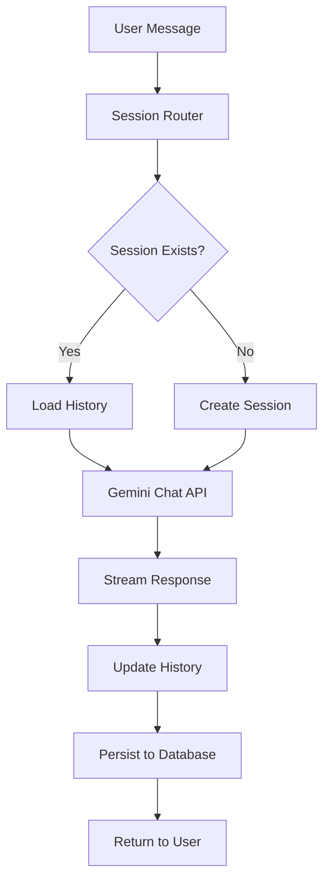

# How to Build Multi-Turn Conversational Applications with Gemini on Vertex AI

Author: [nawazdhandala](https://www.github.com/nawazdhandala)

Tags: GCP, Gemini, Vertex AI, Conversational AI, Chatbots

Description: A practical guide to building multi-turn conversational applications using Gemini on Vertex AI with context management, session handling, and production patterns.

---

Building a chatbot that actually remembers what you said three messages ago is harder than it sounds. Most LLM tutorials show you a single request-response, but real conversational applications need to maintain context across many turns. Gemini on Vertex AI has solid support for multi-turn conversations, and in this post I will show you how to build them properly.

## How Multi-Turn Conversations Work in Gemini

Gemini handles multi-turn conversations through a chat session abstraction. Each message you send includes the full conversation history, and the model uses that context to generate relevant responses. The Vertex AI SDK manages the history for you when you use the chat interface, but understanding what happens under the hood helps when you need to customize behavior.

Every turn in the conversation has a role - either "user" or "model". The SDK accumulates these turns and sends them with each new request. This means the context window fills up over time, and you need to manage that.

## Getting Started with Chat Sessions

The simplest way to start a multi-turn conversation is through the chat API. Here is a basic setup:

```python
import vertexai
from vertexai.generative_models import GenerativeModel

# Initialize the Vertex AI environment
vertexai.init(project="your-project-id", location="us-central1")

# Create a model instance
model = GenerativeModel("gemini-2.0-flash")

# Start a chat session - this tracks conversation history automatically
chat = model.start_chat()

# First turn
response = chat.send_message("I am planning a trip to Japan in April.")
print(response.text)

# Second turn - the model remembers the context
response = chat.send_message("What should I pack?")
print(response.text)
# The model knows you are going to Japan in April and will suggest
# items appropriate for Japanese spring weather
```

## Initializing with Conversation History

Sometimes you need to restore a previous conversation, maybe the user closed their browser and came back later. You can initialize a chat session with existing history.

This code shows how to bootstrap a chat with prior context:

```python
from vertexai.generative_models import Content, Part

# Define previous conversation history
history = [
    Content(
        role="user",
        parts=[Part.from_text("I need help setting up a Kubernetes cluster on GKE.")]
    ),
    Content(
        role="model",
        parts=[Part.from_text(
            "I can help with that. Are you looking to set up a standard "
            "or autopilot cluster? And what region do you prefer?"
        )]
    ),
    Content(
        role="user",
        parts=[Part.from_text("Autopilot in us-central1.")]
    ),
    Content(
        role="model",
        parts=[Part.from_text(
            "Great choice. Autopilot handles node management for you. "
            "Let me walk you through the setup steps."
        )]
    ),
]

# Resume the conversation from where it left off
chat = model.start_chat(history=history)

# The model has full context of the previous conversation
response = chat.send_message("What about networking configuration?")
print(response.text)
```

## Managing Context Window Limits

Every model has a maximum context window. For Gemini 2.0 Flash, that is 1 million tokens. While that is generous, long conversations in production can still hit limits. You need a strategy for managing conversation length.

Here is a sliding window approach that keeps the most recent turns:

```python
class ConversationManager:
    def __init__(self, model_name="gemini-2.0-flash", max_turns=50):
        # Keep only the last N turns to stay within context limits
        self.max_turns = max_turns
        self.model = GenerativeModel(model_name)
        self.history = []
        self.chat = None

    def start_or_resume(self, history=None):
        """Start a new conversation or resume from saved history."""
        if history:
            self.history = history
        # Trim if history exceeds our limit
        if len(self.history) > self.max_turns * 2:
            # Keep a system summary of trimmed context
            self.history = self.history[-(self.max_turns * 2):]
        self.chat = self.model.start_chat(history=self.history)

    def send_message(self, message):
        """Send a message and manage the conversation history."""
        if not self.chat:
            self.start_or_resume()
        response = self.chat.send_message(message)
        # Update our tracked history
        self.history = self.chat.history
        return response.text

    def get_history(self):
        """Return serializable history for persistence."""
        return [
            {
                "role": content.role,
                "text": content.parts[0].text
            }
            for content in self.history
        ]
```

## Adding System Instructions

System instructions shape how the model behaves throughout the entire conversation. They are set once when you create the model and apply to every turn.

This example creates a customer support bot with specific personality and constraints:

```python
# Define system instructions that persist across all turns
system_instruction = """You are a technical support agent for a cloud hosting company.

Rules:
- Always be polite and professional
- If you do not know something, say so honestly
- Never share internal company information
- For billing questions, direct users to billing@example.com
- Keep responses concise but thorough
- Use code examples when explaining technical concepts
"""

# Create model with system instructions
model = GenerativeModel(
    "gemini-2.0-flash",
    system_instruction=system_instruction
)

chat = model.start_chat()

# The model now follows these instructions in every response
response = chat.send_message("My website is down and I need help urgently!")
print(response.text)
```

## Handling Concurrent Users

In a real application, you have many users chatting simultaneously. Each needs their own conversation state. Here is a pattern using a session store:

```python
import uuid
from typing import Dict

class ChatSessionStore:
    """Manages multiple concurrent chat sessions."""

    def __init__(self, model_name="gemini-2.0-flash"):
        self.model_name = model_name
        self.sessions: Dict[str, ConversationManager] = {}

    def create_session(self) -> str:
        """Create a new chat session and return its ID."""
        session_id = str(uuid.uuid4())
        manager = ConversationManager(self.model_name)
        manager.start_or_resume()
        self.sessions[session_id] = manager
        return session_id

    def send_message(self, session_id: str, message: str) -> str:
        """Send a message in an existing session."""
        if session_id not in self.sessions:
            raise ValueError(f"Session {session_id} not found")
        return self.sessions[session_id].send_message(message)

    def close_session(self, session_id: str):
        """Clean up a session when the user is done."""
        if session_id in self.sessions:
            del self.sessions[session_id]

# Usage
store = ChatSessionStore()
session_id = store.create_session()
reply = store.send_message(session_id, "Hello, I need help with my database.")
print(reply)
```

## Streaming Responses for Better UX

Nobody likes staring at a blank screen while the model generates a long response. Streaming shows tokens as they arrive, which makes the application feel much more responsive.

This code enables streaming in a multi-turn chat:

```python
# Send a message with streaming enabled
responses = chat.send_message(
    "Explain the differences between Cloud SQL and Cloud Spanner in detail.",
    stream=True
)

# Process tokens as they arrive
full_response = ""
for chunk in responses:
    if chunk.text:
        print(chunk.text, end="", flush=True)
        full_response += chunk.text

print()  # Newline after streaming completes
```

## Conversation Flow Architecture

For complex conversational applications, you want a clear architecture that separates concerns:



## Persisting Conversations to a Database

For production use, you need to persist conversation history. Here is a pattern using Firestore:

```python
from google.cloud import firestore

class FirestoreConversationStore:
    def __init__(self):
        self.db = firestore.Client()
        self.collection = "conversations"

    def save_history(self, session_id: str, history: list):
        """Save conversation history to Firestore."""
        doc_ref = self.db.collection(self.collection).document(session_id)
        doc_ref.set({
            "history": history,
            "updated_at": firestore.SERVER_TIMESTAMP,
            "turn_count": len(history)
        })

    def load_history(self, session_id: str) -> list:
        """Load conversation history from Firestore."""
        doc_ref = self.db.collection(self.collection).document(session_id)
        doc = doc_ref.get()
        if doc.exists:
            return doc.to_dict().get("history", [])
        return []
```

## Error Recovery in Conversations

Network errors, timeouts, and rate limits happen. Your application should handle these without losing conversation state.

```python
import time
from google.api_core import exceptions

def send_with_retry(chat, message, max_retries=3):
    """Send a message with retry logic for transient failures."""
    for attempt in range(max_retries):
        try:
            return chat.send_message(message)
        except exceptions.ResourceExhausted:
            # Rate limited - wait and retry
            wait_time = 2 ** attempt
            print(f"Rate limited. Waiting {wait_time}s before retry...")
            time.sleep(wait_time)
        except exceptions.DeadlineExceeded:
            # Timeout - retry with same message
            print(f"Request timed out. Retry {attempt + 1}/{max_retries}")
            time.sleep(1)
    raise Exception("Failed after maximum retries")
```

## Monitoring Conversation Quality

Track key metrics for your conversational application: average turns per session, response latency per turn, user satisfaction signals, and conversation drop-off points. These metrics tell you whether users find the experience useful. With OneUptime, you can set up dashboards to track these in real time and alert when conversation quality degrades.

## Wrapping Up

Building multi-turn conversational applications with Gemini involves more than just sending messages back and forth. You need proper session management, context window handling, conversation persistence, streaming for good UX, and error recovery. Start with the basic chat API, then layer in these production concerns as your application grows. The patterns shown here have served me well across several production deployments.
