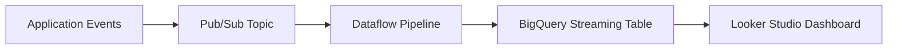

# How to Build Real-Time Dashboards in Looker Studio Connected to BigQuery Streaming Tables

Author: [nawazdhandala](https://www.github.com/nawazdhandala)

Tags: GCP, Looker Studio, BigQuery, Real-Time Dashboards, Streaming, Data Visualization

Description: Learn how to build real-time dashboards in Looker Studio that display live data from BigQuery streaming tables with auto-refresh, optimized queries, and practical design patterns.

---

Real-time dashboards let you see what is happening in your system right now. Not from last night's batch run, but from the data that landed in BigQuery seconds ago. Looker Studio (formerly Google Data Studio) connects directly to BigQuery, and when your BigQuery tables are fed by streaming inserts, you get a dashboard that reflects live data with minimal latency.

This post walks through building a real-time dashboard end-to-end: from setting up the streaming pipeline to designing the Looker Studio dashboard with auto-refresh and performance optimization.

## The Streaming Pipeline

Before building the dashboard, you need data flowing into BigQuery in real-time. The typical architecture uses Pub/Sub for ingestion and either direct BigQuery streaming inserts or Dataflow for transformation:



### Setting Up the BigQuery Table

Create the table with the right schema and partitioning for real-time queries:

```sql
-- Create a table optimized for streaming and real-time queries
-- Partition by ingestion time for efficient recent-data queries
CREATE TABLE `my-project.realtime.events` (
    event_id STRING NOT NULL,
    event_type STRING NOT NULL,
    user_id STRING,
    session_id STRING,
    page_url STRING,
    referrer STRING,
    device_type STRING,
    country STRING,
    event_timestamp TIMESTAMP NOT NULL,
    properties JSON
)
PARTITION BY DATE(event_timestamp)
CLUSTER BY event_type, country
OPTIONS (
    description="Real-time events table fed by streaming inserts",
    require_partition_filter=false
);
```

### Streaming Data In

Use the BigQuery Storage Write API for efficient streaming:

```python
# Stream events into BigQuery using the Storage Write API
from google.cloud import bigquery_storage_v1
from google.cloud.bigquery_storage_v1 import types
from google.protobuf import descriptor_pb2
import json

client = bigquery_storage_v1.BigQueryWriteClient()

# Set up the write stream
parent = client.table_path("my-project", "realtime", "events")
write_stream = types.WriteStream()
write_stream.type_ = types.WriteStream.Type.DEFAULT

stream = client.create_write_stream(
    parent=parent,
    write_stream=write_stream
)

# Append rows to the stream
def stream_events(events):
    """Stream a batch of events to BigQuery."""
    serialized_rows = types.AppendRowsRequest.ProtoData.ProtoRows()

    for event in events:
        row = create_proto_row(event)
        serialized_rows.serialized_rows.append(row.SerializeToString())

    request = types.AppendRowsRequest()
    request.write_stream = stream.name
    request.proto_rows = types.AppendRowsRequest.ProtoData(
        rows=serialized_rows
    )

    response = client.append_rows(iter([request]))
    return response
```

Or use simple streaming inserts for lower throughput scenarios:

```python
# Simple streaming insert for lower-volume use cases
from google.cloud import bigquery
import datetime

client = bigquery.Client()
table_id = "my-project.realtime.events"

# Batch of events to insert
rows_to_insert = [
    {
        "event_id": "evt-001",
        "event_type": "page_view",
        "user_id": "user-123",
        "country": "US",
        "event_timestamp": datetime.datetime.utcnow().isoformat(),
    },
    {
        "event_id": "evt-002",
        "event_type": "click",
        "user_id": "user-456",
        "country": "UK",
        "event_timestamp": datetime.datetime.utcnow().isoformat(),
    }
]

errors = client.insert_rows_json(table_id, rows_to_insert)
if errors:
    print(f"Streaming insert errors: {errors}")
```

## Creating Views for the Dashboard

Instead of pointing Looker Studio directly at the raw streaming table, create views that pre-aggregate data. This reduces query costs and improves dashboard load times:

```sql
-- View: real-time metrics for the last 24 hours
-- This view powers the main dashboard panels
CREATE OR REPLACE VIEW `my-project.realtime.dashboard_metrics_24h` AS
SELECT
    TIMESTAMP_TRUNC(event_timestamp, MINUTE) AS minute_bucket,
    event_type,
    country,
    device_type,
    COUNT(*) AS event_count,
    COUNT(DISTINCT user_id) AS unique_users,
    COUNT(DISTINCT session_id) AS unique_sessions
FROM `my-project.realtime.events`
WHERE event_timestamp >= TIMESTAMP_SUB(CURRENT_TIMESTAMP(), INTERVAL 24 HOUR)
GROUP BY minute_bucket, event_type, country, device_type;
```

```sql
-- View: current hour summary for the real-time ticker
CREATE OR REPLACE VIEW `my-project.realtime.current_hour_summary` AS
SELECT
    event_type,
    COUNT(*) AS event_count,
    COUNT(DISTINCT user_id) AS unique_users,
    TIMESTAMP_DIFF(
        CURRENT_TIMESTAMP(),
        MAX(event_timestamp),
        SECOND
    ) AS seconds_since_last_event
FROM `my-project.realtime.events`
WHERE event_timestamp >= TIMESTAMP_TRUNC(CURRENT_TIMESTAMP(), HOUR)
GROUP BY event_type;
```

```sql
-- View: top pages in the last 15 minutes for a real-time leaderboard
CREATE OR REPLACE VIEW `my-project.realtime.top_pages_15m` AS
SELECT
    page_url,
    COUNT(*) AS view_count,
    COUNT(DISTINCT user_id) AS unique_viewers
FROM `my-project.realtime.events`
WHERE event_type = 'page_view'
  AND event_timestamp >= TIMESTAMP_SUB(CURRENT_TIMESTAMP(), INTERVAL 15 MINUTE)
GROUP BY page_url
ORDER BY view_count DESC
LIMIT 20;
```

## Building the Looker Studio Dashboard

### Step 1: Create a New Report

Go to lookerstudio.google.com and create a new report. Add BigQuery as a data source and connect to your views.

### Step 2: Add the BigQuery Data Sources

For each view, add a separate data source:

1. Click "Add data" in the toolbar
2. Select "BigQuery"
3. Choose your project, dataset, and the view
4. Click "Add"

Repeat for each view you want to use in the dashboard.

### Step 3: Configure Auto-Refresh

Looker Studio supports automatic data refresh. To enable it:

1. Click on "File" and then "Report settings"
2. Under "Data freshness", set the default to a short interval
3. For real-time dashboards, choose the lowest available (typically 1 minute for BigQuery sources)

You can also set data freshness per data source. For real-time views, set a 1-minute refresh. For slower-changing views, use a longer interval to reduce query costs.

### Step 4: Design the Dashboard Layout

A typical real-time dashboard has these components:

**Key Metrics Row (Scorecards)**: Show the current values for your most important metrics.

Configure each scorecard with:
- Data source: `current_hour_summary`
- Metric: `event_count` (SUM)
- Comparison: Previous period for a trend indicator

**Time Series Chart**: Shows the event trend over the last 24 hours.

Configure with:
- Data source: `dashboard_metrics_24h`
- Dimension: `minute_bucket`
- Metric: `event_count` (SUM)
- Date range: Last 24 hours

**Geographic Map**: Shows activity by country.

Configure with:
- Data source: `dashboard_metrics_24h`
- Geo dimension: `country`
- Metric: `unique_users` (SUM)
- Date range: Last 24 hours

**Top Pages Table**: Shows the most visited pages right now.

Configure with:
- Data source: `top_pages_15m`
- Dimensions: `page_url`
- Metrics: `view_count`, `unique_viewers`
- Sort: `view_count` descending

## Optimizing Dashboard Performance

### Use Materialized Views

For frequently-queried aggregations, use BigQuery materialized views instead of regular views. BigQuery maintains these automatically and serves them from cached results:

```sql
-- Materialized view: auto-maintained aggregation of recent events
-- BigQuery keeps this up to date and uses it to answer matching queries
CREATE MATERIALIZED VIEW `my-project.realtime.mv_hourly_metrics`
OPTIONS (
    enable_refresh = true,
    refresh_interval_minutes = 5
) AS
SELECT
    TIMESTAMP_TRUNC(event_timestamp, HOUR) AS hour_bucket,
    event_type,
    country,
    COUNT(*) AS event_count,
    COUNT(DISTINCT user_id) AS unique_users
FROM `my-project.realtime.events`
WHERE event_timestamp >= TIMESTAMP_SUB(CURRENT_TIMESTAMP(), INTERVAL 48 HOUR)
GROUP BY hour_bucket, event_type, country;
```

### Use BI Engine

BigQuery BI Engine provides in-memory acceleration for Looker Studio queries. Reserve capacity for your real-time datasets:

```bash
# Reserve BI Engine capacity for faster dashboard queries
# BI Engine caches frequently-queried data in memory
bq update \
  --reservation \
  --project_id=my-project \
  --location=US \
  --bi_reservation_size=2GB
```

BI Engine automatically detects which queries benefit from in-memory acceleration and caches the relevant data.

### Limit the Time Range in Views

Always include a time filter in your dashboard views. Querying all historical data on every dashboard refresh is wasteful:

```sql
-- Always filter to a bounded time range in views used by dashboards
-- This prevents full-table scans on every refresh
CREATE OR REPLACE VIEW `my-project.realtime.dashboard_events` AS
SELECT *
FROM `my-project.realtime.events`
WHERE event_timestamp >= TIMESTAMP_SUB(CURRENT_TIMESTAMP(), INTERVAL 24 HOUR);
```

### Use Extract Data Sources

For parts of the dashboard that do not need real-time data (like weekly trends), use Looker Studio's "Extract Data" feature. This takes a snapshot of the data and stores it in Looker Studio's cache, eliminating repeated BigQuery queries.

## Adding Alerts for Anomalies

Combine your real-time dashboard with alerting. Use BigQuery scheduled queries to check for anomalies and send alerts:

```sql
-- Scheduled query: alert if event rate drops below threshold
-- Runs every 5 minutes and sends an alert via Cloud Monitoring

DECLARE current_rate INT64;

SET current_rate = (
    SELECT COUNT(*)
    FROM `my-project.realtime.events`
    WHERE event_timestamp >= TIMESTAMP_SUB(CURRENT_TIMESTAMP(), INTERVAL 5 MINUTE)
);

-- If fewer than 100 events in the last 5 minutes, something might be wrong
IF current_rate < 100 THEN
    -- Log a message that Cloud Monitoring can pick up for alerting
    SELECT ERROR(CONCAT('Low event rate alert: only ', CAST(current_rate AS STRING), ' events in the last 5 minutes'));
END IF;
```

## Sharing the Dashboard

Once the dashboard is built, share it with your team:

1. Click "Share" in the top right
2. Add individual users or Google Groups
3. Choose "Viewer" or "Editor" permissions
4. For wider access, generate a shareable link

For embedding in internal tools, use the embed URL that Looker Studio provides.

## Wrapping Up

Real-time dashboards in Looker Studio backed by BigQuery streaming tables give you live visibility into your systems without building custom visualization infrastructure. The key is designing your BigQuery views to pre-aggregate data and limit the time range, using BI Engine for in-memory acceleration, and configuring Looker Studio's auto-refresh to balance freshness against query costs. Start with a few key metrics and a time series chart, then expand as you learn which real-time insights are most valuable for your team.
