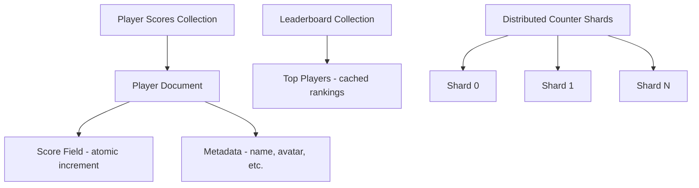

# How to Build Real-Time Leaderboards in Firestore Using Distributed Counters and Aggregation

Author: [nawazdhandala](https://www.github.com/nawazdhandala)

Tags: GCP, Firestore, Leaderboards, Distributed Counters, Real-Time Data

Description: Learn how to build scalable real-time leaderboards in Firestore using distributed counters, aggregation queries, and real-time listeners for gaming and competitive applications.

---

Building a leaderboard sounds simple until you actually try to do it at scale. A naive approach - read a player's score, update it, re-rank everyone - falls apart fast when thousands of players are updating their scores simultaneously. Firestore's document-level write throughput limit of about 1 write per second per document means a single "global scores" document is out of the question. You need a smarter architecture.

This post walks through building a real-time leaderboard in Firestore that can handle high concurrency, provides instant ranking, and updates in real-time for connected clients.

## The Architecture

The leaderboard system has three components:

1. Individual player documents that store each player's current score
2. Distributed counters for handling high-frequency score updates on hot documents
3. Real-time listeners that push leaderboard changes to connected clients

Here is the high-level data model:



## Setting Up the Data Model

Each player gets their own document in a `players` collection. Keeping scores in individual documents avoids the single-document write bottleneck:

```javascript
// Initialize a player document with starting score
const { doc, setDoc, serverTimestamp } = require('firebase/firestore');

async function createPlayer(playerId, displayName) {
  const playerRef = doc(db, 'players', playerId);

  await setDoc(playerRef, {
    displayName: displayName,
    score: 0,
    gamesPlayed: 0,
    lastActive: serverTimestamp(),
    // Store the rank bucket for efficient querying
    // Updated periodically or on score change
    rankBucket: 'unranked'
  });
}
```

## Updating Scores with Atomic Increments

When a player earns points, use the increment field transform. This is atomic and handles concurrent updates correctly:

```javascript
// Update a player's score atomically
// Multiple concurrent updates are all applied correctly
const { doc, updateDoc, increment, serverTimestamp } = require('firebase/firestore');

async function addScore(playerId, points) {
  const playerRef = doc(db, 'players', playerId);

  await updateDoc(playerRef, {
    score: increment(points),          // Atomic increment
    gamesPlayed: increment(1),         // Track games played
    lastActive: serverTimestamp()       // Track activity
  });
}

// Example: player earns 150 points
await addScore('player-abc', 150);
```

This works well for individual player scores because each player has their own document. But what if you need a global counter (like "total points earned across all players")? That is where distributed counters come in.

## Distributed Counters for Hot Aggregates

If you have a global metric that many players update simultaneously (like a team score in a cooperative game), a single document would be a bottleneck. Distributed counters spread writes across multiple "shard" documents:

```javascript
// Create a distributed counter with N shards
const NUM_SHARDS = 10;

async function initializeDistributedCounter(counterId) {
  const batch = writeBatch(db);

  // Create N shard documents under the counter
  for (let i = 0; i < NUM_SHARDS; i++) {
    const shardRef = doc(db, 'counters', counterId, 'shards', String(i));
    batch.set(shardRef, { count: 0 });
  }

  await batch.commit();
}

// Increment the distributed counter by picking a random shard
// This spreads writes across shards, allowing N concurrent writes/sec
async function incrementDistributedCounter(counterId, amount) {
  // Pick a random shard to distribute the write load
  const shardId = String(Math.floor(Math.random() * NUM_SHARDS));
  const shardRef = doc(db, 'counters', counterId, 'shards', shardId);

  await updateDoc(shardRef, {
    count: increment(amount)
  });
}

// Read the total by summing all shards
async function getDistributedCounterTotal(counterId) {
  const shardsSnapshot = await getDocs(
    collection(db, 'counters', counterId, 'shards')
  );

  let total = 0;
  shardsSnapshot.forEach(shard => {
    total += shard.data().count;
  });

  return total;
}
```

With 10 shards, this counter supports roughly 10 concurrent writes per second instead of 1.

## Querying the Leaderboard

Firestore's orderBy and limit make top-N queries straightforward:

```javascript
// Fetch the top 100 players by score
const { collection, query, orderBy, limit, getDocs } = require('firebase/firestore');

async function getTopPlayers(count = 100) {
  const leaderboardQuery = query(
    collection(db, 'players'),
    orderBy('score', 'desc'),
    limit(count)
  );

  const snapshot = await getDocs(leaderboardQuery);
  const players = [];
  let rank = 1;

  snapshot.forEach(doc => {
    const data = doc.data();
    players.push({
      rank: rank++,
      playerId: doc.id,
      displayName: data.displayName,
      score: data.score,
      gamesPlayed: data.gamesPlayed
    });
  });

  return players;
}
```

## Real-Time Leaderboard Updates

The real power of Firestore is real-time listeners. Connected clients can see the leaderboard update live without polling:

```javascript
// Set up a real-time listener on the top players
// The callback fires whenever any top player's score changes
const { collection, query, orderBy, limit, onSnapshot } = require('firebase/firestore');

function subscribeToLeaderboard(count, onUpdate) {
  const leaderboardQuery = query(
    collection(db, 'players'),
    orderBy('score', 'desc'),
    limit(count)
  );

  // onSnapshot fires immediately with current data, then on every change
  const unsubscribe = onSnapshot(leaderboardQuery, (snapshot) => {
    const players = [];
    let rank = 1;

    snapshot.forEach(doc => {
      const data = doc.data();
      players.push({
        rank: rank++,
        playerId: doc.id,
        displayName: data.displayName,
        score: data.score
      });
    });

    // Call the update handler with the fresh leaderboard
    onUpdate(players);
  });

  // Return the unsubscribe function for cleanup
  return unsubscribe;
}

// Usage in a UI component
const unsubscribe = subscribeToLeaderboard(50, (players) => {
  console.log('Leaderboard updated:');
  players.forEach(p => console.log(`#${p.rank} ${p.displayName}: ${p.score}`));
});

// Later, when the component unmounts
// unsubscribe();
```

## Finding a Player's Rank

Getting a player's absolute rank (like "you are ranked 4,523 out of 100,000") is one of the harder problems with Firestore leaderboards. Firestore does not have a built-in rank function, so you need to use aggregation queries:

```javascript
// Find a player's rank by counting how many players have a higher score
const { collection, query, where, getCountFromServer } = require('firebase/firestore');

async function getPlayerRank(playerId) {
  // First, get the player's current score
  const playerDoc = await getDoc(doc(db, 'players', playerId));
  const playerScore = playerDoc.data().score;

  // Count how many players have a higher score
  // The player's rank is that count + 1
  const higherScoresQuery = query(
    collection(db, 'players'),
    where('score', '>', playerScore)
  );

  const snapshot = await getCountFromServer(higherScoresQuery);
  const rank = snapshot.data().count + 1;

  return {
    playerId: playerId,
    score: playerScore,
    rank: rank
  };
}
```

This uses Firestore's server-side count aggregation, so it does not download all the documents. However, for very large player bases, even counting can be slow. For that scenario, consider a rank bucketing approach.

## Rank Bucketing for Large Leaderboards

For leaderboards with millions of players, you can maintain rank buckets that give approximate rankings:

```javascript
// Periodically update rank buckets using a Cloud Function
// This runs on a schedule (e.g., every 5 minutes) to keep rankings fresh
const functions = require('firebase-functions');
const admin = require('firebase-admin');

exports.updateRankBuckets = functions.pubsub
  .schedule('every 5 minutes')
  .onRun(async () => {
    const db = admin.firestore();

    // Define score thresholds for rank tiers
    const tiers = [
      { name: 'top-10', minRank: 1, maxRank: 10 },
      { name: 'top-100', minRank: 11, maxRank: 100 },
      { name: 'top-1000', minRank: 101, maxRank: 1000 },
      { name: 'top-10000', minRank: 1001, maxRank: 10000 },
    ];

    // Get the score at each rank boundary
    for (const tier of tiers) {
      const snapshot = await db.collection('players')
        .orderBy('score', 'desc')
        .offset(tier.maxRank - 1)
        .limit(1)
        .get();

      if (!snapshot.empty) {
        const boundaryScore = snapshot.docs[0].data().score;

        // Store the boundary score for this tier
        await db.collection('leaderboard_tiers').doc(tier.name).set({
          minScore: boundaryScore,
          updatedAt: admin.firestore.FieldValue.serverTimestamp()
        });
      }
    }
  });
```

## Paginated Leaderboard

For displaying the leaderboard beyond the top N, implement cursor-based pagination:

```javascript
// Paginated leaderboard using cursor-based pagination
const { collection, query, orderBy, limit, startAfter, getDocs } = require('firebase/firestore');

async function getLeaderboardPage(pageSize = 25, lastPlayerDoc = null) {
  let leaderboardQuery;

  if (lastPlayerDoc) {
    // Start after the last document from the previous page
    leaderboardQuery = query(
      collection(db, 'players'),
      orderBy('score', 'desc'),
      startAfter(lastPlayerDoc),
      limit(pageSize)
    );
  } else {
    // First page
    leaderboardQuery = query(
      collection(db, 'players'),
      orderBy('score', 'desc'),
      limit(pageSize)
    );
  }

  const snapshot = await getDocs(leaderboardQuery);
  const players = [];

  snapshot.forEach(doc => {
    players.push({
      playerId: doc.id,
      ...doc.data(),
      _docRef: doc  // Keep reference for pagination cursor
    });
  });

  // Return the last document for the next page cursor
  const lastDoc = snapshot.docs[snapshot.docs.length - 1];
  return { players, lastDoc, hasMore: players.length === pageSize };
}

// Usage: load pages sequentially
let result = await getLeaderboardPage(25);
console.log('Page 1:', result.players);

if (result.hasMore) {
  result = await getLeaderboardPage(25, result.lastDoc);
  console.log('Page 2:', result.players);
}
```

## Security Rules for the Leaderboard

You want players to be able to update their own scores (within bounds) but not tamper with other players' scores:

```javascript
// Firestore security rules for the leaderboard
rules_version = '2';
service cloud.firestore {
  match /databases/{database}/documents {
    match /players/{playerId} {
      // Anyone can read the leaderboard
      allow read: if true;

      // Players can only update their own document
      // and only the allowed fields
      allow update: if request.auth != null
        && request.auth.uid == playerId
        && request.resource.data.diff(resource.data).affectedKeys()
            .hasOnly(['score', 'gamesPlayed', 'lastActive']);

      // Only authenticated users can create their own player doc
      allow create: if request.auth != null
        && request.auth.uid == playerId;
    }
  }
}
```

## Wrapping Up

Building a real-time leaderboard in Firestore requires thinking about write throughput, ranking strategies, and real-time delivery. Individual player documents handle the per-player write throughput nicely. Distributed counters solve the hot-document problem for global aggregates. Firestore's real-time listeners push changes to clients instantly. And server-side aggregation queries provide rank calculations without downloading the entire player base. The combination gives you a leaderboard that scales to millions of players while staying responsive and accurate.
