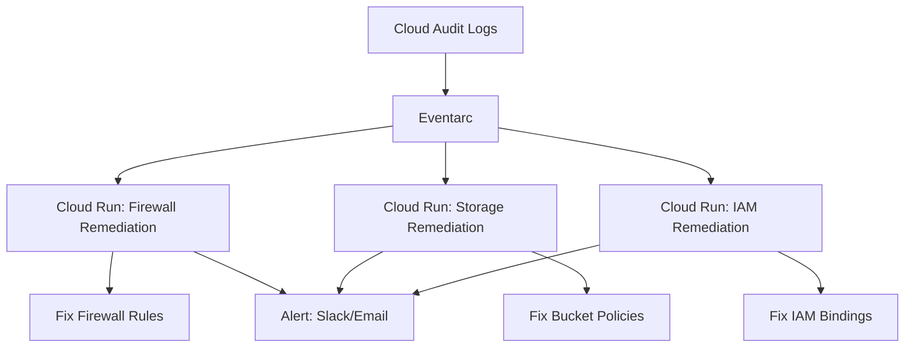

# How to Build Self-Healing Security Infrastructure with Eventarc and Cloud Run

Author: [nawazdhandala](https://www.github.com/nawazdhandala)

Tags: GCP, Eventarc, Cloud Run, Self-Healing, Security Automation

Description: Learn how to build self-healing security infrastructure on Google Cloud using Eventarc triggers and Cloud Run services to automatically detect and remediate security misconfigurations.

---

Security misconfigurations happen constantly in cloud environments. Someone opens a firewall port for debugging and forgets to close it. A bucket gets set to public during a migration. A new team member creates a VM with default credentials. The question is not whether these things will happen, but how quickly you detect and fix them.

Self-healing infrastructure automates the fix. When a security misconfiguration is detected, an event triggers a remediation service that reverts the change automatically. No human intervention needed, no ticket waiting in a queue.

This guide shows you how to build this on Google Cloud using Eventarc for event routing and Cloud Run for remediation logic.

## Architecture Overview

The self-healing system has three layers. Cloud Audit Logs capture every configuration change in your environment. Eventarc routes relevant events to the appropriate remediation service. Cloud Run services execute the remediation logic.



## Step 1: Create the Remediation Services

Start by building the Cloud Run services that handle specific types of security remediations.

### Firewall Remediation Service

```python
# firewall_remediation/main.py
import json
import os
from flask import Flask, request
from google.cloud import compute_v1
from google.cloud import logging as cloud_logging

app = Flask(__name__)
log_client = cloud_logging.Client()
logger = log_client.logger("firewall-remediation")

# Define which ports should never be open to 0.0.0.0/0
BLOCKED_PORTS = {
    "22": "SSH",
    "3389": "RDP",
    "3306": "MySQL",
    "5432": "PostgreSQL",
    "27017": "MongoDB",
    "6379": "Redis",
}

@app.route("/", methods=["POST"])
def handle_event():
    """Handle Eventarc audit log events for firewall changes."""
    envelope = request.get_json()

    # Extract the audit log entry
    audit_log = envelope.get("protoPayload", {})
    method = audit_log.get("methodName", "")

    # Only process firewall insert and update operations
    if method not in [
        "v1.compute.firewalls.insert",
        "v1.compute.firewalls.update",
        "v1.compute.firewalls.patch",
    ]:
        return "Ignored - not a firewall change", 200

    # Extract the firewall rule details
    resource_name = audit_log.get("resourceName", "")
    project_id = resource_name.split("/")[1]
    firewall_name = resource_name.split("/")[-1]

    # Check if the rule violates security policy
    fw_client = compute_v1.FirewallsClient()
    try:
        firewall = fw_client.get(project=project_id, firewall=firewall_name)
    except Exception as e:
        logger.log_text(f"Could not fetch firewall {firewall_name}: {e}")
        return "Firewall not found", 200

    violations = check_firewall_violations(firewall)

    if violations:
        # Disable the firewall rule
        firewall.disabled = True
        operation = fw_client.patch(
            project=project_id,
            firewall=firewall_name,
            firewall_resource=firewall,
        )

        logger.log_struct({
            "action": "firewall_disabled",
            "firewall": firewall_name,
            "project": project_id,
            "violations": violations,
            "actor": audit_log.get("authenticationInfo", {}).get(
                "principalEmail", "unknown"
            ),
        })

        # Send notification
        notify_security_team(
            f"Firewall rule '{firewall_name}' was disabled due to "
            f"security violations: {', '.join(violations)}"
        )

        return json.dumps({"remediated": True, "violations": violations}), 200

    return "No violations found", 200

def check_firewall_violations(firewall):
    """Check a firewall rule against security policy."""
    violations = []

    # Check for overly permissive source ranges
    source_ranges = list(firewall.source_ranges) if firewall.source_ranges else []
    has_open_source = "0.0.0.0/0" in source_ranges

    if not has_open_source:
        return violations

    # Check if any blocked ports are exposed
    for allowed in firewall.allowed or []:
        for port in allowed.ports or []:
            # Handle port ranges
            if "-" in port:
                start, end = port.split("-")
                for blocked_port in BLOCKED_PORTS:
                    if int(start) <= int(blocked_port) <= int(end):
                        violations.append(
                            f"Port {blocked_port} ({BLOCKED_PORTS[blocked_port]}) "
                            f"open to 0.0.0.0/0"
                        )
            elif port in BLOCKED_PORTS:
                violations.append(
                    f"Port {port} ({BLOCKED_PORTS[port]}) open to 0.0.0.0/0"
                )

        # Check for "all ports" allowed
        if not allowed.ports and allowed.I_p_protocol in ["tcp", "all"]:
            violations.append("All TCP ports open to 0.0.0.0/0")

    return violations

def notify_security_team(message):
    """Send notification to security team."""
    # Implement your notification mechanism here
    # Slack webhook, email via SendGrid, PagerDuty, etc.
    print(f"SECURITY ALERT: {message}")

if __name__ == "__main__":
    app.run(host="0.0.0.0", port=int(os.environ.get("PORT", 8080)))
```

### Storage Remediation Service

```python
# storage_remediation/main.py
import json
import os
from flask import Flask, request
from google.cloud import storage

app = Flask(__name__)

@app.route("/", methods=["POST"])
def handle_event():
    """Handle Eventarc events for storage policy changes."""
    envelope = request.get_json()
    audit_log = envelope.get("protoPayload", {})
    method = audit_log.get("methodName", "")

    # Process bucket IAM and ACL changes
    if "setIamPolicy" not in method and "BucketAccessControls" not in method:
        return "Ignored", 200

    resource_name = audit_log.get("resourceName", "")
    bucket_name = extract_bucket_name(resource_name)

    if not bucket_name:
        return "Could not determine bucket", 200

    client = storage.Client()
    bucket = client.bucket(bucket_name)

    # Check for public access
    policy = bucket.get_iam_policy()
    public_bindings = find_public_bindings(policy)

    if public_bindings:
        # Remove public access
        remove_public_access(bucket, policy, public_bindings)

        notify_security_team(
            f"Removed public access from bucket '{bucket_name}'. "
            f"Removed bindings: {json.dumps(public_bindings)}"
        )

        return json.dumps({"remediated": True}), 200

    return "No public access found", 200

def find_public_bindings(policy):
    """Find IAM bindings that grant public access."""
    public = []
    for binding in policy.bindings:
        public_members = [
            m for m in binding["members"]
            if m in ("allUsers", "allAuthenticatedUsers")
        ]
        if public_members:
            public.append({
                "role": binding["role"],
                "public_members": public_members,
            })
    return public

def remove_public_access(bucket, policy, public_bindings):
    """Remove all public access from a bucket."""
    new_bindings = []
    for binding in policy.bindings:
        members = [
            m for m in binding["members"]
            if m not in ("allUsers", "allAuthenticatedUsers")
        ]
        if members:
            binding["members"] = members
            new_bindings.append(binding)

    policy.bindings = new_bindings
    bucket.set_iam_policy(policy)
```

## Step 2: Deploy the Cloud Run Services

```bash
# Deploy the firewall remediation service
gcloud run deploy firewall-remediation \
  --source=./firewall_remediation \
  --region=us-central1 \
  --no-allow-unauthenticated \
  --service-account=security-remediation@PROJECT_ID.iam.gserviceaccount.com \
  --memory=256Mi \
  --timeout=60

# Deploy the storage remediation service
gcloud run deploy storage-remediation \
  --source=./storage_remediation \
  --region=us-central1 \
  --no-allow-unauthenticated \
  --service-account=security-remediation@PROJECT_ID.iam.gserviceaccount.com \
  --memory=256Mi \
  --timeout=60
```

## Step 3: Set Up Eventarc Triggers

Create Eventarc triggers that route the right audit log events to the right remediation service.

```bash
# Grant Eventarc permissions
gcloud projects add-iam-policy-binding PROJECT_ID \
  --member="serviceAccount:security-remediation@PROJECT_ID.iam.gserviceaccount.com" \
  --role="roles/eventarc.eventReceiver"

# Trigger for firewall changes
gcloud eventarc triggers create firewall-change-trigger \
  --location=us-central1 \
  --destination-run-service=firewall-remediation \
  --destination-run-region=us-central1 \
  --event-filters="type=google.cloud.audit.log.v1.written" \
  --event-filters="serviceName=compute.googleapis.com" \
  --event-filters="methodName=v1.compute.firewalls.insert" \
  --service-account=security-remediation@PROJECT_ID.iam.gserviceaccount.com

# Trigger for storage IAM changes
gcloud eventarc triggers create storage-iam-trigger \
  --location=us-central1 \
  --destination-run-service=storage-remediation \
  --destination-run-region=us-central1 \
  --event-filters="type=google.cloud.audit.log.v1.written" \
  --event-filters="serviceName=storage.googleapis.com" \
  --event-filters="methodName=storage.setIamPermissions" \
  --service-account=security-remediation@PROJECT_ID.iam.gserviceaccount.com
```

## Step 4: Add Safety Controls

Self-healing systems need safety controls to prevent remediation loops and unintended side effects.

```python
from google.cloud import firestore

# Use Firestore to track remediation actions and prevent loops
db = firestore.Client()

def should_remediate(resource_id, cooldown_seconds=300):
    """Check if we should remediate this resource or if we recently did."""
    doc_ref = db.collection("remediation_log").document(resource_id)
    doc = doc_ref.get()

    if doc.exists:
        last_action = doc.to_dict().get("last_remediation")
        if last_action:
            elapsed = (datetime.utcnow() - last_action).total_seconds()
            if elapsed < cooldown_seconds:
                # Skip remediation - we just fixed this
                return False

    # Record this remediation
    doc_ref.set({
        "last_remediation": datetime.utcnow(),
        "count": firestore.Increment(1),
    }, merge=True)

    return True
```

Self-healing security infrastructure does not replace good security practices - it adds a safety net. People will make mistakes, and automated remediation ensures those mistakes get fixed in seconds rather than days. The combination of Eventarc for event routing and Cloud Run for remediation logic gives you a serverless, scalable system that runs only when needed and costs almost nothing when your environment is secure.
