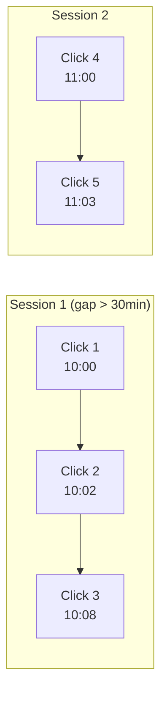
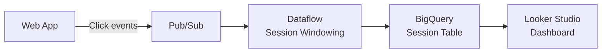

# How to Build Sessionized Clickstream Analytics Using Dataflow Windowing Functions

Author: [nawazdhandala](https://www.github.com/nawazdhandala)

Tags: GCP, Dataflow, Apache Beam, Clickstream, Session Windowing, Streaming Analytics

Description: Learn how to use Dataflow session windowing functions to group clickstream events into user sessions for real-time behavioral analytics on Google Cloud.

---

When you are analyzing user behavior on a website or app, raw click events are not very useful on their own. What you really want to know is: what did the user do during their visit? How long was their session? What pages did they view? Where did they drop off? Answering these questions requires grouping individual events into sessions.

Dataflow's session windowing does exactly this. It groups events by user into sessions based on a configurable gap duration. If a user clicks around your site and then goes quiet for 30 minutes, the session closes. If they come back, a new session starts.

## What Is Session Windowing?

Apache Beam (which powers Dataflow) supports several windowing strategies: fixed windows, sliding windows, and session windows. Session windows are unique because they are data-driven rather than time-driven. The window boundaries are determined by the data itself.



In this example, clicks 1-3 form one session because they are within the 30-minute gap. Click 4 arrives 52 minutes after click 3, so it starts a new session.

## Architecture



## Step 1: Set Up the Infrastructure

Create the Pub/Sub topic, BigQuery dataset, and table.

```bash
# Create the clickstream topic
gcloud pubsub topics create clickstream-events
gcloud pubsub subscriptions create clickstream-sub \
  --topic=clickstream-events \
  --ack-deadline=120

# Create the BigQuery dataset and sessions table
bq mk --dataset MY_PROJECT:clickstream

bq mk --table MY_PROJECT:clickstream.sessions \
  session_id:STRING,user_id:STRING,session_start:TIMESTAMP,session_end:TIMESTAMP,duration_seconds:INTEGER,page_count:INTEGER,pages:STRING,entry_page:STRING,exit_page:STRING,device_type:STRING,country:STRING
```

## Step 2: Define the Click Event Format

Each click event should include enough context for session analysis.

```json
{
  "event_id": "evt_001",
  "user_id": "user_abc",
  "timestamp": "2026-02-17T10:05:32Z",
  "page_url": "/products/widget-pro",
  "page_title": "Widget Pro - Product Page",
  "referrer": "/search?q=widgets",
  "event_type": "pageview",
  "device_type": "mobile",
  "country": "US",
  "session_cookie": "sess_xyz"
}
```

## Step 3: Build the Sessionization Pipeline

Here is the complete pipeline with session windowing.

```python
# clickstream_sessions.py - Sessionize clickstream data using Dataflow
import apache_beam as beam
from apache_beam.options.pipeline_options import PipelineOptions, StandardOptions
from apache_beam.transforms.window import Sessions
from apache_beam.transforms.trigger import (
    AfterWatermark,
    AfterProcessingTime,
    AccumulationMode,
    Repeatedly,
    AfterCount,
)
import json
import hashlib
from datetime import datetime

# Session gap duration in seconds - 30 minutes
SESSION_GAP = 30 * 60

class ParseClickEvent(beam.DoFn):
    """Parse raw Pub/Sub messages into click event dictionaries."""
    def process(self, element):
        try:
            event = json.loads(element.decode('utf-8'))
            # Parse the timestamp for event time
            ts = datetime.fromisoformat(event['timestamp'].replace('Z', '+00:00'))
            # Yield with the event timestamp for correct windowing
            yield beam.window.TimestampedValue(event, ts.timestamp())
        except (json.JSONDecodeError, KeyError, ValueError) as e:
            # Log malformed events but do not crash the pipeline
            yield beam.pvalue.TaggedOutput('errors', {
                'raw': element.decode('utf-8', errors='replace'),
                'error': str(e)
            })

class BuildSession(beam.DoFn):
    """Aggregate click events within a session window into a session summary."""
    def process(self, element, window=beam.DoFn.WindowParam):
        user_id, events = element
        event_list = sorted(events, key=lambda e: e['timestamp'])

        if not event_list:
            return

        # Calculate session metrics
        session_start = event_list[0]['timestamp']
        session_end = event_list[-1]['timestamp']

        start_dt = datetime.fromisoformat(session_start.replace('Z', '+00:00'))
        end_dt = datetime.fromisoformat(session_end.replace('Z', '+00:00'))
        duration = int((end_dt - start_dt).total_seconds())

        # Extract page sequence
        pages = [e.get('page_url', '') for e in event_list if e.get('event_type') == 'pageview']

        # Generate a deterministic session ID
        session_id = hashlib.md5(
            f"{user_id}:{session_start}".encode()
        ).hexdigest()[:16]

        session = {
            'session_id': session_id,
            'user_id': user_id,
            'session_start': session_start,
            'session_end': session_end,
            'duration_seconds': duration,
            'page_count': len(pages),
            'pages': json.dumps(pages),
            'entry_page': pages[0] if pages else '',
            'exit_page': pages[-1] if pages else '',
            'device_type': event_list[0].get('device_type', 'unknown'),
            'country': event_list[0].get('country', 'unknown'),
        }

        yield session

def run():
    options = PipelineOptions()
    options.view_as(StandardOptions).streaming = True

    with beam.Pipeline(options=options) as p:
        # Read click events from Pub/Sub
        raw_events = (
            p
            | "ReadClickEvents" >> beam.io.ReadFromPubSub(
                subscription="projects/MY_PROJECT/subscriptions/clickstream-sub"
            )
        )

        # Parse events and extract timestamps
        parsed = (
            raw_events
            | "ParseEvents" >> beam.ParDo(ParseClickEvent())
                .with_outputs('errors', main='valid')
        )

        # Apply session windowing and build session summaries
        sessions = (
            parsed.valid
            # Key by user_id for per-user sessions
            | "KeyByUser" >> beam.Map(lambda e: (e['user_id'], e))
            # Apply session windows with 30-minute gap
            | "SessionWindow" >> beam.WindowInto(
                Sessions(SESSION_GAP),
                trigger=AfterWatermark(
                    # Emit early results every 2 minutes for long sessions
                    early=AfterProcessingTime(120)
                ),
                accumulation_mode=AccumulationMode.DISCARDING,
                # Allow late events up to 1 hour after session closes
                allowed_lateness=3600,
            )
            # Group events by user within each session window
            | "GroupInSession" >> beam.GroupByKey()
            # Build session summaries
            | "BuildSession" >> beam.ParDo(BuildSession())
        )

        # Write sessions to BigQuery
        (
            sessions
            | "WriteToBigQuery" >> beam.io.WriteToBigQuery(
                table='MY_PROJECT:clickstream.sessions',
                schema=(
                    'session_id:STRING,user_id:STRING,'
                    'session_start:TIMESTAMP,session_end:TIMESTAMP,'
                    'duration_seconds:INTEGER,page_count:INTEGER,'
                    'pages:STRING,entry_page:STRING,exit_page:STRING,'
                    'device_type:STRING,country:STRING'
                ),
                write_disposition=beam.io.BigQueryDisposition.WRITE_APPEND,
                create_disposition=beam.io.BigQueryDisposition.CREATE_IF_NEEDED,
            )
        )

        # Write parsing errors for debugging
        (
            parsed.errors
            | "SerializeErrors" >> beam.Map(lambda e: json.dumps(e).encode('utf-8'))
            | "WriteErrors" >> beam.io.WriteToPubSub(
                topic="projects/MY_PROJECT/topics/clickstream-errors"
            )
        )

if __name__ == '__main__':
    run()
```

## Step 4: Deploy to Dataflow

```bash
# Deploy the sessionization pipeline
python clickstream_sessions.py \
  --runner=DataflowRunner \
  --project=MY_PROJECT \
  --region=us-central1 \
  --temp_location=gs://MY_BUCKET/temp/ \
  --staging_location=gs://MY_BUCKET/staging/ \
  --job_name=clickstream-sessions \
  --streaming \
  --num_workers=2 \
  --max_num_workers=8 \
  --autoscaling_algorithm=THROUGHPUT_BASED
```

## Step 5: Query Session Data in BigQuery

Once sessions are flowing into BigQuery, you can run analytics queries.

```sql
-- Average session duration by device type
SELECT
  device_type,
  COUNT(*) AS session_count,
  AVG(duration_seconds) AS avg_duration_seconds,
  AVG(page_count) AS avg_pages_per_session
FROM `clickstream.sessions`
WHERE session_start >= TIMESTAMP_SUB(CURRENT_TIMESTAMP(), INTERVAL 7 DAY)
GROUP BY device_type
ORDER BY session_count DESC;

-- Top entry pages by session count
SELECT
  entry_page,
  COUNT(*) AS sessions,
  AVG(page_count) AS avg_depth,
  AVG(duration_seconds) AS avg_duration
FROM `clickstream.sessions`
WHERE session_start >= TIMESTAMP_SUB(CURRENT_TIMESTAMP(), INTERVAL 7 DAY)
GROUP BY entry_page
ORDER BY sessions DESC
LIMIT 20;

-- Session drop-off analysis - where do users leave
SELECT
  exit_page,
  COUNT(*) AS exit_count,
  ROUND(COUNT(*) * 100.0 / SUM(COUNT(*)) OVER(), 2) AS exit_pct
FROM `clickstream.sessions`
WHERE page_count > 1
  AND session_start >= TIMESTAMP_SUB(CURRENT_TIMESTAMP(), INTERVAL 7 DAY)
GROUP BY exit_page
ORDER BY exit_count DESC
LIMIT 20;
```

## Tuning Session Windows

The 30-minute gap is a common default, but you should tune it based on your application.

**E-commerce sites:** 30 minutes works well. Users browse, compare, and purchase within that window.

**SaaS applications:** Consider a shorter gap (15 minutes) since users tend to be more focused.

**Content sites/blogs:** A longer gap (45-60 minutes) accounts for readers who open multiple tabs and switch between them.

You can also analyze your data to find the right gap empirically:

```sql
-- Distribution of gaps between consecutive events per user
-- This helps you find the natural session boundary
SELECT
  gap_bucket,
  COUNT(*) AS event_count
FROM (
  SELECT
    FLOOR(TIMESTAMP_DIFF(
      timestamp,
      LAG(timestamp) OVER (PARTITION BY user_id ORDER BY timestamp),
      MINUTE
    ) / 5) * 5 AS gap_bucket
  FROM `clickstream.raw_events`
)
WHERE gap_bucket IS NOT NULL AND gap_bucket <= 120
GROUP BY gap_bucket
ORDER BY gap_bucket
```

Look for a natural break in the distribution - that is your ideal session gap.

## Handling Late Data

Clickstream data frequently arrives late, especially from mobile devices that may have been offline. The pipeline handles this with the `allowed_lateness` parameter. Events arriving up to 1 hour after the session window closes will still be included.

For events arriving even later, consider running a periodic batch reconciliation job that replays raw events and corrects session boundaries.

## Wrapping Up

Session windowing in Dataflow transforms raw clickstream events into meaningful user sessions without any manual session tracking. The pipeline handles late data, scales automatically, and feeds results directly into BigQuery for analysis. The hardest part is choosing the right session gap duration, and even that can be derived from the data itself. Once this pipeline is running, you have a continuous stream of session-level analytics that powers everything from conversion funnels to user engagement metrics.
