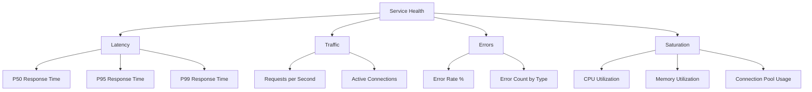

# How to Build Unified Observability Dashboards Combining All Four Golden Signals on GCP

Author: [nawazdhandala](https://www.github.com/nawazdhandala)

Tags: GCP, Golden Signals, Cloud Monitoring, Dashboards, SRE, Observability, Google Cloud

Description: Learn how to build unified observability dashboards on Google Cloud that combine all four golden signals - latency, traffic, errors, and saturation.

---

Google's SRE book introduced the four golden signals as the essential metrics for monitoring any user-facing system: latency, traffic, errors, and saturation. These four signals, when viewed together, tell you the health story of your service at a glance. On Google Cloud Monitoring, you can build dashboards that present all four signals in a single view, making it easy to spot problems and understand their nature. In this post, I will show you how to build these dashboards for different GCP service types.

## The Four Golden Signals

Let me define each signal clearly before we start building.

**Latency** is how long it takes to serve a request. Track both successful and failed request latency separately - a fast error is very different from a slow success.

**Traffic** is how much demand your service is handling. For HTTP services, this is usually requests per second. For a message queue, it might be messages per second.

**Errors** is the rate of requests that fail. This includes explicit failures (5xx responses) and implicit failures (200 responses that return wrong data, or responses that violate an SLO like a 200 that takes 10 seconds).

**Saturation** is how "full" your service is. This is about resource utilization - CPU, memory, disk, connection pools. Saturation tells you how close you are to degradation.



## Golden Signals for GKE Services

Here are the MQL queries for each golden signal when your service runs on GKE behind a Google Cloud HTTPS load balancer.

### Latency

```
# P50, P95, P99 request latency from the load balancer
{
  fetch https_lb_rule::loadbalancing.googleapis.com/https/total_latencies
  | group_by [resource.url_map_name], percentile(val(), 50)
  | every 1m
  ;
  fetch https_lb_rule::loadbalancing.googleapis.com/https/total_latencies
  | group_by [resource.url_map_name], percentile(val(), 95)
  | every 1m
  ;
  fetch https_lb_rule::loadbalancing.googleapis.com/https/total_latencies
  | group_by [resource.url_map_name], percentile(val(), 99)
  | every 1m
}
| union
```

### Traffic

```
# Requests per second through the load balancer
fetch https_lb_rule::loadbalancing.googleapis.com/https/request_count
| group_by [resource.url_map_name], rate(val())
| every 1m
```

### Errors

```
# Error rate as a percentage
{
  fetch https_lb_rule::loadbalancing.googleapis.com/https/request_count
  | filter metric.response_code_class = 500
  | group_by [resource.url_map_name], sum(val())
  | every 1m
  ;
  fetch https_lb_rule::loadbalancing.googleapis.com/https/request_count
  | group_by [resource.url_map_name], sum(val())
  | every 1m
}
| ratio
| mul(100)
```

### Saturation

```
# CPU utilization of GKE containers
fetch k8s_container::kubernetes.io/container/cpu/limit_utilization
| group_by [resource.namespace_name, resource.pod_name], mean(val())
| every 1m
| top 10
```

```
# Memory utilization of GKE containers
fetch k8s_container::kubernetes.io/container/memory/limit_utilization
| group_by [resource.namespace_name, resource.pod_name], mean(val())
| every 1m
| top 10
```

## Building the Complete Dashboard

Here is the full dashboard JSON that combines all four signals.

```bash
cat > golden-signals-dashboard.json << 'EOF'
{
  "displayName": "Golden Signals - Service Health",
  "mosaicLayout": {
    "columns": 12,
    "tiles": [
      {
        "width": 12,
        "height": 1,
        "widget": {
          "title": "",
          "text": {
            "content": "## Latency",
            "format": "MARKDOWN"
          }
        }
      },
      {
        "yPos": 1,
        "width": 4,
        "height": 4,
        "widget": {
          "title": "P50 Latency",
          "xyChart": {
            "dataSets": [{
              "timeSeriesQuery": {
                "timeSeriesQueryLanguage": "fetch https_lb_rule::loadbalancing.googleapis.com/https/total_latencies | group_by [resource.url_map_name], percentile(val(), 50) | every 1m"
              },
              "plotType": "LINE"
            }]
          }
        }
      },
      {
        "xPos": 4,
        "yPos": 1,
        "width": 4,
        "height": 4,
        "widget": {
          "title": "P95 Latency",
          "xyChart": {
            "dataSets": [{
              "timeSeriesQuery": {
                "timeSeriesQueryLanguage": "fetch https_lb_rule::loadbalancing.googleapis.com/https/total_latencies | group_by [resource.url_map_name], percentile(val(), 95) | every 1m"
              },
              "plotType": "LINE"
            }]
          }
        }
      },
      {
        "xPos": 8,
        "yPos": 1,
        "width": 4,
        "height": 4,
        "widget": {
          "title": "P99 Latency",
          "xyChart": {
            "dataSets": [{
              "timeSeriesQuery": {
                "timeSeriesQueryLanguage": "fetch https_lb_rule::loadbalancing.googleapis.com/https/total_latencies | group_by [resource.url_map_name], percentile(val(), 99) | every 1m"
              },
              "plotType": "LINE"
            }]
          }
        }
      },
      {
        "yPos": 5,
        "width": 12,
        "height": 1,
        "widget": {
          "title": "",
          "text": {
            "content": "## Traffic",
            "format": "MARKDOWN"
          }
        }
      },
      {
        "yPos": 6,
        "width": 6,
        "height": 4,
        "widget": {
          "title": "Requests per Second",
          "xyChart": {
            "dataSets": [{
              "timeSeriesQuery": {
                "timeSeriesQueryLanguage": "fetch https_lb_rule::loadbalancing.googleapis.com/https/request_count | group_by [resource.url_map_name], rate(val()) | every 1m"
              },
              "plotType": "LINE"
            }]
          }
        }
      },
      {
        "xPos": 6,
        "yPos": 6,
        "width": 6,
        "height": 4,
        "widget": {
          "title": "Traffic by Response Code Class",
          "xyChart": {
            "dataSets": [{
              "timeSeriesQuery": {
                "timeSeriesQueryLanguage": "fetch https_lb_rule::loadbalancing.googleapis.com/https/request_count | group_by [metric.response_code_class], rate(val()) | every 1m"
              },
              "plotType": "STACKED_AREA"
            }]
          }
        }
      },
      {
        "yPos": 10,
        "width": 12,
        "height": 1,
        "widget": {
          "title": "",
          "text": {
            "content": "## Errors",
            "format": "MARKDOWN"
          }
        }
      },
      {
        "yPos": 11,
        "width": 6,
        "height": 4,
        "widget": {
          "title": "Error Rate (%)",
          "xyChart": {
            "dataSets": [{
              "timeSeriesQuery": {
                "timeSeriesQueryLanguage": "{ fetch https_lb_rule::loadbalancing.googleapis.com/https/request_count | filter metric.response_code_class = 500 | group_by [], sum(val()) | every 1m ; fetch https_lb_rule::loadbalancing.googleapis.com/https/request_count | group_by [], sum(val()) | every 1m } | ratio | mul(100)"
              },
              "plotType": "LINE"
            }]
          }
        }
      },
      {
        "xPos": 6,
        "yPos": 11,
        "width": 6,
        "height": 4,
        "widget": {
          "title": "Error Count by Status Code",
          "xyChart": {
            "dataSets": [{
              "timeSeriesQuery": {
                "timeSeriesQueryLanguage": "fetch https_lb_rule::loadbalancing.googleapis.com/https/request_count | filter metric.response_code >= 400 | group_by [metric.response_code], rate(val()) | every 1m"
              },
              "plotType": "STACKED_BAR"
            }]
          }
        }
      },
      {
        "yPos": 15,
        "width": 12,
        "height": 1,
        "widget": {
          "title": "",
          "text": {
            "content": "## Saturation",
            "format": "MARKDOWN"
          }
        }
      },
      {
        "yPos": 16,
        "width": 4,
        "height": 4,
        "widget": {
          "title": "CPU Utilization",
          "xyChart": {
            "dataSets": [{
              "timeSeriesQuery": {
                "timeSeriesQueryLanguage": "fetch k8s_container::kubernetes.io/container/cpu/limit_utilization | group_by [resource.namespace_name], mean(val()) | every 1m"
              },
              "plotType": "LINE"
            }]
          }
        }
      },
      {
        "xPos": 4,
        "yPos": 16,
        "width": 4,
        "height": 4,
        "widget": {
          "title": "Memory Utilization",
          "xyChart": {
            "dataSets": [{
              "timeSeriesQuery": {
                "timeSeriesQueryLanguage": "fetch k8s_container::kubernetes.io/container/memory/limit_utilization | group_by [resource.namespace_name], mean(val()) | every 1m"
              },
              "plotType": "LINE"
            }]
          }
        }
      },
      {
        "xPos": 8,
        "yPos": 16,
        "width": 4,
        "height": 4,
        "widget": {
          "title": "Pod Restart Count",
          "xyChart": {
            "dataSets": [{
              "timeSeriesQuery": {
                "timeSeriesQueryLanguage": "fetch k8s_container::kubernetes.io/container/restart_count | group_by [resource.namespace_name, resource.pod_name], rate(val()) | every 5m | top 10"
              },
              "plotType": "LINE"
            }]
          }
        }
      }
    ]
  }
}
EOF

gcloud monitoring dashboards create --config-from-file=golden-signals-dashboard.json
```

## Golden Signals for Cloud Run

Cloud Run has its own metric set. Here are the golden signal queries adapted for Cloud Run.

```
# Latency - P95 request latency for Cloud Run
fetch cloud_run_revision::run.googleapis.com/request_latencies
| group_by [resource.service_name], percentile(val(), 95)
| every 1m

# Traffic - requests per second for Cloud Run
fetch cloud_run_revision::run.googleapis.com/request_count
| group_by [resource.service_name], rate(val())
| every 1m

# Errors - 5xx error rate for Cloud Run
{
  fetch cloud_run_revision::run.googleapis.com/request_count
  | filter metric.response_code_class = "5xx"
  | group_by [resource.service_name], sum(val())
  | every 1m
  ;
  fetch cloud_run_revision::run.googleapis.com/request_count
  | group_by [resource.service_name], sum(val())
  | every 1m
}
| ratio
| mul(100)

# Saturation - container CPU utilization for Cloud Run
fetch cloud_run_revision::run.googleapis.com/container/cpu/utilizations
| group_by [resource.service_name], percentile(val(), 95)
| every 1m
```

## Alerts for Each Golden Signal

Set up alerts on each signal to catch problems early.

```bash
# Latency alert - P95 above 500ms
gcloud monitoring policies create --policy-from-file=- << 'EOF'
{
  "displayName": "Golden Signal: High Latency",
  "conditions": [{
    "displayName": "P95 latency above 500ms",
    "conditionMonitoringQueryLanguage": {
      "query": "fetch https_lb_rule::loadbalancing.googleapis.com/https/total_latencies | group_by [], percentile(val(), 95) | every 1m | condition val() > 500 'ms'",
      "duration": "300s"
    }
  }],
  "combiner": "OR"
}
EOF

# Error rate alert - above 1%
gcloud monitoring policies create --policy-from-file=- << 'EOF'
{
  "displayName": "Golden Signal: High Error Rate",
  "conditions": [{
    "displayName": "Error rate above 1%",
    "conditionMonitoringQueryLanguage": {
      "query": "{ fetch https_lb_rule::loadbalancing.googleapis.com/https/request_count | filter metric.response_code_class = 500 | group_by [], sum(val()) | every 1m ; fetch https_lb_rule::loadbalancing.googleapis.com/https/request_count | group_by [], sum(val()) | every 1m } | ratio | mul(100) | condition val() > 1",
      "duration": "300s"
    }
  }],
  "combiner": "OR"
}
EOF

# Saturation alert - CPU above 80%
gcloud monitoring policies create --policy-from-file=- << 'EOF'
{
  "displayName": "Golden Signal: High CPU Saturation",
  "conditions": [{
    "displayName": "CPU utilization above 80%",
    "conditionMonitoringQueryLanguage": {
      "query": "fetch k8s_container::kubernetes.io/container/cpu/limit_utilization | group_by [resource.namespace_name], mean(val()) | every 1m | condition val() > 0.8",
      "duration": "300s"
    }
  }],
  "combiner": "OR"
}
EOF
```

## Design Principles

When building golden signal dashboards, follow these principles. Put the most actionable signal first - usually errors, since they directly impact users. Use consistent time ranges across all panels so correlations are visually obvious. Include threshold lines on charts to show SLO targets. Use color coding - green for healthy, yellow for warning, red for critical.

## Wrapping Up

A golden signals dashboard gives you the essential health view of your service at a glance. Instead of having dozens of charts that you need to mentally correlate, you have four clear categories that answer the fundamental questions: Is it fast? Is there demand? Is it failing? Is it about to fall over? On Google Cloud, MQL makes it straightforward to build these dashboards for any service type, and the alert policies ensure you are notified when any signal goes out of bounds. Build one of these for each of your critical services and make it the first thing you look at when an alert fires.
