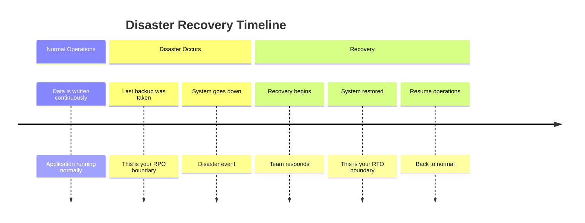

# How to Calculate and Achieve RTO and RPO Targets for GCP Workloads Using Backup and DR Service

Author: [nawazdhandala](https://www.github.com/nawazdhandala)

Tags: GCP, Disaster Recovery, RTO, RPO, Backup and DR, Business Continuity

Description: Learn how to calculate Recovery Time Objective and Recovery Point Objective for your GCP workloads and implement them using Google Cloud Backup and DR Service.

---

When someone asks "how long can your application be down?" and "how much data can you afford to lose?", those questions translate directly to two critical metrics: RTO (Recovery Time Objective) and RPO (Recovery Point Objective). RTO is the maximum acceptable downtime. RPO is the maximum acceptable data loss, measured in time. An RPO of 1 hour means you can lose up to 1 hour of data. Getting these numbers right, and actually achieving them, is the foundation of any disaster recovery strategy.

In this post, I will walk through how to calculate appropriate RTO and RPO targets for different types of GCP workloads and how to implement them using Google Cloud Backup and DR Service.

## Understanding RTO and RPO

Before diving into implementation, let us make sure the concepts are clear.



RPO answers: "When we recover, what is the timestamp of the most recent data we will have?" If your RPO is 1 hour and a disaster happens at 3:00 PM, you should be able to recover data up to at least 2:00 PM.

RTO answers: "How long will it take from the moment of failure until the system is operational again?" If your RTO is 4 hours, users should be back online within 4 hours of the outage starting.

## Calculating RTO and RPO for Your Workloads

The targets should be based on business impact, not technical preference. Work with stakeholders to understand the cost of downtime and data loss.

```yaml
# rto-rpo-analysis.yaml - Document your targets per workload
workloads:
  # Tier 1: Mission-critical - business stops without these
  payment-processing:
    rto: 15 minutes
    rpo: 0 minutes (zero data loss)
    justification: "Every minute of downtime loses revenue and customer trust"
    strategy: multi-region-active-active
    estimated_cost: $$$

  # Tier 2: Important - significant business impact
  order-management:
    rto: 1 hour
    rpo: 15 minutes
    justification: "Orders can be delayed briefly but data loss causes fulfillment issues"
    strategy: cross-region-warm-standby
    estimated_cost: $$

  # Tier 3: Standard - business can tolerate short outage
  reporting-dashboard:
    rto: 4 hours
    rpo: 1 hour
    justification: "Reports are not real-time critical, can be regenerated"
    strategy: backup-and-restore
    estimated_cost: $

  # Tier 4: Low priority - can tolerate extended outage
  development-environments:
    rto: 24 hours
    rpo: 24 hours
    justification: "Developers can use other environments temporarily"
    strategy: backup-and-restore
    estimated_cost: $
```

## Setting Up Google Cloud Backup and DR Service

Google Cloud Backup and DR Service provides centralized backup management for Compute Engine VMs, Cloud SQL, and GKE workloads.

```bash
# Enable the Backup and DR API
gcloud services enable backupdr.googleapis.com

# Create a backup vault for storing backups
gcloud backup-dr backup-vaults create production-vault \
  --location=us-central1 \
  --backup-minimum-enforced-retention-duration=604800s  # 7 days minimum retention

# Create a management server (required for Backup and DR)
gcloud backup-dr management-servers create dr-manager \
  --location=us-central1 \
  --network=projects/my-project/global/networks/default
```

## Implementing RPO with Backup Schedules

Match your backup frequency to your RPO targets.

```bash
# For RPO = 0 (zero data loss): Use synchronous replication
# Cloud SQL with HA enabled provides this within a region
gcloud sql instances create critical-db \
  --database-version=POSTGRES_15 \
  --availability-type=REGIONAL \
  --tier=db-custom-4-16384 \
  --region=us-central1

# For RPO = 15 minutes: Point-in-time recovery with continuous WAL archiving
gcloud sql instances patch critical-db \
  --enable-point-in-time-recovery \
  --retained-transaction-log-days=7

# For RPO = 1 hour: Hourly backup snapshots
gcloud sql instances patch standard-db \
  --backup-start-time=00:00 \
  --enable-bin-log
```

For Compute Engine VMs, create backup policies that match your RPO.

```python
# create_backup_policy.py - Set up backup schedules matching RPO targets
from google.cloud import compute_v1

def create_snapshot_schedule(project_id, region, schedule_name, interval_hours):
    """Create a snapshot schedule for Compute Engine disks."""
    client = compute_v1.ResourcePoliciesClient()

    # Define the snapshot schedule
    policy = compute_v1.ResourcePolicy(
        name=schedule_name,
        snapshot_schedule_policy=compute_v1.ResourcePolicySnapshotSchedulePolicy(
            schedule=compute_v1.ResourcePolicySnapshotSchedulePolicySchedule(
                hourly_schedule=compute_v1.ResourcePolicyHourlySnapshot(
                    hours_in_cycle=interval_hours,
                    start_time='00:00',
                )
            ),
            retention_policy=compute_v1.ResourcePolicySnapshotSchedulePolicyRetentionPolicy(
                max_retention_days=30,
                on_source_disk_delete='KEEP_AUTO_SNAPSHOTS',
            ),
            snapshot_properties=compute_v1.ResourcePolicySnapshotSchedulePolicySnapshotProperties(
                storage_locations=['us'],
                labels={'backup-tier': 'standard'},
            ),
        ),
    )

    operation = client.insert(
        project=project_id,
        region=region,
        resource_policy_resource=policy,
    )

    print(f'Created snapshot schedule: {schedule_name} (every {interval_hours} hours)')
    return operation

# RPO = 1 hour: Snapshot every hour
create_snapshot_schedule('my-project', 'us-central1', 'hourly-snapshots', 1)

# RPO = 4 hours: Snapshot every 4 hours
create_snapshot_schedule('my-project', 'us-central1', 'four-hourly-snapshots', 4)

# RPO = 24 hours: Snapshot daily
create_snapshot_schedule('my-project', 'us-central1', 'daily-snapshots', 24)
```

## Implementing RTO with Recovery Automation

RTO is about how fast you can recover. Automate the recovery process to reduce human error and speed.

```python
# dr_recovery.py - Automated recovery orchestration
import os
import time
import json
from google.cloud import compute_v1
from google.cloud import sqladmin_v1beta4
from google.cloud import container_v1

class DisasterRecoveryOrchestrator:
    """Automates recovery procedures to meet RTO targets."""

    def __init__(self, project_id, recovery_region):
        self.project_id = project_id
        self.recovery_region = recovery_region
        self.recovery_log = []

    def log_step(self, step, status, duration_seconds=0):
        entry = {
            'step': step,
            'status': status,
            'duration_seconds': duration_seconds,
            'timestamp': time.time(),
        }
        self.recovery_log.append(entry)
        print(f'[{status}] {step} ({duration_seconds}s)')

    def recover_cloud_sql(self, instance_name, backup_id=None):
        """Recover a Cloud SQL instance from backup."""
        start = time.time()

        client = sqladmin_v1beta4.SqlAdminServiceClient()

        if backup_id:
            # Restore from a specific backup
            restore_request = sqladmin_v1beta4.InstancesRestoreBackupRequest(
                restore_backup_context=sqladmin_v1beta4.RestoreBackupContext(
                    backup_run_id=backup_id,
                )
            )
            client.restore_backup(
                project=self.project_id,
                instance=instance_name,
                body=restore_request,
            )
        else:
            # Perform point-in-time recovery to the most recent possible time
            clone_request = sqladmin_v1beta4.InstancesCloneRequest(
                clone_context=sqladmin_v1beta4.CloneContext(
                    destination_instance_name=f'{instance_name}-recovery',
                    point_in_time=None,  # Most recent available
                )
            )
            client.clone(
                project=self.project_id,
                instance=instance_name,
                body=clone_request,
            )

        duration = time.time() - start
        self.log_step(f'Recover Cloud SQL: {instance_name}', 'COMPLETED', int(duration))

    def recover_gke_workloads(self, cluster_name, backup_name):
        """Restore GKE workloads from Velero backup."""
        start = time.time()

        # This would typically be done via kubectl/velero CLI
        import subprocess
        result = subprocess.run([
            'velero', 'restore', 'create',
            '--from-backup', backup_name,
            '--wait',
        ], capture_output=True, text=True)

        duration = time.time() - start
        status = 'COMPLETED' if result.returncode == 0 else 'FAILED'
        self.log_step(f'Recover GKE workloads from {backup_name}', status, int(duration))

    def update_dns(self, domain, new_ip):
        """Update DNS to point to the recovery region."""
        start = time.time()

        from google.cloud import dns
        client = dns.Client(project=self.project_id)
        zone = client.zone('my-zone')

        changes = zone.changes()
        record_set = zone.resource_record_set(domain, 'A', 300, [new_ip])
        changes.add_record_set(record_set)
        changes.create()

        duration = time.time() - start
        self.log_step(f'Update DNS for {domain}', 'COMPLETED', int(duration))

    def generate_report(self):
        """Generate a recovery report showing actual vs target RTO."""
        total_duration = sum(e['duration_seconds'] for e in self.recovery_log)
        return {
            'total_recovery_time_seconds': total_duration,
            'total_recovery_time_minutes': total_duration / 60,
            'steps': self.recovery_log,
        }
```

## Measuring Actual RTO and RPO

Track your actual recovery capabilities to make sure they match your targets.

```python
# dr_metrics.py - Track DR metrics
from google.cloud import firestore
from datetime import datetime

db = firestore.Client()

def record_dr_test(workload, target_rto_minutes, target_rpo_minutes,
                    actual_rto_minutes, actual_rpo_minutes, test_type='scheduled'):
    """Record the results of a DR test for tracking and reporting."""

    doc_ref = db.collection('dr_tests').document()
    doc_ref.set({
        'workload': workload,
        'target_rto_minutes': target_rto_minutes,
        'target_rpo_minutes': target_rpo_minutes,
        'actual_rto_minutes': actual_rto_minutes,
        'actual_rpo_minutes': actual_rpo_minutes,
        'rto_met': actual_rto_minutes <= target_rto_minutes,
        'rpo_met': actual_rpo_minutes <= target_rpo_minutes,
        'test_type': test_type,
        'tested_at': datetime.utcnow().isoformat(),
    })

    if actual_rto_minutes > target_rto_minutes:
        print(f'WARNING: RTO not met for {workload}. '
              f'Target: {target_rto_minutes}m, Actual: {actual_rto_minutes}m')

    if actual_rpo_minutes > target_rpo_minutes:
        print(f'WARNING: RPO not met for {workload}. '
              f'Target: {target_rpo_minutes}m, Actual: {actual_rpo_minutes}m')
```

## Cost vs. Recovery Time Tradeoff

Different DR strategies have different costs and recovery characteristics.

```yaml
# DR strategy comparison
strategies:
  backup-and-restore:
    rto: 4-24 hours
    rpo: 1-24 hours
    cost: Low
    description: "Regular backups, rebuild infrastructure on demand"
    use_for: "Non-critical workloads, dev/staging"

  warm-standby:
    rto: 15-60 minutes
    rpo: 5-15 minutes
    cost: Medium
    description: "Scaled-down infrastructure running in DR region"
    use_for: "Important business applications"

  hot-standby:
    rto: 5-15 minutes
    rpo: 0-5 minutes
    cost: High
    description: "Full-scale infrastructure in DR region, ready to serve"
    use_for: "Critical customer-facing services"

  active-active:
    rto: Near zero
    rpo: 0 minutes
    cost: Very High
    description: "Traffic served from multiple regions simultaneously"
    use_for: "Mission-critical, revenue-generating services"
```

## Setting Up DR Alerts

Create monitoring alerts that track your DR readiness.

```bash
# Alert when backup age exceeds RPO threshold
gcloud alpha monitoring policies create \
  --display-name="Backup age exceeds RPO" \
  --condition-display-name="Last backup older than 1 hour" \
  --condition-filter='metric.type="cloudsql.googleapis.com/database/backup/last_completed_time"'

# Alert when a scheduled backup fails
gcloud alpha monitoring policies create \
  --display-name="Backup failure alert" \
  --condition-display-name="Backup job failed" \
  --condition-filter='metric.type="cloudsql.googleapis.com/database/backup/status" AND metric.labels.status="FAILED"'
```

## Documenting the DR Runbook

Every team member should know how to execute the DR plan. Document it clearly.

```markdown
## DR Runbook: Payment Processing System

### Pre-requisites
- Access to GCP console or gcloud CLI
- Velero CLI installed
- kubectl configured for recovery cluster

### Step 1: Assess the Situation (5 minutes)
- Determine which components are affected
- Check if it is a partial or full regional outage
- Decide: restore in place or failover to DR region

### Step 2: Notify Stakeholders (2 minutes)
- Post in #incidents channel
- Update status page via OneUptime

### Step 3: Execute Recovery
- For database: Run `./scripts/recover-db.sh`
- For GKE: Run `velero restore create --from-backup latest`
- For DNS: Run `./scripts/update-dns.sh dr-region`

### Step 4: Verify
- Run health checks: `./scripts/verify-recovery.sh`
- Check data integrity: `./scripts/check-data.sh`

### Step 5: Post-Recovery
- Update status page
- Schedule post-mortem
- Record actual RTO/RPO for metrics
```

## Wrapping Up

RTO and RPO are not just technical metrics - they are business commitments. Calculate them based on the cost of downtime and data loss, not on what is technically convenient. Then implement the appropriate DR strategy for each workload tier. Test regularly, because a DR plan that has never been tested is just a wish.

OneUptime can serve as the foundation of your DR monitoring strategy, tracking backup freshness, recovery drill results, and providing the status page that keeps stakeholders informed during an actual disaster recovery event.
