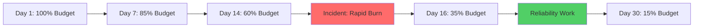

# How to Calculate and Visualize Error Budget Burn Down Over Time on Google Cloud

Author: [nawazdhandala](https://www.github.com/nawazdhandala)

Tags: GCP, SRE, Error Budget, SLO, Google Cloud Monitoring, Reliability

Description: Learn how to calculate error budgets, track their consumption over time, and build burn-down visualizations using Google Cloud Monitoring and SLO services.

---

If you run services in production, you have probably heard people talk about error budgets. The idea is simple enough - you decide how much unreliability your users can tolerate, and that tolerance becomes a budget you can spend. The tricky part is actually tracking how fast you are burning through that budget and making it visible to your team so they can make good decisions about feature velocity versus reliability work.

Google Cloud has first-class support for SLOs and error budgets through its Cloud Monitoring service. In this post, I will walk through how to set up SLOs, calculate error budget burn rates, and build dashboards that show your error budget burn-down over time.

## What Is an Error Budget

An error budget is the inverse of your SLO. If your SLO says your service should be available 99.9% of the time over a 30-day rolling window, your error budget is 0.1% of that window. In concrete terms, that means you can afford roughly 43 minutes of downtime per month before you breach your SLO.

The key insight is that error budgets give engineering teams a shared framework for making trade-offs. If the budget is healthy, you ship features faster. If the budget is running low, you slow down and focus on reliability.

## Setting Up SLOs in Google Cloud Monitoring

Before you can track error budget burn, you need to define SLOs. Google Cloud Monitoring lets you create SLOs on any service it can discover, including GKE services, Cloud Run services, App Engine, and Istio services.

Here is how to create an SLO using the gcloud CLI. This example sets up an availability SLO on a Cloud Run service:

```bash
# Create an availability SLO with a 99.9% target over a rolling 30-day window
gcloud slo service-level-objectives create my-availability-slo \
  --service=my-cloud-run-service \
  --project=my-project-id \
  --display-name="Availability SLO" \
  --goal=0.999 \
  --rolling-period=30d \
  --sli-request-based-good-total-ratio \
  --good-service-filter='resource.type="cloud_run_revision" AND metric.type="run.googleapis.com/request_count" AND metric.labels.response_code_class="2xx"' \
  --total-service-filter='resource.type="cloud_run_revision" AND metric.type="run.googleapis.com/request_count"'
```

You can also create SLOs through the Cloud Console by navigating to Monitoring, then Services, selecting your service, and clicking "Create SLO."

## Calculating Error Budget Burn Rate

Once you have an SLO, the error budget burn rate tells you how fast you are consuming your budget relative to the ideal rate. If you are burning at exactly 1x, you will use up your entire budget right at the end of the window. Burning at 2x means you will exhaust the budget in half the time.

The formula for burn rate is straightforward:

```
Burn Rate = (Actual Error Rate) / (Allowed Error Rate)

Where:
  Allowed Error Rate = 1 - SLO Target
  Actual Error Rate = Bad Events / Total Events (over a given time window)
```

For a 99.9% SLO, the allowed error rate is 0.001. If your actual error rate over the last hour is 0.005, your burn rate is 5x - meaning you are consuming error budget five times faster than the ideal pace.

## Using the Monitoring API to Fetch Error Budget Data

Google Cloud Monitoring exposes SLO and error budget data through its API. You can pull this data programmatically to build custom dashboards or feed it into your incident management system.

Here is a Python script that fetches error budget remaining for a given SLO:

```python
from google.cloud import monitoring_v3
from google.protobuf import timestamp_pb2
import time

def get_error_budget_remaining(project_id, service_id, slo_id):
    """Fetch the remaining error budget for a specific SLO."""
    client = monitoring_v3.ServiceMonitoringServiceClient()

    # Build the SLO name path
    slo_name = (
        f"projects/{project_id}/services/{service_id}"
        f"/serviceLevelObjectives/{slo_id}"
    )

    # Query the time series for error budget remaining
    query_client = monitoring_v3.QueryServiceClient()

    # Use MQL to get error budget data
    query = f"""
    fetch consumer_quota
    | filter resource.service == '{service_id}'
    | { slo_id }
    """

    # Alternative: use the SLO API directly
    slo = client.get_service_level_objective(name=slo_name)
    print(f"SLO Goal: {slo.goal}")
    print(f"Rolling Period: {slo.rolling_period.seconds / 86400} days")

    return slo

# Example usage
get_error_budget_remaining("my-project", "my-service", "my-availability-slo")
```

For more detailed time series data, you can use the Monitoring Query Language (MQL) to pull error budget burn metrics:

```python
from google.cloud import monitoring_v3
import datetime

def query_error_budget_burn(project_id, service_id, slo_id):
    """Query error budget burn rate over the last 24 hours."""
    client = monitoring_v3.QueryServiceClient()

    # MQL query for SLO compliance
    query = f"""
    fetch consumed_api
    | metric 'monitoring.googleapis.com/services/{service_id}/serviceLevelObjectives/{slo_id}/error_budget_remaining'
    | within 24h
    | every 5m
    """

    request = monitoring_v3.QueryTimeSeriesRequest(
        name=f"projects/{project_id}",
        query=query,
    )

    results = client.query_time_series(request=request)

    # Collect data points for visualization
    data_points = []
    for time_series in results:
        for point in time_series.point_data:
            data_points.append({
                "timestamp": point.time_interval.end_time,
                "budget_remaining": point.values[0].double_value,
            })

    return data_points
```

## Building a Burn-Down Dashboard in Cloud Monitoring

The easiest way to visualize error budget burn is through a Cloud Monitoring dashboard. You can create one using the dashboard JSON format.

Here is a dashboard definition that shows error budget remaining over time alongside the burn rate:

```json
{
  "displayName": "Error Budget Burn Down",
  "mosaicLayout": {
    "tiles": [
      {
        "width": 6,
        "height": 4,
        "widget": {
          "title": "Error Budget Remaining (%)",
          "xyChart": {
            "dataSets": [
              {
                "timeSeriesQuery": {
                  "timeSeriesFilter": {
                    "filter": "select_slo_budget_fraction(\"projects/my-project/services/my-service/serviceLevelObjectives/my-slo\")",
                    "aggregation": {
                      "alignmentPeriod": "300s",
                      "perSeriesAligner": "ALIGN_NEXT_OLDER"
                    }
                  }
                },
                "plotType": "LINE"
              }
            ],
            "yAxis": {
              "label": "Budget Remaining",
              "scale": "LINEAR"
            }
          }
        }
      },
      {
        "xPos": 6,
        "width": 6,
        "height": 4,
        "widget": {
          "title": "Error Budget Burn Rate",
          "xyChart": {
            "dataSets": [
              {
                "timeSeriesQuery": {
                  "timeSeriesFilter": {
                    "filter": "select_slo_burn_rate(\"projects/my-project/services/my-service/serviceLevelObjectives/my-slo\", \"1h\")",
                    "aggregation": {
                      "alignmentPeriod": "300s",
                      "perSeriesAligner": "ALIGN_NEXT_OLDER"
                    }
                  }
                },
                "plotType": "LINE"
              }
            ]
          }
        }
      }
    ]
  }
}
```

Deploy this dashboard using the gcloud CLI:

```bash
# Deploy the dashboard from a JSON file
gcloud monitoring dashboards create --config-from-file=error-budget-dashboard.json
```

## Setting Up Burn Rate Alerts

A dashboard is only useful if people look at it. For proactive error budget management, set up alerting policies that fire when the burn rate exceeds certain thresholds.

Google Cloud supports multi-window, multi-burn-rate alerts as recommended by the Google SRE book:

```bash
# Create an alert for fast burn - 14.4x over 1 hour (consumes 2% of budget)
gcloud alpha monitoring policies create \
  --display-name="SLO Fast Burn Alert" \
  --condition-display-name="High burn rate" \
  --condition-filter='select_slo_burn_rate("projects/my-project/services/my-service/serviceLevelObjectives/my-slo", "1h")' \
  --condition-threshold-value=14.4 \
  --condition-threshold-comparison=COMPARISON_GT \
  --notification-channels=projects/my-project/notificationChannels/my-channel \
  --combiner=OR
```

A common multi-window strategy uses these thresholds:

- 14.4x burn rate over 1 hour (with 5-minute short window) - pages immediately
- 6x burn rate over 6 hours (with 30-minute short window) - pages the on-call
- 1x burn rate over 3 days (with 6-hour short window) - creates a ticket

## Visualizing the Burn-Down with Mermaid

Here is a conceptual view of how error budget burn-down looks over a 30-day window:



## Connecting Error Budgets to Development Workflow

The real power of error budget tracking comes when you connect it to your development process. Here are some practical patterns:

First, export your error budget data to BigQuery for long-term analysis. Cloud Monitoring lets you set up log sinks that capture SLO metrics. Second, build a weekly error budget review into your team rituals - pull the data from Cloud Monitoring and discuss whether the team should be shipping features or hardening the system. Third, integrate burn rate alerts with your deployment pipeline. If your error budget is below a certain threshold, block non-critical deployments automatically.

The goal is not to never spend error budget. It is to spend it deliberately on things that matter, and to know exactly where you stand at any point in time.

## Wrapping Up

Error budget burn-down visualization gives your team a concrete, data-driven way to balance reliability and velocity. Google Cloud Monitoring provides the primitives - SLO definitions, budget tracking, burn rate calculations, and alerting - and you can combine them into dashboards and workflows that fit your team's needs. Start by defining one or two SLOs for your most critical services, build a burn-down dashboard, and set up multi-window burn rate alerts. Once you see the burn-down chart in action, you will wonder how you ever made release decisions without it.
