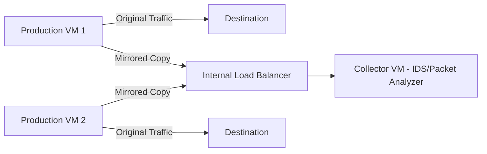

# How to Capture and Inspect Packets Using Packet Mirroring on GCP

Author: [nawazdhandala](https://www.github.com/nawazdhandala)

Tags: GCP, Packet Mirroring, Network Security, Traffic Inspection, VPC

Description: Learn how to set up Packet Mirroring on Google Cloud to capture and inspect network traffic for security analysis, compliance monitoring, and debugging.

---

Sometimes VPC Flow Logs are not enough. Flow logs tell you metadata about connections - who talked to whom, how much data was transferred - but they do not show you the actual packet contents. When you need to see the payload of network traffic, whether for security analysis, regulatory compliance, or deep debugging, you need packet-level capture. Packet Mirroring on GCP duplicates traffic from specific VMs and sends it to a collector for inspection without affecting the original traffic flow.

In this guide, I will show you how to set up Packet Mirroring, deploy a collector running an intrusion detection system, and analyze captured traffic.

## How Packet Mirroring Works

Packet Mirroring creates a copy of network traffic from mirrored sources (VMs or subnets) and forwards it to a collector destination (an internal load balancer fronting your analysis VMs). The mirrored traffic is encapsulated and delivered out-of-band, so there is no performance impact on the original traffic.



The mirrored packets are full copies, including headers and payload. You can filter what gets mirrored by protocol, IP range, or direction.

## Prerequisites

Before you start, you need:

- A VPC network with VMs you want to monitor
- An internal load balancer to serve as the collector destination
- VMs running packet analysis tools (like Zeek, Suricata, or tcpdump)

```bash
# Enable the required API
gcloud services enable compute.googleapis.com
```

## Step 1 - Set Up the Collector Infrastructure

The collector receives mirrored traffic through an internal load balancer. Let us set that up first.

```bash
# Create a collector VM with tools for packet analysis
gcloud compute instances create packet-collector \
    --zone=us-central1-a \
    --machine-type=e2-standard-4 \
    --network=my-vpc \
    --subnet=my-subnet \
    --image-family=debian-11 \
    --image-project=debian-cloud \
    --can-ip-forward \
    --metadata=startup-script='#!/bin/bash
apt-get update
apt-get install -y tcpdump tshark suricata
# Configure Suricata to listen on the right interface
sed -i "s/interface: eth0/interface: ens4/" /etc/suricata/suricata.yaml
systemctl enable suricata
systemctl start suricata'

# Create an unmanaged instance group for the collector
gcloud compute instance-groups unmanaged create collector-group \
    --zone=us-central1-a

gcloud compute instance-groups unmanaged add-instances collector-group \
    --zone=us-central1-a \
    --instances=packet-collector
```

Now create the internal load balancer:

```bash
# Create a health check for the collector
gcloud compute health-checks create tcp collector-hc \
    --port=80

# Create a backend service for the collector
gcloud compute backend-services create collector-backend \
    --region=us-central1 \
    --protocol=TCP \
    --health-checks=collector-hc \
    --load-balancing-scheme=INTERNAL

# Add the collector instance group
gcloud compute backend-services add-backend collector-backend \
    --region=us-central1 \
    --instance-group=collector-group \
    --instance-group-zone=us-central1-a

# Create a forwarding rule for the collector ILB
gcloud compute forwarding-rules create collector-ilb \
    --region=us-central1 \
    --network=my-vpc \
    --subnet=my-subnet \
    --load-balancing-scheme=INTERNAL \
    --backend-service=collector-backend \
    --ports=ALL \
    --is-mirroring-collector
```

The `--is-mirroring-collector` flag is the key - it tells GCP this load balancer receives mirrored traffic.

## Step 2 - Create a Packet Mirroring Policy

Now create the mirroring policy that specifies what traffic to mirror and where to send it.

```bash
# Mirror all traffic from specific VMs
gcloud compute packet-mirrorings create mirror-prod-vms \
    --region=us-central1 \
    --network=my-vpc \
    --collector-ilb=collector-ilb \
    --mirrored-instances=production-vm-1,production-vm-2 \
    --enable
```

You can also mirror traffic from entire subnets:

```bash
# Mirror all traffic from a specific subnet
gcloud compute packet-mirrorings create mirror-prod-subnet \
    --region=us-central1 \
    --network=my-vpc \
    --collector-ilb=collector-ilb \
    --mirrored-subnets=prod-subnet \
    --enable
```

Or mirror traffic with specific tags:

```bash
# Mirror traffic from VMs with a specific network tag
gcloud compute packet-mirrorings create mirror-tagged-vms \
    --region=us-central1 \
    --network=my-vpc \
    --collector-ilb=collector-ilb \
    --mirrored-tags=needs-inspection \
    --enable
```

## Step 3 - Apply Filters

You usually do not want to mirror all traffic. Filters let you narrow down what gets captured.

```bash
# Mirror only TCP traffic on specific ports
gcloud compute packet-mirrorings create mirror-web-traffic \
    --region=us-central1 \
    --network=my-vpc \
    --collector-ilb=collector-ilb \
    --mirrored-subnets=prod-subnet \
    --filter-protocols=tcp \
    --filter-cidr-ranges=0.0.0.0/0 \
    --filter-direction=BOTH \
    --enable
```

For more specific filtering, you can use the API directly:

```python
# Using the Python client for fine-grained filter control
from google.cloud import compute_v1

client = compute_v1.PacketMirroringsClient()

packet_mirroring = compute_v1.PacketMirroring()
packet_mirroring.name = "mirror-specific-traffic"
packet_mirroring.network = compute_v1.PacketMirroringNetworkInfo(
    url="projects/my-project/global/networks/my-vpc"
)
packet_mirroring.collector_ilb = compute_v1.PacketMirroringForwardingRuleInfo(
    url="projects/my-project/regions/us-central1/forwardingRules/collector-ilb"
)
packet_mirroring.mirrored_resources = compute_v1.PacketMirroringMirroredResourceInfo(
    subnetworks=[
        compute_v1.PacketMirroringMirroredResourceInfoSubnetInfo(
            url="projects/my-project/regions/us-central1/subnetworks/prod-subnet"
        )
    ]
)
# Filter to only capture traffic to/from specific IP ranges
packet_mirroring.filter = compute_v1.PacketMirroringFilter(
    cidr_ranges=["10.0.1.0/24", "10.0.2.0/24"],
    IP_protocols=["tcp"],
    direction="BOTH"
)

# Create the mirroring policy
operation = client.insert(
    project="my-project",
    region="us-central1",
    packet_mirroring_resource=packet_mirroring
)
```

## Step 4 - Analyze Captured Traffic

SSH into the collector VM and start analyzing packets.

### Basic Packet Capture with tcpdump

```bash
# Capture packets and save to a file for later analysis
sudo tcpdump -i ens4 -w /tmp/capture.pcap -c 10000

# Capture only HTTP traffic
sudo tcpdump -i ens4 -w /tmp/http_capture.pcap port 80 or port 443

# Live view of DNS queries
sudo tcpdump -i ens4 -n port 53

# Show packet details for traffic from a specific source
sudo tcpdump -i ens4 -vvv src host 10.0.1.15
```

### Deeper Analysis with tshark

```bash
# Analyze HTTP requests in the capture
tshark -r /tmp/capture.pcap -Y "http.request" \
    -T fields -e ip.src -e ip.dst -e http.host -e http.request.uri

# Find DNS queries to suspicious domains
tshark -r /tmp/capture.pcap -Y "dns.qry.name" \
    -T fields -e ip.src -e dns.qry.name | sort | uniq -c | sort -rn

# Extract all TLS certificates for inspection
tshark -r /tmp/capture.pcap -Y "tls.handshake.certificate" \
    -T fields -e ip.src -e ip.dst -e x509sat.utf8String
```

### Running Suricata IDS

If you installed Suricata on the collector, it will automatically analyze mirrored traffic against its rule set.

```bash
# Check Suricata alerts
sudo cat /var/log/suricata/fast.log

# View detailed alert information
sudo cat /var/log/suricata/eve.json | jq 'select(.event_type=="alert")'

# Update Suricata rules
sudo suricata-update
sudo systemctl restart suricata
```

## Step 5 - Automate Alert Processing

For production use, send Suricata alerts to Cloud Logging for centralized monitoring.

```bash
# Install the Cloud Logging agent on the collector
curl -sSO https://dl.google.com/cloudagents/add-logging-agent-repo.sh
sudo bash add-logging-agent-repo.sh
sudo apt-get update && sudo apt-get install -y google-fluentd

# Configure fluentd to ship Suricata alerts
sudo tee /etc/google-fluentd/config.d/suricata.conf <<'EOF'
<source>
  @type tail
  path /var/log/suricata/eve.json
  pos_file /var/lib/google-fluentd/pos/suricata.pos
  tag suricata
  <parse>
    @type json
  </parse>
</source>
EOF

sudo systemctl restart google-fluentd
```

## Scaling the Collector

For high-traffic environments, a single collector VM might not be enough. Scale horizontally by using a managed instance group behind the collector ILB.

```bash
# Create a collector instance template
gcloud compute instance-templates create collector-template \
    --machine-type=e2-standard-8 \
    --network=my-vpc \
    --subnet=my-subnet \
    --can-ip-forward \
    --image-family=debian-11 \
    --image-project=debian-cloud \
    --metadata=startup-script='#!/bin/bash
apt-get update && apt-get install -y suricata
systemctl enable suricata && systemctl start suricata'

# Create a managed instance group
gcloud compute instance-groups managed create collector-mig \
    --template=collector-template \
    --size=3 \
    --zone=us-central1-a
```

## Cost Considerations

Packet Mirroring generates additional network traffic equal to the volume being mirrored. You pay for:

- The network bandwidth consumed by mirrored traffic (intra-zone is free, cross-zone is not)
- The collector VM compute resources
- Storage for captured packet data

Keep the collector in the same zone as the mirrored VMs to avoid cross-zone charges, and use filters aggressively to limit mirrored traffic to only what you need.

## Wrapping Up

Packet Mirroring on GCP gives you full packet capture capability without installing agents on your production VMs. The mirrored traffic flows out-of-band to your collector infrastructure, where you can run whatever analysis tools you need - tcpdump for quick debugging, Suricata for IDS alerting, or custom tools for compliance monitoring. The key to making this practical is using filters to limit what you capture, scaling your collector infrastructure appropriately, and shipping alerts to a centralized monitoring system for rapid response.
